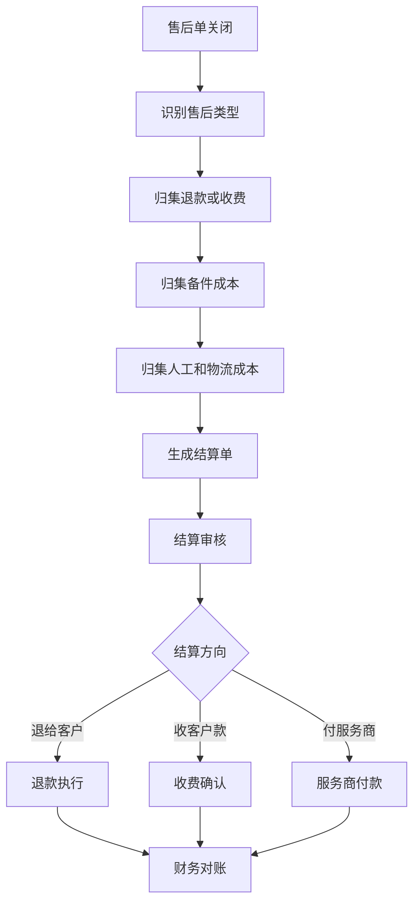
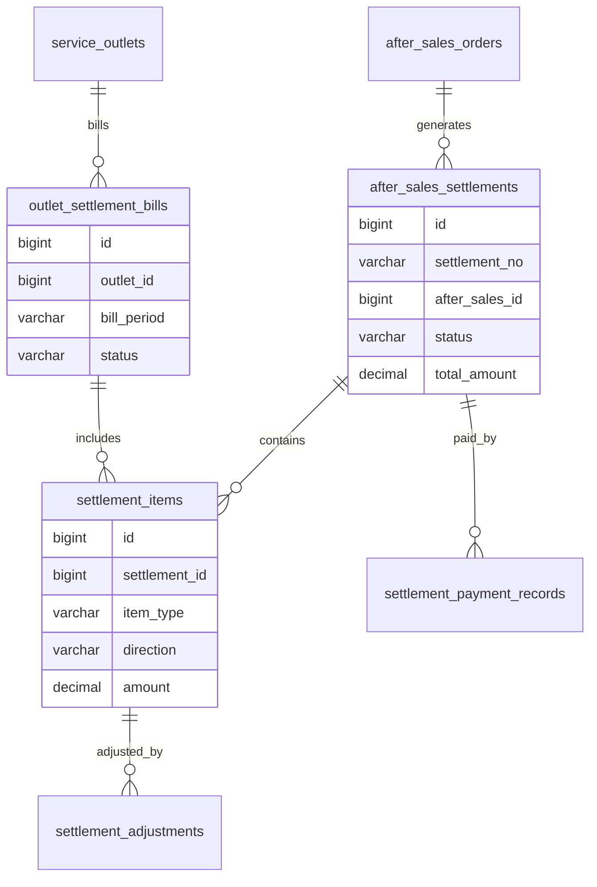
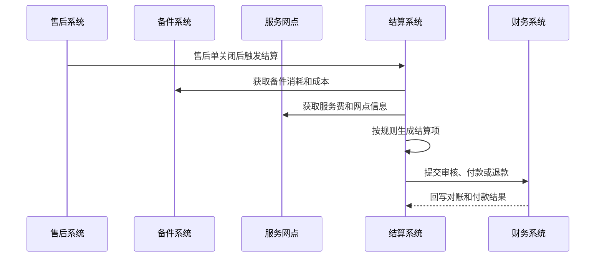

# 售后结算项目案例

## 适合谁看

适合需要做售后退款、赔付、维修收费、服务网点结算、备件成本、质保结算、第三方服务商对账和售后财务闭环的开发者。

售后结算不是“售后单结束后记一笔钱”。真实项目里，售后可能涉及退款、换货补差价、维修收费、质保免费、备件成本、服务网点人工费、第三方服务商结算和财务对账。系统要能回答：谁该收钱、谁该付钱、成本归到哪里、退款是否重复、服务商结算是否准确。

## 业务目标

第一版售后结算支持：

- 根据售后类型生成结算项。
- 支持退款、赔付、维修收费和补差价。
- 归集备件成本、人工成本和物流成本。
- 支持服务网点和第三方服务商结算。
- 支持质保内、质保外和人为损坏的费用规则。
- 支持结算审核、对账和付款。
- 支持结算异常、调整和审计。
- 输出售后成本和服务商结算看板。

## 售后结算链路

售后结算的关键是“结算方向”。同一个售后单可能同时有退款给客户、收客户维修费、付服务商服务费和归集备件成本。

## 核心概念

| 概念 | 说明 | 示例 |
| --- | --- | --- |
| 结算项 | 一笔可结算的费用或收入 | 退款、人工费、备件费 |
| 结算方向 | 收入、支出或成本 | 收客户、退客户、付服务商 |
| 质保规则 | 是否免费和由谁承担 | 保内免费、人为损坏收费 |
| 服务商结算 | 给第三方网点付款 | 上门费、维修费 |
| 备件成本 | 维修消耗备件金额 | 主板成本 300 |
| 结算审核 | 财务或运营确认金额 | 审核服务商账单 |
| 结算调整 | 对异常金额进行修正 | 减免、补收、冲销 |

售后结算要区分客户侧金额和内部成本。退款 100 元不代表售后成本只有 100 元。

## 数据模型

## 推荐表结构

| 表 | 作用 | 关键字段 |
| --- | --- | --- |
| `after_sales_settlements` | 售后结算主表 | `settlement_no`、`after_sales_id`、`status`、`total_amount` |
| `settlement_items` | 结算明细 | `settlement_id`、`item_type`、`direction`、`amount`、`source_id` |
| `settlement_rules` | 结算规则 | `service_type`、`warranty_status`、`item_type`、`calc_rule` |
| `settlement_adjustments` | 结算调整 | `item_id`、`adjust_amount`、`reason`、`approved_by` |
| `outlet_settlement_bills` | 网点结算账单 | `outlet_id`、`bill_period`、`status`、`payable_amount` |
| `settlement_payment_records` | 结算付款记录 | `settlement_id`、`paid_amount`、`bank_serial_no`、`paid_at` |
| `settlement_refund_records` | 退款记录 | `settlement_id`、`refund_no`、`refund_amount`、`status` |
| `settlement_reconciliation_logs` | 对账记录 | `settlement_id`、`target_system`、`check_result`、`diff_reason` |

结算明细要能追溯来源，例如备件消耗、维修工单、退款单、服务网点账单。否则金额争议时无法解释。

## 结算生成流程

结算生成要幂等。售后单关闭事件、消息队列重试或人工重算都不能生成重复结算单。

## 结算项设计

| 结算项 | 方向 | 示例 |
| --- | --- | --- |
| 客户退款 | 支出 | 退还客户 200 元 |
| 客户补差价 | 收入 | 换货补收 50 元 |
| 维修收费 | 收入 | 保外维修收 300 元 |
| 备件成本 | 成本 | 主板成本 180 元 |
| 人工服务费 | 支出或成本 | 付服务商 80 元 |
| 物流费用 | 成本 | 回寄运费 15 元 |
| 赔付费用 | 支出 | 客诉赔付 100 元 |

同一个售后单可能有多条结算项。不要用一个 `amount` 字段表达所有金额。

## 前端页面拆分

| 页面或组件 | 作用 | 注意点 |
| --- | --- | --- |
| 售后结算列表 | 查看结算单状态 | 支持售后单、客户、网点筛选 |
| 结算详情 | 展示收入、支出和成本明细 | 来源单据可点击 |
| 结算规则 | 配置质保和服务费规则 | 规则变更要版本化 |
| 结算审核 | 财务或运营确认金额 | 异常项要突出 |
| 网点账单 | 汇总服务网点结算 | 支持按周期生成 |
| 退款付款 | 查看退款和付款执行 | 关联支付流水 |
| 结算对账 | 与财务、支付、服务商对账 | 展示差异原因 |
| 售后成本看板 | 分析成本和毛利影响 | 按商品、网点、原因统计 |

结算详情页要把客户金额、服务商金额和内部成本分开展示。混在一起会让财务和运营都难以使用。

## 接口拆分建议

| 接口 | 作用 | 注意点 |
| --- | --- | --- |
| `POST /after-sales-settlements/generate` | 生成结算单 | 使用售后单号保证幂等 |
| `GET /after-sales-settlements/{id}` | 查看结算详情 | 聚合结算项和来源 |
| `POST /after-sales-settlements/{id}/approve` | 审核结算 | 保存审核意见 |
| `POST /after-sales-settlements/{id}/adjust` | 调整结算 | 需要审批和原因 |
| `POST /outlet-settlement-bills` | 生成网点账单 | 按周期和网点汇总 |
| `POST /after-sales-settlements/{id}/pay` | 执行付款或退款 | 流水号幂等 |
| `GET /after-sales-settlements/reconciliation` | 查询对账结果 | 支持差异筛选 |

## 实际项目常见问题

### 问题 1：同一售后单生成了两张结算单

售后关闭事件可能重复推送。结算生成要以售后单号建立唯一约束，重复触发时返回已有结算单。

### 问题 2：保内维修没有向客户收费，但成本没人看

保内免费只是客户侧金额为 0，备件、人工和物流仍然是成本。系统要继续生成成本项，用于售后成本分析。

### 问题 3：第三方网点对账金额和系统不一致

网点结算要能追溯到每个工单、服务费规则和调整记录。不要只给服务商一个总金额。

### 问题 4：退款成功但售后结算仍显示待退款

支付回调和结算状态要幂等更新，同时要有定时补偿查询，避免回调丢失后状态长期不一致。

## 权限与审计

售后结算权限至少要区分：

- 查看结算单。
- 生成结算单。
- 审核结算。
- 调整结算金额。
- 生成网点账单。
- 执行退款。
- 执行服务商付款。
- 查看成本看板。
- 导出结算报表。

结算调整、退款、服务商付款和规则变更必须审计。售后结算影响客户资金、服务商结算和内部成本。

## 验收清单

- 售后单关闭后可生成结算单。
- 结算项能区分收入、支出和成本。
- 结算明细能追溯来源单据。
- 保内、保外、人为损坏有不同结算规则。
- 服务网点账单可按周期生成。
- 退款和付款具备幂等性。
- 结算调整有审批和审计。
- 对账差异可查看原因。
- 售后成本可按商品、网点和原因分析。
- 重复生成和重复付款有防护。

## 下一步学习

继续学习 [售后服务项目案例](/projects/after-sales-service-case)、[服务网点项目案例](/projects/service-outlet-case)、[备件库存项目案例](/projects/spare-parts-inventory-case) 和 [复杂财务对账项目案例](/projects/finance-reconciliation-case)。
