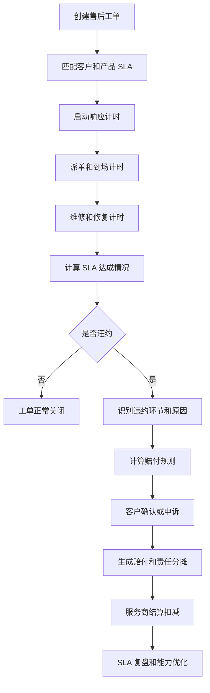
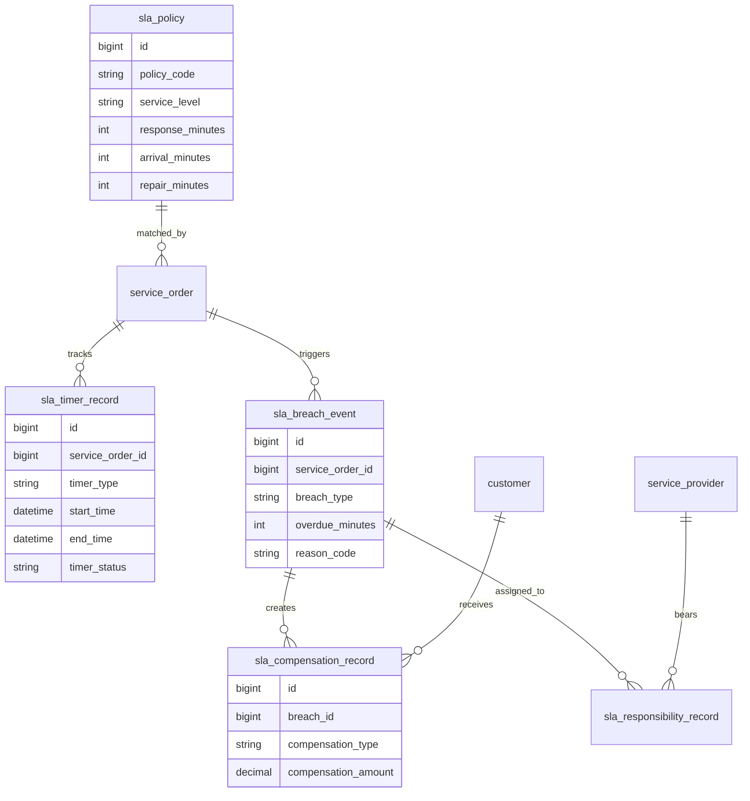
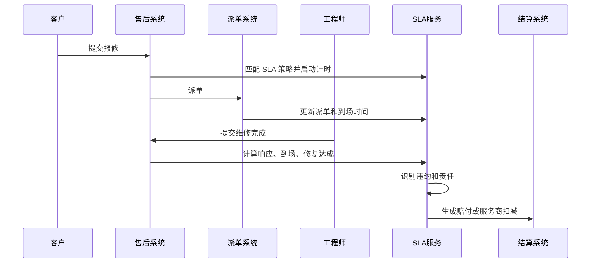
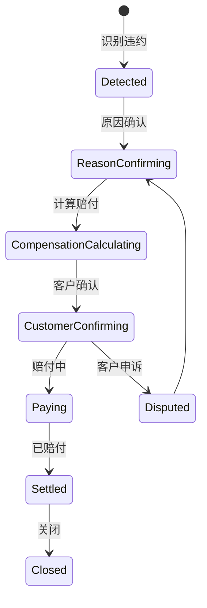
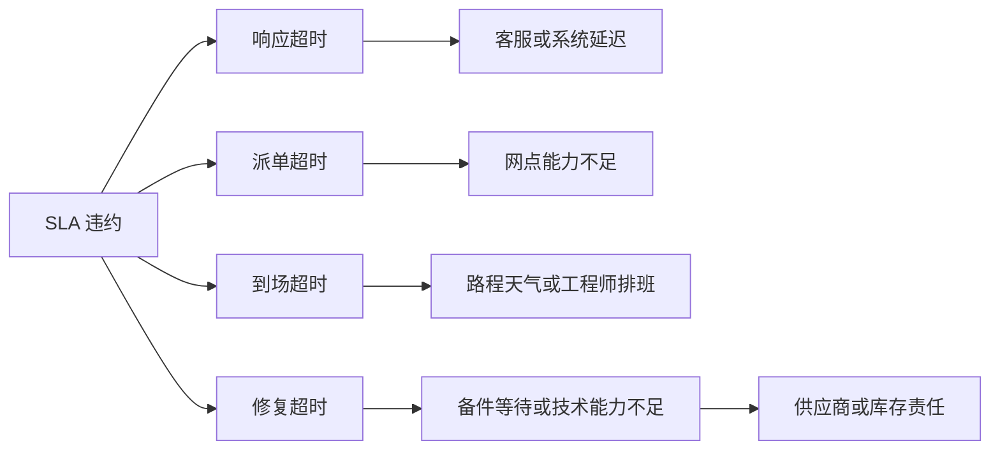

# 售后 SLA 赔付分析项目案例

## 适合谁看

如果你做过售后服务、报修派单、服务网点或客户投诉闭环，但不清楚“服务超时应该怎么赔、怎么追责、怎么复盘”，可以先看这一篇。

售后 SLA 赔付分析关注的是服务承诺、响应时间、到场时间、修复时间、超时原因、赔付规则、客户补偿和服务商责任之间的闭环。

## 业务目标

售后 SLA 赔付系统要回答 6 个问题：

- 不同客户、产品、地区、服务等级对应什么 SLA。
- 工单是否超时，超时发生在响应、派单、到场、修复还是回访。
- 超时原因是服务商、备件、客户、天气、系统还是内部流程。
- 是否需要赔付、赔付多少、由谁承担。
- 赔付后如何影响服务商结算、客户满意度和质量复盘。
- SLA 数据如何反向优化网点能力、备件布局和派单规则。

SLA 不是一个倒计时字段，而是服务承诺、履约监控、赔付责任和改进闭环的组合。

## 售后 SLA 赔付链路

SLA 赔付的难点是责任判定。不是所有超时都应该由服务商或企业承担。

## 核心概念

| 概念 | 说明 | 项目里的典型字段 |
| --- | --- | --- |
| SLA 策略 | 服务等级和承诺时间 | sla_policy |
| 响应时限 | 客户报修后首次响应时间 | response_deadline |
| 到场时限 | 派单后工程师到场时间 | arrival_deadline |
| 修复时限 | 故障从受理到修复的时间 | repair_deadline |
| 暂停计时 | 客户原因、备件等待等暂停 | pause_reason |
| 违约事件 | SLA 未达成记录 | breach_event |
| 赔付规则 | 服务券、现金、减免、积分等 | compensation_rule |
| 责任分摊 | 企业、服务商、客户、供应商承担 | responsibility_share |

SLA 计时必须支持暂停和恢复。客户改约、备件等待、不可抗力都可能影响真实责任。

## 数据模型

计时记录、违约事件、赔付记录要分开。一个工单可能响应超时但修复未超时，也可能多个环节都超时。

## 推荐表结构

| 表 | 用途 | 关键字段 |
| --- | --- | --- |
| sla_policy | SLA 策略 | policy_code、service_level、response_minutes、arrival_minutes、repair_minutes |
| sla_policy_scope | 策略范围 | policy_id、customer_level、product_code、region、service_type |
| sla_timer_record | 计时记录 | service_order_id、timer_type、start_time、pause_minutes、end_time |
| sla_breach_event | SLA 违约事件 | service_order_id、breach_type、overdue_minutes、reason_code、status |
| sla_compensation_rule | 赔付规则 | breach_type、overdue_range、compensation_type、formula_json |
| sla_compensation_record | 赔付记录 | breach_id、customer_id、compensation_amount、compensation_status |
| sla_responsibility_record | 责任分摊 | breach_id、responsible_type、responsible_id、share_amount |

赔付规则要版本化。合同或服务政策调整后，历史赔付不能按新规则重算。

## SLA 判定流程

SLA 服务最好作为独立能力提供给售后、派单、服务商结算和客户投诉系统复用。

## 违约状态设计

客户可能对赔付金额或原因有争议，所以赔付记录要支持申诉和复核。

## 违约原因拆解

原因拆解决定责任分摊。修复超时可能是备件缺货，不一定是工程师问题。

## 前端页面拆分

| 页面 | 主要功能 | 新手容易漏掉 |
| --- | --- | --- |
| SLA 策略页 | 服务等级、范围、响应到场修复时限 | 策略要按客户和区域生效 |
| 工单 SLA 页 | 当前计时、暂停、预计违约 | 展示暂停原因和证据 |
| 违约事件页 | 超时环节、原因、责任、状态 | 一个工单可能多个事件 |
| 赔付计算页 | 规则、金额、方式、客户确认 | 赔付规则要可解释 |
| 服务商扣减页 | 责任分摊、结算扣减 | 与服务商结算联动 |
| SLA 看板 | 达成率、违约率、赔付金额 | 按区域、网点、产品下钻 |
| 复盘任务页 | 违约原因、整改、效果 | 赔完不是结束 |

SLA 页面要实时提醒“即将违约”，不是等违约后才统计。

## 接口拆分建议

| 接口 | 方法 | 说明 |
| --- | --- | --- |
| /api/sla-policies | GET/POST | 查询和维护 SLA 策略 |
| /api/service-orders/:id/sla | GET | 查询工单 SLA 状态 |
| /api/sla-timers/:id/pause | POST | 暂停计时 |
| /api/sla-timers/:id/resume | POST | 恢复计时 |
| /api/sla-breaches | GET | 查询违约事件 |
| /api/sla-breaches/:id/confirm | POST | 确认违约原因 |
| /api/sla-compensations | GET/POST | 查询和生成赔付 |
| /api/sla-dashboard | GET | 查询 SLA 看板 |

计时接口要幂等。移动端网络不稳定时，工程师可能重复提交到场或完成。

## 实际项目常见问题

### 问题 1：SLA 明明超时，系统没有赔付

常见原因是工单没有匹配到 SLA 策略，或计时字段缺失。

解决方式：

- 工单创建时必须保存匹配到的 SLA 策略。
- 关键节点写计时记录。
- 未匹配策略的工单进入异常队列。
- 策略范围变更不影响历史工单。

### 问题 2：客户原因导致超时也被赔付

没有暂停计时和责任原因。

解决方式：

- 支持客户改约、备件等待、不可抗力暂停。
- 暂停需要原因和证据。
- 赔付计算扣除合理暂停时间。
- 争议场景进入复核。

### 问题 3：服务商不认可扣减

扣减缺少证据链。

解决方式：

- 记录派单、接单、到场、完成时间。
- 保存定位、照片、客户签字等证据。
- 责任分摊写入结算明细。
- 支持服务商申诉。

### 问题 4：赔付很多但服务没有改善

赔付记录没有进入复盘和整改。

解决方式：

- 高赔付原因生成复盘任务。
- 按网点、产品、区域统计违约。
- 关联备件库存和派单能力。
- 复盘结果影响网点评级。

## 权限与审计

| 权限 | 建议 |
| --- | --- |
| 查看 SLA | 售后运营、客服、服务商按范围查看 |
| 修改策略 | 售后负责人，发布需要审批 |
| 暂停计时 | 客服或工程师，必须填写原因 |
| 确认违约 | 售后主管或 SLA 专员 |
| 确认赔付 | 财务或售后负责人 |
| 导出赔付 | 敏感导出水印和审计 |

SLA 赔付直接影响客户权益和服务商结算，所有人工确认都要留痕。

## 验收清单

- 工单能匹配到正确 SLA 策略。
- 响应、派单、到场、修复都有计时记录。
- 计时支持暂停、恢复和证据。
- 违约事件能区分环节和原因。
- 赔付规则可解释，并能生成赔付记录。
- 服务商责任能进入结算扣减。
- SLA 看板能按区域、产品、网点和原因下钻。

## 下一步学习

建议继续阅读：

- [售后服务项目案例](/projects/after-sales-service-case)
- [报修派单项目案例](/projects/repair-dispatch-case)
- [服务网点项目案例](/projects/service-outlet-case)
- [售后成本毛利分析项目案例](/projects/after-sales-cost-margin-case)
