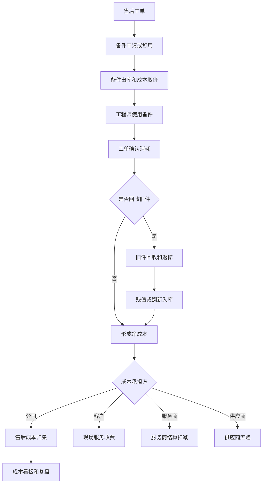
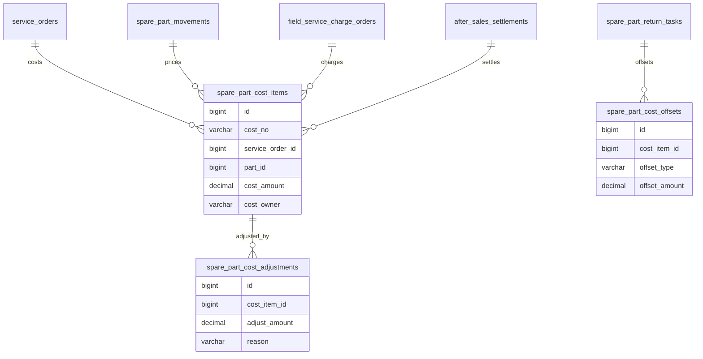
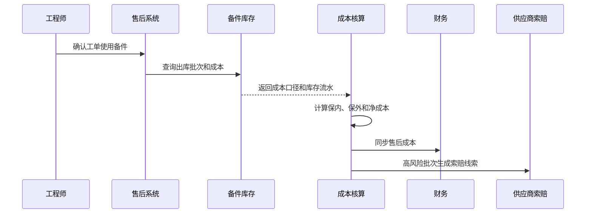

# 售后备件成本核算项目案例

## 适合谁看

适合需要做售后备件领用、工单消耗、保内保外成本、旧件返修、服务商结算、成本归集、毛利分析和质量成本复盘的开发者。

售后备件成本核算不是“备件出库时记一笔成本”。真实项目里，备件可能由中心仓、服务网点、工程师背包、供应商直发或旧件翻新提供。系统要能回答：这次售后用了哪些备件、成本归到哪个工单、保内是否由公司承担、保外是否向客户收费、旧件返修是否抵减成本、服务商结算是否重复计算。

## 业务目标

第一版售后备件成本核算支持：

- 从售后工单、维修记录和备件领用生成成本明细。
- 区分保内、保外、延保、客户付费、服务商承担和供应商质保。
- 支持标准成本、移动平均成本、批次成本和翻新件成本。
- 支持旧件回收、返修入库和残值抵减。
- 支持备件成本和现场服务收费、售后结算、财务对账联动。
- 支持成本调整、差异原因和审批。
- 支持按产品、客户、网点、工程师、服务商分析售后成本。
- 支持质量问题、供应商问题和高成本异常复盘。

## 售后备件成本核算链路

成本核算的关键是“备件消耗确认”。备件出库不等于已消耗，工程师领用后可能退回、调拨、丢失或用于其他工单。

## 核心概念

| 概念 | 说明 | 示例 |
| --- | --- | --- |
| 备件成本 | 备件在售后中形成的成本 | 主板成本 300 元 |
| 成本取价 | 选择成本计算口径 | 标准成本、移动平均 |
| 工单消耗 | 备件实际被某个工单使用 | 工单消耗电源模块 |
| 旧件残值 | 旧件回收或报废产生的价值 | 回收残值 20 元 |
| 保内成本 | 质保期内由企业承担 | 免费维修换件 |
| 保外收费 | 客户需要支付备件费用 | 保外换件收费 |
| 供应商索赔 | 因供应商质量问题追回成本 | 批次质量索赔 |
| 成本归集 | 将成本落到客户、产品、工单或服务商 | 产品售后成本 |

备件成本要和客户收费分开。客户收费 500 元，不代表备件成本就是 500 元；成本、售价、结算价是三个不同口径。

## 数据模型

## 推荐表结构

| 表 | 作用 | 关键字段 |
| --- | --- | --- |
| `spare_part_cost_items` | 备件成本明细 | `cost_no`、`service_order_id`、`part_id`、`quantity`、`unit_cost`、`cost_amount`、`cost_owner` |
| `spare_part_cost_sources` | 成本来源 | `cost_item_id`、`movement_id`、`warehouse_id`、`cost_method`、`batch_no` |
| `spare_part_cost_offsets` | 成本抵减 | `cost_item_id`、`offset_type`、`offset_amount`、`source_id` |
| `spare_part_cost_adjustments` | 成本调整 | `cost_item_id`、`adjust_amount`、`reason`、`approval_status` |
| `spare_part_cost_allocations` | 成本分摊 | `cost_item_id`、`target_type`、`target_id`、`allocated_amount` |
| `spare_part_cost_claims` | 供应商索赔 | `cost_item_id`、`supplier_id`、`claim_amount`、`claim_status` |
| `spare_part_cost_snapshots` | 成本快照 | `period`、`product_id`、`customer_id`、`cost_amount`、`net_cost` |
| `spare_part_cost_audit_logs` | 审计日志 | `cost_item_id`、`action`、`operator_id`、`before_json`、`after_json` |

成本取价要保存快照。后续库存成本变化时，历史工单成本不能被重新计算到不一致。

## 成本确认流程

工单关闭前应确认备件消耗。否则售后成本会滞后，服务商结算和客户收费也可能出现差异。

## 成本状态设计

| 状态 | 含义 | 注意点 |
| --- | --- | --- |
| 待确认 | 备件已领用但未确认消耗 | 不能进入最终成本 |
| 已确认 | 工单确认备件使用 | 可进入成本归集 |
| 待抵减 | 存在旧件或索赔可能 | 等待结果 |
| 已归集 | 成本已归集到对象 | 可入账或看板 |
| 已调整 | 发生人工成本调整 | 必须有审批 |
| 已索赔 | 供应商承担部分成本 | 关联索赔单 |
| 已结算 | 已进入服务商或财务结算 | 限制修改 |
| 已作废 | 工单或消耗被撤销 | 保留原因 |

成本状态不要直接跟随工单状态。工单已关闭时，旧件返修和供应商索赔可能还没结束。

## 前端页面拆分

| 页面或组件 | 作用 | 注意点 |
| --- | --- | --- |
| 售后成本工作台 | 查看待确认、待抵减、异常成本 | 按工单、产品、网点筛选 |
| 工单成本面板 | 在售后工单中展示备件成本和承担方 | 和收费金额分开展示 |
| 成本明细详情 | 展示备件、批次、数量、成本口径和库存流水 | 保留取价依据 |
| 旧件抵减 | 处理旧件回收、返修、残值抵减 | 关联旧件返修任务 |
| 成本调整审批 | 调整错误成本或承担方 | 必填原因和附件 |
| 供应商索赔 | 对质量批次发起索赔 | 关联供应商和批次 |
| 成本看板 | 分析产品、客户、服务商和原因 | 支持净成本和毛利 |
| 财务对账 | 对比成本、收费、结算和入账 | 差异可追踪 |

成本看板要同时展示总成本和净成本。净成本 = 原始备件成本 - 客户收费抵扣 - 旧件残值 - 供应商索赔。

## 接口拆分建议

| 接口 | 作用 | 注意点 |
| --- | --- | --- |
| `POST /service-orders/{id}/spare-part-costs` | 生成备件成本 | 由工单消耗触发 |
| `POST /spare-part-costs/{id}/confirm` | 确认成本 | 校验库存流水 |
| `POST /spare-part-costs/{id}/offsets` | 登记成本抵减 | 关联旧件、收费或索赔 |
| `POST /spare-part-costs/{id}/adjust` | 成本调整 | 高风险走审批 |
| `POST /spare-part-costs/{id}/claim` | 供应商索赔 | 关联供应商和批次 |
| `GET /spare-part-costs/ledger` | 查询成本台账 | 支持期间、产品、客户 |
| `GET /spare-part-costs/analysis` | 查询成本分析 | 支持净成本和毛利 |
| `POST /spare-part-costs/reconcile` | 成本对账 | 对比收费、结算、财务 |

## 实际项目常见问题

### 问题 1：备件出库后成本就被确认

工程师领用不等于工单消耗。出库成本应先进入待确认，工单确认使用后才形成售后成本。

### 问题 2：保内免费导致成本被忽略

免费对客户不代表没有成本。保内成本要进入产品质量、供应商质量和售后毛利分析。

### 问题 3：旧件返修后没有抵减成本

旧件返修、翻新入库、报废残值和供应商索赔都应形成成本抵减或成本复盘信息。

### 问题 4：客户收费和服务商结算重复计算

客户收费、备件成本、服务商结算是不同业务事实。对账时要用工单和成本明细关联，不能简单按金额相加。

## 权限与审计

售后备件成本权限至少要区分：

- 查看工单成本。
- 确认备件消耗。
- 查看成本取价。
- 调整成本金额。
- 调整成本承担方。
- 发起供应商索赔。
- 查看成本看板。
- 导出成本台账。

成本取价、成本调整、承担方变更、旧件抵减、索赔和结算锁定都要审计。成本数据会影响毛利、绩效和财务入账。

## 验收清单

- 备件领用和工单消耗分离。
- 成本明细能关联工单、备件、批次和库存流水。
- 支持保内、保外、延保、客户付费等承担方。
- 支持标准成本、移动平均成本和批次成本快照。
- 支持旧件残值、返修和供应商索赔抵减。
- 客户收费、服务商结算和备件成本分离。
- 成本调整有审批和审计。
- 成本可按产品、客户、网点、服务商分析。
- 财务对账能追踪差异。
- 高成本异常能进入复盘。

## 下一步学习

继续学习 [售后结算项目案例](/projects/after-sales-settlement-case)、[现场服务收费项目案例](/projects/field-service-charging-case)、[备件旧件返修项目案例](/projects/spare-parts-return-repair-case) 和 [备件库存项目案例](/projects/spare-parts-inventory-case)。
