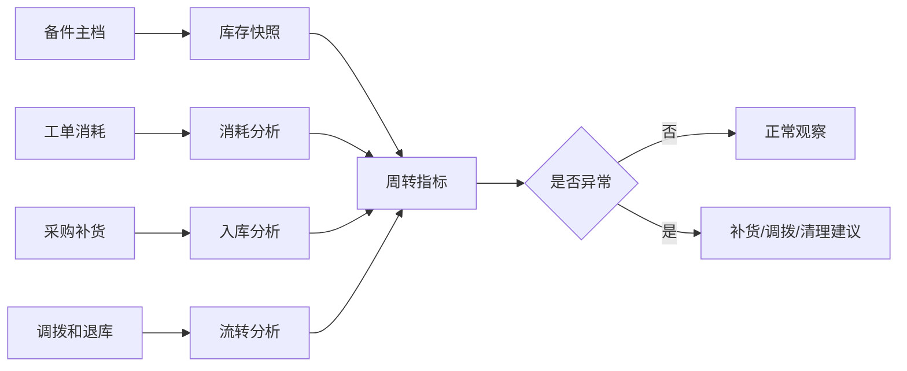
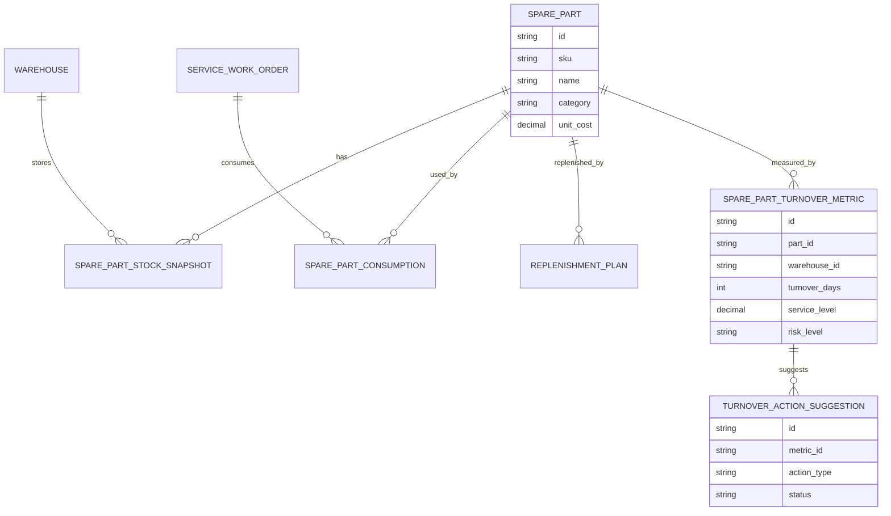
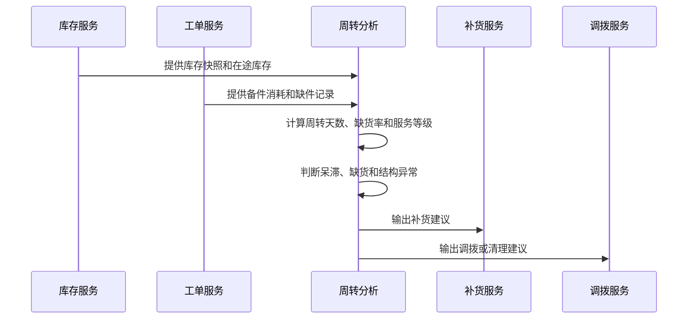
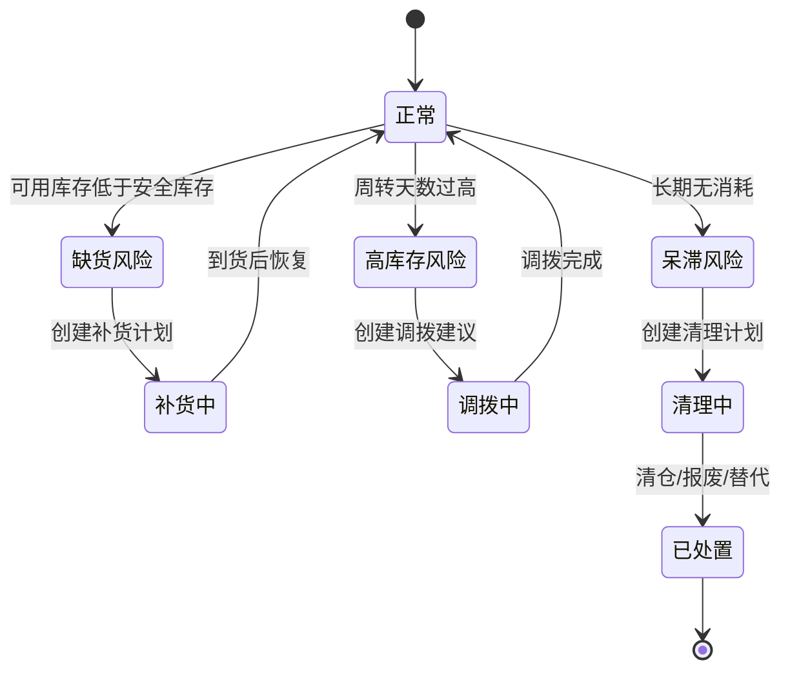
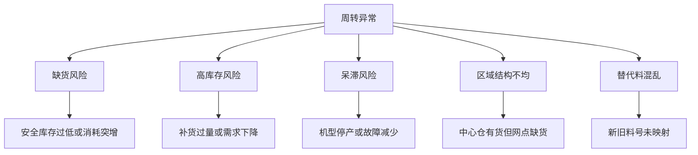

# 售后备件周转分析项目案例

## 适合谁看

如果你做过备件库存、备件补货、售后服务或售后备件成本核算，但不清楚如何分析“备件压货、缺货、呆滞和周转慢”，可以学习这个案例。

售后备件周转分析的目标是让企业既能保证维修可用性，又不让备件库存占用过多资金。它关注的不只是库存数量，还包括周转天数、消耗频率、服务等级、缺货风险和呆滞风险。

## 业务目标

售后备件周转分析要回答：

1. 哪些备件库存太多、周转太慢？
2. 哪些备件经常缺货，影响维修 SLA？
3. 哪些网点或仓库库存结构不合理？
4. 补货、安全库存和调拨策略是否需要调整？

一个成熟的备件周转系统，需要同时看“服务可得性”和“库存资金占用”。只追求低库存会导致维修缺件，只追求高可用会导致大量呆滞。

## 售后备件周转链路

周转分析不是单仓库问题，而是备件在中心仓、区域仓、服务网点和工程师之间流动的问题。

## 核心概念

| 概念 | 含义 | 初学者理解 |
| --- | --- | --- |
| 备件周转 | 备件从入库到消耗或调出的速度 | 转得快说明库存被有效使用 |
| 周转天数 | 当前库存按平均消耗能用多少天 | 天数越高，压货风险越大 |
| 缺货率 | 需要备件时没有库存的比例 | 影响维修时效 |
| 呆滞备件 | 长时间没有消耗或流转的备件 | 可能占用资金或过期 |
| 安全库存 | 为防止缺货保留的最低库存 | 不是越高越好 |
| 服务等级 | 备件满足工单需求的能力 | 高价值或关键备件要求更高 |

## 数据模型

周转指标建议按“备件 + 仓库/网点”维度计算。一个备件在中心仓可能周转慢，但在某些服务网点可能经常缺货。

## 推荐表结构

| 表 | 作用 | 关键字段 |
| --- | --- | --- |
| `spare_part` | 备件主档 | SKU、品类、适配机型、成本、保质期 |
| `warehouse` | 仓库/网点 | 类型、区域、负责人、服务范围 |
| `spare_part_stock_snapshot` | 库存快照 | 备件、仓库、可用库存、锁定库存、在途库存 |
| `spare_part_consumption` | 工单消耗 | 工单、备件、数量、消耗时间、故障类型 |
| `replenishment_plan` | 补货计划 | 备件、目标仓、建议数量、到货时间 |
| `stock_transfer_order` | 调拨单 | 来源仓、目标仓、备件、数量、状态 |
| `spare_part_turnover_metric` | 周转指标 | 周转天数、缺货率、服务等级、呆滞风险 |
| `turnover_action_suggestion` | 处理建议 | 补货、调拨、清仓、替代料、状态 |

## 周转计算流程

初期可以每日计算一次。对于高价值、关键备件，可以提高到小时级监控，但不要把所有低价值备件都做成实时计算。

## 备件风险状态设计

风险状态要对应动作。缺货要补货，高库存要调拨，呆滞要清理或替代，不能所有异常都只提醒。

## 周转异常拆解

异常原因拆解能帮助系统给出不同建议。比如中心仓压货、网点缺货，优先调拨；整体需求下降，优先减少补货或清理。

## 前端页面拆分

| 页面 | 核心内容 | 设计建议 |
| --- | --- | --- |
| 周转分析看板 | 周转天数、库存金额、缺货率、呆滞金额 | 同时展示服务和资金占用 |
| 备件风险列表 | 备件、仓库、风险类型、库存、消耗、建议 | 默认按风险金额和缺货影响排序 |
| 备件详情 | 库存分布、消耗趋势、工单关联、替代料 | 帮运营判断为什么异常 |
| 仓库对比 | 各仓库存结构、缺货、呆滞、调拨建议 | 适合区域经理使用 |
| 策略配置 | 安全库存、补货周期、服务等级目标 | 配置要按备件分类和区域 |
| 处理任务 | 补货、调拨、清仓、报废、替代映射 | 异常必须能闭环 |

## 接口拆分建议

| 接口 | 说明 |
| --- | --- |
| `GET /api/spare-parts-turnover/dashboard` | 查询备件周转总览 |
| `GET /api/spare-parts-turnover/risks` | 查询备件风险列表 |
| `GET /api/spare-parts-turnover/parts/:id` | 查询备件周转详情 |
| `GET /api/spare-parts-turnover/warehouses/:id` | 查询仓库周转分析 |
| `POST /api/spare-parts-turnover/actions` | 创建处理任务 |
| `GET /api/spare-part-strategies` | 查询安全库存和服务等级策略 |
| `PUT /api/spare-part-strategies/:id` | 修改备件策略 |
| `GET /api/spare-parts-turnover/reviews` | 查询处理效果复盘 |

## 实际项目常见问题

### 1. 周转天数很高，但备件不能直接清理

有些备件虽然消耗少，但属于关键安全备件，缺货影响很大。

解决方式：

- 区分关键备件和普通备件。
- 周转分析同时展示服务等级目标。
- 关键备件用最低保障库存，不按普通周转规则清理。
- 清理前检查适配机型和历史故障风险。

### 2. 中心仓有货，服务网点还是缺货

库存总量够，不代表库存位置对。

解决方式：

- 按仓库和服务区域计算周转。
- 识别区域缺货和中心仓高库存的组合。
- 自动生成调拨建议。
- 调拨建议要考虑运输时效和服务 SLA。

### 3. 新旧料号替代关系混乱

同一类备件可能有新料号、旧料号、替代料，导致系统判断缺货。

解决方式：

- 建立替代料映射。
- 区分完全替代和条件替代。
- 消耗统计按替代组汇总，同时保留具体 SKU。
- 替代关系变更要有版本和审批。

### 4. 补货建议过于频繁

每天根据短期波动生成补货，会造成小批量、多频次采购。

解决方式：

- 设置补货周期和最小订购量。
- 对低价值备件按周期补货。
- 对高价值关键备件按缺货风险触发。
- 建议任务支持合并和批量确认。

### 5. 呆滞备件没有处理闭环

只列出呆滞金额，但没有清理动作，库存不会改善。

解决方式：

- 呆滞风险生成清理任务。
- 处理方式包括调拨、促销、返厂、报废、替代消耗。
- 任务完成后回写减少金额和剩余库存。
- 报表展示呆滞处理率和回收金额。

## 权限与审计

| 权限点 | 控制原因 |
| --- | --- |
| 查看全部库存金额 | 涉及成本和经营数据 |
| 修改安全库存 | 会影响缺货和资金占用 |
| 创建补货建议 | 可能触发采购 |
| 创建调拨任务 | 改变库存位置 |
| 报废或清理备件 | 影响资产价值 |
| 导出周转报表 | 涉及库存金额和服务策略 |

审计日志要记录策略变更、补货确认、调拨创建、报废清理、替代料维护和导出操作。

## 验收清单

- 能按备件和仓库计算库存、消耗和周转天数。
- 能识别缺货、高库存、呆滞和区域不均。
- 能展示库存金额、服务等级和缺货影响。
- 能生成补货、调拨、清理和替代料建议。
- 安全库存和服务等级支持分类配置。
- 处理任务能回写效果。
- 关键策略和库存动作有审计日志。

## 下一步学习

- [备件库存项目案例](/projects/spare-parts-inventory-case)
- [备件补货项目案例](/projects/spare-parts-replenishment-case)
- [售后备件成本核算项目案例](/projects/after-sales-spare-part-cost-case)
- [售后服务项目案例](/projects/after-sales-service-case)
