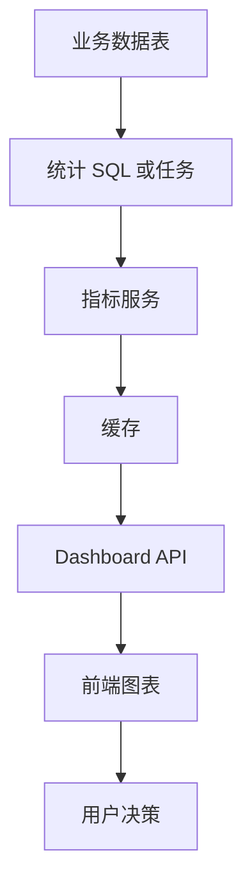
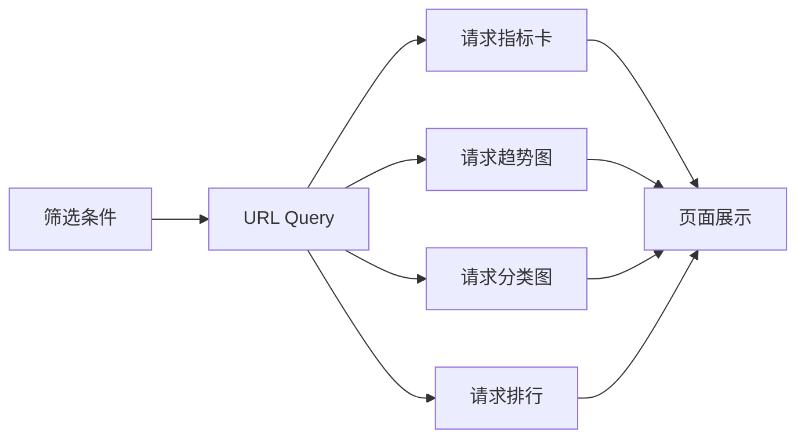
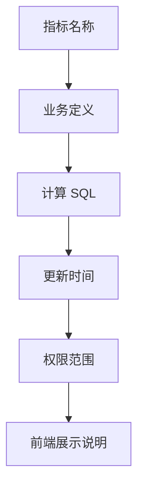

# 数据看板项目案例

## 适合谁看

适合需要做运营看板、销售看板、系统监控、用户增长分析、订单统计和管理驾驶舱的开发者。

数据看板不是“画几个图表”。它要处理指标口径、时间范围、筛选条件、缓存、权限、数据延迟、图表空状态和性能。

## 业务目标

第一版数据看板支持：

- 核心指标卡。
- 趋势折线图。
- 分类柱状图。
- 排名列表。
- 时间范围筛选。
- 部门或业务线筛选。
- 指标说明。
- 数据导出。
- 权限控制。

## 指标链路



看板最重要的是指标口径一致。前端图表只是最后一层展示。

## 页面结构

```text
views/dashboard/
├─ DashboardPage.vue
├─ DashboardFilters.vue
├─ MetricCards.vue
├─ TrendChart.vue
├─ CategoryChart.vue
├─ RankingTable.vue
└─ MetricHelpDrawer.vue
```

页面分工：

| 组件 | 负责 |
| --- | --- |
| DashboardFilters | 时间范围、部门、业务线 |
| MetricCards | 总量、同比、环比 |
| TrendChart | 时间趋势 |
| CategoryChart | 分类对比 |
| RankingTable | Top N 明细 |
| MetricHelpDrawer | 指标口径解释 |

## 数据请求流



筛选条件建议同步到 URL。这样可以复制看板链接，也方便刷新后恢复状态。

## API 设计

```text
GET /api/dashboard/summary?from=2026-07-01&to=2026-07-31&departmentId=10
GET /api/dashboard/trend?metric=orders&from=...&to=...
GET /api/dashboard/category?metric=orders&groupBy=channel
GET /api/dashboard/ranking?metric=sales&page=1&pageSize=10
```

响应要包含单位和口径信息。

```json
{
  "metric": "paid_orders",
  "label": "支付订单数",
  "unit": "单",
  "value": 1280,
  "compare": {
    "type": "week_over_week",
    "rate": 0.12
  },
  "updatedAt": "2026-07-02T10:00:00+08:00"
}
```

## 指标口径治理



每个指标都要写清：

- 这个指标叫什么。
- 统计哪些数据。
- 不统计哪些数据。
- 时间口径是什么。
- 是否有延迟。
- 谁能看到。

## 缓存策略

看板接口通常不需要每次都打数据库。

| 数据类型 | 缓存建议 |
| --- | --- |
| 今日实时核心指标 | 30 秒到 2 分钟 |
| 历史趋势 | 10 分钟到 1 小时 |
| 排名列表 | 1 到 5 分钟 |
| 指标字典 | 长缓存，变更时失效 |

缓存 key 要包含筛选条件：

```ts
function dashboardCacheKey(query: DashboardQuery) {
  return `dashboard:${query.metric}:${query.from}:${query.to}:${query.departmentId ?? 'all'}`
}
```

## 常见问题

### 问题 1：前端图表显示正常，但业务说数据不对

先对指标口径，不要先改图表。确认 SQL、时间范围、时区、状态过滤、权限范围和缓存时间。

### 问题 2：切换筛选条件后图表闪烁或旧数据混入

每个图表请求要根据当前 query 判断是否仍有效。可以使用请求序号、取消请求或数据请求库。

### 问题 3：看板接口越来越慢

不要让复杂统计直接压在线上交易库。可以使用缓存、预聚合表、定时任务、读库或分析库。

## 验收清单

- 每个指标有口径说明。
- 时间范围、时区、状态过滤明确。
- 筛选条件同步到 URL。
- 图表有 loading、empty、error 状态。
- 接口有缓存和过期策略。
- 用户只能看到自己权限范围内的数据。
- 数据导出和页面展示口径一致。
- README 写清指标、接口和缓存策略。

## 下一步学习

继续学习 [数据库索引与查询优化](/database/indexes)、[浏览器渲染与性能](/browser/rendering-performance) 和 [真实项目问题库](/projects/real-world-issues)。
