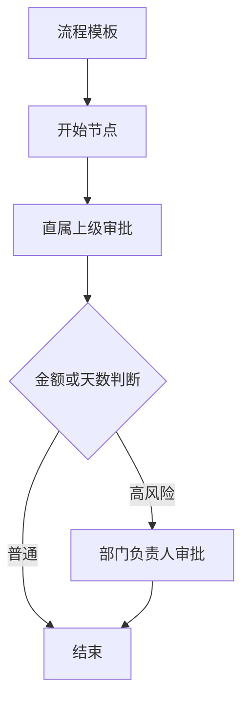
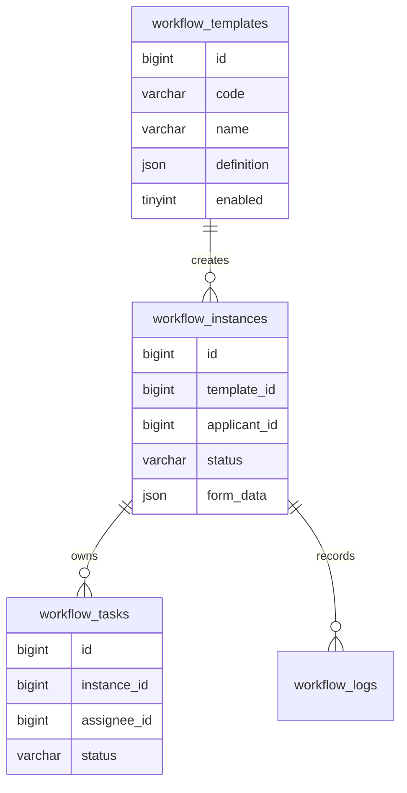
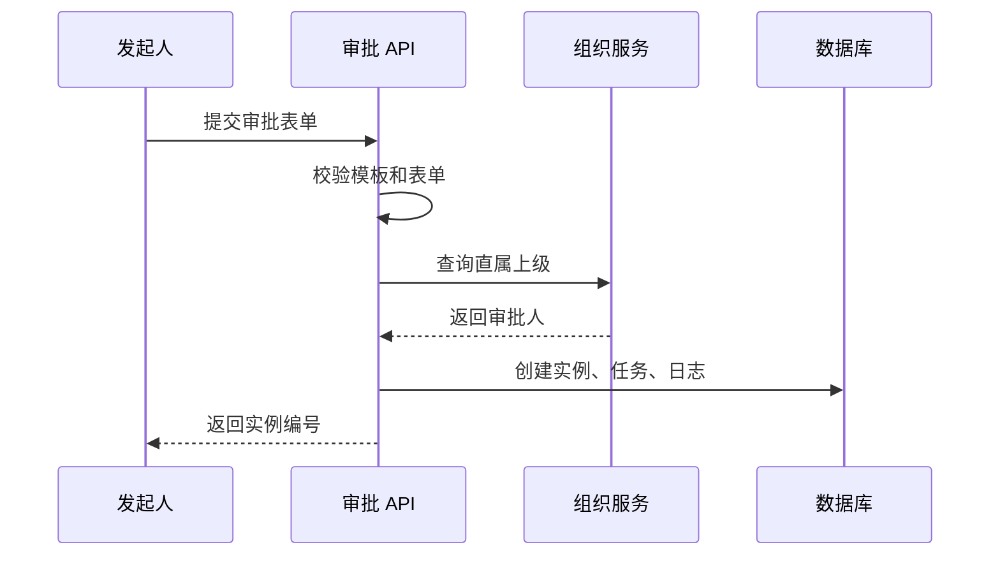

# 审批流项目案例

## 适合谁看

适合正在做请假、报销、采购、合同、发布审批、权限申请等流程型业务的开发者。

审批流的难点不是“画几个节点”，而是流程定义、实例流转、任务处理、权限校验、状态一致性、撤回、驳回、转交和审计日志。

## 业务目标

第一版审批流支持：

- 流程模板配置。
- 发起审批。
- 审批任务列表。
- 同意、驳回、转交。
- 审批记录。
- 审批状态查询。
- 与组织架构和权限系统联动。

## 先看审批实例

先从使用者视角观察一条正在运行的审批。重点不是节点画得多复杂，而是当前任务、处理人、版本、剩余时间和历史记录是否一致。

<DocFigure
  src="/images/projects/approval-workflow-state.webp"
  alt="采购审批实例展示已提交、直属上级、财务复核、部门负责人和结束节点，并列出当前任务与审计记录"
  caption="审批动作要在事务中校验任务状态与版本，并发处理时只能有一个请求成功。"
  :width="1440"
  :height="900"
/>

图中财务复核是唯一当前任务。审批记录用于解释流程如何到达这里，但不能替代真实任务状态；服务端仍要以实例和任务表为准完成条件更新。

## 核心概念

| 概念 | 说明 |
| --- | --- |
| 流程模板 | 审批规则，例如请假审批模板 |
| 流程实例 | 某一次实际发起的审批 |
| 节点 | 审批过程中的一步 |
| 任务 | 分配给某个处理人的待办 |
| 表单数据 | 发起人提交的业务内容 |
| 审批动作 | 同意、驳回、转交、撤回 |

## 流程模型



第一版不要急着做复杂可视化流程设计器。先支持固定节点类型和条件分支，保证业务能跑通。

## 数据模型



关键状态：

| 对象 | 状态 |
| --- | --- |
| 实例 | draft、running、approved、rejected、cancelled |
| 任务 | pending、approved、rejected、transferred、cancelled |

状态必须有限且明确，不能用自由文本随便写。

## 发起审批流程



创建实例、首个任务、审批日志必须在同一个事务里完成。

## 审批动作处理

审批动作不是简单改状态。它至少要做：

1. 校验当前任务是否存在。
2. 校验当前用户是否任务处理人。
3. 校验任务是否仍是 pending。
4. 写审批意见。
5. 更新当前任务。
6. 判断下一节点。
7. 创建下一任务或结束实例。
8. 写审计日志。

伪代码：

```ts
await db.transaction(async (tx) => {
  const task = await taskRepository.findPendingTask(tx, taskId)
  assertAssignee(task, currentUser.id)

  await taskRepository.approve(tx, taskId, comment)

  const nextNode = resolveNextNode(instance, task)
  if (nextNode) {
    await taskRepository.create(tx, {
      instanceId: instance.id,
      assigneeId: nextNode.assigneeId
    })
  } else {
    await instanceRepository.markApproved(tx, instance.id)
  }

  await logRepository.create(tx, actionLog)
})
```

## 前端页面拆分

```text
views/workflow/
├─ templates/
│  └─ WorkflowTemplateList.vue
├─ launch/
│  └─ LaunchApprovalPage.vue
├─ tasks/
│  ├─ TodoTaskList.vue
│  └─ DoneTaskList.vue
└─ detail/
   ├─ ApprovalDetail.vue
   ├─ ApprovalTimeline.vue
   └─ ApprovalActions.vue
```

页面重点：

- 待办列表只显示当前用户可处理任务。
- 详情页展示表单、当前状态、审批时间线。
- 动作按钮根据任务状态和处理人决定。

## 常见问题

### 问题 1：两个人同时审批同一个任务

任务更新要带状态条件。

```sql
UPDATE workflow_tasks
SET status = 'approved'
WHERE id = ? AND status = 'pending';
```

如果影响行数为 0，说明任务已被处理。

### 问题 2：驳回后不知道回到哪里

驳回规则要写进模板：退回发起人、退回上一节点、直接结束。不要让每个业务接口临时决定。

### 问题 3：审批记录缺失

审批动作、处理人、处理时间、意见、前后状态都要写日志。日志不要依赖前端展示状态临时拼。

## 验收清单

- 模板、实例、任务、日志模型清晰。
- 发起审批时能创建实例、任务和日志。
- 同意、驳回、转交都有权限校验。
- 并发审批不会重复处理。
- 审批详情能展示完整时间线。
- 所有审批动作都有审计日志。
- README 写清流程状态和节点规则。

## 下一步学习

继续学习 [Node 权限 API 从零到项目](/node/permission-api-project)、[数据库事务、锁与并发](/database/transactions) 和 [真实项目问题库](/projects/real-world-issues)。
