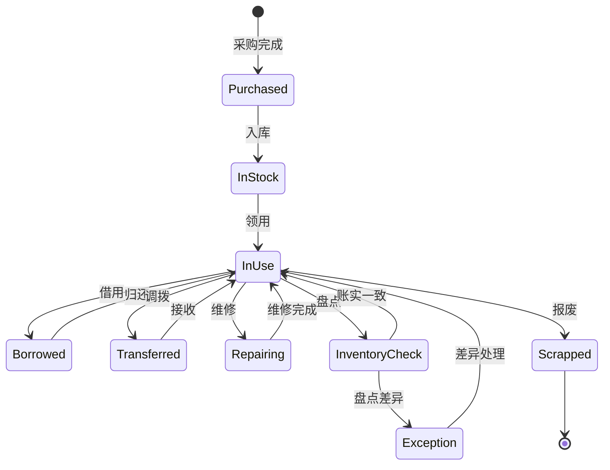
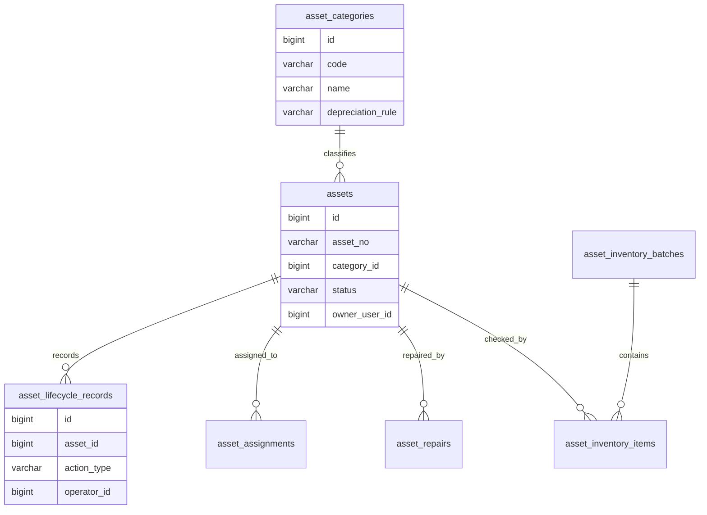
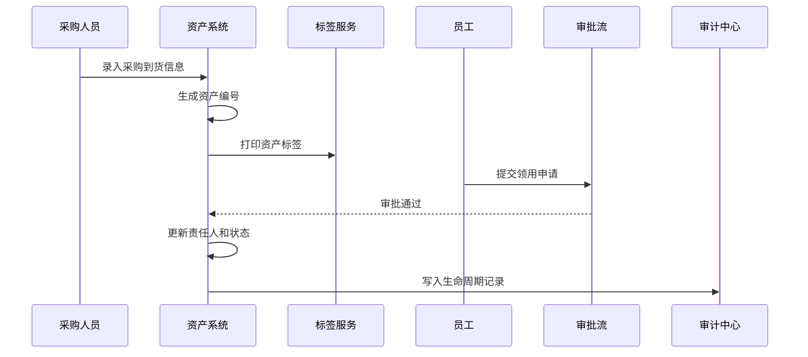

# 资产管理项目案例

## 适合谁看

适合需要做固定资产、IT 设备、办公用品、资产入库、领用、调拨、维修、盘点、折旧和报废流程的开发者。

资产管理不是“登记一张设备表”。真实项目里，资产会经历采购、入库、领用、借用、调拨、维修、盘点、折旧和报废。每一步都关系到资产归属、责任人、位置、成本和审计。资产系统做不好，最常见的问题是账实不符、责任人不清、设备丢失后查不到流转记录。

## 业务目标

第一版资产管理支持：

- 维护资产分类和资产编码。
- 资产入库和标签打印。
- 资产领用、借用和归还。
- 资产部门调拨。
- 资产维修和保养记录。
- 资产盘点和差异处理。
- 资产报废审批。
- 资产折旧和成本归属。
- 资产操作审计。

## 资产生命周期

资产状态要严格流转。不要让管理员直接把“在用”改成“报废”，否则中间的审批、责任人确认和财务处理都会丢失。

## 数据模型

## 推荐表结构

| 表 | 作用 | 关键字段 |
| --- | --- | --- |
| `asset_categories` | 资产分类 | `code`、`name`、`depreciation_rule`、`enabled` |
| `assets` | 资产主表 | `asset_no`、`category_id`、`status`、`current_user_id`、`location_id` |
| `asset_assignments` | 领用和借用记录 | `asset_id`、`assignee_id`、`assign_type`、`returned_at` |
| `asset_transfers` | 调拨记录 | `asset_id`、`from_dept_id`、`to_dept_id`、`status` |
| `asset_repairs` | 维修记录 | `asset_id`、`repair_reason`、`vendor`、`cost_amount` |
| `asset_inventory_batches` | 盘点批次 | `batch_no`、`scope_type`、`status`、`started_at` |
| `asset_inventory_items` | 盘点明细 | `batch_id`、`asset_id`、`check_result`、`difference_reason` |
| `asset_lifecycle_records` | 生命周期记录 | `asset_id`、`action_type`、`before_status`、`after_status` |

资产编号要稳定。标签二维码、领用记录、盘点记录和财务折旧都应该关联同一个资产编号。

## 入库和领用流程

领用成功后要同时更新当前责任人、所在部门、使用位置和生命周期记录。只改资产状态会导致后续盘点无法追踪。

## 盘点设计

| 场景 | 处理方式 | 注意点 |
| --- | --- | --- |
| 正常盘点 | 扫码确认资产存在 | 保存盘点人和时间 |
| 位置不一致 | 标记位置差异 | 需要责任人确认 |
| 责任人不一致 | 标记使用人差异 | 可能需要调拨流程 |
| 资产缺失 | 生成差异单 | 高价值资产需要审批 |
| 发现账外资产 | 创建待确认资产 | 不能直接入账 |
| 报废资产仍在用 | 生成异常记录 | 需要恢复或重新报废 |

盘点不是简单的“是否存在”。实际项目里更重要的是责任人、部门、位置和状态是否一致。

## 前端页面拆分

| 页面 | 作用 | 注意点 |
| --- | --- | --- |
| 资产台账 | 查询资产状态、责任人和位置 | 支持扫码定位资产 |
| 资产详情 | 查看生命周期、附件和维修记录 | 时间线展示流转过程 |
| 入库管理 | 批量创建资产和标签 | 编码规则要稳定 |
| 领用借用 | 员工申请资产 | 审批通过后才变更责任人 |
| 调拨管理 | 部门或位置变更 | 接收方需要确认 |
| 维修管理 | 跟踪维修费用和结果 | 维修中资产不可重复领用 |
| 盘点管理 | 创建盘点批次和差异处理 | 支持扫码盘点 |
| 报废审批 | 高价值资产报废 | 财务和资产管理员共同确认 |

## 实际项目常见问题

### 问题 1：资产账上在库，实际已经被员工拿走

说明领用流程绕过了系统。资产出库必须走领用或借用记录，并要求责任人确认。

### 问题 2：盘点差异处理后仍然查不到原因

盘点差异不能只改资产表。要保留差异类型、处理人、处理说明和审批记录。

### 问题 3：报废资产又出现在领用列表

资产状态机和列表过滤不一致。报废、丢失、维修中的资产都不能进入可领用池。

## 验收清单

- 资产分类和编码规则清晰。
- 每个资产有稳定编号和标签。
- 入库、领用、借用、调拨、维修、盘点、报废都有记录。
- 资产当前责任人、部门和位置可追踪。
- 盘点支持批次和差异处理。
- 报废需要审批。
- 高价值资产操作有审计。
- 维修中和报废资产不能被领用。
- 资产生命周期可以按时间线查看。
- 资产数据能导出给财务或审计。

## 下一步学习

继续学习 [采购管理项目案例](/projects/procurement-management-case)、[审批流项目案例](/projects/approval-workflow-case) 和 [审计中心项目案例](/projects/audit-center-case)。
