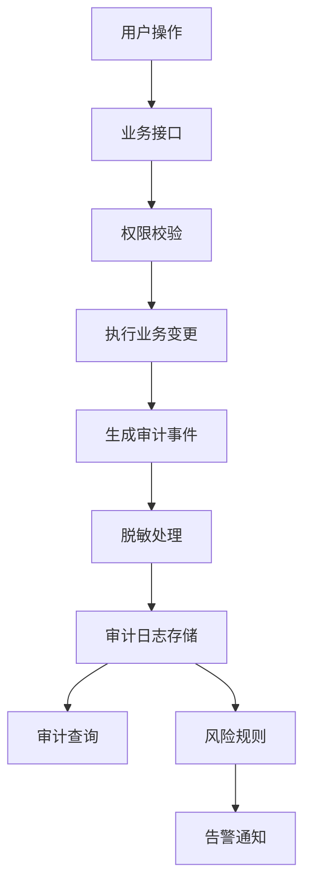
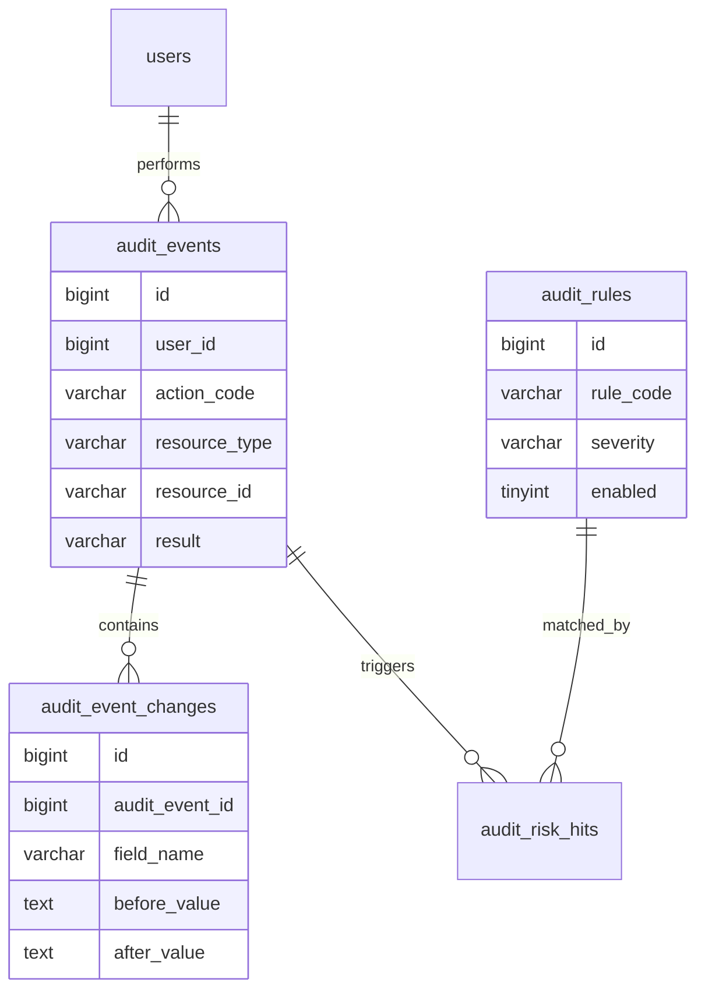
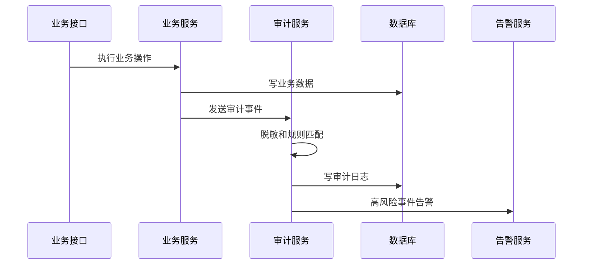

# 审计中心项目案例

## 适合谁看

适合需要做操作日志、安全审计、权限变更追踪、敏感数据访问记录、合规导出和风险告警的开发者。

审计中心不是“记录一行谁点了按钮”。真实项目里，审计日志要能回答：谁、在什么时间、从哪里、对什么对象、做了什么、结果如何、修改前后是什么、为什么允许这个操作。权限系统、开放平台、支付订单、文件中心和多租户系统都离不开审计。

## 业务目标

第一版审计中心支持：

- 记录用户关键操作。
- 记录接口访问和业务结果。
- 记录权限、角色、租户、支付、文件等高风险变更。
- 支持按用户、资源、动作、时间查询。
- 支持变更前后对比。
- 支持敏感字段脱敏。
- 支持审计日志导出。
- 支持风险规则和告警。

## 审计链路图



审计记录最好由后端生成，不能依赖前端主动上报。前端上报可以补充行为分析，但不能作为安全审计的唯一来源。

## 数据模型



## 推荐表结构

| 表 | 作用 | 关键字段 |
| --- | --- | --- |
| `audit_events` | 审计事件主表 | `tenant_id`、`user_id`、`action_code`、`resource_type`、`result` |
| `audit_event_changes` | 字段变更明细 | `field_name`、`before_value`、`after_value` |
| `audit_rules` | 风险规则 | `rule_code`、`severity`、`enabled` |
| `audit_risk_hits` | 风险命中记录 | `audit_event_id`、`rule_id`、`handled_status` |
| `audit_exports` | 审计导出任务 | `query_snapshot`、`file_id`、`expired_at` |

审计表通常增长很快，要提前设计索引、归档和导出策略。

## 审计事件格式

```ts
interface AuditEvent {
  tenantId?: string
  userId: string
  actionCode: string
  resourceType: string
  resourceId: string
  result: 'success' | 'failed'
  ip: string
  userAgent: string
  reason?: string
  changes?: Array<{
    fieldName: string
    beforeValue: string
    afterValue: string
  }>
}
```

动作码要稳定，例如 `role.permission.update`、`payment.refund.create`、`file.download.sensitive`。不要只记录中文按钮文案，因为文案会变。

## 写入流程



高风险审计不能因为日志服务短暂失败就完全丢失。可以使用本地消息表或队列重试。

## 高风险动作

| 动作 | 为什么高风险 |
| --- | --- |
| 修改角色权限 | 可能造成越权 |
| 导出敏感数据 | 数据泄露风险高 |
| 重置密钥 | 影响第三方系统调用 |
| 发起退款 | 涉及资金 |
| 下载私密文件 | 涉及隐私和合规 |
| 禁用租户 | 影响整个客户 |

这些动作必须记录操作理由、结果和变更前后内容。

## 前端页面拆分

| 页面 | 作用 | 注意点 |
| --- | --- | --- |
| 审计日志列表 | 查询关键操作 | 筛选条件要丰富 |
| 审计详情 | 查看请求来源和变更内容 | 敏感字段脱敏 |
| 风险事件 | 查看命中规则 | 支持处理状态 |
| 规则配置 | 配置风险规则 | 修改规则也要审计 |
| 导出任务 | 导出审计记录 | 导出本身也要记录 |

## 常见问题

### 问题 1：出了事故但日志查不到谁改的

说明关键操作没有接入审计，或者只记录了接口路径，没有记录资源 ID 和业务动作。审计要按业务动作设计，不要只按技术接口设计。

### 问题 2：审计日志里出现明文手机号或密钥

审计系统也要做脱敏。不要因为是内部日志就保存完整敏感信息。

### 问题 3：日志太多导致查询很慢

审计表要按时间、租户、动作、资源建立索引，并考虑冷热分离和归档。

## 验收清单

- 高风险操作都写审计。
- 审计事件包含用户、租户、资源、动作、结果和来源。
- 关键变更记录 before / after。
- 敏感字段脱敏。
- 审计日志可按多条件查询。
- 审计导出有任务记录。
- 风险规则命中能告警。
- 审计系统自身的配置变更也有审计。
- 日志有归档和保留策略。

## 下一步学习

继续学习 [多租户权限项目案例](/projects/multi-tenant-permission-case)、[文件中心项目案例](/projects/file-center-case) 和 [数据库安全与审计](/database/security-audit)。
