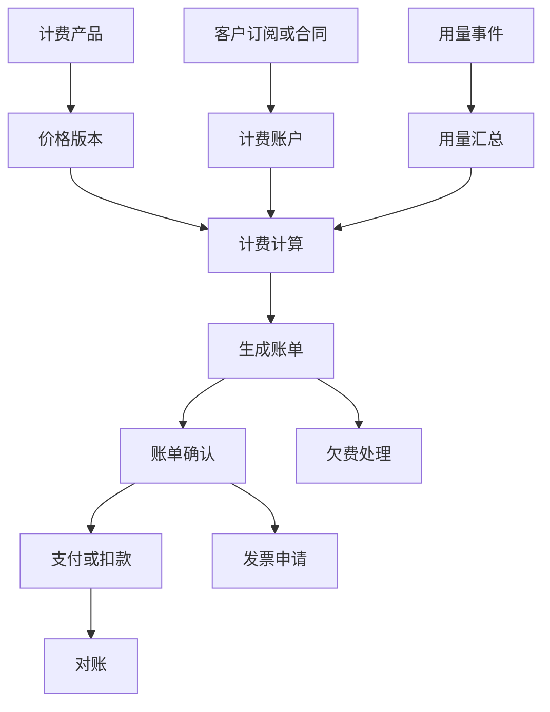
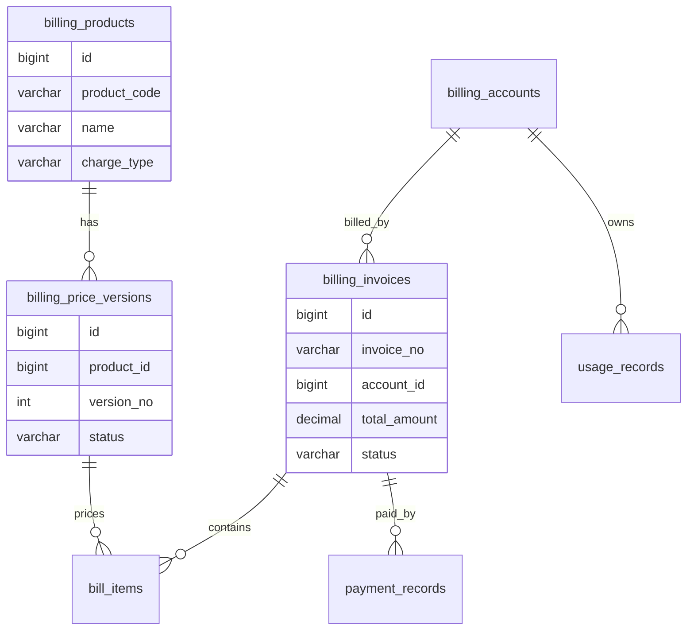
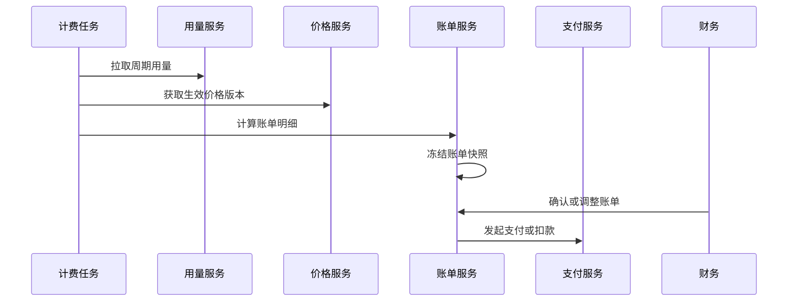

# 计费中台项目案例

## 适合谁看

适合需要做 SaaS 计费、用量计费、阶梯价格、账单生成、扣费、发票、对账和欠费处理的开发者。

计费中台不是“订单金额乘以数量”。真实项目里，计费会涉及套餐、价格版本、用量采集、计费周期、折扣、税费、账单确认、支付、退款、发票、对账和欠费停服。它比会员订阅更偏底层，重点是把“收费规则”和“账务事实”做稳定。

## 业务目标

第一版计费中台支持：

- 配置计费产品和价格版本。
- 支持固定订阅和用量计费。
- 采集用量明细。
- 生成周期账单。
- 支持账单确认和调整。
- 支持支付和退款关联。
- 支持发票申请。
- 支持对账和欠费处理。

## 计费链路图

计费系统要区分“可售卖配置”和“账务结果”。价格配置可以变，但已经生成的账单必须保持稳定。

## 数据模型

## 推荐表结构

| 表 | 作用 | 关键字段 |
| --- | --- | --- |
| `billing_products` | 计费产品 | `product_code`、`name`、`charge_type`、`status` |
| `billing_price_versions` | 价格版本 | `product_id`、`version_no`、`price_config`、`effective_at` |
| `billing_accounts` | 计费账户 | `customer_id`、`currency`、`status`、`credit_limit` |
| `usage_records` | 用量明细 | `account_id`、`metric_code`、`quantity`、`occurred_at` |
| `billing_invoices` | 周期账单 | `invoice_no`、`account_id`、`billing_period`、`status` |
| `bill_items` | 账单明细 | `invoice_id`、`product_code`、`quantity`、`amount` |
| `payment_records` | 支付记录 | `invoice_id`、`pay_amount`、`pay_status`、`paid_at` |
| `billing_adjustments` | 账单调整 | `invoice_id`、`adjust_amount`、`reason`、`approved_by` |

金额字段不要用浮点数。根据项目规范使用整数分或数据库 `decimal`，并统一币种和精度。

## 账单生成流程

账单生成要幂等。同一个账户同一个计费周期不能重复生成两张有效账单。

## 计费规则

| 规则类型 | 示例 | 注意点 |
| --- | --- | --- |
| 固定订阅 | 每月 999 元 | 周期开始和结束要明确 |
| 按量计费 | 每 1000 次 API 调用收费 | 用量去重要严格 |
| 阶梯计费 | 0-1000 次免费，超出按阶梯收费 | 阶梯边界要可测试 |
| 套餐抵扣 | 套餐包含 10GB 存储 | 抵扣顺序要固定 |
| 折扣优惠 | 年付 8 折 | 折扣快照要进入账单 |
| 欠费停服 | 逾期 7 天暂停高级功能 | 停服前要通知 |

第一版计费中台可以先支持固定订阅和简单用量计费，再扩展阶梯、抵扣和复杂折扣。

## 前端页面拆分

| 页面 | 作用 | 注意点 |
| --- | --- | --- |
| 计费产品 | 管理产品和收费类型 | 产品编码发布后稳定 |
| 价格版本 | 配置价格和生效时间 | 发布后不可直接修改 |
| 用量明细 | 查看采集记录 | 支持按账户和指标查询 |
| 账单列表 | 查看周期账单 | 状态和金额清晰 |
| 账单详情 | 展示明细、用量、折扣和调整 | 能解释金额来源 |
| 账单调整 | 审批减免或补收 | 调整原因必须保存 |
| 支付对账 | 对比支付和账单 | 差异可处理 |
| 欠费管理 | 跟踪逾期账户 | 支持通知和停服策略 |

## 实际项目常见问题

### 问题 1：用户质疑账单金额但系统解释不清

账单详情必须保存价格版本、用量快照、折扣快照和计算明细。不要只保存最终金额。

### 问题 2：重复生成账单

账单任务要以账户和计费周期做唯一约束。任务重试时应该返回已有账单，而不是新建一张。

### 问题 3：价格调整影响历史账单

历史账单必须使用生成时的价格快照。价格版本变更只影响未来周期。

## 验收清单

- 产品、价格版本和计费账户边界清晰。
- 价格版本有生效时间和发布状态。
- 用量明细可追踪、可去重。
- 账单生成幂等。
- 账单保存价格、用量和折扣快照。
- 账单调整需要审批和原因。
- 支付记录能和账单关联。
- 欠费账户有通知和处理策略。
- 金额精度统一。
- 账单关键操作有审计记录。

## 下一步学习

继续学习 [会员订阅项目案例](/projects/subscription-billing-case)、[支付订单项目案例](/projects/payment-order-case) 和 [复杂财务对账项目案例](/projects/finance-reconciliation-case)。
