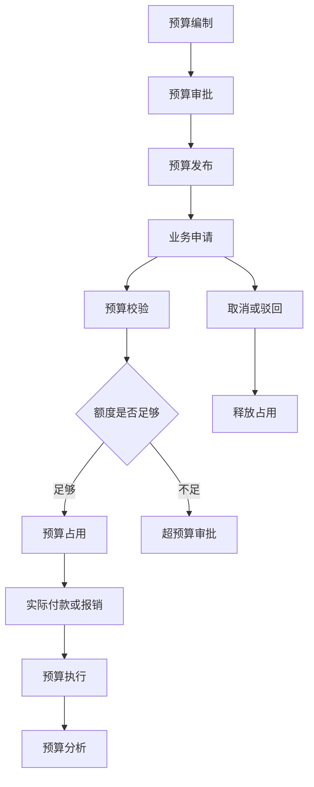
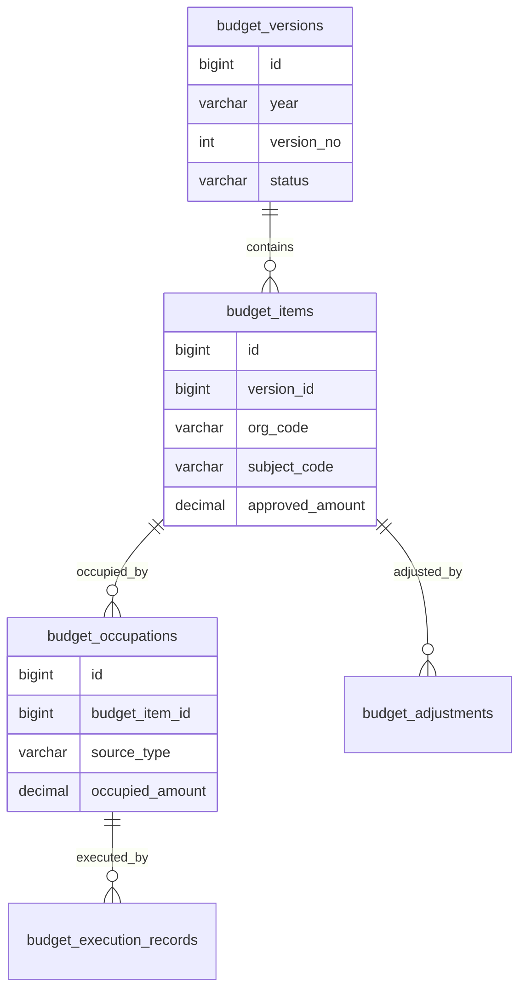
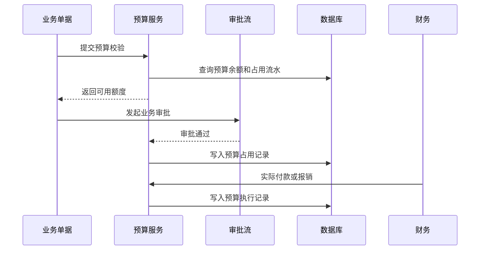

# 预算管理项目案例

## 适合谁看

适合需要做年度预算、部门预算、项目预算、预算申请、预算占用、预算调整、预算执行分析和超预算控制的开发者。

预算管理不是“给部门填一个金额”。真实项目里，预算会贯穿采购、合同、报销、付款、项目和财务分析。系统必须能说明预算从哪里来、谁审批、占用了多少、释放了多少、实际花了多少、是否超过控制线。

## 业务目标

第一版预算管理支持：

- 维护年度、部门、项目和费用科目预算。
- 支持预算编制、审批、发布和调整。
- 支持业务单据占用预算。
- 支持审批驳回、取消和关闭时释放预算。
- 支持预算执行率、剩余额度和超预算预警。
- 支持预算变更和占用流水审计。

## 预算管理链路

核心原则：预算金额、占用金额和实际金额要分开。占用表示“预计要花”，实际表示“已经发生”，两者不能混为一谈。

## 数据模型

## 推荐表结构

| 表 | 作用 | 关键字段 |
| --- | --- | --- |
| `budget_versions` | 预算版本 | `year`、`version_no`、`status`、`published_at` |
| `budget_items` | 预算明细 | `version_id`、`org_code`、`subject_code`、`approved_amount` |
| `budget_adjustments` | 预算调整 | `budget_item_id`、`adjust_amount`、`reason`、`status` |
| `budget_occupations` | 预算占用 | `budget_item_id`、`source_type`、`source_id`、`occupied_amount` |
| `budget_execution_records` | 预算执行 | `occupation_id`、`actual_amount`、`executed_at`、`status` |
| `budget_release_records` | 占用释放 | `occupation_id`、`release_amount`、`reason` |
| `budget_alert_rules` | 预警规则 | `subject_code`、`threshold_rate`、`alert_level` |

预算流水必须可追踪。不要只在预算明细表里更新剩余额度，否则很难解释某个金额为什么变化。

## 预算校验规则

| 场景 | 校验重点 | 处理方式 |
| --- | --- | --- |
| 采购申请 | 部门、科目、年度、预计金额 | 额度足够则占用 |
| 合同付款 | 合同归属预算和付款节点 | 校验剩余额度和合同金额 |
| 报销申请 | 费用科目和报销人部门 | 不足时走超预算审批 |
| 预算调整 | 调入调出科目 | 调整必须审批 |
| 单据取消 | 原占用记录 | 释放占用额度 |

预算校验要放在后端。前端可以展示剩余额度，但不能作为最终控制依据。

## 预算占用流程

占用写入要具备幂等能力。同一个业务单据重复回调审批通过时，不能重复占用预算。

## 前端页面拆分

| 页面或组件 | 作用 | 注意点 |
| --- | --- | --- |
| 预算编制 | 填写年度预算 | 支持按部门和科目展开 |
| 预算审批 | 审核预算版本 | 展示同比、环比和调整说明 |
| 预算执行看板 | 查看使用进度 | 区分占用、执行和剩余 |
| 预算明细 | 查看预算项流水 | 能定位业务单据 |
| 预算调整 | 调增、调减和转移预算 | 调整原因必填 |
| 超预算审批 | 处理超预算申请 | 展示超出金额和影响 |
| 预警配置 | 配置执行率阈值 | 不同科目可以不同规则 |

预算看板要避免只显示百分比。用户还需要看到预算总额、已占用、已执行、可用余额和预计风险。

## 常见问题

### 问题 1：预算显示还有钱，但付款时提示不足

通常是页面只看了预算总额，没有减去已占用和在途单据。预算可用额度应等于已发布预算减占用和执行后的可用值。

### 问题 2：业务单据驳回后预算没有释放

审批驳回、业务取消、订单关闭都要触发释放。释放要写流水，并和原占用记录关联。

### 问题 3：预算调整后历史报表对不上

预算版本和调整流水必须保留。历史报表应能展示当时版本，也能展示调整后的最新口径。

### 问题 4：多个系统同时占用导致余额为负

预算占用需要事务和并发控制。可以对预算项加乐观锁或数据库行锁，避免并发超占。

## 验收清单

- 预算支持版本、审批和发布。
- 预算明细按组织、科目和年度管理。
- 占用、执行、释放都有流水。
- 业务单据占用预算具备幂等能力。
- 驳回、取消和关闭能释放占用。
- 超预算有审批流程。
- 预算调整有原因和审计。
- 看板区分预算、占用、执行和剩余。
- 并发占用不会导致余额为负。
- 预警规则能按科目或组织配置。

## 下一步学习

继续学习 [采购管理项目案例](/projects/procurement-management-case)、[合同管理项目案例](/projects/contract-management-case)、[复杂财务对账项目案例](/projects/finance-reconciliation-case) 和 [审批流项目案例](/projects/approval-workflow-case)。
