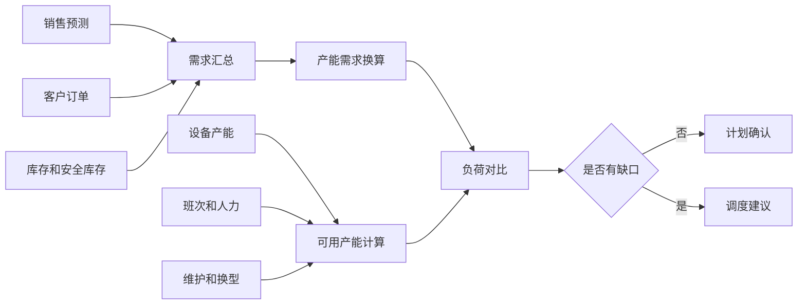
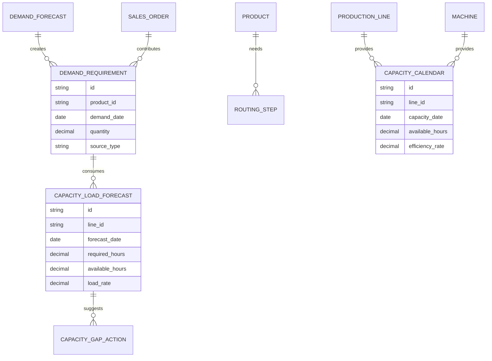
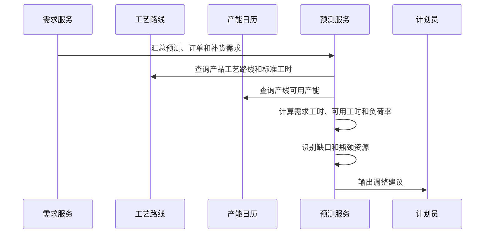
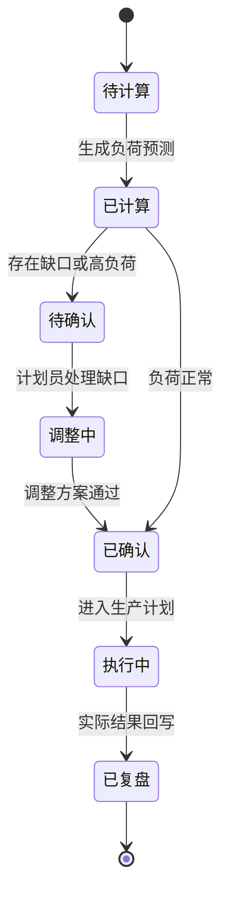
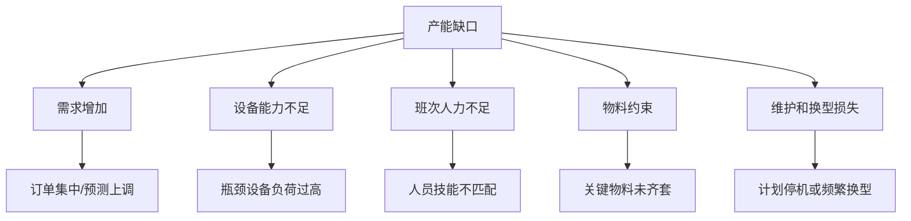

# 产能负荷预测项目案例

## 适合谁看

如果你做过生产排程、生产瓶颈分析、供应链计划或制造成本分析，但不清楚如何提前预测“未来产能够不够”，可以学习这个案例。

产能负荷预测的核心不是只算产线利用率，而是把需求预测、订单、生产计划、设备能力、班次、人力、物料和换型损失一起考虑，提前发现未来某个时间段的产能缺口或闲置。

## 业务目标

产能负荷预测要回答：

1. 未来每天、每周、每条产线的负荷是多少？
2. 哪些工序、设备或班组会成为瓶颈？
3. 缺口能否通过加班、外协、调产线或提前生产解决？
4. 预测结果和实际执行偏差在哪里？

它比生产排程更靠前，目的是给计划人员足够时间调整资源，而不是等订单排不下才临时救火。

## 产能负荷预测链路

这条链路说明，负荷预测一边算“需要多少产能”，一边算“能提供多少产能”，最后比较缺口。

## 核心概念

| 概念 | 含义 | 初学者理解 |
| --- | --- | --- |
| 需求量 | 未来需要生产的数量 | 来自预测、订单和库存补货 |
| 标准工时 | 生产一个单位需要多少时间 | 把数量换算成工时 |
| 可用产能 | 某产线某时间段能生产的能力 | 设备、班次、人力扣除停机后的能力 |
| 负荷率 | 需求产能 / 可用产能 | 超过 100% 就可能排不下 |
| 产能缺口 | 需求大于可用产能的差额 | 需要加班、外协或调整 |
| 预测偏差 | 预测和实际的差异 | 用来持续优化预测模型 |

## 数据模型

预测系统要把“需求”和“产能日历”分开。需求经常变，产能也会因为维护、请假、班次调整而变化。

## 推荐表结构

| 表 | 作用 | 关键字段 |
| --- | --- | --- |
| `demand_forecast` | 销售或市场预测 | 产品、区域、日期、预测数量、版本 |
| `sales_order` | 已确认订单 | 产品、数量、交期、优先级 |
| `demand_requirement` | 需求汇总 | 来源、产品、日期、数量、是否锁定 |
| `routing_step` | 工艺路线 | 产品、工序、产线、标准工时 |
| `capacity_calendar` | 产能日历 | 产线、日期、班次、可用小时、效率 |
| `capacity_load_forecast` | 负荷预测结果 | 需求工时、可用工时、负荷率、缺口 |
| `capacity_gap_action` | 缺口处理建议 | 加班、外协、调线、提前生产、状态 |

## 预测计算流程

产能负荷预测可以按天或周生成。计划粒度越细，数据要求越高；初期建议按周和关键产线做起。

## 预测状态设计

预测不是最终计划。它给计划员提供风险和建议，经过确认后才进入生产计划或排程系统。

## 负荷缺口拆解

缺口建议要对应原因。设备能力不足适合外协或调线，人力不足适合加班或调班，物料不足则要联动采购和供应链。

## 前端页面拆分

| 页面 | 核心内容 | 设计建议 |
| --- | --- | --- |
| 负荷预测看板 | 总负荷率、缺口天数、瓶颈产线、趋势 | 使用日历热力图展示未来风险 |
| 产线负荷详情 | 每日产能、需求工时、负荷率、缺口 | 支持按产品、工序、订单下钻 |
| 缺口处理 | 缺口原因、建议动作、影响评估 | 帮计划员比较方案 |
| 产能日历 | 班次、维护、停机、人员、效率 | 产能来源要透明 |
| 需求版本 | 预测版本、订单变化、锁定需求 | 避免不知道负荷为什么变 |
| 预测复盘 | 预测负荷与实际负荷对比 | 用来优化标准工时和预测口径 |

## 接口拆分建议

| 接口 | 说明 |
| --- | --- |
| `GET /api/capacity-forecast/dashboard` | 查询产能负荷总览 |
| `GET /api/capacity-forecast/lines` | 查询产线负荷列表 |
| `GET /api/capacity-forecast/lines/:id/calendar` | 查询产线日历负荷 |
| `GET /api/capacity-forecast/gaps` | 查询产能缺口 |
| `POST /api/capacity-forecast/gaps/:id/actions` | 创建缺口处理方案 |
| `GET /api/capacity-calendars` | 查询产能日历 |
| `PUT /api/capacity-calendars/:id` | 更新班次、维护或效率 |
| `GET /api/capacity-forecast/reviews` | 查询预测复盘 |

## 实际项目常见问题

### 1. 销售预测经常变，计划员不信系统

如果没有版本，负荷变化无法解释。

解决方式：

- 每次导入预测生成版本。
- 区分预测需求和已锁定订单。
- 负荷详情展示需求变化来源。
- 对关键周期设置冻结窗口。

### 2. 标准工时不准确，负荷计算失真

标准工时来自经验时，很容易和实际偏差很大。

解决方式：

- 先用历史实际工时校准标准工时。
- 按产线、产品、工序分开维护。
- 预测复盘中展示标准工时偏差。
- 偏差超过阈值时触发工艺参数复核。

### 3. 只看产线总产能，忽略瓶颈工序

总产能够不代表每个工序都够。

解决方式：

- 按工序和关键设备计算负荷。
- 识别最高负荷的瓶颈资源。
- 缺口建议绑定具体工序。
- 不要只用整条产线平均能力。

### 4. 缺口建议不可执行

系统说“加班”但没有考虑人力、物料和成本。

解决方式：

- 每种建议计算约束和影响。
- 加班要检查人员和班次。
- 外协要检查供应商能力和交期。
- 调线要检查工艺兼容和换型成本。

### 5. 预测结果没有复盘

没有复盘就无法改进预测。

解决方式：

- 生产执行后回写实际产量、工时和停机。
- 对比预测负荷和实际负荷。
- 统计预测偏差原因。
- 把偏差反馈给需求预测、标准工时和产能日历。

## 权限与审计

| 权限点 | 控制原因 |
| --- | --- |
| 查看全部产能预测 | 涉及工厂产能和经营计划 |
| 修改产能日历 | 直接影响计划判断 |
| 导入需求预测 | 会改变未来负荷 |
| 确认缺口方案 | 影响生产计划 |
| 导出负荷报表 | 涉及产能敏感数据 |

审计日志要记录预测版本导入、产能日历变更、缺口方案确认、冻结窗口调整和数据导出。

## 验收清单

- 能汇总预测、订单和库存补货需求。
- 能根据工艺路线把需求数量换算成工时。
- 能维护产线、设备、班次和维护日历。
- 能计算负荷率、缺口和瓶颈资源。
- 缺口能生成可执行处理建议。
- 能复盘预测结果和实际执行偏差。
- 关键配置有版本和审计日志。

## 下一步学习

- [生产排程项目案例](/projects/production-scheduling-case)
- [生产瓶颈分析项目案例](/projects/production-bottleneck-analysis-case)
- [生产换型损失分析项目案例](/projects/production-changeover-loss-analysis-case)
- [供应链计划项目案例](/projects/supply-chain-planning-case)
