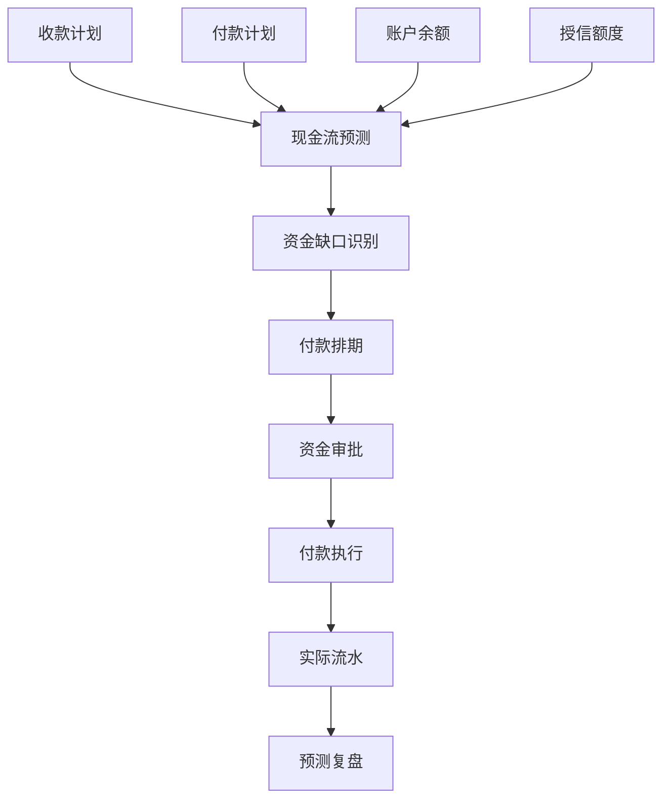
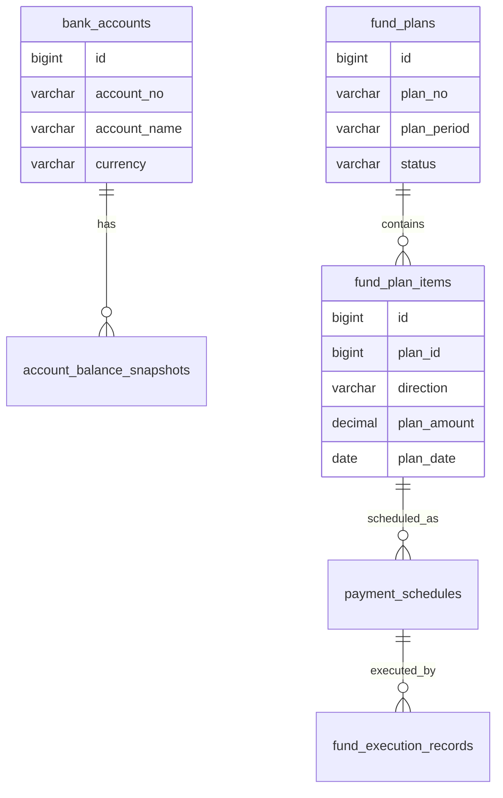
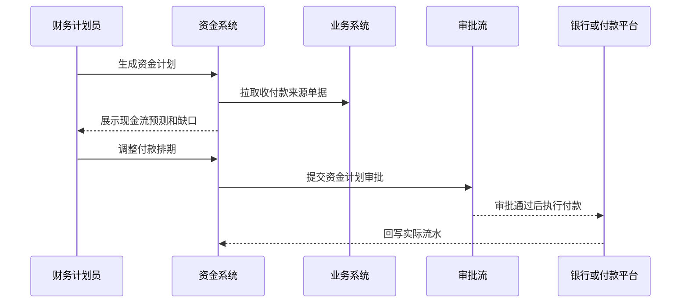

# 资金计划项目案例

## 适合谁看

适合需要做资金预测、收款计划、付款计划、账户余额、资金缺口、付款排期、资金审批和现金流看板的开发者。

资金计划不是“看银行卡余额”。真实企业里，资金要同时考虑合同收款、采购付款、工资、税费、报销、贷款、投资和授信。系统要回答“未来哪天缺钱、哪些款必须付、哪些款可以延期、预计现金流是否安全”。

## 业务目标

第一版资金计划支持：

- 汇总合同、订单、采购、报销和工资等资金来源。
- 维护收款计划和付款计划。
- 维护银行账户和可用余额。
- 支持资金预测、资金缺口和安全水位。
- 支持付款优先级和付款排期。
- 支持资金计划审批和调整。
- 支持现金流看板和风险预警。

## 资金计划链路

核心原则：资金计划要区分计划、审批、执行和实际流水。计划金额不是已经发生的资金流水。

## 数据模型

## 推荐表结构

| 表 | 作用 | 关键字段 |
| --- | --- | --- |
| `bank_accounts` | 银行账户 | `account_no`、`account_name`、`currency`、`status` |
| `account_balance_snapshots` | 账户余额快照 | `account_id`、`balance`、`available_balance`、`snapshot_at` |
| `fund_plans` | 资金计划主表 | `plan_no`、`plan_period`、`status`、`owner_id` |
| `fund_plan_items` | 资金计划明细 | `plan_id`、`direction`、`source_type`、`plan_amount`、`plan_date` |
| `payment_schedules` | 付款排期 | `plan_item_id`、`priority`、`scheduled_date`、`status` |
| `fund_execution_records` | 执行记录 | `schedule_id`、`actual_amount`、`executed_at`、`bank_serial_no` |
| `fund_risk_alerts` | 资金风险 | `plan_id`、`risk_type`、`risk_level`、`reason` |
| `fund_adjustments` | 计划调整 | `plan_item_id`、`adjust_amount`、`reason`、`status` |

资金计划明细必须能追溯来源单据，例如合同、采购单、报销单或工资批次。否则计划和业务无法对齐。

## 资金计划来源

| 来源 | 类型 | 关键字段 |
| --- | --- | --- |
| 销售合同 | 收款 | 合同金额、收款节点、预计日期 |
| 采购合同 | 付款 | 付款条件、发票、验收状态 |
| 报销单 | 付款 | 报销人、金额、审批状态 |
| 工资批次 | 付款 | 发薪日期、总额、状态 |
| 税费计划 | 付款 | 税种、申报期、缴款日期 |
| 银行流水 | 实际 | 到账、付款、手续费 |

资金计划不是财务凭证，但要和财务系统对齐，至少要能和实际银行流水或付款记录核对。

## 资金排期流程

付款排期要支持优先级。工资、税费和关键供应商付款通常优先级高，普通采购可以调整日期。

## 前端页面拆分

| 页面或组件 | 作用 | 注意点 |
| --- | --- | --- |
| 资金工作台 | 查看未来现金流和风险 | 突出资金缺口日期 |
| 收款计划 | 管理预计回款 | 标记逾期和不确定性 |
| 付款计划 | 管理待付款项 | 展示优先级和可延期性 |
| 付款排期 | 调整付款日期和账户 | 支持拖动或批量调整 |
| 账户余额 | 查看账户和余额快照 | 区分余额和可用余额 |
| 资金审批 | 审核大额付款计划 | 展示调整前后影响 |
| 执行流水 | 查看实际付款和到账 | 关联银行流水号 |
| 现金流看板 | 分析缺口、余额和执行偏差 | 展示计划与实际差异 |

资金工作台要以时间轴展示未来现金流。单纯列表很难让财务快速看到哪天会缺钱。

## 常见问题

### 问题 1：计划显示资金充足，但实际付款失败

可能只看了账户余额，没有考虑冻结金额、在途付款和银行限额。要使用可用余额，并记录已排期未执行金额。

### 问题 2：业务调整付款日期后财务不知道

来源单据变化要触发计划变更提醒。资金计划不能只在月初生成一次后不再更新。

### 问题 3：同一笔付款被重复排期

付款排期要按来源单据建立唯一约束，并在执行前检查是否已有执行记录。

### 问题 4：现金流预测总是不准

要记录计划与实际偏差，按客户、供应商、业务线复盘，逐步修正预计收款和付款参数。

## 验收清单

- 资金计划能汇总收款和付款来源。
- 账户余额和可用余额有快照。
- 计划、排期、执行和实际流水分离。
- 付款排期支持优先级和调整。
- 资金缺口能按日期预警。
- 来源单据变化能触发计划提醒。
- 付款执行能关联银行流水。
- 重复排期和重复付款有防护。
- 现金流看板展示计划与实际偏差。
- 大额或高风险付款有审批和审计。

## 下一步学习

继续学习 [预算管理项目案例](/projects/budget-management-case)、[复杂财务对账项目案例](/projects/finance-reconciliation-case)、[采购管理项目案例](/projects/procurement-management-case) 和 [支付订单项目案例](/projects/payment-order-case)。
