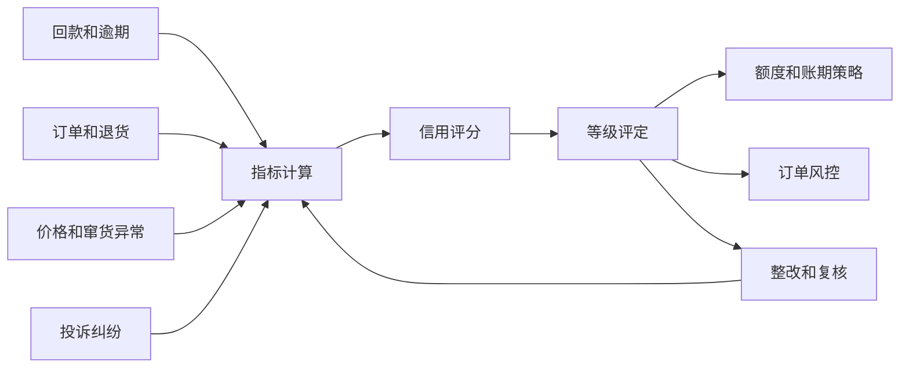
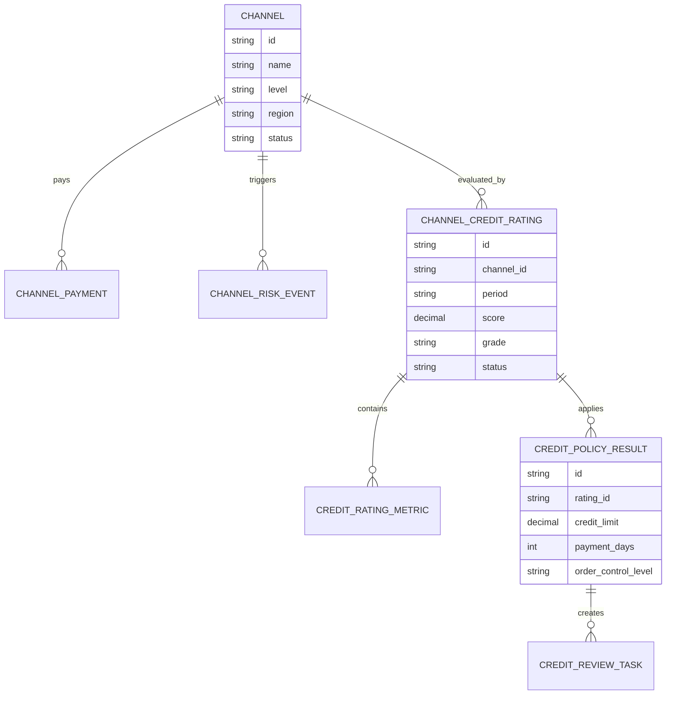
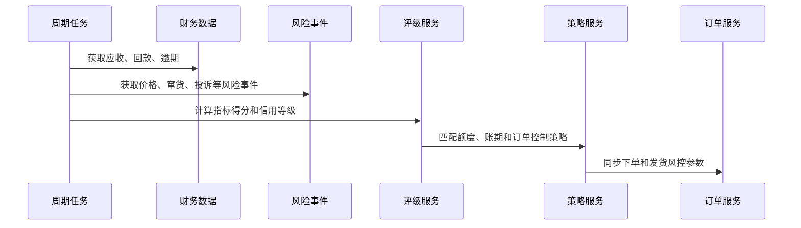
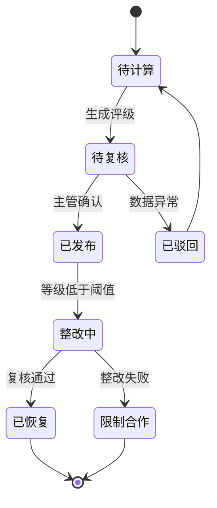
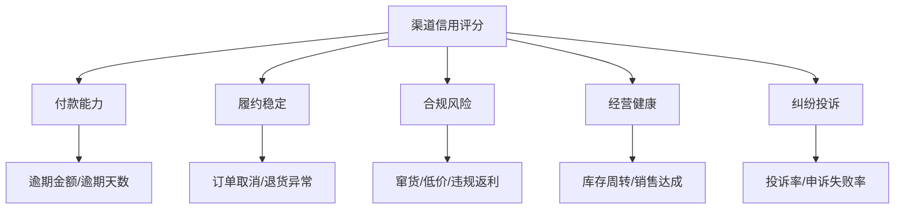

# 渠道信用评级项目案例

## 适合谁看

如果你做过渠道结算、渠道库存、客户账期或客户授信风控，但不清楚如何给经销商、代理商、服务商做信用评级，可以学习这个案例。

渠道信用评级的目标是把渠道的付款能力、履约表现、价格合规、库存健康、投诉纠纷和历史风险合成一个等级，用于控制账期、额度、发货、返利和合作策略。

## 业务目标

渠道信用评级要回答：

1. 哪些渠道可以给更高账期和额度？
2. 哪些渠道需要收紧发货、返利或授信？
3. 信用等级变化的原因是什么？
4. 等级如何影响订单、结算和风控动作？

它不是财务单独做的评分表，而是连接销售、财务、渠道运营和风控的经营控制系统。

## 渠道信用评级链路

信用评级最重要的是能解释。业务不能只看到 B 级或 C 级，还要知道是逾期、窜货、低价、纠纷还是库存异常导致降级。

## 核心概念

| 概念 | 含义 | 初学者理解 |
| --- | --- | --- |
| 信用评分 | 用多个指标计算出的风险分 | 分数越高风险越低或越高，需统一口径 |
| 信用等级 | A/B/C/D 等业务等级 | 等级直接影响策略 |
| 授信额度 | 允许欠款或账期采购的上限 | 渠道最多可以赊多少 |
| 账期 | 允许延期付款的天数 | 比如月结 30 天 |
| 风险事件 | 会影响信用的异常行为 | 逾期、拒付、窜货、投诉 |
| 评级周期 | 月度、季度或实时重评 | 防止一次异常长期影响 |

## 数据模型

评级结果要和策略结果分开。评分是判断，额度、账期和订单控制是业务动作。

## 推荐表结构

| 表 | 作用 | 关键字段 |
| --- | --- | --- |
| `channel` | 渠道主档 | 渠道等级、区域、合作状态、负责人 |
| `channel_payment` | 回款记录 | 应收、实收、逾期天数、核销状态 |
| `channel_risk_event` | 风险事件 | 事件类型、严重程度、金额、处理状态 |
| `credit_rating_rule` | 评级规则 | 指标权重、评分区间、适用范围、版本 |
| `channel_credit_rating` | 信用评级结果 | 分数、等级、周期、规则版本、状态 |
| `credit_rating_metric` | 指标明细 | 指标值、得分、权重、扣分原因 |
| `credit_policy_result` | 策略结果 | 授信额度、账期、发货控制、返利控制 |
| `credit_review_task` | 复核任务 | 降级原因、负责人、整改要求、复核结果 |

## 评级计算流程

信用评级建议周期计算，同时支持重大事件触发重评。例如严重逾期或确认窜货后，可以立即降级。

## 评级状态设计

信用等级会影响订单和财务策略，通常不能计算完就直接生效，需要复核和发布。

## 信用指标拆解

指标要分组展示，避免一个长表让业务无法理解。每个扣分点都要能追溯到原始事件。

## 前端页面拆分

| 页面 | 核心内容 | 设计建议 |
| --- | --- | --- |
| 信用看板 | 等级分布、降级渠道、逾期金额、风险趋势 | 帮管理者看总体风险 |
| 渠道评级列表 | 渠道、分数、等级、额度、账期、状态 | 默认展示降级和待复核 |
| 评级详情 | 指标得分、扣分事件、历史趋势、策略影响 | 说明为什么是这个等级 |
| 规则配置 | 指标权重、等级区间、适用渠道 | 支持版本和模拟 |
| 策略配置 | 等级对应额度、账期、发货控制 | 评分和策略分开维护 |
| 整改复核 | 降级原因、整改动作、复核结论 | 形成闭环 |

## 接口拆分建议

| 接口 | 说明 |
| --- | --- |
| `GET /api/channel-credit/dashboard` | 查询信用评级总览 |
| `GET /api/channel-credit/ratings` | 查询评级列表 |
| `GET /api/channel-credit/ratings/:id` | 查询评级详情 |
| `POST /api/channel-credit/ratings/:id/publish` | 发布评级结果 |
| `POST /api/channel-credit/ratings/:id/review-tasks` | 创建整改复核任务 |
| `GET /api/channel-credit/rules` | 查询评级规则 |
| `PUT /api/channel-credit/rules/:id` | 修改评级规则 |
| `GET /api/channel-credit/policies` | 查询等级策略 |

## 实际项目常见问题

### 1. 销售觉得评级太严，影响业绩

信用评级会影响发货和账期，业务阻力很常见。

解决方式：

- 评级详情展示具体扣分事件。
- 支持特殊授信审批，但必须有有效期。
- 对高风险订单给出可替代动作，例如现款发货。
- 降级策略分阶段执行，不要一刀切。

### 2. 评级数据滞后

如果一个渠道刚严重逾期，但评级下月才更新，风险控制就太慢。

解决方式：

- 周期评级用于常规等级。
- 重大风险事件触发实时重评。
- 订单系统读取最新已发布策略。
- 高风险事件先冻结，复核后恢复。

### 3. 规则调整后历史等级对不上

覆盖历史规则会导致旧评级无法解释。

解决方式：

- 评级规则使用版本。
- 评级结果保存规则版本和指标得分。
- 历史重算标记为模拟结果。
- 规则发布前用历史数据试算影响。

### 4. 渠道等级和信用等级混淆

渠道等级可能代表合作规模，信用等级代表风险，不能混用。

解决方式：

- 页面明确区分渠道等级和信用等级。
- 策略可以同时参考两者。
- 信用等级低但销售规模大的渠道需要更严格复核。
- 不要用销售额直接替代信用评分。

### 5. 评级结果没有落到订单控制

如果只展示评级，不影响额度、账期和发货，业务价值很弱。

解决方式：

- 评级发布后同步策略结果到订单服务。
- 订单提交时校验额度、账期和风险等级。
- 超额订单进入审批。
- 财务和渠道运营共同确认策略。

## 权限与审计

| 权限点 | 控制原因 |
| --- | --- |
| 查看全部信用评级 | 涉及渠道经营风险 |
| 修改评级规则 | 影响额度和账期 |
| 发布评级结果 | 会影响订单策略 |
| 特殊授信审批 | 存在资金风险 |
| 导出信用报表 | 包含财务和风险数据 |

审计日志要记录规则变更、评级发布、特殊授信、策略同步、等级调整和数据导出。

## 验收清单

- 能按渠道计算信用分和等级。
- 能展示指标明细和扣分原因。
- 能把评级映射到账期、额度和订单控制策略。
- 支持周期评级和重大事件重评。
- 评级规则和策略支持版本。
- 降级渠道能创建整改复核任务。
- 关键操作有权限和审计。

## 下一步学习

- [渠道结算项目案例](/projects/channel-settlement-case)
- [渠道价格稽核项目案例](/projects/channel-price-audit-case)
- [渠道窜货监控项目案例](/projects/channel-diversion-monitor-case)
- [客户授信风控项目案例](/projects/customer-credit-risk-control-case)
