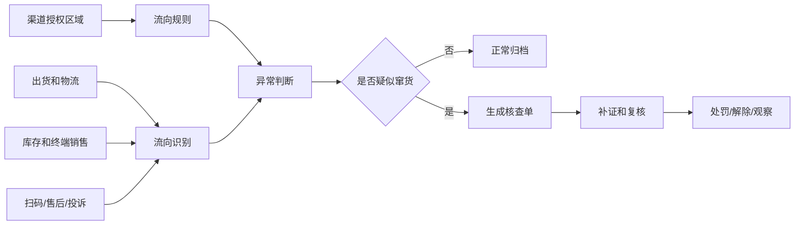
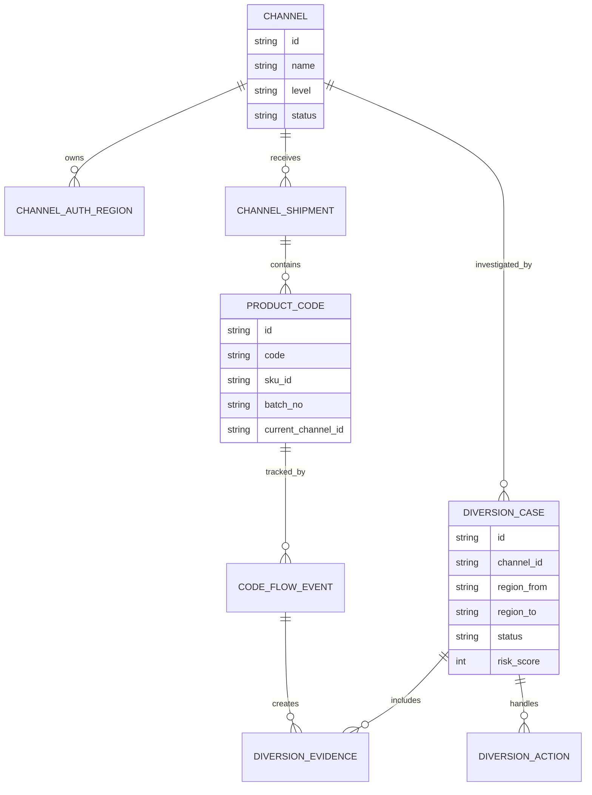
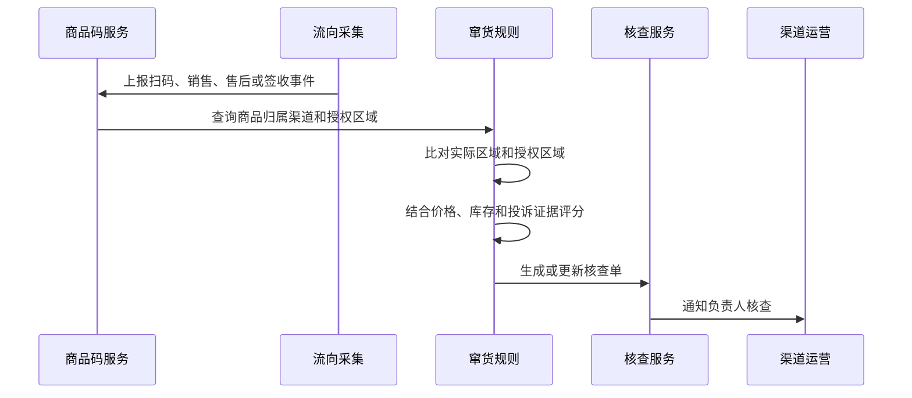
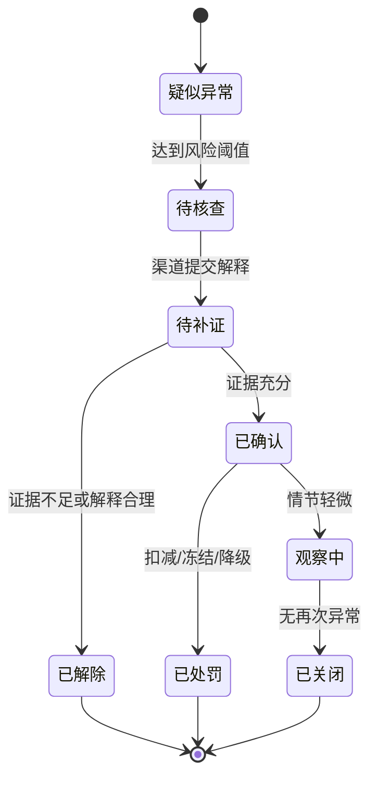
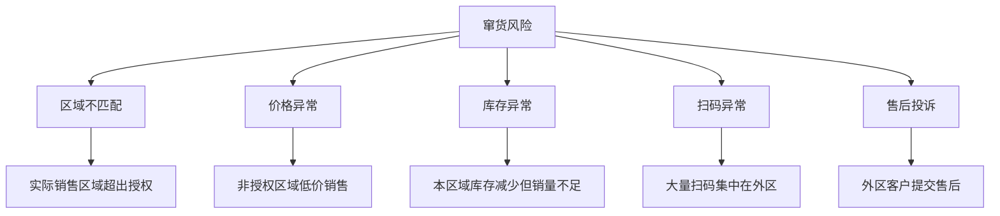

# 渠道窜货监控项目案例

## 适合谁看

如果你做过渠道库存、渠道价格稽核、渠道结算或经销商管理，但不清楚如何发现“跨区域销售、低价倒货、异常流向”，可以学习这个案例。

渠道窜货监控的目标不是只做地图展示，而是把出货、库存、扫码、终端销售、价格、物流和投诉等信号合起来，识别渠道商品是否流到了不该流向的区域或客户。

## 业务目标

渠道窜货监控要回答：

1. 商品从哪个渠道流出？
2. 实际销售或扫码发生在哪个区域？
3. 是否违反授权区域、价格政策或渠道协议？
4. 异常应该预警、核查、处罚还是解除？

真实项目中，窜货通常不是单一证据能证明的，需要多个信号交叉验证。比如订单发到 A 区，但扫码和售后都集中在 B 区，且成交价明显低于 B 区渠道价，这才是强异常。

## 渠道窜货监控链路

这条链路的核心是“授权区域”和“实际流向”之间的对比。授权区域来自合同或渠道政策，实际流向来自多种业务证据。

## 核心概念

| 概念 | 含义 | 初学者理解 |
| --- | --- | --- |
| 窜货 | 商品流向非授权区域或渠道 | A 区的货卖到了 B 区 |
| 授权区域 | 渠道被允许销售的区域 | 合同或政策约定的范围 |
| 流向证据 | 证明商品实际位置的记录 | 扫码、签收、终端销售、售后 |
| 码段 | 商品箱码、单品码、批次码范围 | 用于追踪每件货 |
| 异常强度 | 证据组合后的风险程度 | 证据越多，越可能是真窜货 |
| 核查单 | 对疑似窜货的处理单 | 需要渠道解释和运营复核 |

## 数据模型

如果商品没有码段追踪，也可以先用订单、物流和终端销售做粗粒度监控。但有一物一码或箱码时，准确度会更高。

## 推荐表结构

| 表 | 作用 | 关键字段 |
| --- | --- | --- |
| `channel` | 渠道主档 | 渠道等级、区域、负责人、状态 |
| `channel_auth_region` | 授权区域 | 渠道、省市区、有效期、授权来源 |
| `channel_shipment` | 渠道出货 | 渠道、SKU、批次、数量、发货区域 |
| `product_code` | 商品码 | 单品码、箱码、SKU、批次、当前归属 |
| `code_flow_event` | 流向事件 | 扫码、签收、销售、售后、地理位置 |
| `diversion_case` | 窜货核查单 | 渠道、异常区域、风险分、状态 |
| `diversion_evidence` | 异常证据 | 证据类型、位置、时间、可信度 |
| `diversion_action` | 处理动作 | 补证、复核、处罚、解除、观察 |

## 监控识别流程

窜货监控可以实时生成疑点，但处罚建议走人工复核。因为位置误差、扫码代扫、物流中转都可能造成误判。

## 核查状态设计

“疑似异常”和“已确认”必须分开。系统可以发现疑点，但确认窜货通常需要业务复核。

## 证据强度拆解

项目落地时可以给不同证据设置权重。单次外区扫码可能只是偶然，大量外区扫码加低价销售才更可信。

## 前端页面拆分

| 页面 | 核心内容 | 设计建议 |
| --- | --- | --- |
| 窜货监控看板 | 异常区域、渠道排行、风险趋势、处罚金额 | 先看异常集中在哪里 |
| 核查单列表 | 渠道、SKU、来源区域、流向区域、风险分、状态 | 默认展示待核查和高风险 |
| 核查详情 | 商品流向、地图、证据链、价格和库存 | 证据链比单个结论更重要 |
| 商品码追踪 | 码段、批次、出货、扫码、售后轨迹 | 用于追踪具体货品 |
| 授权区域配置 | 渠道、区域、SKU、有效期 | 规则来源必须清楚 |
| 处罚复盘 | 处罚、解除、申诉、重复异常 | 帮渠道管理做长期治理 |

## 接口拆分建议

| 接口 | 说明 |
| --- | --- |
| `GET /api/diversion/dashboard` | 查询窜货监控总览 |
| `GET /api/diversion/cases` | 查询核查单列表 |
| `GET /api/diversion/cases/:id` | 查询核查详情和证据链 |
| `POST /api/diversion/cases/:id/evidence` | 补充证据 |
| `POST /api/diversion/cases/:id/confirm` | 确认窜货 |
| `POST /api/diversion/cases/:id/release` | 解除异常 |
| `GET /api/product-codes/:code/flow` | 查询商品码流向 |
| `PUT /api/channel-auth-regions/:id` | 修改渠道授权区域 |

## 实际项目常见问题

### 1. 外区扫码很多，但业务说是物流中转

物流中转、仓库扫码、售后维修扫码都可能造成外区记录。

解决方式：

- 区分扫码场景，例如消费者扫码、仓库扫码、售后扫码。
- 物流节点不直接作为销售流向。
- 只有消费者扫码、终端销售和售后地址才作为强证据。
- 核查详情展示证据类型和可信度。

### 2. 没有一物一码，无法精确追踪

很多企业早期只有订单和渠道库存，没有单品码。

解决方式：

- 先按批次、订单、物流和区域销量做粗粒度监控。
- 对高价值 SKU 或重点渠道先接入箱码。
- 逐步把出库、签收、终端销售和售后关联起来。
- 不要一开始就要求全量一物一码。

### 3. 渠道之间互相调货，系统全部判异常

有些调货是被允许的，但需要授权和记录。

解决方式：

- 建立渠道调拨申请和审批。
- 授权调拨生成合法流向记录。
- 未审批调拨才进入疑似窜货。
- 调拨有效期和 SKU 范围必须明确。

### 4. 处罚争议很大

窜货处罚会影响渠道利益，必须有可解释证据。

解决方式：

- 处罚前必须有证据链。
- 提供申诉和复核流程。
- 处罚规则写入渠道协议或政策。
- 审计记录保留确认人、证据和处罚依据。

### 5. 低价乱价和窜货混在一起

低价可能是本区低价，也可能是跨区倒货导致。

解决方式：

- 渠道价格稽核负责判断价格是否违规。
- 窜货监控负责判断流向是否违规。
- 两者可以互相提供证据，但不要混成一个状态。
- 高风险场景用组合规则触发更高优先级核查。

## 权限与审计

| 权限点 | 控制原因 |
| --- | --- |
| 查看全部窜货核查 | 涉及渠道治理和处罚 |
| 查看本渠道异常 | 外部渠道只能看自己的核查单 |
| 修改授权区域 | 影响规则判断 |
| 确认窜货 | 会触发处罚或冻结 |
| 解除异常 | 需要审计原因 |
| 导出证据链 | 涉及渠道和客户敏感数据 |

审计日志要记录授权区域变更、证据补充、状态变更、处罚执行、申诉处理和导出操作。

## 验收清单

- 能维护渠道授权区域和有效期。
- 能接入出货、扫码、销售、售后和库存流向。
- 能根据实际区域和授权区域生成疑似异常。
- 核查详情能展示证据链和风险分。
- 支持补证、复核、确认、处罚和解除。
- 能区分物流中转、合法调拨和真实窜货。
- 关键操作有权限控制和审计日志。

## 下一步学习

- [渠道库存协同项目案例](/projects/channel-inventory-collaboration-case)
- [渠道价格稽核项目案例](/projects/channel-price-audit-case)
- [渠道费用稽核项目案例](/projects/channel-expense-audit-case)
- [渠道结算项目案例](/projects/channel-settlement-case)
