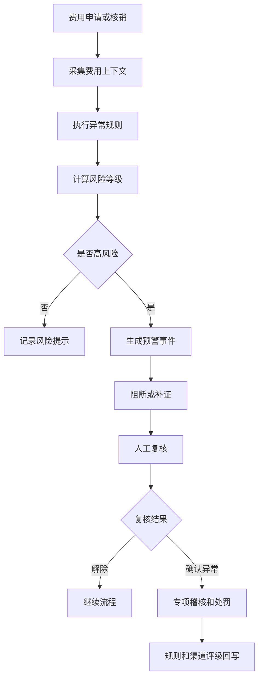
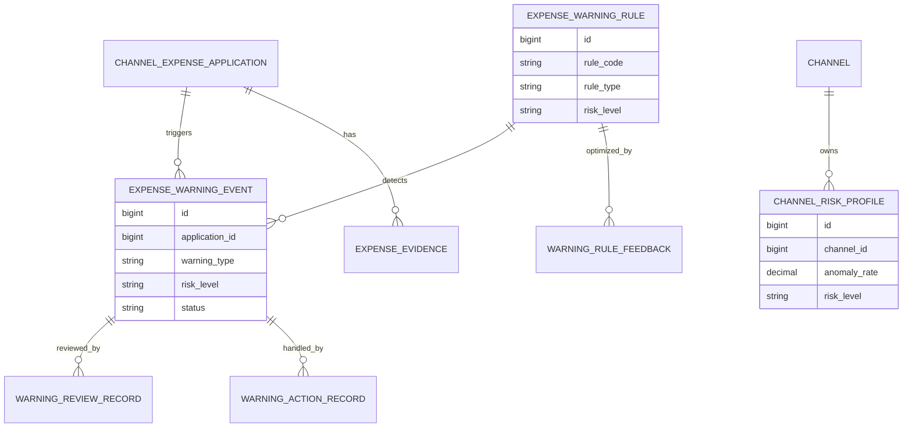
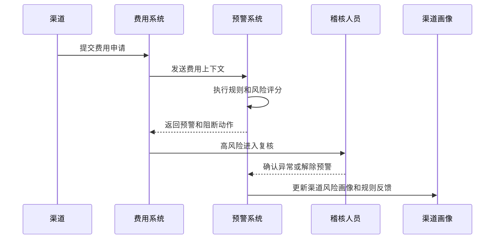
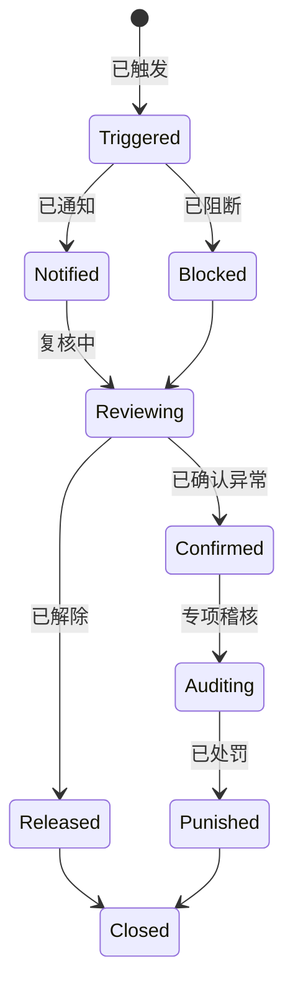
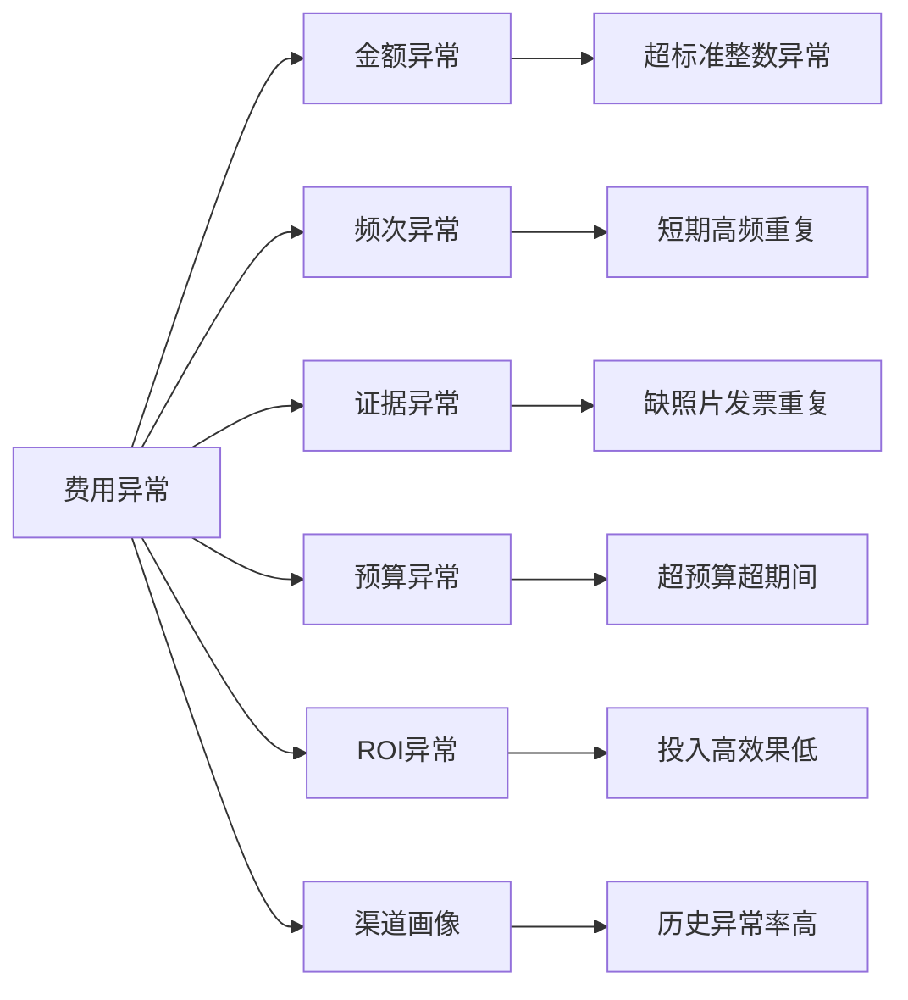

# 渠道费用异常预警项目案例

## 适合谁看

如果你做过渠道费用稽核、渠道费用 ROI 复盘、渠道费用预算优化、渠道结算或风险控制，但还不清楚费用异常如何在申请、执行、核销和结算前提前发现，可以学习这个案例。

渠道费用异常预警关注的是渠道费用在预算、政策、发票、证据、金额、频次、ROI 和渠道行为上的异常信号。它不是结算前才做稽核，而是在费用申请和执行过程中提前提醒，降低重复报销、虚假活动、超预算和低效投入。

## 业务目标

渠道费用异常预警要回答 6 个问题：

- 哪些费用申请可能重复、超标、超预算或缺证据。
- 哪些渠道、区域或费用类型异常率持续升高。
- 哪些费用虽然合规，但 ROI 过低或销售结果异常。
- 预警后应该阻断、补证、降级审批还是进入专项稽核。
- 预警命中是否准确，误报如何调整规则。
- 预警结果如何影响渠道评级、预算和后续费用审批。

真实项目里，如果只在结算后发现异常，钱可能已经付出去了。预警系统要把控制点前移。

## 渠道费用异常预警链路

这条链路说明，异常预警要和费用流程联动，而不是只生成报表。

## 核心概念

| 概念 | 说明 | 新手理解 |
| --- | --- | --- |
| 预警规则 | 判断异常的条件 | 超预算、重复发票、频次异常 |
| 风险等级 | 异常严重程度 | 提示、关注、高风险 |
| 预警事件 | 命中的异常记录 | 需要处理的告警 |
| 阻断动作 | 暂停继续流程 | 防止高风险费用通过 |
| 误报 | 实际没问题但被预警 | 需要优化规则 |
| 规则回写 | 根据复核结果调整规则 | 让预警更准 |
| 渠道画像 | 渠道历史合规表现 | 高频异常渠道更严格 |

预警系统要平衡准确率和业务效率。预警太少会漏风险，预警太多会拖慢业务。

## 数据模型

预警事件要保存规则版本和命中证据。否则规则调整后，历史预警无法解释。

## 推荐表结构

| 表 | 用途 | 关键字段 |
| --- | --- | --- |
| `expense_warning_rule` | 预警规则 | rule_code、rule_type、condition_json、risk_level、version |
| `expense_warning_event` | 预警事件 | application_id、rule_code、warning_type、risk_level、status |
| `warning_action_record` | 处置动作 | warning_id、action_type、operator_id、comment |
| `warning_review_record` | 复核记录 | warning_id、reviewer_id、result、false_positive_flag |
| `channel_risk_profile` | 渠道风险画像 | channel_id、anomaly_rate、confirmed_count、risk_level |
| `warning_rule_feedback` | 规则反馈 | rule_id、feedback_type、sample_id、adjust_suggestion |
| `expense_evidence` | 费用证据 | application_id、evidence_type、verify_status、file_id |

规则反馈表很重要。长期误报的规则需要降权或调整阈值。

## 预警处理流程

预警处理要靠流程承接。只把告警放在列表里，业务很容易不处理。

## 预警状态设计

预警解除要记录原因。否则后续无法判断是规则误报，还是业务补齐了证据。

## 异常因素拆解

不同异常需要不同动作。缺证据可以补，重复发票要阻断，低 ROI 可能进入预算调整。

## 前端页面拆分

| 页面 | 核心内容 | 设计建议 |
| --- | --- | --- |
| 预警工作台 | 预警事件、风险等级、渠道、金额 | 高风险置顶 |
| 预警详情页 | 命中规则、证据、历史相似案例 | 解释为什么预警 |
| 复核处理页 | 解除、补证、确认异常、转稽核 | 动作要清晰 |
| 规则管理页 | 条件、阈值、版本、启停 | 变更需要审批 |
| 渠道画像页 | 异常率、确认率、处罚记录 | 影响后续审批 |
| 误报分析页 | 误报样本、规则调整建议 | 优化预警质量 |
| 趋势看板 | 费用类型、区域、渠道异常趋势 | 帮助管理层识别风险 |

预警详情页要展示命中证据，而不是只显示“高风险”。证据决定用户是否信任预警。

## 接口拆分建议

| 接口 | 方法 | 说明 |
| --- | --- | --- |
| `/api/expense-warnings/events` | GET | 查询预警事件 |
| `/api/expense-warnings/check` | POST | 执行费用预警检查 |
| `/api/expense-warnings/events/:id/review` | POST | 提交复核结果 |
| `/api/expense-warnings/events/:id/actions` | POST | 记录处置动作 |
| `/api/expense-warnings/rules` | GET/POST | 查询和维护预警规则 |
| `/api/expense-warnings/channel-profiles` | GET | 查询渠道风险画像 |
| `/api/expense-warnings/dashboard` | GET | 查询预警趋势 |

预警检查接口要返回命中规则、风险等级、建议动作和证据片段。

## 实际项目常见问题

### 1. 预警太多，业务不看

所有异常都标红，用户不知道先处理哪个。

解决方式：

- 设置风险等级和优先级。
- 高风险阻断，中风险提醒，低风险记录。
- 预警工作台按金额和风险排序。
- 统计规则误报率并调整阈值。

### 2. 规则只看金额，漏掉虚假活动

费用金额不高，但活动证据虚假或重复。

解决方式：

- 规则覆盖证据、频次、发票、活动和 ROI。
- 图片、发票和活动时间做重复校验。
- 同一渠道短期高频申请预警。
- 低 ROI 高频费用进入专项稽核。

### 3. 预警无法阻断流程

系统只是发消息，费用仍然继续审批和结算。

解决方式：

- 高风险预警返回阻断动作。
- 补证或复核通过后才能继续。
- 阻断原因显示在费用单详情。
- 强制放行需要审批和审计。

### 4. 误报没人反馈

规则越做越多，但准确率没有提升。

解决方式：

- 复核时标记误报。
- 误报样本进入规则反馈。
- 定期统计规则命中率和确认率。
- 低质量规则降权或停用。

### 5. 渠道历史异常没有影响后续审批

同一渠道反复异常，但审批策略不变。

解决方式：

- 维护渠道风险画像。
- 高频异常渠道提高审批等级。
- 预算分配和评级参考异常率。
- 整改完成后再降低风险等级。

## 权限与审计

| 权限点 | 控制原因 |
| --- | --- |
| 查看预警事件 | 涉及渠道费用和风险信息 |
| 解除预警 | 可能让费用继续流转 |
| 确认异常 | 影响渠道评级和处罚 |
| 修改规则 | 会影响所有费用检查 |
| 强制放行 | 高风险例外动作 |
| 导出预警清单 | 需要记录导出范围 |

预警解除、规则调整和强制放行都必须有审计记录。

## 验收清单

- 费用申请和核销可以触发预警检查。
- 预警结果包含命中规则、证据和建议动作。
- 高风险预警可以阻断流程。
- 预警可以复核、解除、确认异常或转稽核。
- 误报可以回写规则反馈。
- 渠道风险画像能根据异常结果更新。
- 规则版本、放行和解除操作可审计。

## 下一步学习

学完这个案例后，可以继续看：

- [渠道费用稽核项目案例](/projects/channel-expense-audit-case)
- [渠道费用 ROI 复盘项目案例](/projects/channel-expense-roi-review-case)
- [渠道费用预算优化项目案例](/projects/channel-expense-budget-optimization-case)
- [风险控制中心项目案例](/projects/risk-control-center-case)

