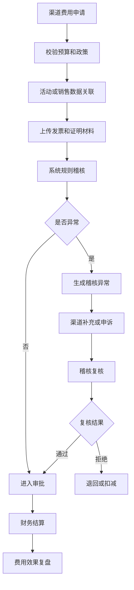
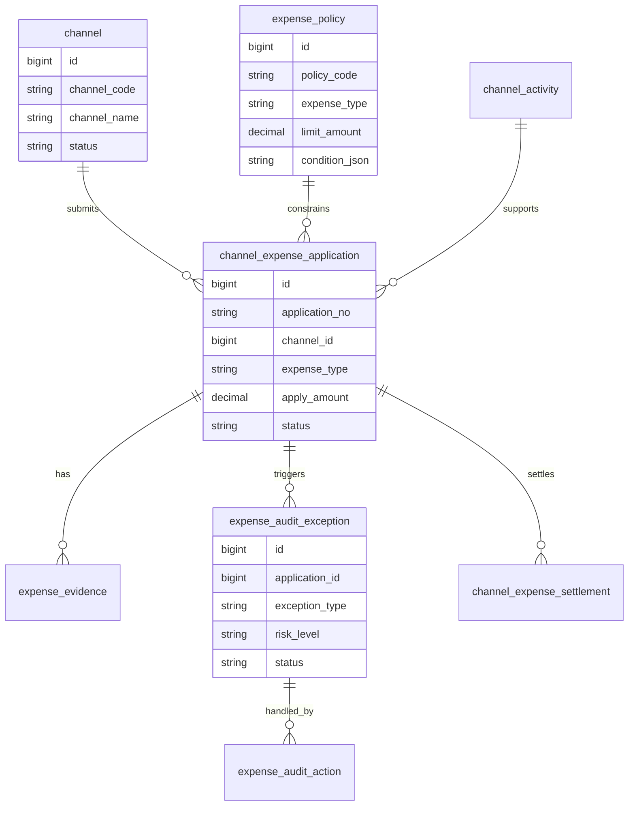
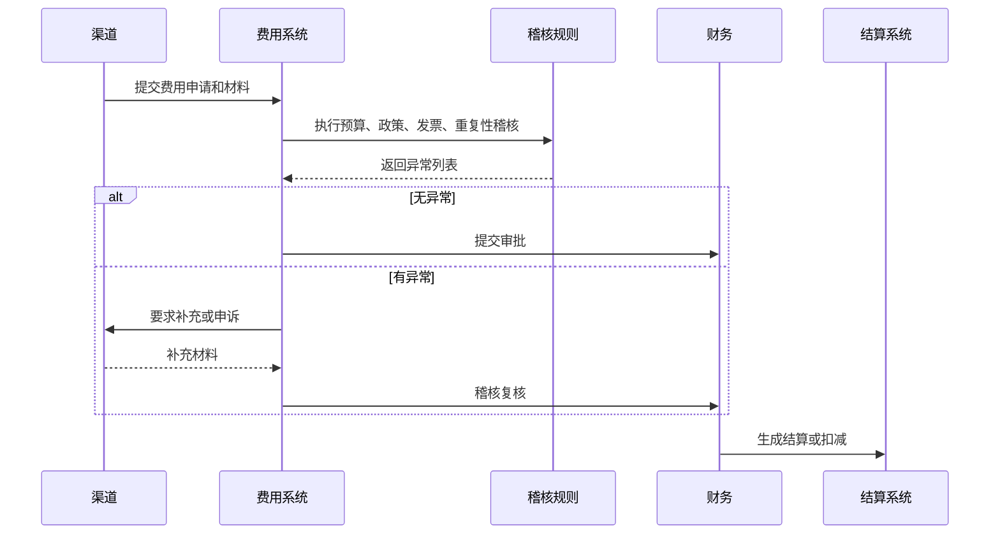
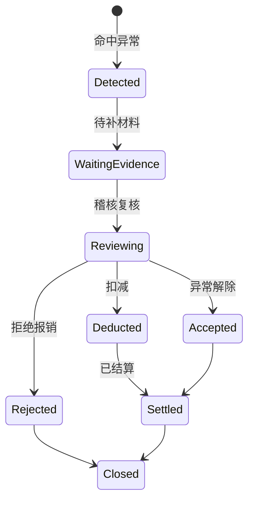
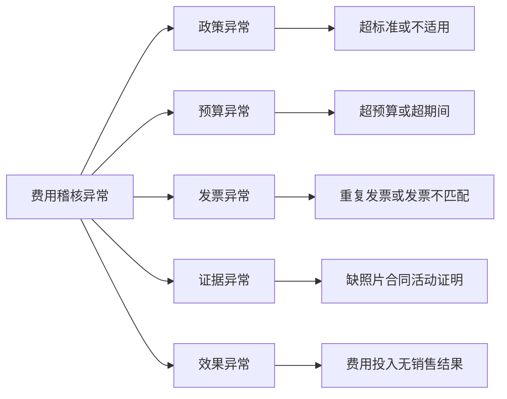

# 渠道费用稽核项目案例

## 适合谁看

如果你做过渠道结算、费用报销、发票协同或销售返利，但不清楚渠道费用为什么经常出现重复、超标和证据不完整，可以先看这一篇。

渠道费用稽核关注的是经销商、门店、代理商、区域销售在市场活动、陈列、促销、物料、返点、补贴和服务费用上的申请、核销、发票、预算和审计。

## 业务目标

渠道费用稽核系统要回答 6 个问题：

- 每笔渠道费用是否有预算、政策和活动依据。
- 费用是否重复申请、超标准、超比例或超期间。
- 发票、照片、合同、活动证明是否完整。
- 渠道费用和销售结果、库存、返利是否能对得上。
- 异常费用如何退回、扣减、冻结或复核。
- 费用稽核结论如何影响渠道评级和后续预算。

费用稽核不是财务最后看一眼发票，而是从申请、执行、核销、审批到结算全链路控制。

## 渠道费用稽核链路

稽核要在结算前完成。如果结算后才发现问题，追回成本和沟通成本都很高。

## 核心概念

| 概念 | 说明 | 项目里的典型字段 |
| --- | --- | --- |
| 费用政策 | 费用类型、标准和适用范围 | expense_policy |
| 费用申请 | 渠道提交的费用单 | expense_application |
| 核销材料 | 发票、照片、合同、活动证明 | evidence_file |
| 稽核规则 | 重复、超标、缺证据等判断 | audit_rule |
| 异常事件 | 稽核命中的问题 | audit_exception |
| 扣减金额 | 不予报销或结算的金额 | deduction_amount |
| 费用效果 | 费用投入带来的销售或曝光结果 | expense_effect |
| 渠道评分 | 费用合规影响的渠道指标 | channel_score |

费用稽核的核心是“证据链”。没有证据，再复杂的审批流也很难判断费用是否真实。

## 数据模型

费用申请和稽核异常要分开。一个费用单可能命中多个异常，例如重复发票、超预算、缺活动照片。

## 推荐表结构

| 表 | 用途 | 关键字段 |
| --- | --- | --- |
| expense_policy | 费用政策 | policy_code、expense_type、limit_amount、scope_json、version |
| channel_expense_application | 渠道费用申请 | application_no、channel_id、expense_type、apply_amount、status |
| expense_evidence | 证明材料 | application_id、evidence_type、file_id、verify_status |
| expense_audit_rule | 稽核规则 | rule_code、rule_type、condition_json、risk_level |
| expense_audit_exception | 稽核异常 | application_id、rule_code、exception_type、risk_level、status |
| expense_audit_action | 异常处理 | exception_id、action_type、operator_id、comment |
| channel_expense_settlement | 费用结算 | application_id、settlement_amount、deduction_amount、settlement_status |

政策、规则、申请、材料、异常、结算都要有版本或快照。费用政策调整后不能影响历史稽核结论。

## 稽核规则流程

规则结果要结构化保存。不要只写“稽核失败”，要记录命中的规则、证据和建议动作。

## 异常状态设计

异常解除不等于结算完成。解除只是稽核通过，仍要走审批和结算流程。

## 稽核异常拆解

异常拆解能帮助业务知道该补什么：补发票、补照片、补审批，还是接受扣减。

## 前端页面拆分

| 页面 | 主要功能 | 新手容易漏掉 |
| --- | --- | --- |
| 费用政策页 | 费用类型、标准、范围、版本 | 政策过期不能继续使用 |
| 费用申请页 | 提交费用、关联活动、上传材料 | 提交前校验必填证据 |
| 稽核工作台 | 异常列表、风险等级、处理动作 | 支持批量和单据详情跳转 |
| 证据核验页 | 发票、照片、合同、活动证明 | 证据要有核验状态 |
| 结算扣减页 | 通过金额、扣减金额、原因 | 扣减原因要能给渠道看 |
| 费用效果页 | 费用投入、销售结果、ROI | 不只看报销金额 |
| 渠道合规页 | 异常率、整改率、重复问题 | 关联渠道评级 |

稽核页面要能让财务、销售运营和渠道三方对同一笔费用形成共识。

## 接口拆分建议

| 接口 | 方法 | 说明 |
| --- | --- | --- |
| /api/channel-expenses/policies | GET/POST | 查询和维护费用政策 |
| /api/channel-expenses/applications | GET/POST | 查询和提交费用申请 |
| /api/channel-expenses/:id/audit | POST | 执行费用稽核 |
| /api/channel-expenses/exceptions | GET | 查询稽核异常 |
| /api/channel-expenses/exceptions/:id/actions | POST | 处理异常 |
| /api/channel-expenses/settlements | GET/POST | 查询和生成结算 |
| /api/channel-expenses/effects | GET | 查询费用效果 |

稽核接口要支持重新执行。补材料、改政策、改预算后，需要重新生成稽核结果并保留历史。

## 实际项目常见问题

### 问题 1：同一张发票被重复报销

发票没有结构化识别，只把图片当附件保存。

解决方式：

- 保存发票代码、号码、金额、开票方。
- 对发票号码和金额做重复校验。
- 关联发票验真结果。
- 重复报销生成高风险异常。

### 问题 2：费用政策调整后历史费用被判异常

历史费用重新读取当前政策。

解决方式：

- 费用申请保存政策版本。
- 稽核异常保存规则版本。
- 历史单据按当时政策判断。
- 政策变更只影响新申请。

### 问题 3：渠道说活动真实，但没有证据

活动照片、合同、陈列证明缺失。

解决方式：

- 按费用类型配置必填证据。
- 证据上传带时间、地点和水印。
- 缺证据进入补材料状态。
- 逾期未补自动扣减或拒绝。

### 问题 4：费用花了但没有效果

报销和销售结果没有关联。

解决方式：

- 费用申请关联活动、产品和门店。
- 计算活动期间销售提升。
- 低效果费用进入复盘。
- 结果影响下一期预算分配。

## 权限与审计

| 权限 | 建议 |
| --- | --- |
| 提交费用 | 渠道或渠道经理 |
| 查看费用 | 按渠道、区域和费用类型授权 |
| 处理异常 | 财务稽核或销售运营 |
| 修改政策 | 费用管理员，发布需要审批 |
| 生成结算 | 财务角色 |
| 导出费用 | 敏感导出水印和审计 |

渠道费用直接影响成本和渠道关系，所有扣减和拒绝必须能解释。

## 验收清单

- 费用申请能关联政策、预算、活动和证据。
- 稽核规则能发现重复、超标、缺证据和效果异常。
- 异常处理有补材料、复核、扣减、拒绝和关闭流程。
- 结算金额和扣减金额可追溯。
- 政策和规则有版本。
- 渠道费用效果能按活动和渠道复盘。
- 导出和敏感操作有审计。

## 下一步学习

建议继续阅读：

- [渠道结算项目案例](/projects/channel-settlement-case)
- [费用报销项目案例](/projects/expense-reimbursement-case)
- [销售返利政策项目案例](/projects/sales-rebate-policy-case)
- [发票协同项目案例](/projects/invoice-collaboration-case)
