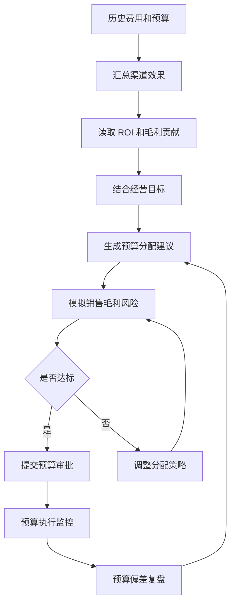
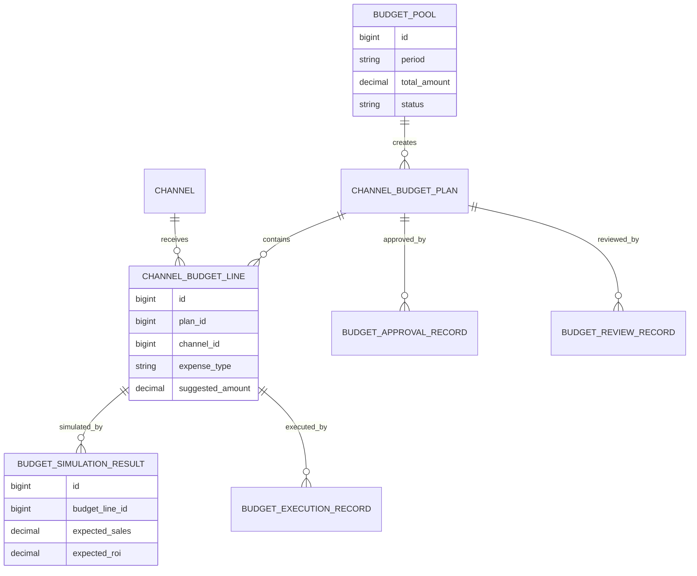
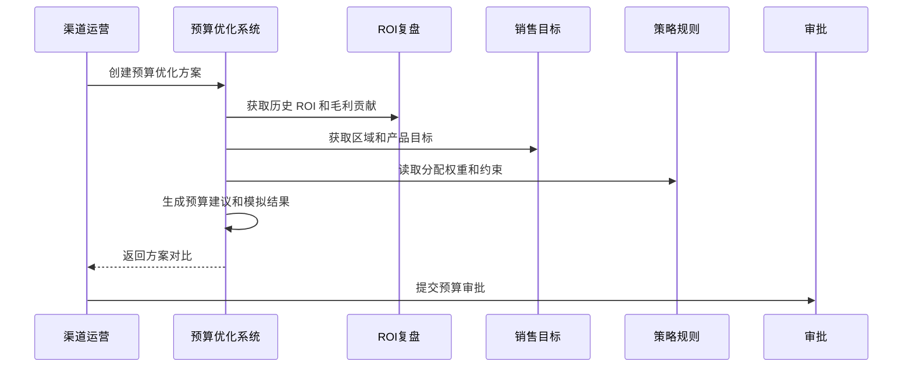
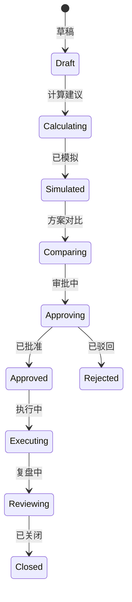
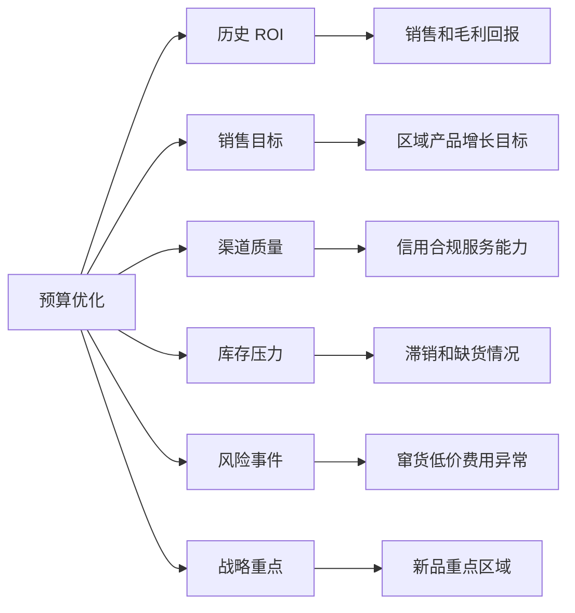

# 渠道费用预算优化项目案例

## 适合谁看

如果你做过渠道费用稽核、渠道费用 ROI 复盘、渠道政策模拟、预算管理、运营活动或渠道利润模拟，但还不清楚下一期渠道预算应该怎么分、哪些渠道应该多给、哪些费用应该收缩，可以学习这个案例。

渠道费用预算优化关注的是根据历史费用、ROI、渠道质量、销售目标、库存压力、区域策略和风险事件，为下一期渠道费用给出预算分配建议。它不是简单按去年比例加减，而是把预算投向更有效、更可控、更符合经营目标的渠道和费用类型。

## 业务目标

渠道费用预算优化要回答 6 个问题：

- 下一期渠道费用总预算应该分配到哪些渠道、区域、产品和费用类型。
- 高 ROI 渠道是否应该加预算，低 ROI 渠道是否应该降预算。
- 库存压力、新品推广、区域增长目标如何影响预算分配。
- 预算调整会带来多少销售、毛利和风险变化。
- 预算建议如何进入审批、执行和复盘。
- 实际执行偏差如何反哺下一轮预算优化。

真实项目里，预算分配最容易延续历史惯性：去年给多少，今年差不多也给多少。系统要让预算分配有证据、有模拟、有复盘。

## 渠道费用预算优化链路

这条链路说明，预算优化不是单次计算，而是“建议、模拟、审批、执行、复盘”的循环。

## 核心概念

| 概念 | 说明 | 新手理解 |
| --- | --- | --- |
| 预算池 | 可分配的费用总额 | 今年有多少钱可花 |
| 分配规则 | 预算按什么逻辑分出去 | 按 ROI、目标、区域 |
| 预算建议 | 系统生成的分配方案 | 推荐给谁多少预算 |
| 预算模拟 | 看方案可能带来的结果 | 销售、毛利、风险预测 |
| 预算占用 | 预算被申请或锁定 | 防止超预算 |
| 预算偏差 | 实际花费和预算差异 | 用来优化下一期 |
| 策略约束 | 分配必须遵守的限制 | 最低投入、上限、重点区域 |

预算优化的核心不是“算得精确”，而是让预算分配过程可解释、可比较、可复盘。

## 数据模型

预算计划和预算明细要分开。一个预算方案可能包含多个渠道、费用类型和产品线。

## 推荐表结构

| 表 | 用途 | 关键字段 |
| --- | --- | --- |
| `budget_pool` | 预算池 | period、total_amount、scope_type、status |
| `channel_budget_plan` | 渠道预算方案 | pool_id、plan_no、strategy_type、status、created_by |
| `channel_budget_line` | 预算分配明细 | plan_id、channel_id、region_id、expense_type、suggested_amount |
| `budget_strategy_rule` | 分配策略规则 | rule_code、factor_weights、constraints_json、version |
| `budget_simulation_result` | 模拟结果 | budget_line_id、expected_sales、expected_profit、expected_roi |
| `budget_execution_record` | 预算执行 | budget_line_id、occupied_amount、used_amount、remaining_amount |
| `budget_review_record` | 预算复盘 | plan_id、actual_roi、deviation_reason、next_suggestion |

分配策略要版本化。不同版本的预算建议不能混在一起比较。

## 预算优化流程

优化流程要支持多个方案并排比较，例如保守方案、增长方案、去库存方案。

## 预算状态设计

已批准预算进入执行后，要支持占用和释放。否则费用申请可能出现超预算或预算闲置。

## 预算因素拆解

预算分配不能只看 ROI。战略新品、库存清理和重点区域可能需要阶段性投入。

## 前端页面拆分

| 页面 | 核心内容 | 设计建议 |
| --- | --- | --- |
| 预算优化工作台 | 预算池、方案状态、总额、待审批 | 按期间和组织筛选 |
| 方案配置页 | 策略类型、权重、约束、预算范围 | 允许选择模板 |
| 预算建议页 | 渠道、区域、费用类型、建议金额 | 展示建议原因 |
| 方案模拟页 | 销售、毛利、ROI、风险影响 | 多方案并排 |
| 预算审批页 | 调整差异、模拟结论、审批意见 | 审批人先看摘要 |
| 执行监控页 | 占用、使用、剩余、超预算风险 | 支持实时预警 |
| 预算复盘页 | 实际 ROI、偏差、下一期建议 | 形成闭环 |

预算页面最重要的是“方案对比”。用户需要看到为什么一个方案比另一个方案更合理。

## 接口拆分建议

| 接口 | 方法 | 说明 |
| --- | --- | --- |
| `/api/channel-budget/pools` | GET/POST | 查询和创建预算池 |
| `/api/channel-budget/plans` | GET/POST | 查询和创建预算方案 |
| `/api/channel-budget/plans/:id/calculate` | POST | 生成预算建议 |
| `/api/channel-budget/plans/:id/simulate` | POST | 模拟方案效果 |
| `/api/channel-budget/plans/:id/submit-approval` | POST | 提交预算审批 |
| `/api/channel-budget/execution` | GET | 查询预算执行情况 |
| `/api/channel-budget/reviews` | GET/POST | 查询和提交预算复盘 |

预算计算接口要返回建议原因，例如“历史 ROI 高、库存压力大、重点区域、风险低”。

## 实际项目常见问题

### 1. 按历史比例分预算

预算分配延续去年惯性，低效渠道仍然拿到大量费用。

解决方式：

- 引入历史 ROI 和毛利贡献。
- 低 ROI 渠道自动降权。
- 战略投入要单独标记原因。
- 预算复盘影响下一期分配。

### 2. 高 ROI 渠道预算无限放大

只看 ROI，忽略渠道承接能力和市场上限。

解决方式：

- 设置渠道预算上限。
- 纳入库存、产能和渠道服务能力。
- 预测边际收益递减。
- 超上限需要人工审批。

### 3. 预算审批看不懂调整原因

审批人只看到金额变化，不知道为什么变。

解决方式：

- 每条预算建议附带原因。
- 展示较上期增减金额和比例。
- 展示模拟销售、毛利和风险。
- 人工调整必须填写原因。

### 4. 执行时预算被抢占

先申请的渠道占用大量预算，重点渠道后续无预算可用。

解决方式：

- 预算按渠道、区域和费用类型分桶。
- 申请时占用预算，审批失败释放。
- 重点预算设置保留额度。
- 超预算申请触发审批。

### 5. 复盘没有回到预算规则

复盘报告写完就结束，下一期继续拍脑袋。

解决方式：

- 复盘结论回写策略规则建议。
- 低效费用类型自动降权。
- 高效策略进入预算模板。
- 规则调整保留版本和审批。

## 权限与审计

| 权限点 | 控制原因 |
| --- | --- |
| 查看预算方案 | 涉及区域和渠道资源分配 |
| 调整预算建议 | 会影响费用申请额度 |
| 修改分配策略 | 会影响所有渠道预算 |
| 提交预算审批 | 进入正式预算流程 |
| 查看模拟结果 | 涉及经营目标和利润 |
| 导出预算明细 | 需要记录导出范围 |

预算优化结果影响资源分配，人工调整和策略变更必须留痕。

## 验收清单

- 能基于预算池生成渠道预算方案。
- 能结合 ROI、目标、库存和风险生成建议。
- 能输出建议原因和模拟结果。
- 能进行多方案对比。
- 能提交审批并进入执行监控。
- 能统计预算占用、使用和剩余。
- 能做预算复盘并反哺策略规则。

## 下一步学习

学完这个案例后，可以继续看：

- [渠道费用 ROI 复盘项目案例](/projects/channel-expense-roi-review-case)
- [预算管理项目案例](/projects/budget-management-case)
- [渠道政策模拟项目案例](/projects/channel-policy-simulation-case)
- [渠道利润模拟项目案例](/projects/channel-profit-simulation-case)

