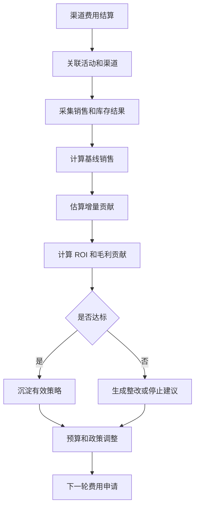
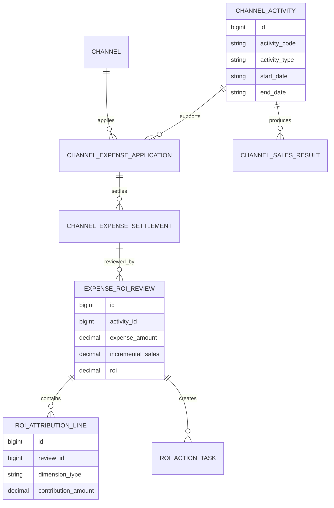
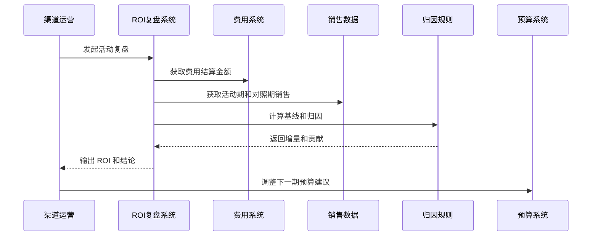
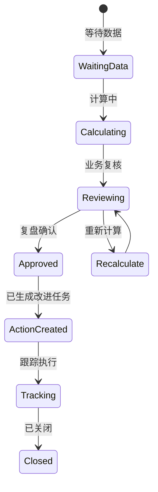
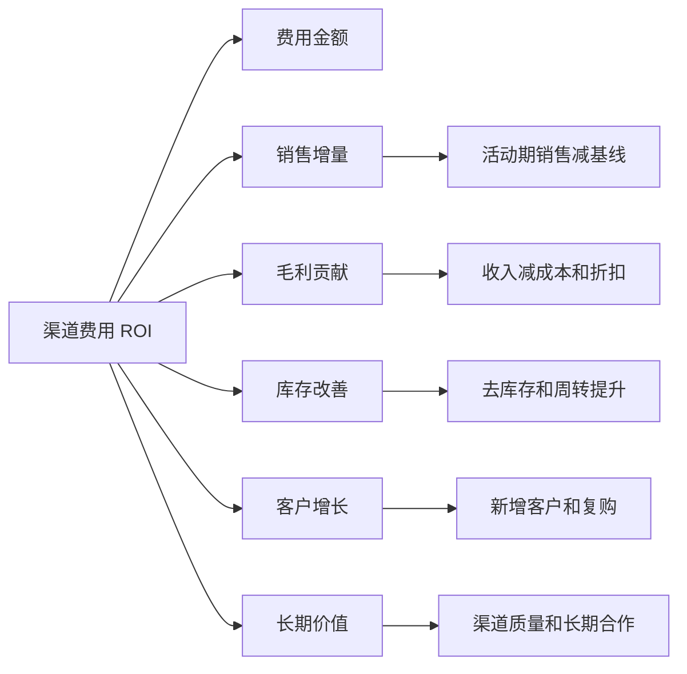

# 渠道费用 ROI 复盘项目案例

## 适合谁看

如果你做过渠道费用稽核、渠道结算、运营活动、销售返利、渠道政策模拟或渠道利润模拟，但还不清楚费用花出去之后到底值不值、哪个渠道有效、哪些活动应该停掉，可以学习这个案例。

渠道费用 ROI 复盘关注的是市场费用、陈列费用、促销补贴、物料费用、培训费用和渠道激励投入后的销售增长、毛利贡献、库存改善、客户增长和长期价值。它不是简单用销售额除以费用，而是要把基线、增量、毛利、归因和滞后效果一起算清楚。

## 业务目标

渠道费用 ROI 复盘要回答 6 个问题：

- 每笔渠道费用投入带来了多少可解释的销售增量。
- 哪些渠道、区域、门店、产品和活动的投入产出最好。
- 销售增长是费用带来的，还是本来就会发生的自然增长。
- 费用投入对毛利、库存、客户增长和复购是否有帮助。
- 低 ROI 费用应该停止、降级、整改还是换成其他政策。
- 复盘结论如何反哺下一轮预算、政策和审批。

真实项目里，渠道费用经常只做报销稽核，不做效果复盘。结果是费用合规了，但不一定有效。

## 渠道费用 ROI 复盘链路

这条链路说明，ROI 复盘不是活动结束后写一段总结，而是要把结论回写到预算和费用政策里。

## 核心概念

| 概念 | 说明 | 新手理解 |
| --- | --- | --- |
| 费用投入 | 渠道活动或政策花的钱 | 陈列费、促销费、培训费 |
| 基线销售 | 不投入费用也可能产生的销售 | 正常销售水平 |
| 增量销售 | 相比基线多出来的销售 | 可能由费用带来 |
| 归因规则 | 判断销售增长归属于哪个活动 | 防止重复计算 |
| ROI | 投入产出比 | 收益除以成本 |
| 毛利贡献 | 扣除成本后的利润贡献 | 比销售额更真实 |
| 复盘结论 | 继续、调整、停止或扩大 | 影响后续预算 |

ROI 复盘最难的是“归因”。同一个渠道可能同时有促销、返利、陈列和新品上市，不能把所有增长都算给一个活动。

## 数据模型

ROI 复盘要关联费用、活动、销售结果和归因明细。只保存一个 ROI 数字，后续无法解释。

## 推荐表结构

| 表 | 用途 | 关键字段 |
| --- | --- | --- |
| `channel_expense_settlement` | 已结算费用 | channel_id、activity_id、expense_type、settlement_amount |
| `channel_sales_result` | 渠道销售结果 | channel_id、activity_id、product_id、sales_amount、gross_profit |
| `sales_baseline_snapshot` | 基线快照 | channel_id、product_id、period、baseline_amount、method |
| `expense_roi_review` | ROI 复盘主表 | activity_id、expense_amount、incremental_sales、roi、conclusion |
| `roi_attribution_line` | 归因明细 | review_id、dimension_type、dimension_id、contribution_amount |
| `roi_action_task` | 改进任务 | review_id、action_type、owner_id、due_date、status |
| `expense_policy_feedback` | 政策反馈 | review_id、policy_code、suggestion、effective_status |

基线快照很关键。没有基线，销售增长到底是自然增长还是费用带来的，就只能靠感觉判断。

## ROI 复盘流程

ROI 复盘要允许人工解释，但系统必须先给出基线和归因结果。否则复盘很容易变成主观汇报。

## 复盘状态设计

复盘确认不是结束。真正有价值的是后续预算、政策和费用审批发生变化。

## ROI 因素拆解

很多活动销售额很高但毛利很低，甚至靠大折扣冲量。复盘必须同时看毛利贡献。

## 前端页面拆分

| 页面 | 核心内容 | 设计建议 |
| --- | --- | --- |
| ROI 复盘工作台 | 待复盘活动、费用金额、ROI 状态 | 默认显示高费用低效果 |
| 活动效果页 | 销售、毛利、库存、客户变化 | 用趋势图解释前后变化 |
| 基线设置页 | 基线方法、对照期、对照渠道 | 给出方法说明 |
| 归因明细页 | 渠道、区域、产品、活动贡献 | 支持下钻到单个渠道 |
| 复盘结论页 | 继续、调整、停止、扩大 | 结论要结构化 |
| 改进任务页 | 整改事项、负责人、截止日期 | 跟踪后续动作 |
| 政策反馈页 | 对预算和费用政策的建议 | 影响下一轮申请 |

页面设计重点是“解释 ROI”。不要只放一个百分比，要让用户看到费用、基线、增量和毛利怎么算出来。

## 接口拆分建议

| 接口 | 方法 | 说明 |
| --- | --- | --- |
| `/api/channel-expense-roi/reviews` | GET/POST | 查询和创建 ROI 复盘 |
| `/api/channel-expense-roi/reviews/:id/calculate` | POST | 计算 ROI 和归因 |
| `/api/channel-expense-roi/reviews/:id/baseline` | GET/PUT | 查询和调整基线 |
| `/api/channel-expense-roi/reviews/:id/attribution` | GET | 查询归因明细 |
| `/api/channel-expense-roi/reviews/:id/conclusion` | POST | 提交复盘结论 |
| `/api/channel-expense-roi/tasks` | GET/POST | 查询和创建改进任务 |
| `/api/channel-expense-roi/policy-feedback` | GET | 查询政策反馈 |

计算接口要支持重算。销售数据延迟、费用调整、退货冲减都会影响 ROI。

## 实际项目常见问题

### 1. 把活动期销售全部算成活动贡献

没有扣除自然销售基线，导致 ROI 虚高。

解决方式：

- 选择历史同期或相似渠道作为基线。
- 计算活动期增量，而不是总销售。
- 基线方法保存为快照。
- 复盘时展示基线和实际曲线。

### 2. 多个活动重复归因

同一笔销售同时被促销、陈列和返利活动认领。

解决方式：

- 建立活动优先级和归因规则。
- 销售结果只允许分摊一次或按权重分摊。
- 归因明细保存权重。
- 复盘报告展示重叠活动。

### 3. 只看销售额不看毛利

活动卖得多，但折扣、返利和费用把利润吃掉了。

解决方式：

- ROI 同时计算销售 ROI 和毛利 ROI。
- 折扣、返利、费用进入成本口径。
- 低毛利高销售活动单独预警。
- 预算审批优先看毛利贡献。

### 4. 复盘结论无法影响下一次费用申请

每次复盘都是文档，没有进入系统规则。

解决方式：

- 复盘结论回写费用政策建议。
- 低 ROI 渠道下次申请自动提示。
- 高 ROI 活动进入推荐模板。
- 预算分配参考历史 ROI。

### 5. 数据延迟导致复盘不准

退货、冲销、渠道库存回传有延迟。

解决方式：

- 设置初版复盘和最终复盘。
- 关键指标支持滚动更新。
- 退货和冲销回写影响毛利。
- 版本化保存每次复盘结果。

## 权限与审计

| 权限点 | 控制原因 |
| --- | --- |
| 查看 ROI | 涉及渠道经营和费用效果 |
| 调整基线 | 会直接影响复盘结论 |
| 提交结论 | 会影响预算和政策 |
| 创建整改任务 | 会影响渠道和区域团队 |
| 导出复盘报告 | 涉及费用和销售数据 |
| 修改归因规则 | 会影响历史和未来复盘口径 |

ROI 复盘数据容易引发渠道和区域争议。所有基线调整、归因修改和结论变更都要审计。

## 验收清单

- 能从费用结算生成待复盘活动。
- 能关联活动期销售、毛利、库存和客户数据。
- 能生成基线销售和增量销售。
- 能按渠道、区域、产品和活动拆解贡献。
- 能输出 ROI、毛利 ROI 和复盘结论。
- 能把复盘结论转成改进任务或政策建议。
- 能支持数据延迟后的重算和版本保留。

## 下一步学习

学完这个案例后，可以继续看：

- [渠道费用稽核项目案例](/projects/channel-expense-audit-case)
- [渠道利润模拟项目案例](/projects/channel-profit-simulation-case)
- [渠道政策模拟项目案例](/projects/channel-policy-simulation-case)
- [运营活动项目案例](/projects/marketing-campaign-case)

