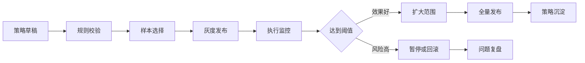
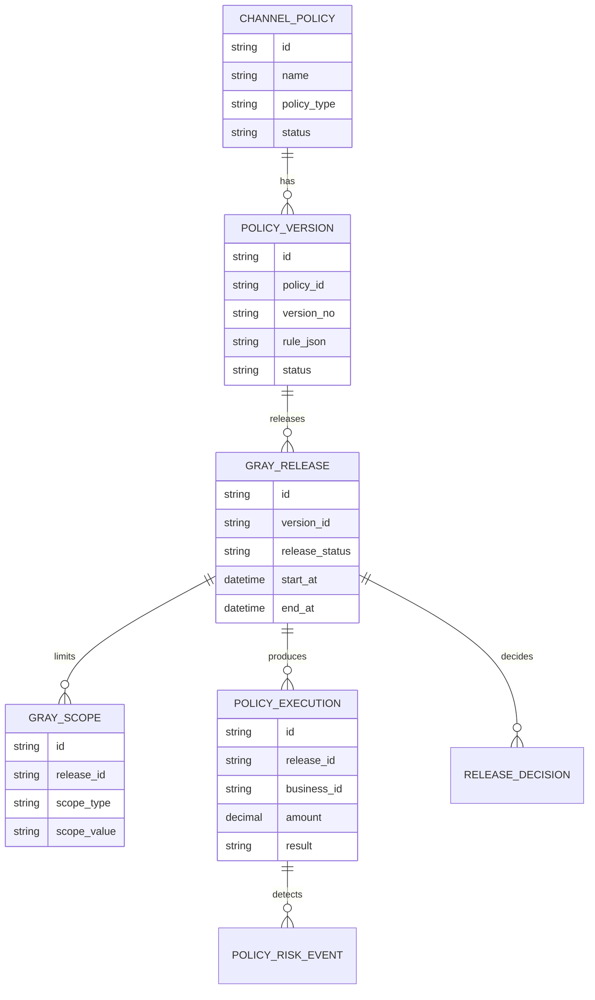
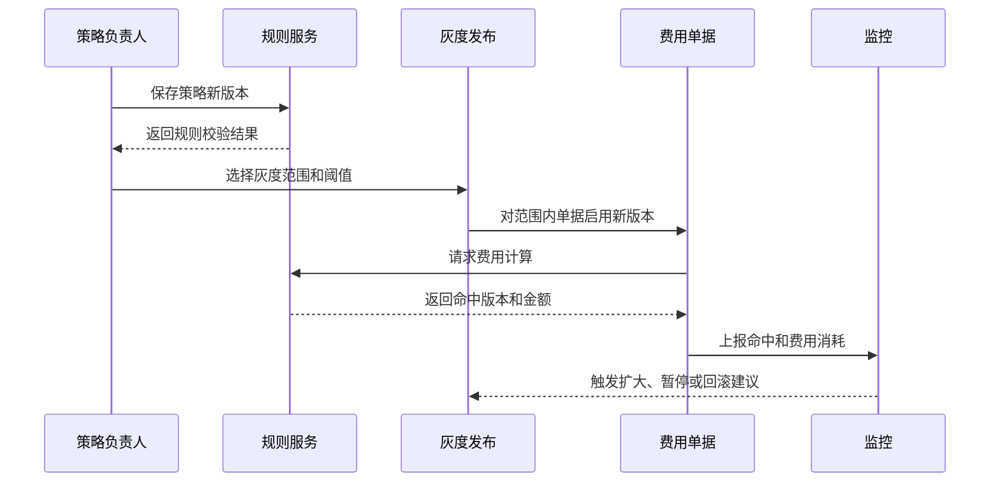
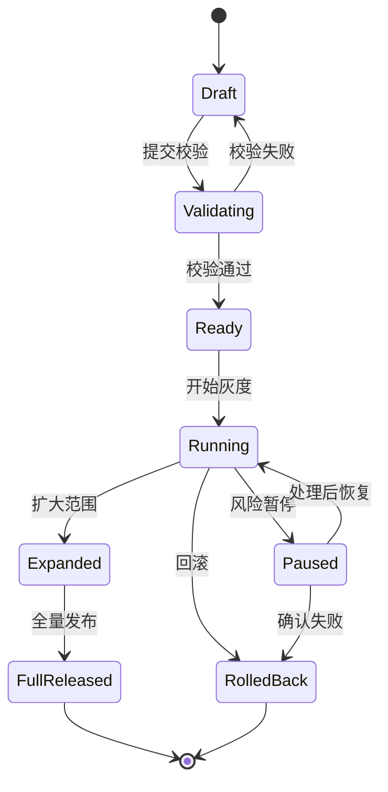
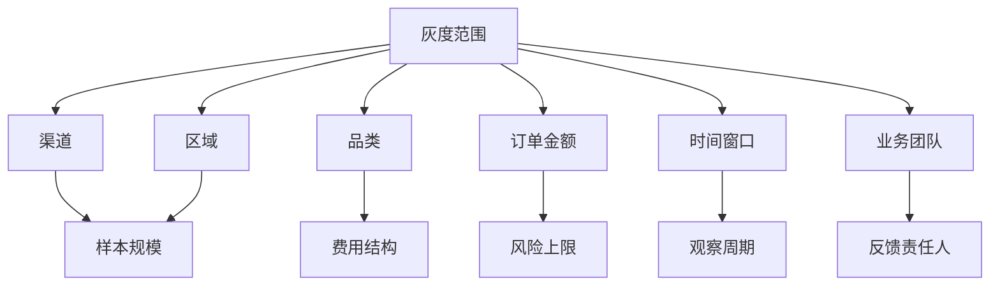

# 渠道费用策略灰度项目案例

## 适合谁看

- 想理解“策略配置为什么不能一次性全量上线”的前端和产品同学。
- 正在做渠道费用、返利政策、预算投放或规则引擎后台的团队。
- 希望把人工 Excel 政策升级为可灰度、可回滚、可复盘系统的项目负责人。

## 业务目标

渠道费用策略灰度的核心，是让一条新政策先在少量渠道、区域或品类上试运行，再根据费用消耗、ROI、异常率和业务反馈决定是否扩大范围。

如果没有灰度机制，策略上线常见风险是：

- 费用规则写错，导致大面积多算或漏算。
- 预算消耗过快，影响后续活动。
- 一线团队不理解新规则，导致投诉。
- 策略效果差，但回滚成本很高。

## 策略灰度链路

可以把它理解成“规则系统里的 A/B 发布”。不过业务规则比 UI 实验更敏感，因为它直接影响费用、结算和渠道关系。

## 核心概念

| 概念 | 说明 | 例子 |
| --- | --- | --- |
| 策略版本 | 同一策略的不同配置版本 | V1 按销售额 3%，V2 按品类阶梯 |
| 灰度范围 | 首批试运行对象 | 华东区域、A 类渠道、某品类 |
| 命中条件 | 判断单据是否使用该策略 | 渠道等级、区域、品类、时间 |
| 风险阈值 | 灰度期间的停止条件 | 预算消耗超过 80%、异常率超过 5% |
| 回滚 | 停止新版本并恢复旧版本 | 新单按旧策略计算 |
| 复盘指标 | 判断策略是否有效 | ROI、毛利、异常单、投诉数 |

## 数据模型

## 推荐表结构

| 表 | 关键字段 | 作用 |
| --- | --- | --- |
| `channel_policy` | `name`、`policy_type`、`owner_id`、`status` | 策略主档 |
| `policy_version` | `policy_id`、`version_no`、`rule_json`、`change_reason` | 策略版本 |
| `gray_release` | `version_id`、`status`、`start_at`、`end_at`、`rollback_version_id` | 灰度发布单 |
| `gray_scope` | `release_id`、`scope_type`、`scope_value` | 灰度对象范围 |
| `policy_execution` | `release_id`、`business_id`、`amount`、`hit_detail_json` | 命中结果 |
| `policy_risk_event` | `release_id`、`risk_type`、`level`、`status` | 风险事件 |

## 灰度发布流程

## 发布状态设计

## 灰度范围拆解

灰度范围不要只按百分比。企业系统里更常见的是按业务对象灰度，例如“华东区域的 A 类渠道，且仅限某品类活动费用”。

## 前端页面拆分

| 页面 | 主要内容 | 设计重点 |
| --- | --- | --- |
| 策略版本列表 | 当前版本、草稿版本、发布时间、状态 | 明确展示当前生效版本 |
| 策略编辑器 | 条件、计算方式、预算限制、适用范围 | 规则保存前必须校验 |
| 灰度发布单 | 灰度对象、风险阈值、观察周期、回滚版本 | 支持草稿、审批和发布 |
| 灰度监控 | 命中单数、费用金额、预算消耗、异常事件 | 用趋势图展示风险变化 |
| 发布复盘 | ROI、异常率、投诉、预算偏差、决策记录 | 为下一次策略调整提供依据 |

## 接口拆分建议

| 接口 | 方法 | 说明 |
| --- | --- | --- |
| `/api/channel-policies` | GET | 查询策略列表 |
| `/api/channel-policies/:id/versions` | POST | 创建策略版本 |
| `/api/policy-versions/:id/validate` | POST | 校验规则合法性 |
| `/api/gray-releases` | POST | 创建灰度发布单 |
| `/api/gray-releases/:id/start` | POST | 开始灰度 |
| `/api/gray-releases/:id/rollback` | POST | 回滚策略 |
| `/api/gray-releases/:id/metrics` | GET | 查询灰度监控指标 |

## 实际项目常见问题

### 1. 新旧策略同时命中，金额不知道以谁为准

必须有明确优先级：灰度策略优先、指定范围优先、版本号优先，或者由规则引擎返回唯一生效版本。

费用计算结果里要保存 `policy_version_id`，否则后续对账时无法解释金额来源。

### 2. 灰度范围配置太复杂，业务看不懂

不要只展示 JSON。前端应把条件翻译成自然语言，例如：

“仅对华东区域、A 类渠道、空调品类、2026-07-01 至 2026-07-31 的活动费用生效。”

### 3. 回滚后历史单据是否重算

推荐默认不重算历史已确认单据，只影响新单和未确认单据。若必须重算，需要单独发起重算任务，并记录审批原因。

### 4. 风险阈值没有触发

常见原因是监控指标延迟。灰度发布前要确认指标口径和刷新频率，关键风险可以使用同步校验，例如单笔费用超过上限时直接阻断。

### 5. 策略发布缺少审批依据

发布单要保存校验结果、试算结果、灰度范围、风险阈值和预期收益。审批人不能只看到“同意/拒绝”按钮。

## 权限与审计

| 动作 | 权限建议 | 审计内容 |
| --- | --- | --- |
| 编辑策略 | 渠道运营或财务策略管理员 | 修改前后规则 |
| 启动灰度 | 业务负责人审批后执行 | 灰度范围和阈值 |
| 扩大范围 | 策略负责人和财务确认 | 指标结果和扩大原因 |
| 回滚策略 | 管理员或应急角色 | 回滚版本和影响范围 |
| 重算费用 | 财务主管 | 重算单据和金额差异 |

## 验收清单

- 策略版本可以草稿、校验、发布和回滚。
- 灰度范围可以按渠道、区域、品类、金额和时间配置。
- 每次费用计算都能追溯命中的策略版本。
- 灰度期间能看到费用消耗、异常事件和风险阈值。
- 回滚后新单不再命中新版本。
- 发布复盘能记录最终决策和指标结果。

## 下一步学习

完成这个案例后，可以继续学习：

- [渠道费用预算优化项目案例](/projects/channel-expense-budget-optimization-case)
- [渠道费用异常预警项目案例](/projects/channel-expense-anomaly-warning-case)
- [规则引擎项目案例](/projects/rule-engine-case)

