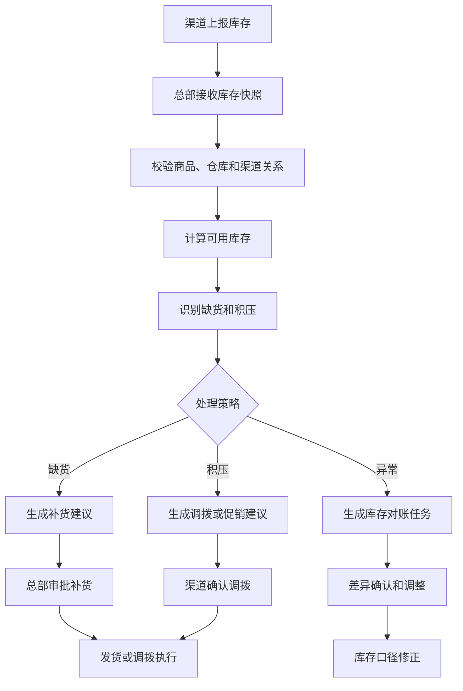
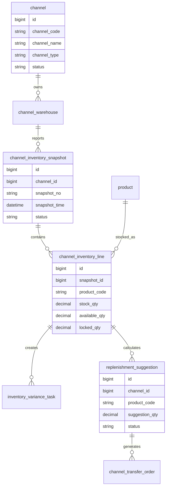
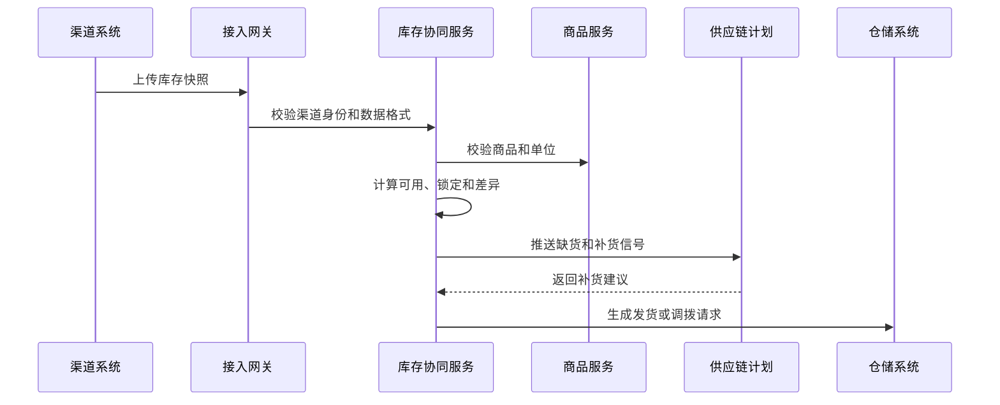
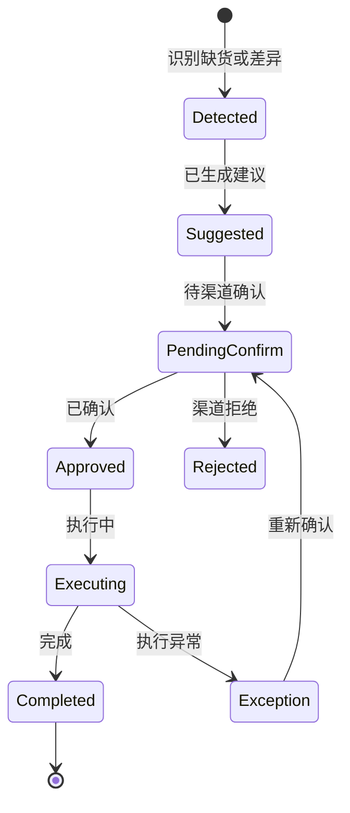
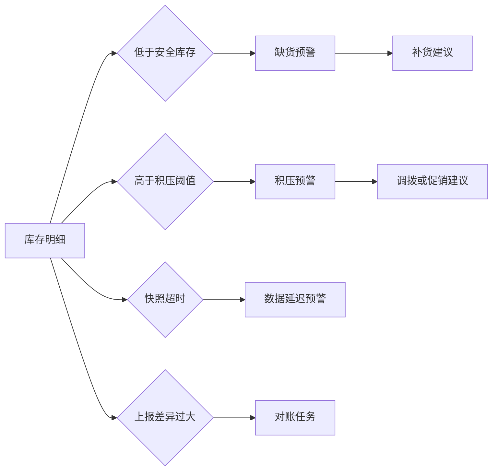

# 渠道库存协同项目案例

## 适合谁看

如果你做过库存、渠道、门店、经销商或供应链计划系统，但不清楚“为什么总部库存准，渠道仍然缺货”，可以先看这一篇。

渠道库存协同解决的是总部、经销商、门店、仓库和在途库存之间的信息同步、补货建议、调拨协同、库存预警和异常对账。

## 业务目标

渠道库存协同要回答 6 个问题：

- 每个渠道、门店、仓库当前有多少可用库存。
- 哪些库存已经被订单、调拨、预售或售后锁定。
- 哪些渠道缺货、积压或即将断货。
- 总部应该补货、调拨、促销清货，还是暂停发货。
- 渠道上报库存和系统库存不一致时如何对账。
- 库存变化如何反向影响销售预测和供应链计划。

渠道库存的难点不是一张库存表，而是多方数据同步延迟、口径不一致和责任边界不清。

## 渠道库存协同链路

协同的重点是让总部和渠道看到同一套库存事实，并能对缺货、积压、差异做动作。

## 核心概念

| 概念 | 说明 | 项目里的典型字段 |
| --- | --- | --- |
| 渠道库存 | 经销商、门店或渠道仓库存 | channel_stock |
| 可用库存 | 实物库存扣减锁定后的可卖数量 | available_qty |
| 锁定库存 | 已被订单、调拨、售后占用 | locked_qty |
| 在途库存 | 已发货但未入库的库存 | in_transit_qty |
| 库存快照 | 某一时间点上报的库存状态 | snapshot_time |
| 补货建议 | 系统计算的补货数量 | replenishment_suggestion |
| 调拨建议 | 渠道间转移库存的建议 | transfer_suggestion |
| 库存差异 | 上报库存与系统库存不一致 | variance_qty |

库存协同必须明确“库存口径”。实物库存、可用库存、在途库存和锁定库存不能混用。

## 数据模型

库存快照和库存明细要分开。快照记录上报批次，明细记录每个商品的库存口径。

## 推荐表结构

| 表 | 用途 | 关键字段 |
| --- | --- | --- |
| channel | 渠道主数据 | channel_code、channel_name、channel_type、status |
| channel_warehouse | 渠道仓库 | channel_id、warehouse_code、warehouse_type、region |
| channel_inventory_snapshot | 库存快照 | channel_id、snapshot_no、snapshot_time、source_system、status |
| channel_inventory_line | 库存明细 | snapshot_id、product_code、stock_qty、available_qty、locked_qty |
| inventory_variance_task | 库存差异任务 | channel_id、product_code、variance_qty、owner_id、status |
| replenishment_suggestion | 补货建议 | channel_id、product_code、suggestion_qty、reason_code、status |
| channel_transfer_order | 渠道调拨单 | from_channel_id、to_channel_id、product_code、transfer_qty、status |

库存快照最好保留来源系统和时间。如果渠道每天只上传一次，实时可用库存就不能当成绝对准确。

## 库存同步流程

渠道库存接入要先做数据校验。商品编码、单位、仓库关系错误，会直接导致补货建议错误。

## 协同任务状态设计

补货和调拨建议不能直接等同于执行单。渠道可能拒绝、修改或延迟执行。

## 库存预警规则

库存预警既要看数量，也要看数据新鲜度。一个 3 天前的库存快照不能支撑今天的补货判断。

## 前端页面拆分

| 页面 | 主要功能 | 新手容易漏掉 |
| --- | --- | --- |
| 渠道库存总览 | 库存、可用、锁定、在途、缺货 | 显示快照时间和数据来源 |
| 渠道库存明细 | 商品、仓库、批次、库存口径 | 支持单位换算和多仓查看 |
| 补货建议页 | 缺货识别、建议数量、原因 | 渠道确认和总部审批 |
| 调拨协同页 | 渠道间调拨、确认、执行 | 调拨在途状态要可见 |
| 库存差异页 | 上报差异、系统差异、处理任务 | 差异调整必须审计 |
| 库存预警页 | 缺货、积压、超时、异常 | 预警要能转任务 |
| 渠道库存报表 | 周转、动销、满足率、断货率 | 不只看库存余额 |

库存页面必须把“当前数值”和“更新时间”放在一起展示，否则用户会误以为数据实时准确。

## 接口拆分建议

| 接口 | 方法 | 说明 |
| --- | --- | --- |
| /api/channel-inventory/snapshots | POST | 上传渠道库存快照 |
| /api/channel-inventory | GET | 查询渠道库存总览 |
| /api/channel-inventory/lines | GET | 查询库存明细 |
| /api/channel-inventory/replenishments | GET/POST | 查询和创建补货建议 |
| /api/channel-inventory/transfers | GET/POST | 查询和创建渠道调拨 |
| /api/channel-inventory/variances | GET | 查询库存差异 |
| /api/channel-inventory/alerts | GET | 查询库存预警 |

上传接口要支持幂等。渠道系统网络不稳定时可能重复上传同一个快照。

## 实际项目常见问题

### 问题 1：渠道库存和总部库存永远对不上

常见原因是库存口径不同，有的按实物库存，有的按可用库存。

解决方式：

- 明确库存字段含义。
- 接入时要求渠道同时上传实物、锁定、可用和在途。
- 对差异生成对账任务。
- 对调整动作写审计记录。

### 问题 2：补货建议不准

只按当前库存补货，没有考虑销量、在途和数据延迟。

解决方式：

- 补货计算加入近 7/30 天动销。
- 扣除锁定库存，加入在途库存。
- 快照过期时降低建议可信度。
- 人工调整建议要保存原因。

### 问题 3：渠道不愿意上报真实库存

渠道担心总部控货或压货。

解决方式：

- 建立库存数据用途说明。
- 给渠道提供缺货预警和补货收益。
- 关键渠道可先做试点。
- 上报及时率纳入渠道协同指标。

### 问题 4：调拨执行后状态断裂

调拨从一个渠道出库后，另一个渠道没有及时入库。

解决方式：

- 调拨单增加在途状态。
- 出库、物流、入库分别记录。
- 超时在途生成预警。
- 调拨差异进入对账任务。

## 权限与审计

| 权限 | 建议 |
| --- | --- |
| 查看渠道库存 | 按区域、渠道和产品线授权 |
| 上传库存 | 渠道系统或渠道管理员 |
| 创建补货建议 | 供应链计划或系统任务 |
| 审批调拨 | 渠道负责人和总部运营 |
| 调整差异 | 库存管理员，必须填写原因 |
| 导出库存 | 敏感导出水印和审计 |

渠道库存会影响商业策略和供应链决策，不能对所有渠道互相开放。

## 验收清单

- 渠道库存快照支持幂等上传。
- 库存明细区分实物、可用、锁定和在途。
- 缺货、积压、快照超时和差异能触发预警。
- 补货建议能说明原因和计算口径。
- 调拨协同有确认、出库、在途、入库和异常状态。
- 库存差异处理有任务和审计。
- 报表能按渠道、产品、区域分析库存健康度。

## 下一步学习

建议继续阅读：

- [库存管理项目案例](/projects/inventory-management-case)
- [供应链计划项目案例](/projects/supply-chain-planning-case)
- [渠道结算项目案例](/projects/channel-settlement-case)
- [门店零售管理项目案例](/projects/retail-store-management-case)
