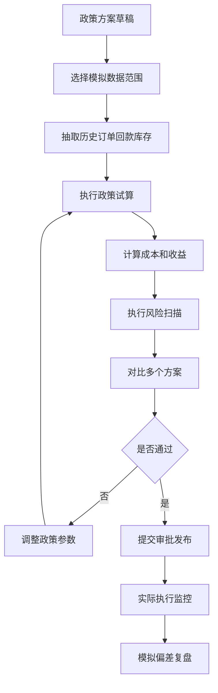
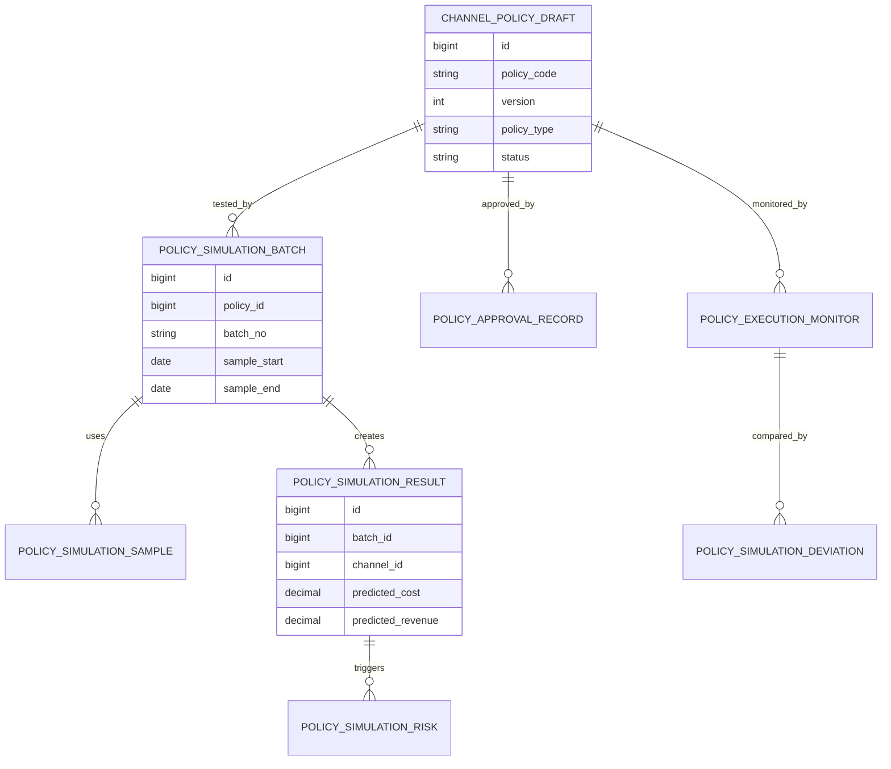
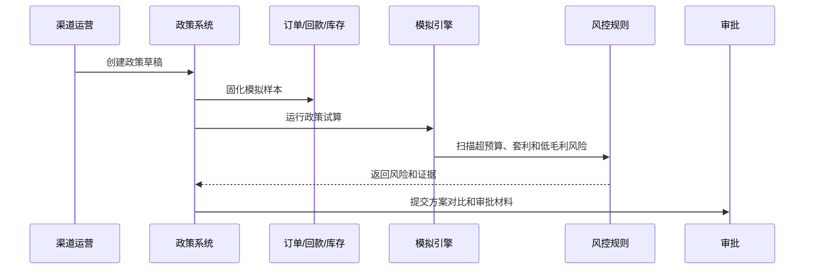
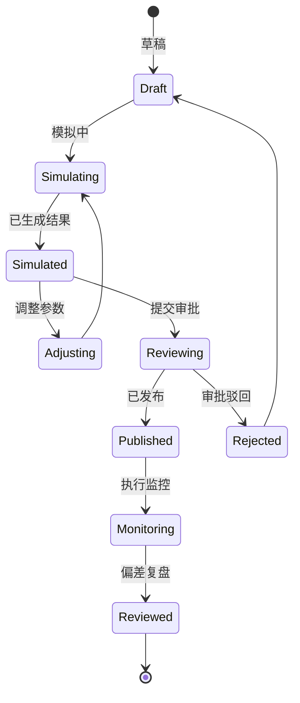
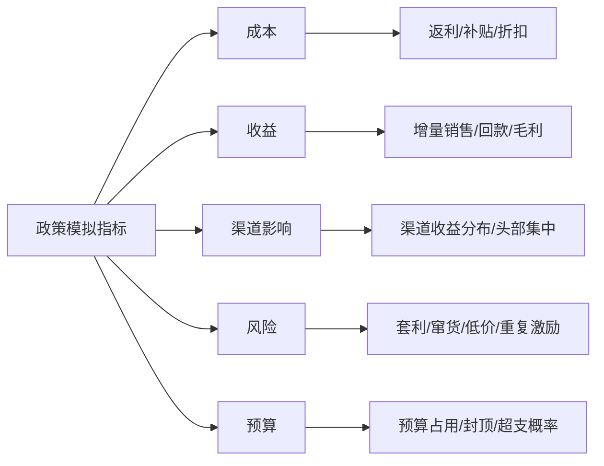

# 渠道政策模拟项目案例

## 适合谁看

如果你做过渠道结算、销售返利政策、渠道返利风控或价格审批中心，但还不清楚新政策发布前如何预估影响、发现风险和控制预算，可以学习这个案例。

渠道政策模拟关注的是在政策真正生效前，用历史订单、回款、渠道等级、产品结构、区域目标和预算约束试算不同政策方案的效果。它要帮助业务回答：这个政策会多花多少钱，能带来多少增量，哪些渠道受益，哪些渠道可能套利。

## 业务目标

渠道政策模拟要回答 6 个问题：

- 新政策适用于哪些渠道、区域、产品、客户和期间。
- 用历史数据试算后，预计返利、补贴、费用和折扣成本是多少。
- 哪些渠道收益过高、收益过低或可能钻政策漏洞。
- 政策是否超过预算、毛利底线和价格红线。
- 不同政策版本之间的 ROI、达成率和风险差异如何。
- 政策发布后，实际结果是否符合模拟预期。

真实项目里，渠道政策经常在发布后才发现预算超支或被套利。政策模拟的价值就是把风险提前暴露在审批前。

## 渠道政策模拟链路

政策模拟不是一次性计算，而是草稿、试算、对比、调整、审批、发布、复盘的闭环。

## 核心概念

| 概念 | 说明 | 新手理解 |
| --- | --- | --- |
| 政策方案 | 尚未发布的政策草稿 | 一套返利、折扣或补贴规则 |
| 模拟批次 | 某次试算任务 | 用同一批数据跑一次方案 |
| 模拟样本 | 参与试算的历史数据 | 订单、回款、渠道、库存 |
| 政策参数 | 比例、阶梯、封顶、门槛 | 政策里可调整的数字 |
| 成本测算 | 政策预计消耗的金额 | 返利、补贴、费用 |
| 风险扫描 | 判断是否可能套利或超预算 | 异常收益、低毛利、跨区 |
| 偏差复盘 | 发布后实际和模拟对比 | 看政策设计是否准确 |

政策模拟要支持多版本对比。只看单个方案，很难判断政策是变好了还是变贵了。

## 数据模型

政策草稿和正式政策要分开。草稿可以频繁调整，正式政策发布后必须版本化和审批。

## 推荐表结构

| 表 | 用途 | 关键字段 |
| --- | --- | --- |
| `channel_policy_draft` | 政策草稿 | policy_code、version、policy_type、scope_json、status |
| `channel_policy_rule_draft` | 草稿规则 | policy_id、condition_json、reward_json、cap_amount、priority |
| `policy_simulation_batch` | 模拟批次 | batch_no、policy_id、sample_start、sample_end、created_by |
| `policy_simulation_sample` | 模拟样本 | batch_id、source_type、source_id、amount、channel_id、product_id |
| `policy_simulation_result` | 模拟结果 | batch_id、channel_id、predicted_cost、predicted_revenue、roi |
| `policy_simulation_risk` | 模拟风险 | result_id、risk_type、risk_level、evidence |
| `policy_execution_monitor` | 执行监控 | policy_id、period、actual_cost、actual_revenue、actual_roi |
| `policy_simulation_deviation` | 偏差复盘 | policy_id、period、cost_deviation、revenue_deviation、reason |

模拟样本建议固化。否则同一个政策方案今天和明天试算结果不同，业务很难判断差异来自政策还是数据。

## 模拟执行流程

模拟引擎要能重复运行。每次调整政策参数后，业务需要马上看到成本、收益和风险的变化。

## 政策草稿状态设计

草稿不要直接发布。至少要经过一次模拟、一次风险扫描和一次审批。

## 模拟指标拆解

政策模拟不要只看总成本。还要看收益分布，如果少数渠道拿走大部分收益，就需要审查政策公平性和套利风险。

## 前端页面拆分

| 页面 | 核心内容 | 设计建议 |
| --- | --- | --- |
| 政策草稿页 | 适用范围、规则、阶梯、封顶 | 支持复制历史政策 |
| 模拟配置页 | 样本期间、渠道、产品、数据口径 | 明确样本范围 |
| 模拟结果页 | 成本、收益、ROI、预算占用 | 支持多方案对比 |
| 风险明细页 | 异常渠道、异常订单、证据 | 风险要能下钻 |
| 方案对比页 | A/B/C 方案成本收益差异 | 适合审批前决策 |
| 发布审批页 | 模拟结论、风险结论、预算影响 | 审批人不用看规则细节 |
| 执行复盘页 | 实际和模拟偏差 | 反向优化政策设计 |

政策模拟页面要让业务能调参数，也要让审批人能快速看懂风险和财务影响。

## 接口拆分建议

| 接口 | 方法 | 说明 |
| --- | --- | --- |
| `/api/channel-policies/drafts` | GET/POST | 查询和创建政策草稿 |
| `/api/channel-policies/drafts/:id/rules` | GET/POST | 维护政策规则 |
| `/api/channel-policies/drafts/:id/simulations` | POST | 创建模拟批次 |
| `/api/channel-policies/simulations/:id/run` | POST | 执行模拟 |
| `/api/channel-policies/simulations/:id/results` | GET | 查询模拟结果 |
| `/api/channel-policies/simulations/:id/risks` | GET | 查询模拟风险 |
| `/api/channel-policies/drafts/:id/submit` | POST | 提交审批 |
| `/api/channel-policies/:id/deviation-review` | GET | 查询执行偏差复盘 |

模拟执行可能很慢，建议异步任务化，并返回批次状态和进度。

## 实际项目常见问题

### 1. 模拟结果和实际执行差很多

常见原因是模拟样本不稳定，或者实际市场环境变化太大。

解决方式：

- 固化模拟样本和数据截止时间。
- 保存政策参数版本。
- 发布后按周期对比实际和模拟。
- 偏差原因拆成数据、市场、执行和政策设计。

### 2. 政策总成本可控，但个别渠道收益异常

总预算没超，但头部渠道拿走太多激励。

解决方式：

- 展示渠道收益分布。
- 设置渠道级封顶和阶梯。
- 对异常收益渠道生成风险。
- 审批时必须展示 Top 受益渠道。

### 3. 业务只调高返利比例，忽略毛利

销量可能上升，但毛利下降。

解决方式：

- 模拟结果同时展示收入、毛利和成本。
- 设置毛利底线。
- 低毛利产品或渠道触发审批。
- 复盘实际 ROI。

### 4. 政策重叠导致重复激励

新政策和已有政策范围重叠。

解决方式：

- 发布前做政策范围重叠检测。
- 支持互斥组和优先级。
- 模拟时执行所有现存政策，展示叠加成本。
- 重叠部分必须明确排除或合并。

### 5. 审批人看不懂复杂规则

政策规则太细，审批材料缺少业务摘要。

解决方式：

- 审批页展示范围、成本、收益、风险、预算影响。
- 规则细节作为可展开内容。
- 自动生成方案对比摘要。
- 高风险项必须带证据和处理建议。

## 权限与审计

| 权限点 | 控制原因 |
| --- | --- |
| 创建政策草稿 | 会影响渠道经营策略 |
| 修改政策规则 | 会改变成本和收益 |
| 执行模拟 | 会读取订单和渠道敏感数据 |
| 查看风险明细 | 涉及渠道异常和商业数据 |
| 提交审批 | 会进入正式发布链路 |
| 发布政策 | 直接影响结算和激励 |

审计日志要记录草稿创建、规则调整、模拟批次、样本范围、风险扫描、审批意见、政策发布和偏差复盘。

## 验收清单

- 能创建政策草稿并维护规则、范围、阶梯和封顶。
- 能固化模拟样本并异步执行试算。
- 能展示成本、收益、ROI、预算占用和渠道影响。
- 能识别超预算、低毛利、政策重叠和异常收益。
- 能对比多个政策方案。
- 能把模拟结论带入审批。
- 能在政策发布后复盘实际和模拟偏差。

## 下一步学习

建议继续阅读：

- [销售返利政策项目案例](/projects/sales-rebate-policy-case)
- [渠道返利风控项目案例](/projects/channel-rebate-risk-control-case)
- [渠道结算项目案例](/projects/channel-settlement-case)
- [价格审批中心项目案例](/projects/price-approval-center-case)
