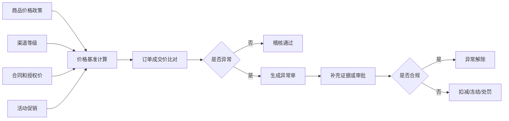
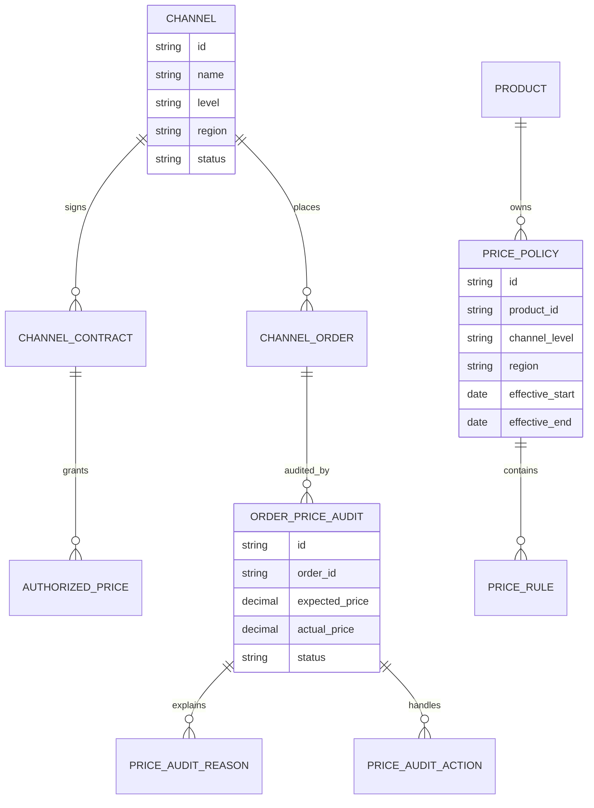
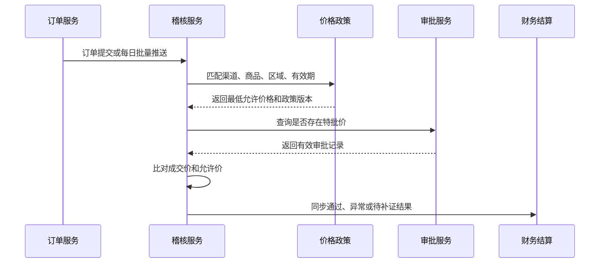
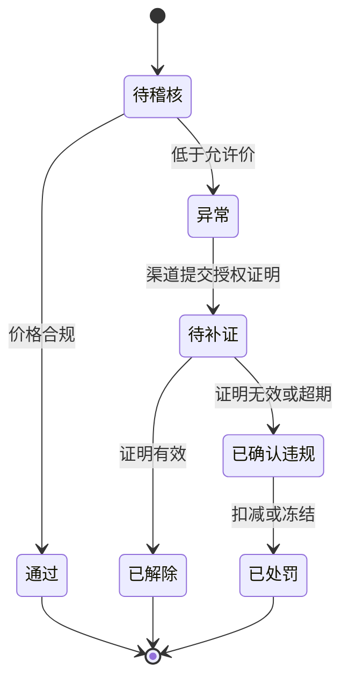
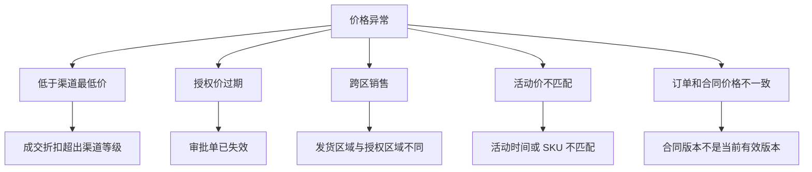

# 渠道价格稽核项目案例

## 适合谁看

如果你做过商品、渠道、订单或财务结算模块，但不知道如何处理“渠道低价乱价”“报价不一致”“合同价和成交价不一致”这类问题，可以学习这个案例。

渠道价格稽核的目标不是简单找出低价订单，而是把价格政策、授权价、合同价、成交价、活动价和异常审批串起来，形成可追溯的价格治理流程。

## 业务目标

渠道价格稽核通常服务于三类人：

- 销售管理者：想知道哪些渠道破坏价格体系。
- 财务人员：想确认结算、返利和发票是否按正确价格执行。
- 渠道运营：想发现低价冲货、跨区销售和异常折扣。

这个项目要回答：

1. 一笔订单应该卖多少钱？
2. 实际成交价有没有低于规则？
3. 如果低价，是否有审批或活动授权？
4. 违规后要预警、扣减还是冻结？

## 渠道价格稽核链路

稽核的关键是“基准价格”怎么来。不能只拿商品标准价比对订单价，因为渠道等级、区域、合同、活动都会改变允许价格。

## 核心概念

| 概念 | 含义 | 项目里怎么用 |
| --- | --- | --- |
| 标准价 | 商品默认价格 | 没有特殊政策时的基础价格 |
| 渠道价 | 针对渠道等级或区域的价格 | 一般由渠道政策配置 |
| 授权价 | 对某渠道或项目单独批准的价格 | 需要有效期和审批记录 |
| 最低成交价 | 系统允许的最低价格 | 稽核订单是否违规的底线 |
| 价差 | 基准价和成交价之间的差额 | 用来计算损失或处罚 |
| 价格异常 | 成交价低于允许范围或证据不完整 | 进入稽核处理 |

## 数据模型

价格稽核需要把“政策数据”和“交易数据”隔离。政策可以变，订单是事实；稽核记录要保存当时匹配到的政策版本，否则后续无法解释。

## 推荐表结构

| 表 | 作用 | 关键字段 |
| --- | --- | --- |
| `channel` | 渠道主档 | 渠道等级、区域、状态、负责人 |
| `product` | 商品主档 | SKU、品类、标准价、状态 |
| `price_policy` | 价格政策 | 适用渠道、区域、有效期、政策版本 |
| `price_rule` | 价格规则明细 | 商品、折扣、最低价、阶梯条件 |
| `authorized_price` | 特批价格 | 渠道、商品、授权价、审批单、有效期 |
| `channel_order` | 渠道订单 | 渠道、商品、数量、成交价、下单时间 |
| `order_price_audit` | 价格稽核结果 | 基准价、成交价、价差、状态 |
| `price_audit_action` | 异常处理动作 | 申诉、补证、扣减、冻结、解除 |

## 稽核流程

订单提交时可以做快速校验，正式稽核建议用批处理。因为稽核可能依赖合同、活动、审批、发票和出库数据，实时链路不宜过重。

## 异常状态设计

不要把异常直接判定为违规。很多低价订单可能有项目特批或活动授权，需要允许补证和复核。

## 价格差异拆解

异常原因要能支撑后续动作。比如低于最低价可能扣减返利，跨区销售可能冻结渠道下单，授权价过期可能要求重新审批。

## 前端页面拆分

| 页面 | 核心内容 | 设计建议 |
| --- | --- | --- |
| 价格稽核看板 | 异常金额、异常订单数、渠道排行、区域分布 | 主管先看风险集中在哪里 |
| 稽核任务列表 | 订单、渠道、商品、价差、异常原因、状态 | 默认展示待处理和高价差记录 |
| 稽核详情 | 订单价、政策价、合同价、授权价、证据链 | 详情页要能解释“为什么异常” |
| 政策配置 | 渠道等级、商品范围、最低价、有效期 | 必须支持版本和生效时间 |
| 授权价管理 | 特批价、审批单、有效期、适用范围 | 防止口头特批无法追溯 |
| 处罚记录 | 扣减、冻结、申诉、解除记录 | 便于财务和渠道运营复盘 |

## 接口拆分建议

| 接口 | 说明 |
| --- | --- |
| `GET /api/channel-price-audit/dashboard` | 查询价格稽核总览 |
| `GET /api/channel-price-audit/items` | 查询稽核列表 |
| `GET /api/channel-price-audit/items/:id` | 查询稽核详情和证据链 |
| `POST /api/channel-price-audit/items/:id/appeal` | 渠道提交补证或申诉 |
| `POST /api/channel-price-audit/items/:id/confirm` | 确认违规 |
| `POST /api/channel-price-audit/items/:id/release` | 解除异常 |
| `GET /api/price-policies` | 查询价格政策 |
| `POST /api/authorized-prices` | 新增特批价格 |

## 实际项目常见问题

### 1. 不知道应该用哪个价格作为基准

价格体系复杂时，标准价、渠道价、合同价、活动价和授权价会同时存在。

解决方式：

- 先定义价格优先级，例如授权价高于合同价，合同价高于渠道政策价。
- 所有价格规则都必须有有效期。
- 稽核记录保存匹配到的政策版本。
- 前端详情展示“价格命中路径”，而不是只展示最终价格。

### 2. 订单修改后稽核结果不更新

如果订单支持改价、拆单、退货，稽核必须跟着交易事实变化。

解决方式：

- 订单价格、数量、渠道、商品变更后触发重新稽核。
- 已处罚记录不要直接覆盖，要生成冲正或调整记录。
- 退货退款要影响异常金额。
- 财务结算读取最终确认后的稽核结果。

### 3. 业务要求把所有低价都拦截

完全实时拦截会影响下单效率，也可能误伤有授权的订单。

解决方式：

- 明确哪些异常实时拦截，哪些进入事后稽核。
- 对高风险渠道或高价值 SKU 采用强校验。
- 对普通订单先放行后稽核。
- 低于绝对底价才强制禁止提交。

### 4. 渠道提交证据后无法判断真假

补证不只是上传附件，还要结构化。

解决方式：

- 证据必须关联审批单、活动、合同或授权价。
- 附件只作为补充，不能作为唯一判断依据。
- 证据有效期、适用 SKU、适用区域必须可校验。
- 审核结论写入稽核动作表。

### 5. 价格规则变更影响历史稽核

新规则不能改变旧订单的判断，否则复盘和处罚会失真。

解决方式：

- 政策只新增版本，不直接覆盖旧版本。
- 订单稽核保存命中的政策版本号。
- 历史重算要标记为模拟结果。
- 生产环境修改政策必须走审批和审计。

## 权限与审计

| 权限点 | 控制原因 |
| --- | --- |
| 查看全部稽核 | 涉及渠道经营和价格策略 |
| 查看本渠道稽核 | 外部渠道只能看自己的异常 |
| 配置价格政策 | 直接影响订单和结算 |
| 新增特批价格 | 需要审批和有效期 |
| 确认违规 | 会触发处罚或扣减 |
| 导出价格差异 | 价格数据高度敏感 |

审计日志至少记录政策变更、授权价创建、稽核结果变更、申诉提交、违规确认、处罚执行和导出操作。

## 验收清单

- 能根据渠道、区域、商品、合同和活动匹配基准价格。
- 能识别低于允许价、授权过期、跨区销售等异常。
- 稽核详情能展示价格命中路径和证据链。
- 异常支持补证、解除、确认违规和处罚。
- 价格政策支持版本和有效期。
- 财务结算能读取最终稽核结论。
- 关键操作有权限控制和审计日志。

## 下一步学习

- [渠道结算项目案例](/projects/channel-settlement-case)
- [渠道费用稽核项目案例](/projects/channel-expense-audit-case)
- [销售返利政策项目案例](/projects/sales-rebate-policy-case)
- [复杂财务对账项目案例](/projects/finance-reconciliation-case)
