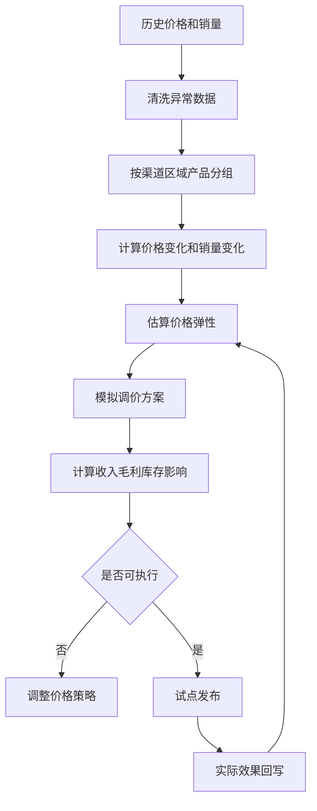
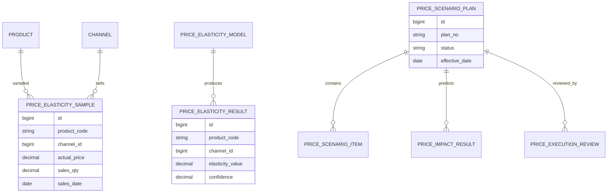
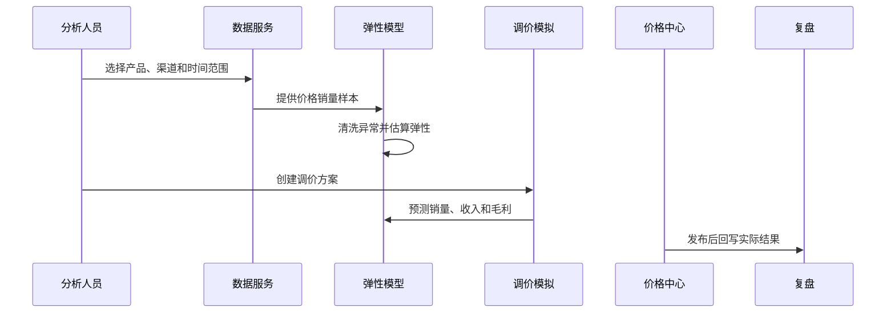
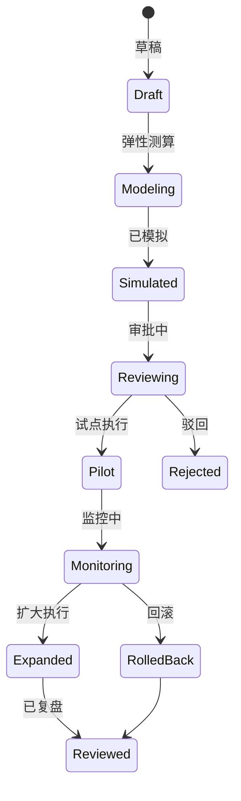
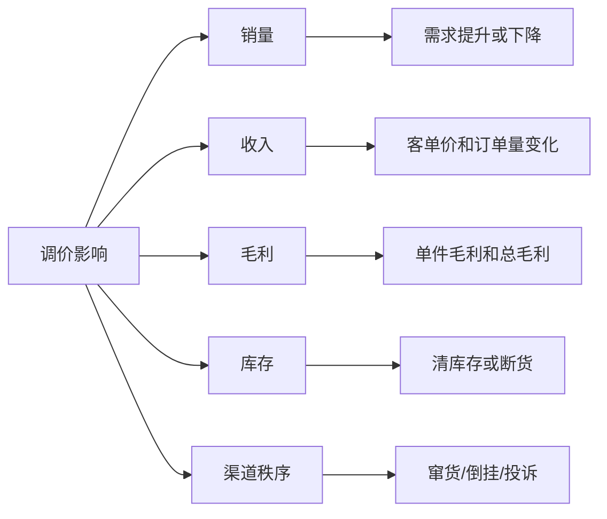

# 渠道价格弹性分析项目案例

## 适合谁看

如果你做过渠道利润模拟、渠道价格稽核、价格审批中心或销售预测复盘，但还不清楚价格变化会如何影响销量、收入和毛利，可以学习这个案例。

渠道价格弹性分析关注的是不同渠道、区域、产品和客户群在价格变化后的销量反应。它不是简单看低价卖得多，而是估算价格变动对销量、收入、毛利、库存和渠道关系的影响。

## 业务目标

渠道价格弹性分析要回答 6 个问题：

- 某个产品在不同渠道降价后，销量会增加多少。
- 涨价是否会导致销量下降、客户流失或窜货风险。
- 低价促销带来的收入增长是否能覆盖毛利损失。
- 不同区域、渠道等级、产品生命周期的价格敏感度是否不同。
- 价格策略是否会造成渠道冲突、库存积压或价格倒挂。
- 实际执行后，价格弹性模型是否需要校准。

真实项目中，很多价格决策只靠经验。价格弹性分析的价值是把“可能有效”变成“可试算、可监控、可复盘”。

## 渠道价格弹性分析链路

价格弹性分析不是一次模型计算，而是历史分析、方案模拟、试点发布和效果回写的循环。

## 核心概念

| 概念 | 说明 | 新手理解 |
| --- | --- | --- |
| 价格弹性 | 价格变化对销量的影响程度 | 降价后销量涨多少 |
| 基准价格 | 对比用的正常价格 | 没有促销时的价格 |
| 需求变化 | 销量或订单量变化 | 调价后的销售反应 |
| 分组维度 | 渠道、区域、产品、人群 | 不同场景弹性不同 |
| 调价方案 | 准备执行的价格策略 | 涨价、降价、阶梯价 |
| 毛利影响 | 调价后利润变化 | 卖多不一定赚多 |
| 模型校准 | 用真实结果修正估算 | 让下次更准 |

弹性不能脱离场景。新品、成熟品、清仓品、刚需品的价格敏感度完全不同。

## 数据模型

样本数据要保留促销、断货、节假日、渠道活动等标记。否则模型会把活动影响误判为价格影响。

## 推荐表结构

| 表 | 用途 | 关键字段 |
| --- | --- | --- |
| `price_elasticity_sample` | 价格销量样本 | product_code、channel_id、actual_price、sales_qty、promotion_flag |
| `price_elasticity_model` | 弹性模型 | model_code、scope_json、method、version、status |
| `price_elasticity_result` | 弹性结果 | model_id、product_code、channel_id、elasticity_value、confidence |
| `price_scenario_plan` | 调价方案 | plan_no、scenario_name、effective_date、status |
| `price_scenario_item` | 调价明细 | plan_id、product_code、channel_id、base_price、new_price |
| `price_impact_result` | 影响测算 | plan_id、sales_change、revenue_change、margin_change |
| `price_execution_review` | 执行复盘 | plan_id、actual_sales、actual_margin、deviation_reason |

弹性结果必须有置信度。样本不足或数据噪声大的场景，不适合自动给出强建议。

## 弹性计算流程

弹性计算要支持人工排除异常样本，例如大促、断货、渠道压货、异常退货。

## 调价方案状态设计

价格弹性分析建议先试点，不要直接全渠道发布。价格变化会影响渠道关系和客户预期。

## 价格影响拆解

降价不一定好，涨价也不一定坏。最终要看总毛利、库存和渠道秩序。

## 前端页面拆分

| 页面 | 核心内容 | 设计建议 |
| --- | --- | --- |
| 弹性分析总览 | 产品弹性、渠道弹性、置信度 | 低置信度不要强推荐 |
| 样本管理页 | 价格、销量、促销、断货标记 | 支持剔除异常样本 |
| 弹性结果页 | 分组弹性、趋势、解释 | 展示计算口径 |
| 调价方案页 | 产品、渠道、原价、新价、期间 | 支持批量导入 |
| 影响测算页 | 销量、收入、毛利、库存变化 | 方案审批核心页面 |
| 试点监控页 | 实际销量、毛利、异常价格 | 及时回滚 |
| 偏差复盘页 | 预测和实际差异 | 校准模型 |

弹性页面要让业务看到“为什么建议这样调价”，而不是只输出一个模型值。

## 接口拆分建议

| 接口 | 方法 | 说明 |
| --- | --- | --- |
| `/api/price-elasticity/samples` | GET | 查询价格销量样本 |
| `/api/price-elasticity/models/:id/run` | POST | 执行弹性计算 |
| `/api/price-elasticity/results` | GET | 查询弹性结果 |
| `/api/price-scenarios` | GET/POST | 查询和创建调价方案 |
| `/api/price-scenarios/:id/simulate` | POST | 测算调价影响 |
| `/api/price-scenarios/:id/submit` | POST | 提交审批 |
| `/api/price-scenarios/:id/review` | GET | 查询执行复盘 |

样本查询要限制数据量。历史价格销量数据可能非常大，建议按产品和期间聚合。

## 实际项目常见问题

### 1. 把促销影响误认为价格弹性

大促期间销量上涨，不一定是价格本身造成。

解决方式：

- 样本标记促销、节假日、断货和渠道活动。
- 异常样本可剔除或降权。
- 分析同类非促销期间数据。
- 结果展示置信度和样本量。

### 2. 降价后销量涨了，但毛利下降

只看销量，没有看单件毛利和总毛利。

解决方式：

- 影响测算同时看销量、收入和毛利。
- 设置毛利底线。
- 调价审批展示毛利变化。
- 试点后复盘实际毛利。

### 3. 不同渠道价格互相冲突

某渠道降价导致其他渠道投诉或窜货。

解决方式：

- 调价方案做渠道冲突检测。
- 结合渠道授权区域和最低价政策。
- 低价渠道限制销售范围。
- 异常跨区销售接入窜货监控。

### 4. 样本太少，模型不可靠

新品或低频产品没有足够历史数据。

解决方式：

- 使用相似产品参考弹性。
- 标记低置信度。
- 先小范围试点。
- 随着执行数据回写逐步校准。

### 5. 调价执行后没人复盘

价格策略变成一次性动作。

解决方式：

- 调价方案必须配置复盘周期。
- 自动拉取实际销量、收入、毛利和库存。
- 偏差超阈值生成复盘任务。
- 复盘结论回写模型版本。

## 权限与审计

| 权限点 | 控制原因 |
| --- | --- |
| 查看价格样本 | 涉及渠道价格和销量 |
| 运行弹性模型 | 会影响调价建议 |
| 创建调价方案 | 影响市场价格 |
| 提交价格审批 | 进入正式价格链路 |
| 查看偏差复盘 | 涉及经营结果 |
| 导出分析结果 | 涉及商业敏感数据 |

审计日志要记录样本筛选、模型运行、方案创建、价格调整、审批意见、试点结果和复盘结论。

## 验收清单

- 能按产品、渠道、区域和时间分析价格销量样本。
- 能标记促销、断货、活动等异常因素。
- 能计算价格弹性和置信度。
- 能模拟调价对销量、收入、毛利和库存的影响。
- 能识别渠道价格冲突和低毛利风险。
- 能试点、监控、回滚和复盘调价方案。

## 下一步学习

建议继续阅读：

- [渠道利润模拟项目案例](/projects/channel-profit-simulation-case)
- [渠道价格稽核项目案例](/projects/channel-price-audit-case)
- [价格审批中心项目案例](/projects/price-approval-center-case)
- [销售预测复盘项目案例](/projects/sales-forecast-review-case)
