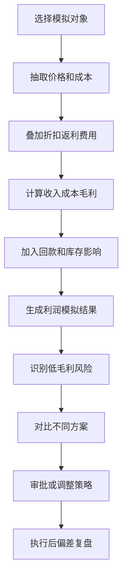
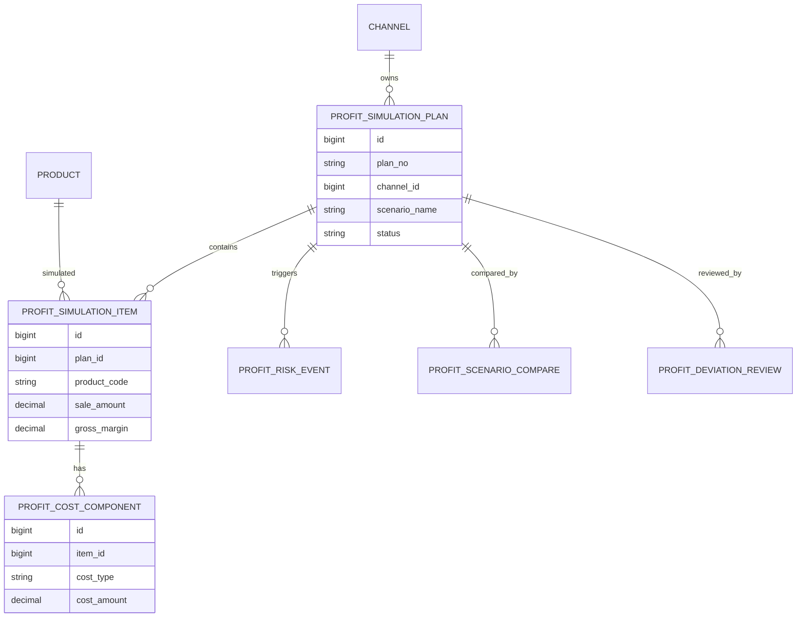
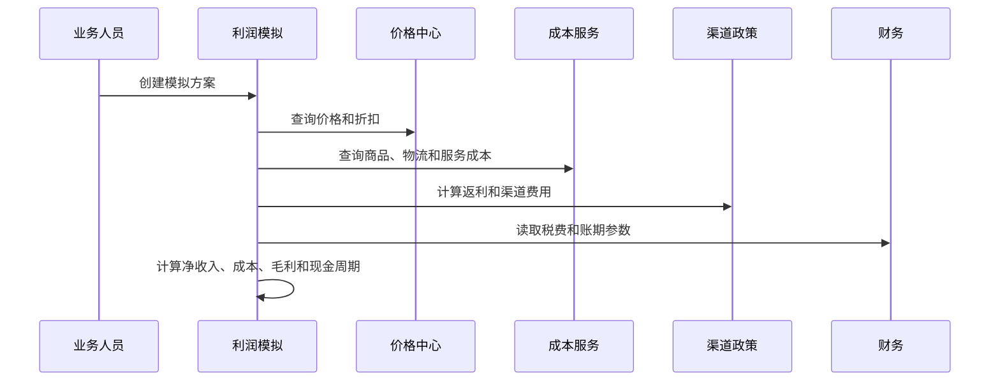
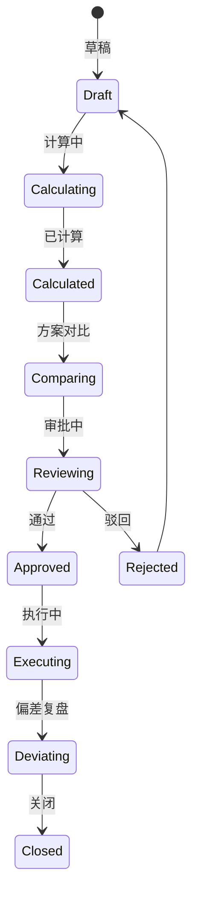
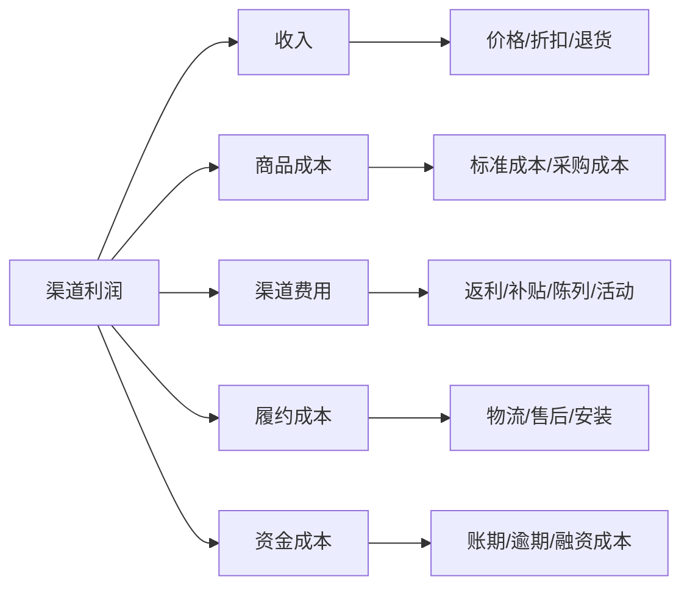

# 渠道利润模拟项目案例

## 适合谁看

如果你做过渠道政策模拟、渠道结算、销售返利政策或制造成本差异分析，但还不清楚如何在政策和订单执行前预估渠道利润，可以学习这个案例。

渠道利润模拟关注的是渠道、产品、价格、折扣、返利、费用、物流、税费、库存和回款对利润的影响。它不是单纯算销售额，而是提前判断某个渠道政策、价格方案或订单组合是否真正赚钱。

## 业务目标

渠道利润模拟要回答 6 个问题：

- 某个渠道、区域、产品组合的预计收入、成本和毛利是多少。
- 折扣、返利、费用、物流和账期会怎样影响利润。
- 哪些订单或渠道看起来销量高，但实际毛利低。
- 新政策发布后，利润会提高还是被激励成本吃掉。
- 不同方案之间的毛利、现金流和风险差异如何。
- 实际执行结果和模拟结果偏差在哪里。

真实项目中，很多业务只看销售额和达成率，忽略返利、退货、费用和回款周期。渠道利润模拟要把这些因素提前合并到一个利润视图里。

## 渠道利润模拟链路

渠道利润模拟要同时服务销售、渠道运营和财务。销售关心成交，财务关心利润，运营关心政策是否可持续。

## 核心概念

| 概念 | 说明 | 新手理解 |
| --- | --- | --- |
| 模拟方案 | 一次利润试算的输入集合 | 渠道、产品、价格、政策组合 |
| 净收入 | 扣除折扣退货后的收入 | 不是合同金额 |
| 变动成本 | 随销售变化的成本 | 商品成本、物流、服务成本 |
| 渠道费用 | 为渠道产生的费用 | 返利、陈列、补贴、活动 |
| 毛利 | 收入减成本和费用 | 判断是否赚钱 |
| 现金周期 | 从发货到回款的时间 | 账期长会影响资金 |
| 偏差复盘 | 实际和模拟的差异分析 | 看模型准不准 |

利润模拟不能只用一个成本率。不同产品、区域、物流方式和服务政策的成本差异很大。

## 数据模型

成本项必须拆开保存。这样才能解释毛利低是因为折扣高、返利高、物流高，还是产品成本高。

## 推荐表结构

| 表 | 用途 | 关键字段 |
| --- | --- | --- |
| `profit_simulation_plan` | 模拟方案 | plan_no、channel_id、scenario_name、period、status |
| `profit_simulation_item` | 模拟明细 | plan_id、product_code、qty、sale_price、sale_amount |
| `profit_cost_component` | 成本构成 | item_id、cost_type、cost_amount、source |
| `profit_policy_snapshot` | 政策快照 | plan_id、policy_code、policy_version、estimated_amount |
| `profit_risk_event` | 利润风险 | plan_id、risk_type、risk_level、impact_amount |
| `profit_scenario_compare` | 方案对比 | base_plan_id、compare_plan_id、margin_diff、cash_diff |
| `profit_deviation_review` | 偏差复盘 | plan_id、actual_margin、simulated_margin、reason |

模拟方案要保存政策快照和成本版本。否则后续成本价或返利政策变化后，历史模拟无法解释。

## 利润计算流程

利润计算要清楚区分“模拟值”和“实际值”。模拟值用于决策，实际值用于复盘和校准模型。

## 模拟方案状态设计

重要方案建议走审批。尤其是低毛利、高返利、长账期或大金额渠道方案。

## 利润影响因素拆解

拆解后，业务才能知道该调价格、调政策、调物流，还是控制账期。

## 前端页面拆分

| 页面 | 核心内容 | 设计建议 |
| --- | --- | --- |
| 利润模拟总览 | 模拟方案、平均毛利、低毛利风险 | 先看方案结果 |
| 方案配置页 | 渠道、产品、价格、数量、期间 | 支持复制历史方案 |
| 成本构成页 | 商品、物流、返利、费用、资金成本 | 成本来源可追溯 |
| 结果分析页 | 净收入、成本、毛利、现金周期 | 支持图表和明细 |
| 风险明细页 | 低毛利、超返利、长账期、高退货 | 风险可下钻 |
| 方案对比页 | A/B 方案毛利和现金流差异 | 便于审批 |
| 偏差复盘页 | 模拟和实际差异 | 用来校准模型 |

利润模拟页面要避免只给出一个毛利率。用户需要看到每个成本项是怎么来的。

## 接口拆分建议

| 接口 | 方法 | 说明 |
| --- | --- | --- |
| `/api/channel-profit/simulations` | GET/POST | 查询和创建模拟方案 |
| `/api/channel-profit/simulations/:id/calculate` | POST | 执行利润计算 |
| `/api/channel-profit/simulations/:id/items` | GET | 查询模拟明细 |
| `/api/channel-profit/simulations/:id/cost-components` | GET | 查询成本构成 |
| `/api/channel-profit/simulations/:id/risks` | GET | 查询利润风险 |
| `/api/channel-profit/scenario-compare` | POST | 对比多个方案 |
| `/api/channel-profit/deviation-review` | GET | 查询偏差复盘 |

利润计算接口建议异步执行，大批量产品和渠道组合会比较慢。

## 实际项目常见问题

### 1. 模拟毛利很好，实际毛利很差

常见原因是退货、返利、物流和服务成本没有纳入。

解决方式：

- 成本项覆盖商品、渠道、履约、资金和售后。
- 退货率使用历史或场景假设。
- 政策和成本保存版本。
- 实际执行后做偏差复盘。

### 2. 低毛利订单被销售强推

销售只看成交额，不看利润。

解决方式：

- 低于毛利底线自动预警。
- 大金额低毛利方案走审批。
- 页面展示毛利损失金额。
- 销售目标加入毛利指标。

### 3. 返利政策叠加后利润被吃掉

多个政策同时命中，没有在模拟中叠加计算。

解决方式：

- 模拟时加载所有生效政策。
- 展示政策费用构成。
- 支持政策互斥和优先级。
- 叠加成本超阈值生成风险。

### 4. 成本口径经常变化

标准成本、实际成本、财务成本不一致。

解决方式：

- 模拟方案选择成本版本。
- 成本项保存来源。
- 财务确认后锁定实际成本。
- 偏差复盘区分成本口径变化和业务变化。

### 5. 方案对比只看毛利率

毛利率高不一定现金流好。

解决方式：

- 同时看毛利额、毛利率、账期和回款风险。
- 长账期方案计算资金成本。
- 现金周期超阈值生成风险。
- 审批页展示利润和现金流双指标。

## 权限与审计

| 权限点 | 控制原因 |
| --- | --- |
| 创建利润模拟 | 涉及价格和成本敏感数据 |
| 查看成本构成 | 涉及商品成本和渠道政策 |
| 调整成本假设 | 会影响决策结果 |
| 提交方案审批 | 影响商业策略 |
| 查看偏差复盘 | 涉及经营结果 |
| 导出模拟结果 | 涉及利润和渠道数据 |

审计日志要记录方案创建、参数调整、成本版本、计算批次、风险结果、审批意见和偏差复盘。

## 验收清单

- 能配置渠道、产品、价格、数量和期间。
- 能计算净收入、商品成本、渠道费用、履约成本和资金成本。
- 能识别低毛利、高返利、长账期和现金流风险。
- 能对比多个利润方案。
- 能把高风险方案带入审批。
- 能复盘实际利润和模拟利润偏差。

## 下一步学习

建议继续阅读：

- [渠道政策模拟项目案例](/projects/channel-policy-simulation-case)
- [销售返利政策项目案例](/projects/sales-rebate-policy-case)
- [制造成本差异分析项目案例](/projects/manufacturing-cost-variance-case)
- [销售预测复盘项目案例](/projects/sales-forecast-review-case)
