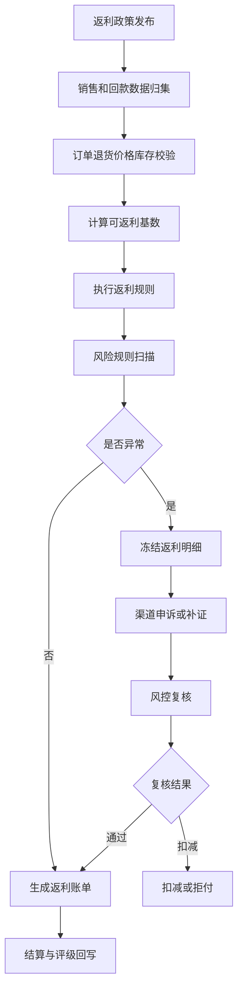
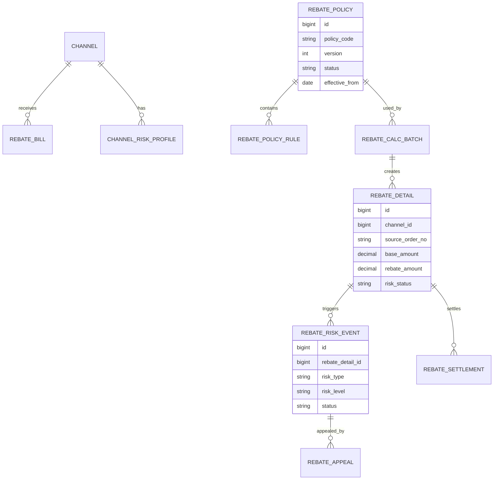
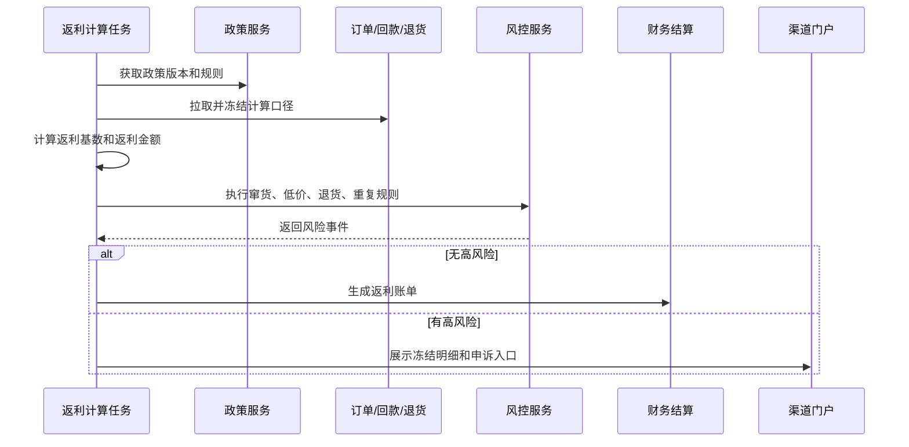
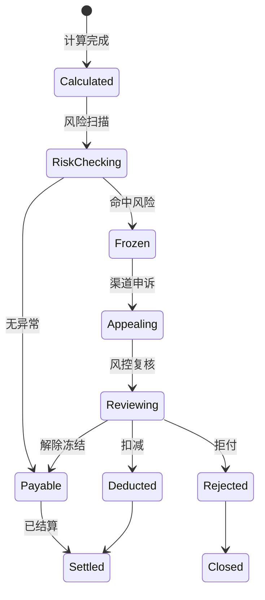
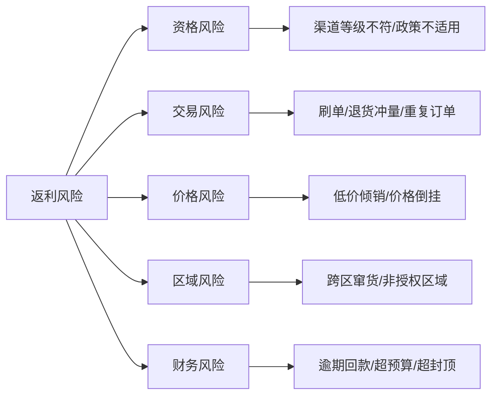

# 渠道返利风控项目案例

## 适合谁看

如果你做过渠道结算、销售返利政策、渠道费用稽核或渠道信用评级，但还不清楚返利为什么容易被套取、重复计算和事后争议，可以学习这个案例。

渠道返利风控关注的是经销商、代理商、门店、销售团队围绕销量、回款、库存、价格、区域和活动政策产生的返利风险。它的核心不是“算返利”，而是确保返利发放有真实销售、有政策依据、有风险拦截、有申诉复核、有审计证据。

## 业务目标

渠道返利风控要回答 6 个问题：

- 哪些销售或回款可以参与返利计算。
- 返利政策是否适用于当前渠道、区域、产品和期间。
- 是否存在刷单、退货冲量、跨区窜货、低价倾销或重复返点。
- 返利金额是否超过预算、封顶或渠道信用限制。
- 异常返利如何冻结、扣减、申诉和复核。
- 风险结论如何影响渠道评级、后续政策和结算节奏。

真实项目里，返利经常不是算错，而是“数据口径没有锁定”。订单、回款、退货、价格和渠道归属如果不断变化，返利结果就很难解释。

## 渠道返利风控链路

返利风控应该在结算前完成。结算后再追回返利，通常会变成销售、财务、渠道之间的争议。

## 核心概念

| 概念 | 说明 | 项目里的典型字段 |
| --- | --- | --- |
| 返利政策 | 定义返利对象、条件和比例 | rebate_policy |
| 返利基数 | 可参与计算的销售或回款金额 | rebate_base_amount |
| 政策版本 | 某一时期生效的返利口径 | policy_version |
| 风险规则 | 判断返利异常的条件 | risk_rule |
| 冻结明细 | 暂不进入结算的返利项 | frozen_rebate_detail |
| 申诉材料 | 渠道提交的证明 | appeal_evidence |
| 扣减金额 | 风控确认后不予支付的部分 | deduction_amount |
| 渠道信用 | 风险结论影响的渠道评级 | channel_credit_score |

返利风控要把“计算规则”和“风险规则”分开。前者决定应该给多少，后者决定能不能给、是否需要复核。

## 数据模型

`REBATE_CALC_BATCH` 很重要。每次计算都要有批次，保存政策版本、数据截止时间和计算参数，否则无法复盘“当时为什么算出这个金额”。

## 推荐表结构

| 表 | 用途 | 关键字段 |
| --- | --- | --- |
| `rebate_policy` | 返利政策 | policy_code、version、effective_from、effective_to、status |
| `rebate_policy_rule` | 返利规则 | policy_id、condition_json、rate_type、rate_value、cap_amount |
| `rebate_calc_batch` | 计算批次 | batch_no、policy_version、data_cutoff_time、operator_id |
| `rebate_base_snapshot` | 返利基数快照 | batch_id、order_no、return_amount、payment_amount、eligible_amount |
| `rebate_detail` | 返利明细 | channel_id、source_order_no、base_amount、rebate_amount、risk_status |
| `rebate_risk_rule` | 风控规则 | rule_code、risk_type、threshold_json、risk_level |
| `rebate_risk_event` | 风险事件 | detail_id、rule_code、risk_level、status、evidence |
| `rebate_appeal` | 渠道申诉 | risk_event_id、appeal_reason、evidence_file_id、review_result |
| `rebate_settlement` | 返利结算 | bill_no、payable_amount、deduction_amount、settlement_status |

返利基数快照必须保存退货、退款、回款、折扣、税额等关键字段。不要每次复盘都重新查实时订单。

## 风控扫描流程

风控服务不要只返回“失败”。它要返回命中规则、证据字段、建议动作和是否允许申诉。

## 返利明细状态设计

冻结状态不是最终结论。它表示当前证据不足或风险过高，需要渠道补证或风控复核。

## 风险类型拆解

风险类型拆清楚后，复核动作才清楚：有的要补合同，有的要查物流，有的要扣减，有的要影响信用评级。

## 前端页面拆分

| 页面 | 主要功能 | 设计建议 |
| --- | --- | --- |
| 返利政策页 | 政策、版本、适用范围、封顶 | 政策发布后只允许新版本变更 |
| 返利计算页 | 批次、数据截止时间、计算结果 | 明确展示口径和版本 |
| 风险工作台 | 风险事件、等级、证据、处理动作 | 支持按渠道、区域、规则筛选 |
| 申诉复核页 | 申诉材料、复核结论、扣减原因 | 渠道可见结论，内部可见审计 |
| 返利账单页 | 应返、冻结、扣减、实付 | 财务重点看金额口径 |
| 渠道风险画像 | 风险次数、重复问题、整改率 | 反哺信用评级和政策 |
| 复盘看板 | 政策效果、风险率、ROI | 帮业务调整政策 |

返利页面要避免只给财务看。渠道、销售运营、风控和管理层关注点不同，需要不同视角。

## 接口拆分建议

| 接口 | 方法 | 说明 |
| --- | --- | --- |
| `/api/channel-rebates/policies` | GET/POST | 查询和维护返利政策 |
| `/api/channel-rebates/calc-batches` | GET/POST | 查询和创建计算批次 |
| `/api/channel-rebates/calc-batches/:id/run` | POST | 执行返利计算 |
| `/api/channel-rebates/risk-events` | GET | 查询风险事件 |
| `/api/channel-rebates/risk-events/:id/appeals` | POST | 提交申诉 |
| `/api/channel-rebates/risk-events/:id/review` | POST | 风控复核 |
| `/api/channel-rebates/settlements` | GET/POST | 查询和生成结算 |
| `/api/channel-rebates/risk-profile` | GET | 查询渠道风险画像 |

返利计算建议异步执行。批次要保存执行日志、失败原因和可重跑标记。

## 实际项目常见问题

### 1. 退货发生在返利结算之后

渠道先冲销量拿返利，之后发生退货，返利已经发出。

解决方式：

- 返利政策设置观察期。
- 退货冲减下一期返利。
- 高风险渠道延迟结算。
- 结算单保留可追溯的订单明细。

### 2. 同一笔销售被多个政策重复计算

政策范围重叠，例如区域政策和活动政策同时命中。

解决方式：

- 政策配置互斥组和优先级。
- 明细记录命中的政策和排除原因。
- 发布政策前做重叠检测。
- 超出预算或重复命中自动预警。

### 3. 渠道跨区销售套取返利

订单归属区域和实际流向不一致。

解决方式：

- 订单关联授权区域、收货地、物流轨迹和商品码。
- 对跨区销售生成风险事件。
- 窜货确认后扣减返利并影响评级。
- 高频跨区渠道进入重点监控。

### 4. 回款口径和销售口径打架

销售认为按出货算，财务认为按回款算。

解决方式：

- 政策明确返利基数：出货、开票、回款或净销售。
- 计算批次保存基数字段快照。
- 页面展示基数来源和扣减项。
- 政策审批时必须确认财务口径。

### 5. 申诉复核没有证据链

只记录“同意”或“拒绝”，后续审计无法解释。

解决方式：

- 申诉必须上传证据并结构化说明。
- 复核记录保存证据、结论、扣减金额和责任人。
- 高金额复核走二级审批。
- 所有风险状态变更进入审计日志。

## 权限与审计

| 权限点 | 控制原因 |
| --- | --- |
| 维护返利政策 | 会影响渠道收益和财务成本 |
| 执行返利计算 | 会生成结算依据 |
| 查看风险事件 | 可能涉及渠道敏感经营数据 |
| 复核申诉 | 会改变冻结、扣减和实付金额 |
| 生成结算 | 直接影响付款 |
| 导出返利明细 | 涉及商业政策和渠道数据 |

审计日志要记录政策发布、批次执行、明细冻结、申诉提交、复核结论、扣减调整、结算生成和付款确认。

## 验收清单

- 返利政策支持版本、范围、封顶和互斥配置。
- 返利计算批次能保存政策版本和数据截止时间。
- 返利基数快照能解释订单、退货、回款和扣减。
- 风控规则能识别退货冲量、跨区、低价、重复和超预算。
- 风险事件支持冻结、申诉、复核、扣减和拒付。
- 返利结算能区分应返、冻结、扣减和实付。
- 风险结果能回写渠道画像和信用评级。

## 下一步学习

建议继续阅读：

- [渠道结算项目案例](/projects/channel-settlement-case)
- [渠道费用稽核项目案例](/projects/channel-expense-audit-case)
- [渠道信用评级项目案例](/projects/channel-credit-rating-case)
- [销售返利政策项目案例](/projects/sales-rebate-policy-case)
