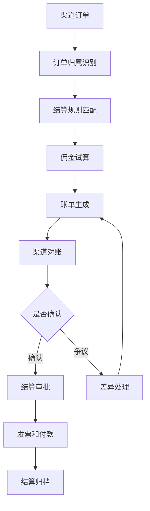
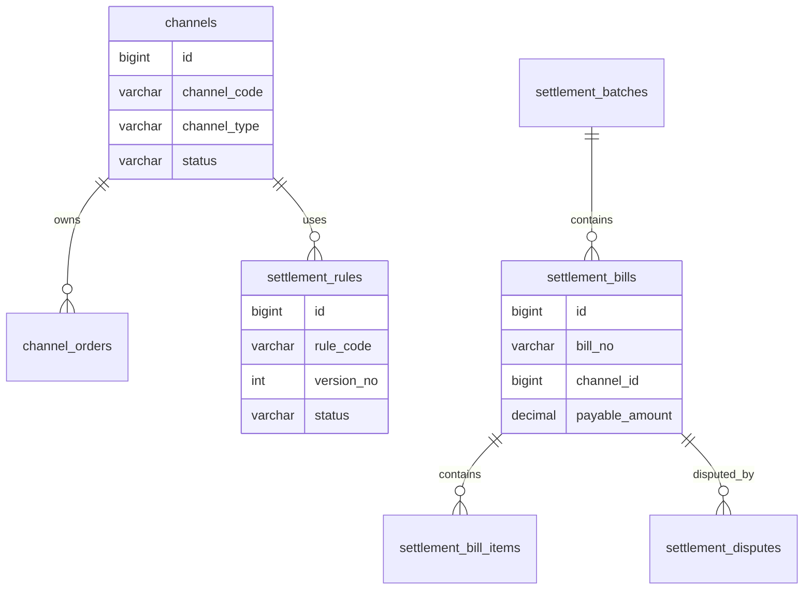
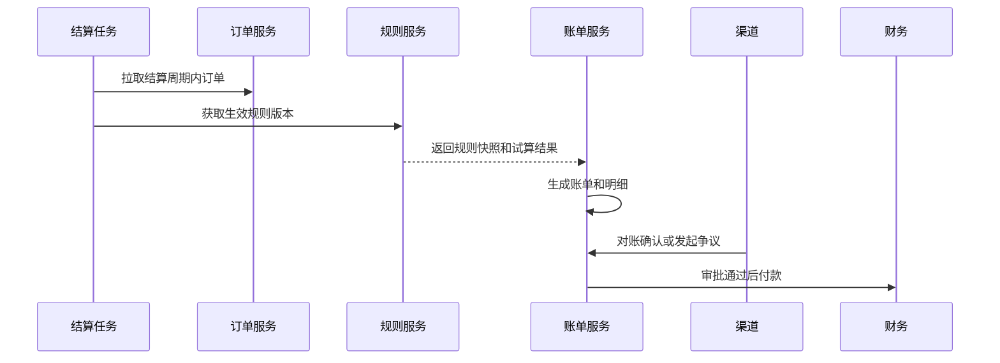

# 渠道结算项目案例

## 适合谁看

适合需要做渠道订单、佣金计算、分润规则、账单生成、对账、结算审批、发票和付款的开发者。

渠道结算不是“订单金额乘比例”。真实项目里，渠道可能有代理商、分销商、达人、门店、平台和服务商。不同渠道的计费口径、退款扣回、阶梯比例、账期、税率、发票和付款方式都不同。如果规则和账单没有版本，结算争议会很难解释。

## 业务目标

第一版渠道结算支持：

- 维护渠道档案和结算账户。
- 配置佣金、分润和扣罚规则。
- 按周期生成渠道账单。
- 支持退款、取消、违约和补差扣回。
- 支持渠道对账确认。
- 支持结算审批、发票和付款记录。
- 支持结算争议处理和审计。

## 渠道结算链路

核心原则：结算要有快照。账单生成后，即使后续规则变化，也必须能按当时规则解释金额。

## 数据模型

## 推荐表结构

| 表 | 作用 | 关键字段 |
| --- | --- | --- |
| `channels` | 渠道档案 | `channel_code`、`channel_type`、`settlement_cycle`、`status` |
| `channel_accounts` | 结算账户 | `channel_id`、`account_name`、`bank_no`、`tax_no` |
| `channel_orders` | 渠道订单 | `order_no`、`channel_id`、`paid_amount`、`refund_amount` |
| `settlement_rules` | 结算规则 | `rule_code`、`version_no`、`rule_json`、`effective_at` |
| `settlement_batches` | 结算批次 | `batch_no`、`period_start`、`period_end`、`status` |
| `settlement_bills` | 渠道账单 | `bill_no`、`channel_id`、`gross_amount`、`payable_amount` |
| `settlement_bill_items` | 账单明细 | `bill_id`、`order_no`、`rule_snapshot`、`amount` |
| `settlement_disputes` | 结算争议 | `bill_id`、`reason`、`status`、`handled_result` |
| `settlement_payments` | 付款记录 | `bill_id`、`pay_amount`、`paid_at`、`pay_status` |

账单明细要保存规则快照和订单快照。否则渠道质疑金额时，只能看当前规则，无法解释历史账单。

## 结算规则类型

| 规则类型 | 示例 | 注意点 |
| --- | --- | --- |
| 固定比例 | 支付金额的 10% | 是否扣除退款和优惠 |
| 阶梯比例 | 月销售额越高比例越高 | 阶梯区间要有版本 |
| 固定金额 | 每单奖励 5 元 | 注意刷单和取消扣回 |
| 混合规则 | 固定服务费加比例分润 | 计算顺序要明确 |
| 扣罚规则 | 超时履约扣减 | 证据和申诉通道要保留 |

规则配置要支持试算。业务人员改规则前，需要看到样例订单的计算结果。

## 账单生成流程

账单生成任务要可重跑，但重跑不能重复生成。建议按渠道、周期和规则版本建立唯一约束。

## 前端页面拆分

| 页面或组件 | 作用 | 注意点 |
| --- | --- | --- |
| 渠道档案 | 管理渠道资料和结算账户 | 税号、账户变更要审计 |
| 结算规则 | 配置佣金和分润规则 | 支持版本、试算和生效时间 |
| 结算批次 | 按周期生成账单 | 展示成功、失败和待处理数量 |
| 渠道账单 | 查看应结金额 | 展示订单明细和规则快照 |
| 对账确认 | 渠道确认或提出争议 | 争议原因结构化 |
| 结算审批 | 财务审核账单 | 展示差异和历史付款 |
| 付款记录 | 查看付款状态 | 支持失败重试和回执 |
| 结算看板 | 统计渠道成本和 ROI | 指标口径要固定 |

结算页面必须让业务能追溯每一分钱。只展示汇总金额，不展示明细和规则，会导致大量线下沟通。

## 常见问题

### 问题 1：渠道说账单金额和自己算的不一致

账单需要展示订单范围、退款扣回、规则版本、计算公式和明细。没有快照就很难解释差异。

### 问题 2：规则改了以后历史账单变化

账单明细必须保存规则快照。规则新版本只能影响新账期或重新生成的指定账单。

### 问题 3：退款发生在账单确认之后

需要扣回机制。后续账期生成负向明细，或者生成补差账单。

### 问题 4：定时任务重复执行导致重复账单

按渠道、结算周期、账单类型建立唯一键，任务重试时先检查已有批次和账单状态。

## 验收清单

- 渠道档案、结算账户和税务信息清晰分离。
- 结算规则支持版本、生效时间和试算。
- 账单生成保存订单快照和规则快照。
- 支持退款扣回和补差。
- 渠道可以对账确认或发起争议。
- 结算审批和付款记录可追踪。
- 账单任务可重试且不会重复生成。
- 结算金额能追溯到订单明细。
- 规则调整不影响历史账单解释。
- 结算看板能展示渠道成本、应付和已付。

## 下一步学习

继续学习 [复杂财务对账项目案例](/projects/finance-reconciliation-case)、[支付订单项目案例](/projects/payment-order-case)、[计费中台项目案例](/projects/billing-platform-case) 和 [运营活动项目案例](/projects/marketing-campaign-case)。
