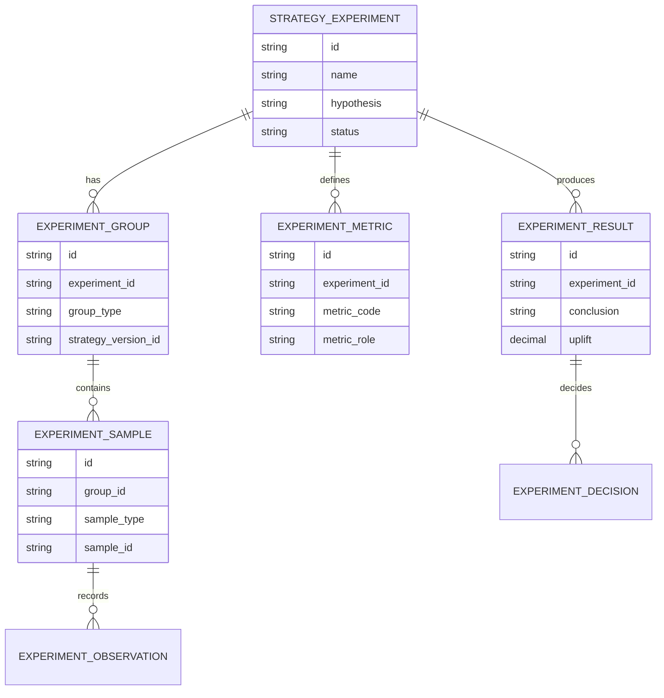
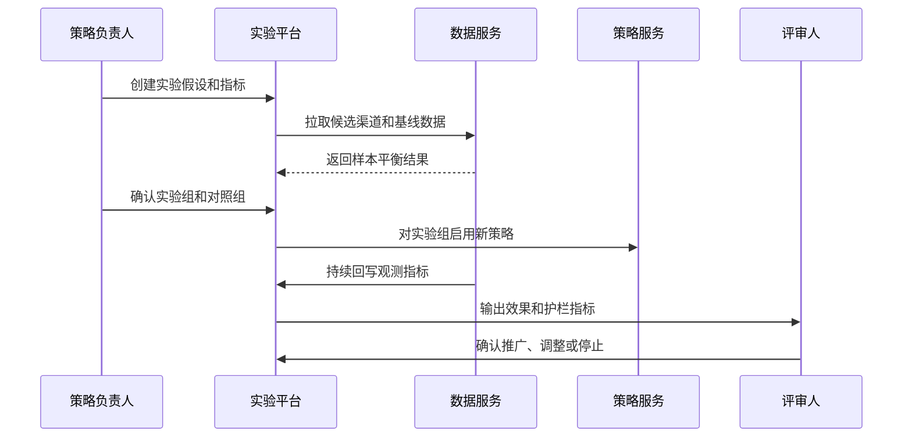
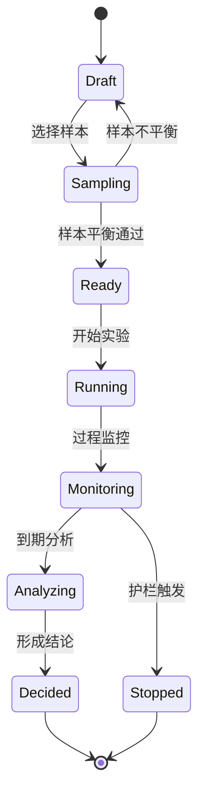
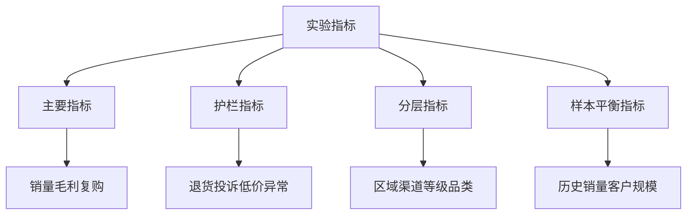

# 渠道策略对照实验项目案例

## 适合谁看

- 想理解企业渠道策略如何做实验、对照组和效果评估的前端开发者。
- 正在做渠道政策、返利、费用投放、增长实验或经营分析系统的团队。
- 希望把“策略上线后看结果”升级为“上线前设计实验、上线中监控、上线后可信归因”的项目负责人。

## 业务目标

渠道策略对照实验的目标，是在策略全量推广前，把渠道、区域、品类或门店拆成实验组和对照组，通过相同周期内的结果对比判断策略是否真的有效。

它解决的是策略复盘里最难的问题：销售上涨到底是策略带来的，还是市场自然波动、季节因素、竞争环境或大客户订单造成的。

## 对照实验链路

可以把它理解成“渠道策略的临床试验”。实验组使用新策略，对照组保持原策略，然后比较结果差异。

## 核心概念

| 概念 | 说明 | 例子 |
| --- | --- | --- |
| 实验假设 | 希望验证的策略效果 | 提高 A 类渠道复购率 |
| 实验组 | 使用新策略的对象 | 华东 50 家渠道 |
| 对照组 | 保持旧策略的对象 | 相似条件的 50 家渠道 |
| 样本平衡 | 两组初始条件要接近 | 历史销量、客户等级相似 |
| 主要指标 | 判断成败的核心指标 | 增量毛利、复购率、ROI |
| 护栏指标 | 防止副作用的指标 | 退货率、投诉、低价异常 |

## 数据模型

## 推荐表结构

| 表 | 关键字段 | 作用 |
| --- | --- | --- |
| `strategy_experiment` | `name`、`hypothesis`、`start_date`、`end_date`、`status` | 实验主表 |
| `experiment_group` | `experiment_id`、`group_type`、`strategy_version_id` | 实验组和对照组 |
| `experiment_sample` | `group_id`、`sample_type`、`sample_id`、`baseline_json` | 样本对象 |
| `experiment_metric` | `metric_code`、`metric_role`、`target_direction` | 指标定义 |
| `experiment_observation` | `sample_id`、`metric_code`、`metric_value`、`observe_date` | 观测数据 |
| `experiment_result` | `experiment_id`、`uplift`、`confidence`、`conclusion` | 实验结果 |
| `experiment_decision` | `result_id`、`decision_type`、`reason`、`owner_id` | 推广决策 |

## 实验执行流程

## 实验状态设计

## 指标体系拆解

第一版可以先不做复杂统计检验，但必须保证两点：

- 实验组和对照组在历史销量、渠道等级、区域结构上接近。
- 同时看主要指标和护栏指标，避免“销量提升但退货暴涨”。

## 前端页面拆分

| 页面 | 主要内容 | 设计重点 |
| --- | --- | --- |
| 实验列表 | 实验名称、假设、状态、周期、负责人、结论 | 快速区分运行中和待分析 |
| 实验创建 | 假设、样本范围、指标、周期、护栏阈值 | 引导业务先定义成功标准 |
| 样本分组 | 实验组、对照组、基线对比、平衡提示 | 防止样本不公平 |
| 过程监控 | 指标趋势、护栏风险、样本异常 | 及时停止高风险实验 |
| 实验结果 | uplift、置信度、分层表现、推广建议 | 结论要可解释 |

## 接口拆分建议

| 接口 | 方法 | 说明 |
| --- | --- | --- |
| `/api/channel-experiments` | POST | 创建实验 |
| `/api/channel-experiments/:id/samples` | POST | 生成样本分组 |
| `/api/channel-experiments/:id/balance-check` | GET | 检查样本平衡 |
| `/api/channel-experiments/:id/start` | POST | 开始实验 |
| `/api/channel-experiments/:id/metrics` | GET | 查询实验指标 |
| `/api/channel-experiments/:id/analyze` | POST | 生成实验结果 |
| `/api/channel-experiments/:id/decision` | POST | 提交推广决策 |

## 实际项目常见问题

### 1. 实验组挑了好渠道，结果天然更好

这是最常见的问题。样本分组时必须展示基线对比，例如历史销量、渠道等级、区域、品类结构。

如果差异过大，要提示重新分组或在结果中标注可信度不足。

### 2. 实验期间业务偷偷调整对照组

实验开始后，对照组策略应锁定。任何人工干预都要记录成实验事件。

否则结果无法判断是策略效果还是人为调整带来的。

### 3. 指标太多，最后不知道看哪个

创建实验时必须指定一个主要指标和若干护栏指标。主要指标决定成败，护栏指标决定是否可以继续推广。

不要让所有指标都拥有同等决策权。

### 4. 实验周期太短

渠道策略通常存在滞后效应。周期至少覆盖一个完整销售节奏，例如一个促销周期、一个账期或一个订货周期。

页面可以在创建时提示历史平均成交周期。

### 5. 实验结论没有沉淀

实验结果应沉淀为策略知识：适合哪些渠道、不适合哪些区域、下一次如何调整。

否则每次策略都从零开始试。

## 权限与审计

| 动作 | 权限建议 | 审计内容 |
| --- | --- | --- |
| 创建实验 | 渠道策略负责人 | 假设、范围、指标 |
| 修改样本 | 策略负责人和数据分析 | 修改前后样本 |
| 启动实验 | 渠道主管审批 | 启动时间和策略版本 |
| 中止实验 | 渠道主管或风控 | 中止原因 |
| 确认结论 | 策略负责人和财务 | 指标结果和决策 |

## 验收清单

- 能创建实验假设、周期、指标和护栏阈值。
- 能生成实验组和对照组，并展示样本平衡。
- 实验期间能监控主要指标和护栏指标。
- 实验结果能展示 uplift、风险和结论。
- 推广决策能关联实验结果。
- 人工干预和样本调整都有审计记录。

## 下一步学习

完成这个案例后，可以继续学习：

- [渠道策略效果复盘项目案例](/projects/channel-strategy-effect-review-case)
- [渠道费用策略灰度项目案例](/projects/channel-expense-strategy-gray-release-case)
- [渠道政策模拟项目案例](/projects/channel-policy-simulation-case)

