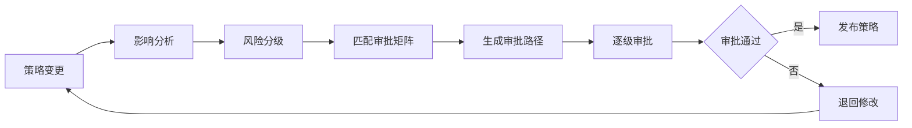
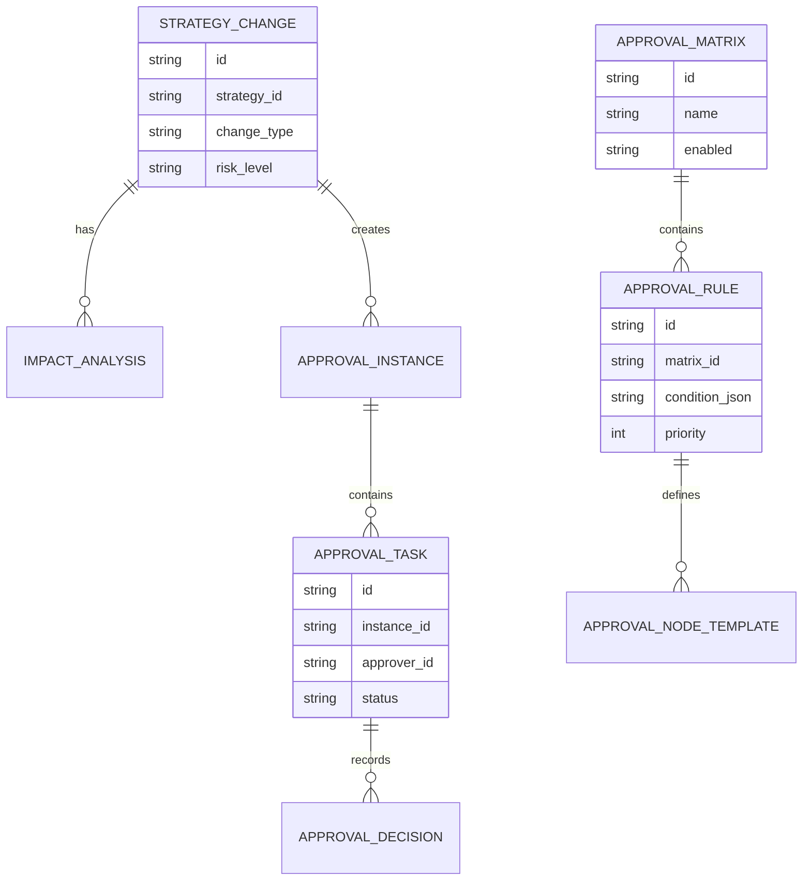
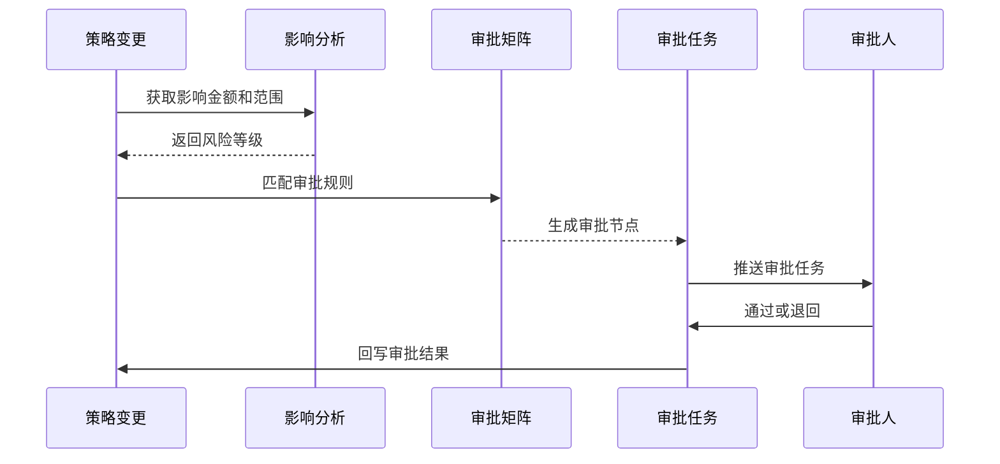
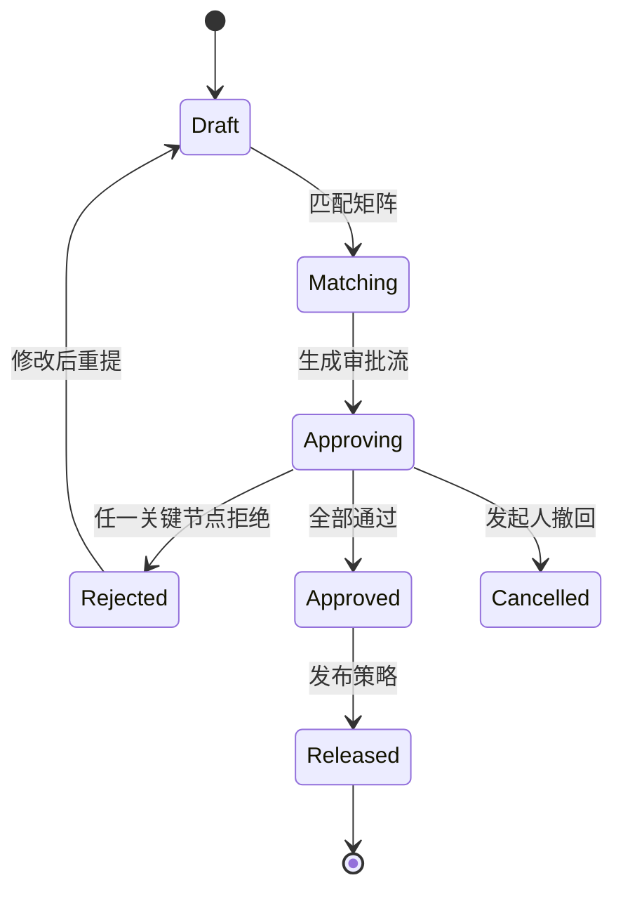
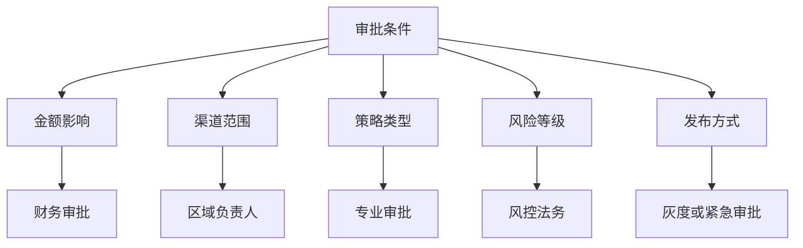

# 渠道策略审批矩阵项目案例

## 适合谁看

- 想理解策略审批如何根据金额、风险、范围和版本自动匹配审批人的前端开发者。
- 正在做渠道政策、费用规则、审批流、风控中心或规则治理系统的团队。
- 希望避免所有策略都走同一条审批流，导致高风险审批不严、低风险审批过慢的项目负责人。

## 业务目标

渠道策略审批矩阵的目标，是根据策略类型、影响金额、渠道范围、风险等级、是否灰度、是否回滚等条件，自动匹配审批路径和审批人。

它要解决：

- 低风险策略审批太慢。
- 高风险策略审批缺少财务或风控。
- 不同区域审批规则不一致。
- 策略变更影响金额很大，但只由运营审批。
- 回滚、紧急发布、灰度扩大没有独立审批规则。

## 审批矩阵链路

可以把它理解成“策略审批的路由表”。系统先判断这次变更有多大风险，再决定需要谁审批。

## 核心概念

| 概念 | 说明 | 举例 |
| --- | --- | --- |
| 审批矩阵 | 条件到审批路径的映射 | 金额大于 100 万需要财务总监 |
| 影响金额 | 变更预计影响的费用或收入 | 预计增加返利 30 万 |
| 风险等级 | 策略变更的业务风险 | 低、中、高 |
| 审批节点 | 一步审批动作 | 渠道主管、财务、法务 |
| 并行审批 | 多个角色同时审批 | 财务和风控同时审批 |
| 紧急审批 | 特殊场景快速处理 | 回滚或风险阻断 |

## 数据模型

## 推荐表结构

| 表 | 关键字段 | 作用 |
| --- | --- | --- |
| `strategy_change` | `strategy_id`、`change_type`、`risk_level`、`status` | 策略变更单 |
| `approval_matrix` | `name`、`scope_type`、`enabled` | 审批矩阵 |
| `approval_rule` | `matrix_id`、`condition_json`、`priority` | 审批规则 |
| `approval_node_template` | `rule_id`、`node_type`、`role_code`、`parallel_group` | 节点模板 |
| `approval_instance` | `change_id`、`matched_rule_id`、`status` | 审批实例 |
| `approval_task` | `instance_id`、`approver_id`、`deadline_at`、`status` | 审批任务 |
| `approval_decision` | `task_id`、`decision`、`comment` | 审批意见 |

## 审批匹配流程

## 审批状态设计

## 审批条件拆解

审批矩阵要有优先级。多个规则命中时，通常选择最高风险、最高优先级的审批路径。

## 前端页面拆分

| 页面 | 主要内容 | 设计重点 |
| --- | --- | --- |
| 审批矩阵列表 | 矩阵名称、适用范围、状态、优先级 | 区分全局和区域规则 |
| 审批规则配置 | 条件、节点、角色、并行组、超时规则 | 用表单配置，避免写 JSON |
| 策略审批详情 | 变更差异、影响分析、匹配规则、审批路径 | 审批人要看懂风险 |
| 审批任务列表 | 待办、已办、超时、退回 | 支持角色筛选 |
| 审批审计 | 谁在何时依据什么规则审批 | 支持追溯 |

## 接口拆分建议

| 接口 | 方法 | 说明 |
| --- | --- | --- |
| `/api/approval-matrices` | GET | 查询审批矩阵 |
| `/api/approval-matrices/:id/rules` | POST | 保存审批规则 |
| `/api/strategy-changes/:id/match-approval` | POST | 匹配审批路径 |
| `/api/approval-instances/:id` | GET | 查询审批实例 |
| `/api/approval-tasks` | GET | 查询审批任务 |
| `/api/approval-tasks/:id/decision` | POST | 提交审批意见 |
| `/api/approval-instances/:id/audit` | GET | 查询审批审计 |

## 实际项目常见问题

### 1. 所有策略都走同一条审批流

低风险策略会变慢，高风险策略又不够严。审批矩阵应该按金额、范围和风险分层。

### 2. 审批人看不到影响分析

审批详情必须展示影响金额、渠道数量、版本差异、风险提示和回滚方案。

只展示“同意/拒绝”按钮没有意义。

### 3. 矩阵规则冲突

规则要有优先级和命中解释。系统应展示“命中了哪条规则，为什么走这条路径”。

### 4. 紧急回滚审批太慢

回滚和风险阻断应有独立路径，可以先执行再补审，但必须保留原因和补审期限。

### 5. 审批组织变动后规则失效

审批节点最好绑定角色或岗位，而不是固定个人。最终审批任务可以在运行时解析到具体人。

## 权限与审计

| 动作 | 权限建议 | 审计内容 |
| --- | --- | --- |
| 配置矩阵 | 系统管理员、流程管理员 | 条件和节点变化 |
| 发起审批 | 策略负责人 | 变更内容 |
| 审批通过 | 匹配审批人 | 审批意见 |
| 紧急回滚 | 应急角色 | 回滚原因 |
| 修改审批人 | 流程管理员 | 替换原因 |

## 验收清单

- 能按条件匹配审批矩阵。
- 能生成串行和并行审批节点。
- 审批人能看到影响分析和变更差异。
- 规则命中原因可解释。
- 支持退回、撤回、通过和紧急回滚。
- 审批过程可审计。

## 下一步学习

完成这个案例后，可以继续学习：

- [渠道策略版本治理项目案例](/projects/channel-strategy-version-governance-case)
- [渠道费用策略灰度项目案例](/projects/channel-expense-strategy-gray-release-case)
- [审批流项目案例](/projects/approval-workflow-case)

