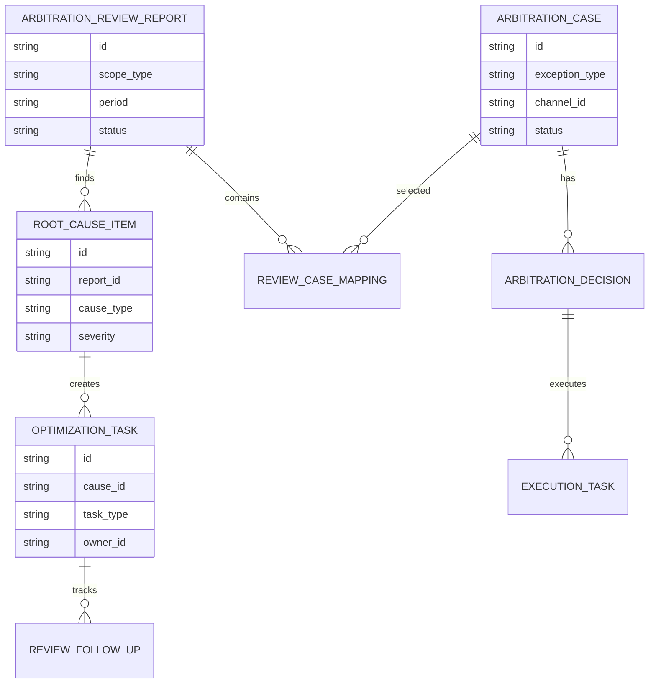
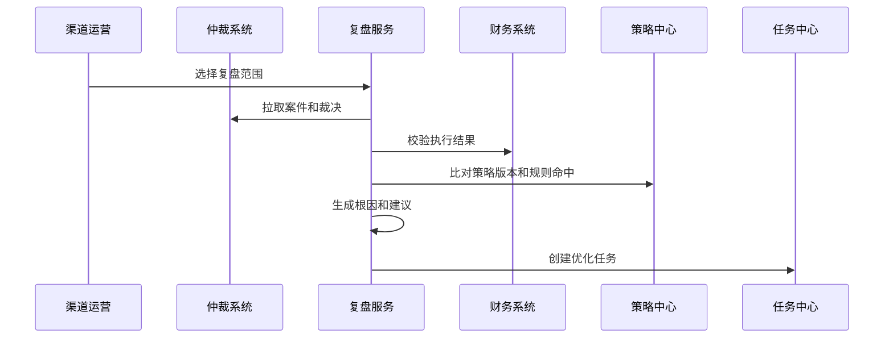
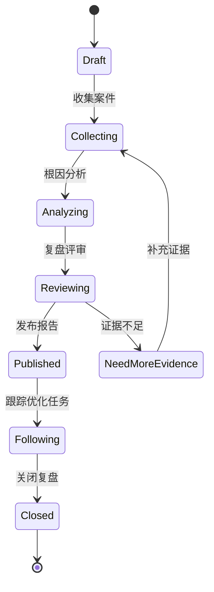
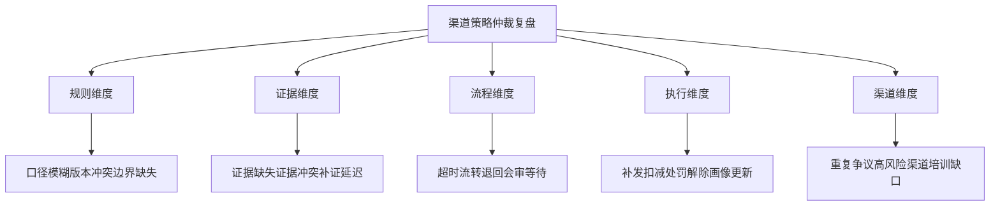

# 渠道策略仲裁复盘项目案例

## 适合谁看

- 想理解渠道策略仲裁结束后如何复盘规则、证据、责任和执行效果的前端开发者。
- 正在做渠道政策、返利风控、价格稽核、渠道投诉、审计或合规系统的团队。
- 希望避免“仲裁一案一结，问题重复发生，策略规则长期不改”的项目负责人。

## 业务目标

渠道策略异常仲裁解决单个争议案件的裁决问题，但真正成熟的系统还要把仲裁结论沉淀为规则优化、证据模板、执行标准和渠道画像。

仲裁复盘要解决：

- 这次仲裁为什么发生，是策略缺陷、执行偏差、数据错误还是渠道违规。
- 仲裁处理是否及时，证据是否充分，裁决是否可执行。
- 同类争议是否重复出现，是否说明规则需要调整。
- 裁决结果是否已完成补发、扣减、处罚、豁免或画像更新。
- 复盘结论如何进入策略优化和下次仲裁的证据清单。

## 仲裁复盘链路

复盘不是再审一次案件，而是回答“下次如何减少同类争议、缩短处理时间、提高裁决一致性”。

## 核心概念

| 概念 | 说明 |
| --- | --- |
| 复盘对象 | 已结案的仲裁案件、同类案件组或某个策略版本下的全部争议。 |
| 结论归因 | 判断争议原因属于规则缺陷、数据异常、执行偏差、沟通不足或渠道违规。 |
| 证据完整度 | 证据包是否覆盖必需证据，是否存在延迟补证或证据冲突。 |
| 裁决一致性 | 同类案件是否给出相近结论，是否存在人为尺度不一致。 |
| 执行闭环 | 裁决后的财务调整、返利修正、处罚解除或策略优化是否完成。 |
| 复盘建议 | 输出规则修改、流程优化、证据模板调整、培训和预警建议。 |

## 数据模型

复盘报告应当支持“单案复盘”和“批量复盘”。批量复盘更适合发现规则缺陷和流程共性问题。

## 推荐表结构

| 表 | 作用 | 关键字段 |
| --- | --- | --- |
| `arbitration_review_report` | 保存复盘报告 | `scope_type`、`period`、`owner_id`、`status` |
| `review_case_mapping` | 关联复盘案件 | `report_id`、`case_id`、`include_reason` |
| `root_cause_item` | 保存根因项 | `report_id`、`cause_type`、`severity`、`evidence` |
| `decision_consistency_check` | 保存裁决一致性检查 | `report_id`、`case_group`、`variance_score` |
| `execution_closure_check` | 保存执行闭环检查 | `case_id`、`execution_status`、`amount_delta` |
| `optimization_task` | 保存优化任务 | `cause_id`、`task_type`、`owner_id`、`due_at` |
| `review_follow_up` | 保存跟进记录 | `task_id`、`progress`、`risk`、`updated_at` |

## 复盘生成流程

复盘报告不能只依赖仲裁系统。执行闭环需要财务、返利、处罚和策略系统共同证明。

## 复盘状态设计

复盘发布不是结束。只有优化任务完成并验证效果后，复盘才算闭环。

## 复盘维度拆解

复盘维度要能转化为任务。不能落地的复盘结论，最终会变成文档归档。

## 前端页面拆分

| 页面 | 核心内容 | 设计重点 |
| --- | --- | --- |
| 复盘报告列表 | 复盘范围、案件数、风险等级、状态、负责人 | 优先暴露高金额和高重复率复盘。 |
| 复盘详情 | 案件样本、根因、证据、结论、建议 | 让用户看到从数据到结论的路径。 |
| 案件聚类 | 同类案件、争议类型、裁决差异、金额影响 | 用于发现规则和裁决不一致。 |
| 执行闭环 | 裁决执行状态、财务调整、处罚处理 | 复盘要确认裁决真的落地。 |
| 优化任务 | 规则修改、流程优化、培训、预警任务 | 把复盘结论转成可跟踪任务。 |

## 接口拆分建议

| 接口 | 作用 |
| --- | --- |
| `GET /api/channel-arbitration-review-reports` | 查询复盘报告列表。 |
| `POST /api/channel-arbitration-review-reports` | 创建复盘报告。 |
| `GET /api/channel-arbitration-review-reports/:id` | 查询复盘详情。 |
| `POST /api/channel-arbitration-review-reports/:id/analyze` | 执行复盘分析。 |
| `GET /api/channel-arbitration-review-reports/:id/cases` | 查询复盘案件。 |
| `GET /api/channel-arbitration-review-reports/:id/closure` | 查询执行闭环。 |
| `POST /api/channel-arbitration-review-reports/:id/tasks` | 创建优化任务。 |

## 实际项目常见问题

### 1. 复盘只写主观总结

没有案件数据、金额影响、处理时长和证据缺口，结论难以服众。解决方式是把复盘维度结构化，并绑定证据。

### 2. 同类案件裁决不一致

不同处理人对同类争议给出不同结论。解决方式是按争议类型做案件聚类，检查裁决差异并沉淀裁决标准。

### 3. 裁决执行没有校验

仲裁系统显示已结案，但财务补发或扣减没有完成。解决方式是复盘阶段必须拉取执行系统状态。

### 4. 复盘建议无法落地

报告写“加强培训”“优化规则”，没有负责人和截止时间。解决方式是复盘建议必须转成任务，并持续跟踪。

### 5. 复盘没有反哺证据清单

每次仲裁都临时找证据。解决方式是把复盘中的证据缺口更新到仲裁类型的必需证据模板。

## 权限与审计

| 权限 | 说明 |
| --- | --- |
| 创建复盘 | 可以选择案件范围并生成复盘。 |
| 查看敏感证据 | 可以查看渠道合同、金额和处罚证据。 |
| 编辑根因 | 可以维护复盘根因和建议。 |
| 发布报告 | 可以发布复盘结论。 |
| 跟踪任务 | 可以更新规则优化和流程整改任务。 |

复盘报告、根因调整、结论发布和优化任务关闭都要审计，避免事后修改责任结论。

## 验收清单

- 能从已结案仲裁中生成单案或批量复盘。
- 能按争议类型、策略版本、渠道和金额聚类案件。
- 能评估证据完整度、处理时效和裁决一致性。
- 能校验裁决后的执行闭环。
- 能输出根因、证据和改进建议。
- 能把复盘建议转成规则、流程、培训或预警任务。
- 能跟踪优化任务完成情况并关闭复盘。

## 下一步学习

- [渠道策略异常仲裁项目案例](/projects/channel-strategy-exception-arbitration-case)
- [渠道策略版本治理项目案例](/projects/channel-strategy-version-governance-case)
- [渠道策略效果复盘项目案例](/projects/channel-strategy-effect-review-case)
