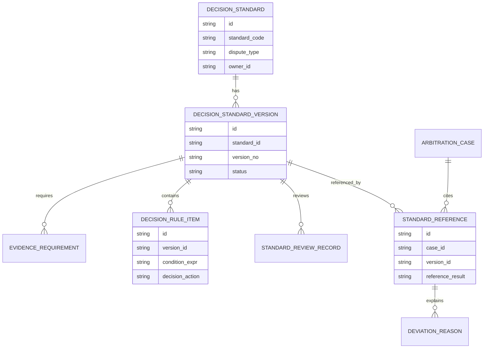
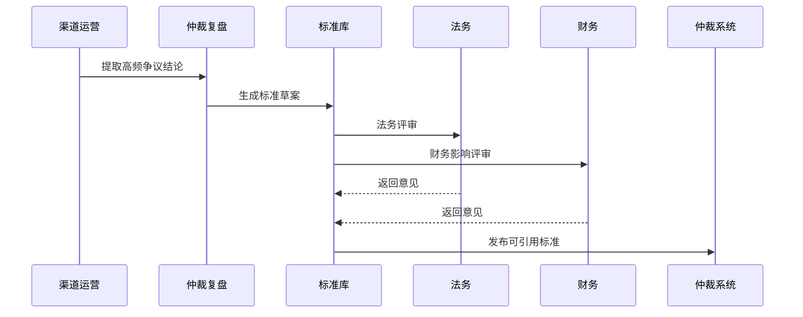
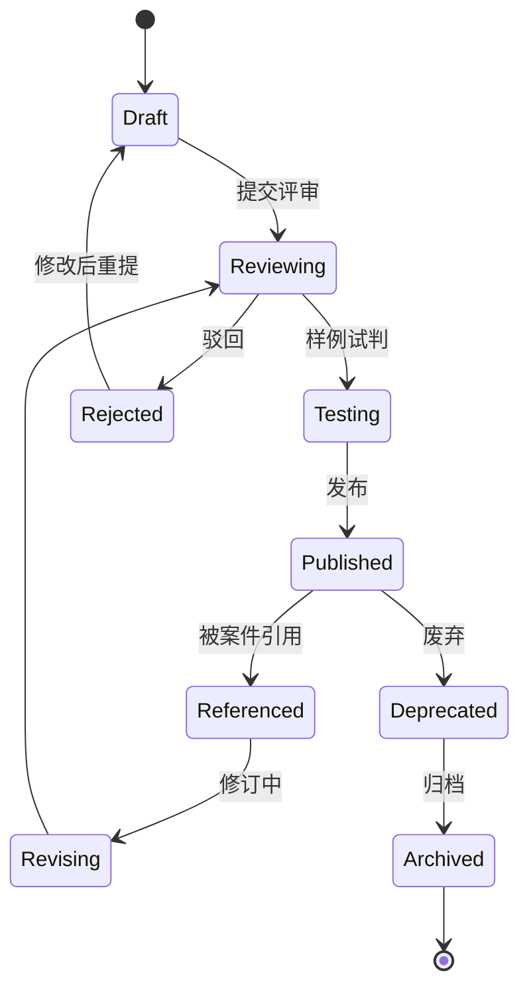
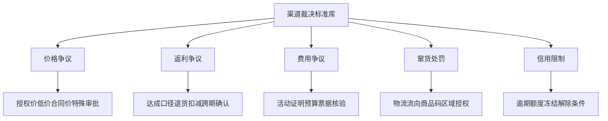

# 渠道策略裁决标准库项目案例

## 适合谁看

- 想理解渠道争议仲裁如何沉淀裁决标准、减少人为尺度差异的前端开发者。
- 正在做渠道政策、返利风控、价格稽核、仲裁复盘、合规审计或规则引擎系统的团队。
- 希望避免“同类案件不同人裁得不一样，渠道质疑不公平”的项目负责人。

## 业务目标

渠道策略仲裁复盘能发现裁决不一致和规则缺陷，但要长期降低争议成本，需要把成熟结论沉淀为裁决标准库。标准库不是简单 FAQ，而是能指导证据要求、责任判断、金额处理和执行动作的结构化规则。

裁决标准库要解决：

- 不同异常类型需要哪些证据才能裁决。
- 什么情况下维持、撤销、调整、补偿或处罚。
- 金额差异、责任比例和豁免条件如何计算。
- 标准变更后如何影响正在处理的仲裁案件。
- 裁决人如何快速引用标准并保留解释依据。

## 裁决标准链路

标准库的价值是让裁决变得可解释、可复用、可审计，而不是完全替代人工判断。

## 核心概念

| 概念 | 说明 |
| --- | --- |
| 裁决标准 | 面向某类渠道争议的处理原则、证据要求、判断条件和执行动作。 |
| 适用条件 | 标准适用的产品线、渠道类型、策略版本、金额区间和时间范围。 |
| 证据门槛 | 裁决前必须具备的合同、订单、物流、发票、命中日志或沟通记录。 |
| 裁决动作 | 维持、撤销、调整、补偿、处罚、豁免、转专项或补充调查。 |
| 标准版本 | 标准每次变更后的版本，用于解释历史裁决。 |
| 引用记录 | 仲裁案件引用了哪个标准、哪个版本、是否有偏离说明。 |

## 数据模型

标准和标准版本要分开。历史仲裁必须保留当时引用的标准版本，不能被新版本覆盖。

## 推荐表结构

| 表 | 作用 | 关键字段 |
| --- | --- | --- |
| `decision_standard` | 保存标准基础信息 | `standard_code`、`dispute_type`、`owner_id`、`status` |
| `decision_standard_version` | 保存标准版本 | `standard_id`、`version_no`、`effective_at`、`status` |
| `evidence_requirement` | 保存证据要求 | `version_id`、`evidence_type`、`required`、`missing_action` |
| `decision_rule_item` | 保存裁决规则 | `version_id`、`condition_expr`、`decision_action`、`priority` |
| `standard_review_record` | 保存标准评审 | `version_id`、`reviewer_role`、`opinion`、`result` |
| `standard_reference` | 保存案件引用 | `case_id`、`version_id`、`reference_result`、`deviation_flag` |
| `deviation_reason` | 保存偏离说明 | `reference_id`、`reason_type`、`description`、`approver_id` |

## 标准发布流程

裁决标准往往涉及金额、合同和处罚，发布前必须经过业务、法务和财务多角色评审。

## 标准版本状态设计

标准发布后不能直接删除。废弃标准仍然需要用于历史案件解释。

## 标准类型拆解

不同争议类型的标准字段不同，页面要按类型展示判断条件和证据要求。

## 前端页面拆分

| 页面 | 核心内容 | 设计重点 |
| --- | --- | --- |
| 标准库列表 | 争议类型、标准状态、版本、适用范围、引用次数 | 方便裁决人快速找到可用标准。 |
| 标准详情 | 适用条件、证据门槛、判断规则、裁决动作 | 让标准能指导真实裁决。 |
| 标准试判 | 输入样例案件，查看推荐结论和缺失证据 | 发布前验证标准是否可用。 |
| 引用记录 | 哪些案件引用了标准，是否偏离标准 | 用于审计裁决一致性。 |
| 版本对比 | 新旧标准差异、影响案件、评审记录 | 标准变更要能解释。 |

## 接口拆分建议

| 接口 | 作用 |
| --- | --- |
| `GET /api/channel-decision-standards` | 查询裁决标准列表。 |
| `POST /api/channel-decision-standards` | 创建裁决标准。 |
| `GET /api/channel-decision-standards/:id` | 查询标准详情。 |
| `POST /api/channel-decision-standards/:id/versions` | 创建标准版本。 |
| `POST /api/channel-decision-standard-versions/:id/trial` | 执行样例试判。 |
| `POST /api/channel-decision-standard-versions/:id/publish` | 发布标准版本。 |
| `POST /api/channel-arbitration-cases/:id/standard-reference` | 案件引用标准。 |
| `GET /api/channel-decision-standards/:id/references` | 查询标准引用记录。 |

## 实际项目常见问题

### 1. 标准写成自然语言，无法引用

裁决人只能复制文字，系统无法判断适用条件。解决方式是把适用范围、证据要求和裁决动作结构化。

### 2. 标准太死，无法处理特殊情况

真实案件存在例外。解决方式是允许偏离标准，但必须填写原因并经过更高权限审批。

### 3. 标准版本覆盖历史解释

新标准发布后，历史案件看起来不符合标准。解决方式是案件引用时锁定标准版本。

### 4. 标准没有试判

发布后才发现条件冲突或证据缺失。解决方式是标准发布前必须用历史案件样本试判。

### 5. 标准没有效果监控

标准发布后争议并未减少。解决方式是统计引用率、偏离率、申诉率和执行失败率。

## 权限与审计

| 权限 | 说明 |
| --- | --- |
| 创建标准 | 可以维护标准草案。 |
| 评审标准 | 可以按角色审核适用条件和金额影响。 |
| 发布标准 | 可以发布可引用版本。 |
| 引用标准 | 可以在仲裁案件中引用标准。 |
| 偏离标准 | 可以提交偏离原因并触发审批。 |

标准创建、版本变更、试判结果、发布、引用和偏离都要写审计日志。

## 验收清单

- 能按争议类型维护裁决标准。
- 能配置适用条件、证据门槛和裁决动作。
- 能对标准版本做评审、试判和发布。
- 能在仲裁案件中引用标准版本。
- 能记录偏离标准的原因和审批。
- 能统计标准引用率、偏离率和争议改善效果。
- 能保留历史版本，支持历史案件解释。

## 下一步学习

- [渠道策略仲裁复盘项目案例](/projects/channel-strategy-arbitration-review-case)
- [渠道策略异常仲裁项目案例](/projects/channel-strategy-exception-arbitration-case)
- [规则引擎项目案例](/projects/rule-engine-case)
