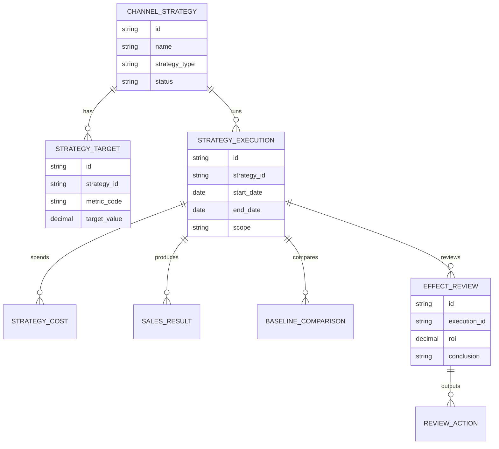
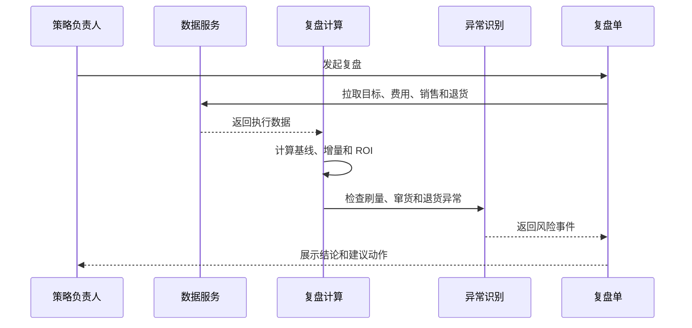
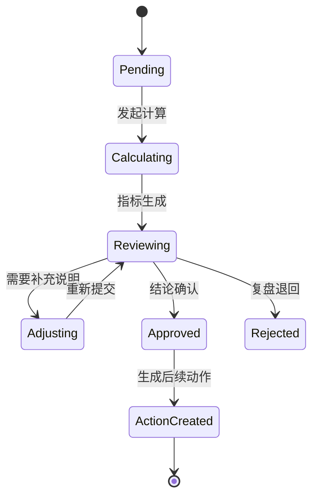
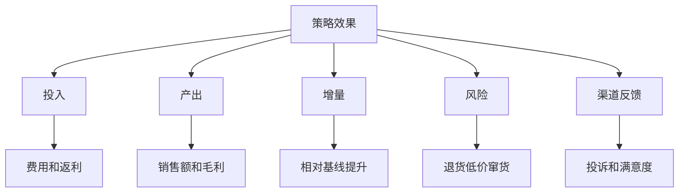

# 渠道策略效果复盘项目案例

## 适合谁看

- 想理解渠道政策、返利、费用投放和销售效果如何闭环的前端开发者。
- 正在做渠道运营、销售管理、费用 ROI 或经营分析系统的团队。
- 希望把“活动做完凭感觉判断”升级为“有指标、有归因、有复盘结论”的项目负责人。

## 业务目标

渠道策略效果复盘，是在渠道政策或费用活动执行后，比较目标、投入、产出、异常和渠道反馈，判断策略是否值得继续、扩大、调整或停止。

它常用于这些场景：

- 某个渠道返利政策是否提高了销量。
- 某个区域费用投放是否带来有效增量。
- 某类渠道是否滥用政策套利。
- 新策略灰度后是否可以全量发布。
- 下一轮预算应该投向哪些渠道和品类。

## 策略复盘链路

复盘不是简单做报表。它要回答“这次策略是否真的带来增量”，而不是只看执行期间销售额是否上涨。

## 核心概念

| 概念 | 说明 | 例子 |
| --- | --- | --- |
| 策略目标 | 策略上线前设定的业务目标 | 提升 A 品类销量 10% |
| 对照基线 | 没有策略时的预期表现 | 去年同期、近 3 个月均值 |
| 增量效果 | 超过基线的部分 | 多卖出的数量或毛利 |
| 投入产出 | 费用、返利和资源投入对应的回报 | ROI、毛利 ROI |
| 异常剔除 | 排除刷量、窜货、退货冲量 | 防止复盘失真 |
| 复盘结论 | 继续、扩大、调整、停止 | 下一轮策略动作 |

## 数据模型

## 推荐表结构

| 表 | 关键字段 | 作用 |
| --- | --- | --- |
| `channel_strategy` | `name`、`strategy_type`、`owner_id`、`status` | 策略主档 |
| `strategy_target` | `strategy_id`、`metric_code`、`target_value` | 目标指标 |
| `strategy_execution` | `strategy_id`、`scope_json`、`start_date`、`end_date` | 执行周期和范围 |
| `strategy_cost` | `execution_id`、`cost_type`、`amount` | 费用投入 |
| `sales_result` | `execution_id`、`channel_id`、`sku_id`、`sales_amount`、`gross_profit` | 销售结果 |
| `baseline_comparison` | `execution_id`、`baseline_type`、`baseline_value`、`increment_value` | 基线对比 |
| `effect_review` | `execution_id`、`roi`、`risk_summary`、`conclusion` | 复盘结论 |

## 复盘流程

## 复盘状态设计

## 效果指标拆解

指标设计要避免只看销售额。建议至少同时看：

- 费用投入。
- 销售增量。
- 毛利增量。
- ROI。
- 异常比例。
- 退货和投诉。

## 前端页面拆分

| 页面 | 主要内容 | 设计重点 |
| --- | --- | --- |
| 策略复盘列表 | 策略、周期、范围、ROI、结论、状态 | 快速定位待复盘策略 |
| 复盘详情 | 目标、执行、费用、销售、基线、异常 | 按“目标到结论”组织 |
| 指标看板 | ROI、增量、毛利、费用消耗、异常率 | 支持渠道和品类下钻 |
| 异常明细 | 异常单据、原因、影响金额、处理状态 | 避免异常影响结论 |
| 复盘结论 | 继续、扩大、调整、停止和理由 | 结论要可追溯 |

## 接口拆分建议

| 接口 | 方法 | 说明 |
| --- | --- | --- |
| `/api/channel-strategy-reviews` | GET | 查询复盘列表 |
| `/api/channel-strategy-reviews` | POST | 发起复盘 |
| `/api/channel-strategy-reviews/:id` | GET | 查询复盘详情 |
| `/api/channel-strategy-reviews/:id/recalculate` | POST | 重新计算指标 |
| `/api/channel-strategy-reviews/:id/anomalies` | GET | 查询异常明细 |
| `/api/channel-strategy-reviews/:id/approve` | POST | 确认复盘结论 |
| `/api/channel-strategy-reviews/:id/actions` | POST | 生成后续策略动作 |

## 实际项目常见问题

### 1. 策略期间销售上涨，但不一定是策略带来的

必须做基线对比。可以用历史同期、策略前均值、未参与渠道作为对照。

复盘报告里要把“总销售额”和“估算增量”分开展示。

### 2. 费用归因不清楚

费用要关联策略执行 ID。不能只按时间段粗略归集，否则多个活动重叠时无法解释。

如果费用无法直接归因，要在复盘里标记为“分摊费用”，并展示分摊规则。

### 3. 退货和窜货导致效果虚高

复盘时要把退货、低价异常、窜货事件纳入风险指标。高风险数据可以从增量中剔除，或单独标注影响金额。

### 4. 结论变成主观评价

结论要绑定指标阈值。例如 ROI 大于 1.5 且异常率低于 3% 才建议扩大。

业务负责人可以补充判断，但必须保留系统指标和人工说明。

### 5. 复盘没有推动下一步动作

复盘通过后应生成后续动作：扩大策略、调整预算、修改规则、冻结异常渠道或创建新的灰度发布。

没有动作的复盘很容易变成形式化报告。

## 权限与审计

| 动作 | 权限建议 | 审计内容 |
| --- | --- | --- |
| 发起复盘 | 策略负责人 | 策略、周期和范围 |
| 重新计算 | 数据分析或策略负责人 | 计算时间和参数 |
| 修改结论 | 策略负责人或主管 | 修改前后结论 |
| 审批复盘 | 渠道主管或财务 | 审批意见 |
| 导出报告 | 授权角色 | 导出范围和指标 |

## 验收清单

- 能按策略和执行周期发起复盘。
- 能展示目标、投入、产出、基线和增量。
- 能识别并展示异常对结论的影响。
- 复盘结论可以生成后续动作。
- 指标计算口径可追溯。
- 复盘报告可以导出并保留历史版本。

## 下一步学习

完成这个案例后，可以继续学习：

- [渠道费用 ROI 复盘项目案例](/projects/channel-expense-roi-review-case)
- [渠道费用策略灰度项目案例](/projects/channel-expense-strategy-gray-release-case)
- [渠道政策模拟项目案例](/projects/channel-policy-simulation-case)

