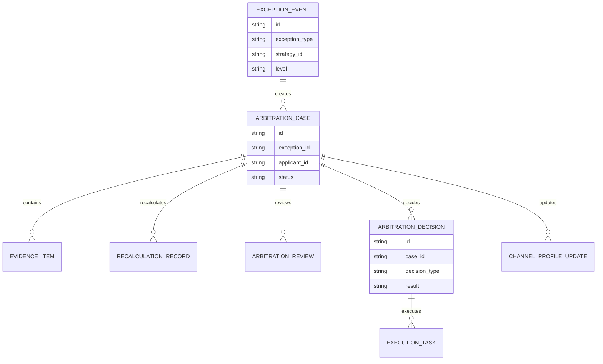
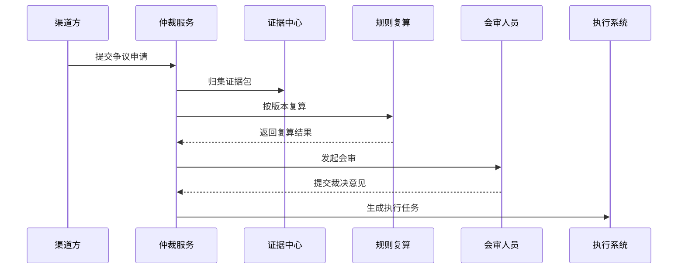
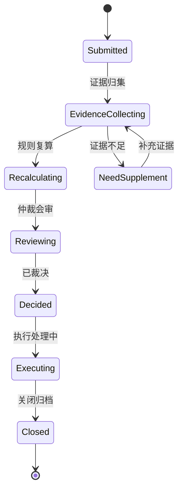
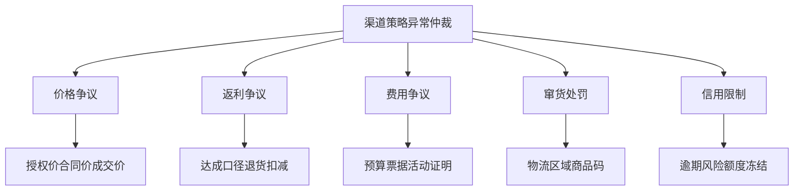

# 渠道策略异常仲裁项目案例

## 适合谁看

- 想理解渠道策略异常出现争议后如何做证据归集、责任判断和处理裁决的前端开发者。
- 正在做渠道政策、价格稽核、返利风控、窜货监控、渠道投诉或合规审计系统的团队。
- 希望避免“渠道说系统算错，业务说渠道违规，财务无法结算”的项目负责人。

## 业务目标

渠道策略回滚治理处理策略异常的技术和业务恢复，但有些异常会进入争议状态：渠道认为价格、返利、费用或处罚不合理，运营认为渠道违反规则，财务需要一个可执行结论。

异常仲裁要解决：

- 争议从哪里来，关联哪些策略、订单、费用或返利。
- 证据是否完整，是否能支撑责任判断。
- 谁有权裁决，是否需要多角色会审。
- 裁决后如何执行补发、扣减、处罚、豁免或复算。
- 仲裁结论如何反哺策略规则和渠道画像。

## 异常仲裁链路

仲裁不是客服工单，它需要能看清策略版本、命中日志、渠道证据、审批记录和财务影响。

## 核心概念

| 概念 | 说明 |
| --- | --- |
| 异常事件 | 系统发现的价格、费用、返利、窜货或信用异常。 |
| 争议申请 | 渠道、销售、运营或财务提出的异议。 |
| 证据包 | 订单、合同、发票、物流、沟通记录、策略命中日志等证据。 |
| 规则复算 | 按指定策略版本重新计算结果，判断系统是否算错。 |
| 仲裁结论 | 维持、撤销、调整、补偿、处罚或转人工专项。 |
| 执行处理 | 根据结论触发财务调整、返利修正、处罚解除或渠道画像更新。 |

## 数据模型

仲裁案件要和异常事件分开。一个异常可能无人争议，也可能被多个相关方提出不同诉求。

## 推荐表结构

| 表 | 作用 | 关键字段 |
| --- | --- | --- |
| `exception_event` | 保存异常事件 | `exception_type`、`strategy_id`、`business_id`、`level`、`status` |
| `arbitration_case` | 保存仲裁案件 | `exception_id`、`applicant_id`、`claim_type`、`status` |
| `evidence_item` | 保存证据项 | `case_id`、`evidence_type`、`file_id`、`source_system` |
| `recalculation_record` | 保存规则复算 | `case_id`、`strategy_version_id`、`origin_result`、`recalc_result` |
| `arbitration_review` | 保存会审记录 | `case_id`、`reviewer_id`、`role_code`、`opinion` |
| `arbitration_decision` | 保存裁决结论 | `case_id`、`decision_type`、`amount_delta`、`reason` |
| `execution_task` | 保存执行任务 | `decision_id`、`task_type`、`owner_id`、`status` |

## 仲裁处理流程

复算必须绑定策略版本，否则无法解释“当时为什么这么算”。

## 仲裁状态设计

证据不足不能直接驳回，应该进入补充证据状态，并明确缺什么证据。

## 仲裁类型拆解

不同仲裁类型的证据不同，前端应按类型显示证据清单，而不是一张通用附件表。

## 前端页面拆分

| 页面 | 核心内容 | 设计重点 |
| --- | --- | --- |
| 仲裁案件列表 | 异常类型、渠道、金额影响、状态、负责人 | 优先显示高金额和高风险案件。 |
| 仲裁详情 | 异常来源、策略版本、命中日志、诉求、证据 | 让裁决人能从证据到结论。 |
| 证据包 | 证据清单、缺失项、来源、上传记录 | 按异常类型展示必需证据。 |
| 规则复算 | 原始结果、复算版本、差异原因 | 复算结果要能解释。 |
| 执行跟踪 | 补发、扣减、处罚解除、结算调整 | 裁决不是结束，执行完成才闭环。 |

## 接口拆分建议

| 接口 | 作用 |
| --- | --- |
| `GET /api/channel-arbitration-cases` | 查询仲裁案件。 |
| `POST /api/channel-arbitration-cases` | 创建仲裁申请。 |
| `GET /api/channel-arbitration-cases/:id` | 查询仲裁详情。 |
| `POST /api/channel-arbitration-cases/:id/evidence` | 补充证据。 |
| `POST /api/channel-arbitration-cases/:id/recalculate` | 执行规则复算。 |
| `POST /api/channel-arbitration-cases/:id/review` | 提交会审意见。 |
| `POST /api/channel-arbitration-cases/:id/decision` | 提交裁决结论。 |
| `GET /api/channel-arbitration-cases/:id/execution` | 查询执行进度。 |

## 实际项目常见问题

### 1. 证据散落在多个系统

订单、合同、物流、发票和沟通记录分别在不同系统。解决方式是仲裁详情页做证据包聚合，并标明来源。

### 2. 复算口径不一致

运营用新规则复算历史订单，导致结论不公平。解决方式是按异常发生时的策略版本复算。

### 3. 裁决结论无法执行

结论写了“适当补偿”，财务不知道怎么处理。解决方式是裁决结论必须结构化，包含金额、对象、动作和执行系统。

### 4. 渠道无法看到进度

渠道提交异议后不知道处理到哪一步。解决方式是提供外部可见状态，但敏感内部意见要脱敏。

### 5. 仲裁结果没有反哺策略

同类争议不断出现。解决方式是按仲裁类型统计规则缺陷，并生成策略优化任务。

## 权限与审计

| 权限 | 说明 |
| --- | --- |
| 提交争议 | 可以创建仲裁申请和上传证据。 |
| 查看证据 | 可以查看证据包和复算记录。 |
| 提交会审意见 | 可以按角色填写专业意见。 |
| 提交裁决 | 可以形成最终仲裁结论。 |
| 执行裁决 | 可以触发财务、返利或处罚调整。 |

仲裁涉及金额和责任判断，所有证据、意见、复算和裁决都要写审计日志。

## 验收清单

- 能从渠道策略异常创建仲裁案件。
- 能按异常类型展示证据清单和缺失项。
- 能绑定策略版本执行规则复算。
- 能记录多角色会审意见。
- 能输出结构化裁决结论。
- 能生成补发、扣减、处罚解除或结算调整任务。
- 能把仲裁结果反哺渠道画像和策略优化。

## 下一步学习

- [渠道策略回滚治理项目案例](/projects/channel-strategy-rollback-governance-case)
- [渠道策略发布审计项目案例](/projects/channel-strategy-release-audit-case)
- [渠道价格稽核项目案例](/projects/channel-price-audit-case)
