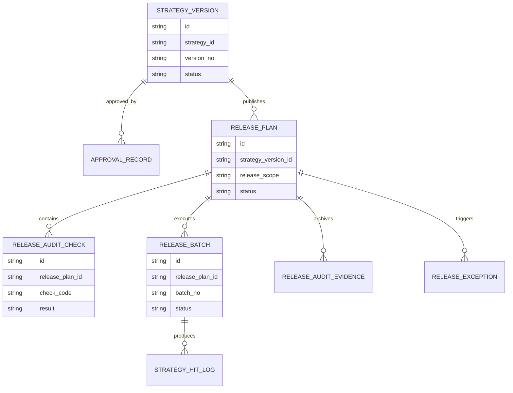
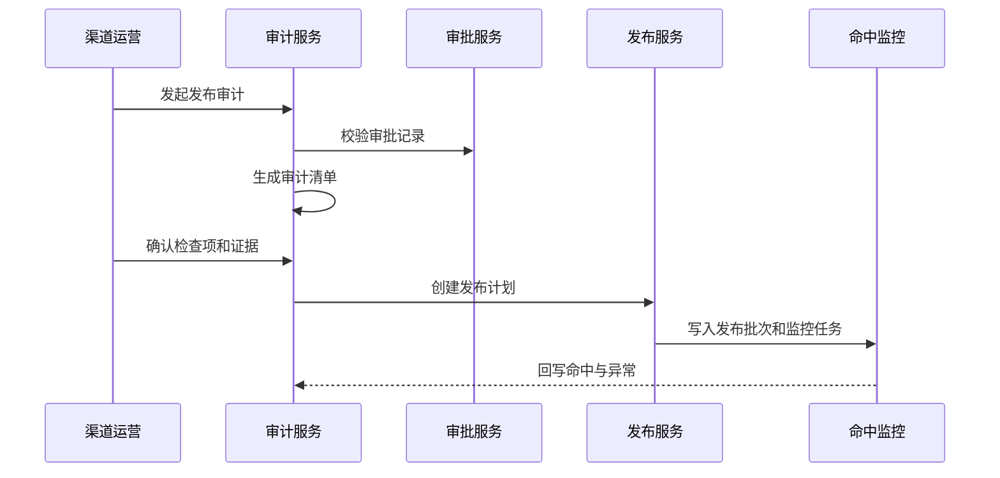
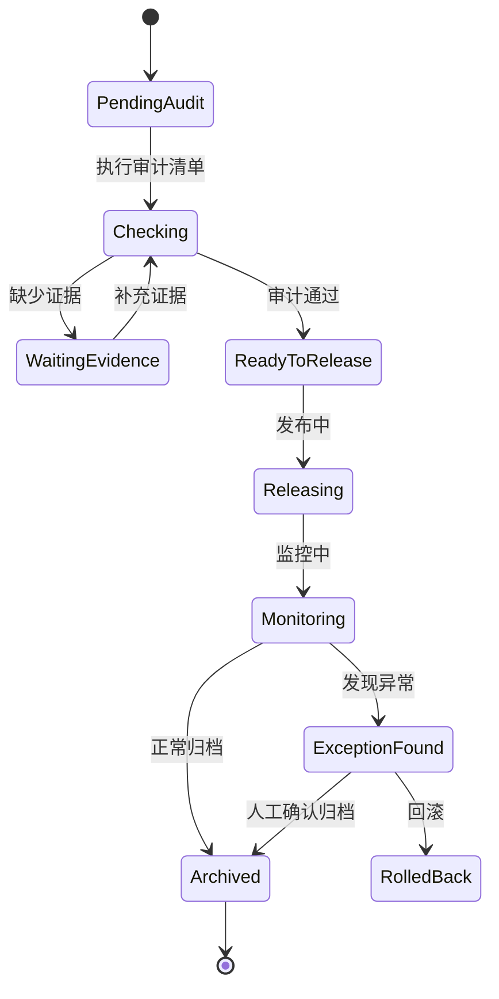
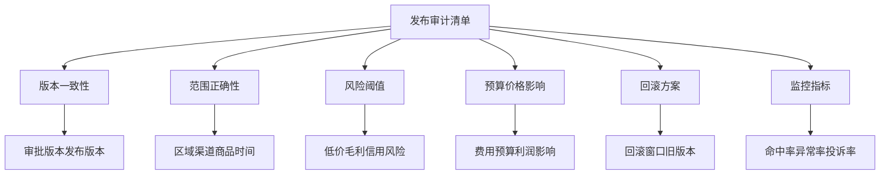

# 渠道策略发布审计项目案例

## 适合谁看

- 想理解渠道策略从审批通过到正式发布之间如何做审计控制的前端开发者。
- 正在做渠道政策、价格策略、返利规则、费用政策或多区域渠道治理系统的团队。
- 希望避免“策略发布了才发现范围错、版本错、审批没覆盖、执行无法追溯”的项目负责人。

## 业务目标

渠道策略审批矩阵解决“谁来批”的问题，发布审计解决“能不能发、发给谁、发了什么、谁确认过”的问题。

一个成熟的发布审计模块需要保证：

- 发布版本与审批版本一致。
- 发布范围、渠道、区域、商品、时间窗可追溯。
- 高风险策略发布前有审计清单。
- 发布后能追踪命中情况、异常反馈和回滚入口。
- 审计人员能看到完整证据，而不是只看发布按钮。

## 发布审计链路

发布审计不是多加一个确认弹窗。它要把策略版本、审批结论、发布范围、配置差异、风险影响和发布结果串起来，形成可审计证据链。

## 核心概念

| 概念 | 说明 |
| --- | --- |
| 发布审计 | 策略发布前后的合规检查和证据记录。 |
| 审计清单 | 发布前必须确认的检查项，例如范围、价格底线、预算、灰度、回滚方案。 |
| 发布计划 | 描述发布时间、发布范围、执行批次和回滚窗口。 |
| 版本一致性 | 确认发布内容和审批通过的策略版本没有偏差。 |
| 命中监控 | 策略发布后观察渠道、订单、费用或价格是否按预期命中。 |
| 审计归档 | 将发布证据、审批链路、检查结果和监控结果留存。 |

## 数据模型

这个模型把审批、发布计划、审计检查、发布批次、命中日志分开。这样后续即使支持灰度、分批、回滚，也不会把所有字段堆进策略版本表。

## 推荐表结构

| 表 | 作用 | 关键字段 |
| --- | --- | --- |
| `strategy_version` | 保存策略版本 | `strategy_id`、`version_no`、`status`、`approved_at` |
| `release_plan` | 保存发布计划 | `strategy_version_id`、`release_scope`、`release_time`、`rollback_deadline` |
| `release_audit_check` | 保存审计检查项 | `release_plan_id`、`check_code`、`result`、`confirmed_by` |
| `release_audit_evidence` | 保存审计证据 | `release_plan_id`、`evidence_type`、`file_id`、`summary` |
| `release_batch` | 保存发布批次 | `release_plan_id`、`batch_no`、`scope_snapshot`、`status` |
| `strategy_hit_log` | 保存策略命中日志 | `release_batch_id`、`channel_id`、`business_id`、`hit_result` |
| `release_exception` | 保存发布异常 | `release_plan_id`、`exception_type`、`level`、`status` |

## 发布审计流程

前端不要把发布过程做成一个单按钮操作。推荐拆成“检查、确认、计划、发布、监控”几步，让用户知道当前卡在哪个环节。

## 发布状态设计

发布状态要能表达“审计未通过但可补证”和“发布后发现异常”。否则用户会误以为发布只存在成功和失败两种结果。

## 审计检查项拆解

审计项要配置化。不同类型的渠道策略关注点不一样：价格策略重视低价和毛利，费用策略重视预算和 ROI，返利策略重视冲量和窜货。

## 前端页面拆分

| 页面 | 核心内容 | 设计重点 |
| --- | --- | --- |
| 发布审计列表 | 策略名称、版本、发布范围、审计状态、负责人 | 能快速看到待补证和待发布项。 |
| 审计详情 | 审批记录、版本差异、检查项、证据、风险提示 | 按检查项组织信息，不要只堆字段。 |
| 发布计划 | 发布时间、发布范围、批次、回滚窗口 | 范围要能展开看快照。 |
| 发布监控 | 命中率、异常数、渠道反馈、回滚入口 | 发布后仍要能继续治理。 |
| 审计归档 | 审批、发布、监控、异常、回滚证据 | 适合合规审查和历史追溯。 |

## 接口拆分建议

| 接口 | 作用 |
| --- | --- |
| `GET /api/channel-strategy-release-audits` | 查询发布审计列表。 |
| `POST /api/channel-strategy-release-audits` | 创建发布审计。 |
| `GET /api/channel-strategy-release-audits/:id` | 查询审计详情。 |
| `POST /api/channel-strategy-release-audits/:id/check` | 执行或刷新审计检查。 |
| `POST /api/channel-strategy-release-audits/:id/evidence` | 上传或补充审计证据。 |
| `POST /api/channel-strategy-release-audits/:id/release-plan` | 创建发布计划。 |
| `POST /api/channel-strategy-release-audits/:id/publish` | 执行发布。 |
| `GET /api/channel-strategy-release-audits/:id/monitoring` | 查询发布后监控。 |

## 实际项目常见问题

### 1. 审批版本和发布版本不一致

策略审批后又被运营修改，最后发布的是另一个版本。解决方式是发布审计绑定不可变版本号，并校验版本 hash。

### 2. 发布范围被临时扩大

灰度范围从部分渠道扩大到全部渠道，但审批链路没有覆盖。解决方式是把范围快照纳入审计，范围变化必须重新审计。

### 3. 审计证据只有口头确认

后续出现争议时无法证明谁确认了什么。解决方式是每个检查项记录确认人、时间、结果和证据附件。

### 4. 发布后没有命中监控

策略发布成功不等于业务命中正常。解决方式是发布计划自动创建监控任务，至少看命中率、异常率和投诉反馈。

### 5. 回滚方案没有提前准备

发布异常时才找旧版本和范围，容易错过处理窗口。解决方式是发布前必须确认回滚版本、回滚范围和回滚截止时间。

## 权限与审计

| 权限 | 说明 |
| --- | --- |
| 查看审计 | 可以查看发布审计列表和基础信息。 |
| 确认检查项 | 可以确认审计检查项并补充说明。 |
| 上传证据 | 可以上传审计文件、截图或业务说明。 |
| 执行发布 | 可以在审计通过后执行发布。 |
| 执行回滚 | 可以在异常时触发回滚。 |

发布审计日志至少要记录：版本、范围、检查项、证据、发布批次、监控异常和回滚操作。审计日志不能被普通运营删除。

## 验收清单

- 能为已审批策略创建发布审计。
- 能校验审批版本和发布版本一致性。
- 能生成并确认审计检查项。
- 能保存发布范围快照和审计证据。
- 能创建发布计划并分批发布。
- 发布后能查看命中监控和异常记录。
- 出现异常时能追溯证据并发起回滚。

## 下一步学习

- [渠道策略审批矩阵项目案例](/projects/channel-strategy-approval-matrix-case)
- [渠道策略版本治理项目案例](/projects/channel-strategy-version-governance-case)
- [渠道费用策略灰度项目案例](/projects/channel-expense-strategy-gray-release-case)
