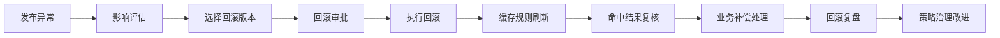
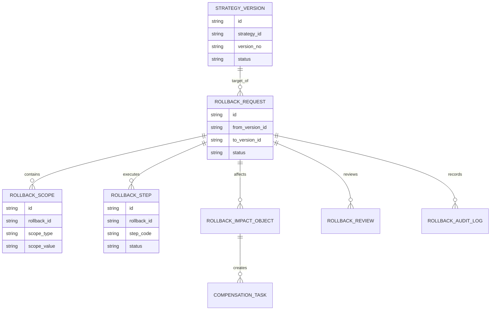
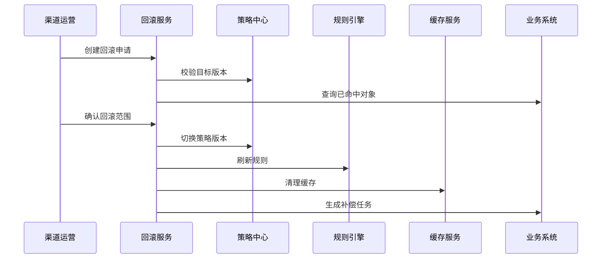
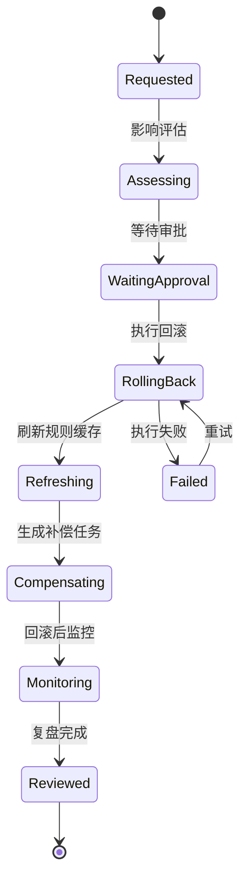
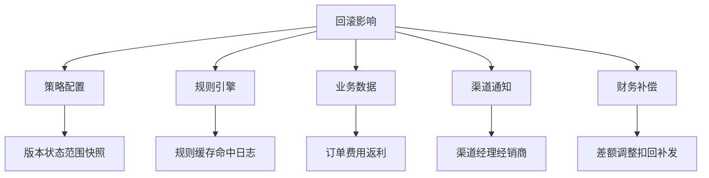

# 渠道策略回滚治理项目案例

## 适合谁看

- 想理解渠道策略发布异常后如何快速回滚、控制影响和追溯责任的前端开发者。
- 正在做渠道政策、价格策略、返利规则、费用策略、灰度发布或策略中心的团队。
- 希望避免“策略发错了，但不知道回滚哪个版本、影响哪些渠道、谁确认过”的项目负责人。

## 业务目标

渠道策略发布审计能降低发布风险，但不能保证永远不出错。策略上线后可能出现低价穿透、费用超预算、渠道投诉、返利计算异常、订单命中异常等问题。回滚治理要解决：

- 回滚到哪个版本。
- 回滚哪些渠道、区域、商品和客户。
- 已经命中的订单、费用、返利如何处理。
- 搜索、缓存、规则引擎和客户端配置如何同步刷新。
- 回滚后如何复盘，避免同类策略再次出错。

回滚治理的目标不是简单恢复旧配置，而是在可控窗口内降低业务损失，并保留完整证据。

## 回滚治理链路

回滚不能只改策略状态。它必须考虑已经命中的业务数据，例如订单价格、费用申请、返利计算和渠道通知。

## 核心概念

| 概念 | 说明 |
| --- | --- |
| 回滚版本 | 要恢复到的历史策略版本，通常是上一个已验证版本。 |
| 回滚范围 | 回滚影响的渠道、区域、商品、客户和时间窗口。 |
| 影响评估 | 评估异常策略已经命中的业务对象和风险等级。 |
| 回滚审批 | 高风险回滚需要业务、财务、法务或渠道负责人确认。 |
| 补偿处理 | 对已产生的错误订单、费用或返利进行修正或人工处理。 |
| 回滚复盘 | 回滚后分析异常原因，并更新发布审计和策略规则。 |

## 数据模型

回滚请求要和版本、范围、步骤、影响对象分开。这样前端可以清楚展示“回滚什么、回滚到哪、影响谁、现在卡在哪一步”。

## 推荐表结构

| 表 | 作用 | 关键字段 |
| --- | --- | --- |
| `rollback_request` | 保存回滚申请 | `from_version_id`、`to_version_id`、`reason`、`risk_level`、`status` |
| `rollback_scope` | 保存回滚范围 | `rollback_id`、`scope_type`、`scope_value`、`snapshot` |
| `rollback_step` | 保存回滚步骤 | `rollback_id`、`step_code`、`status`、`error_message` |
| `rollback_impact_object` | 保存受影响对象 | `rollback_id`、`object_type`、`business_id`、`handle_status` |
| `compensation_task` | 保存补偿任务 | `impact_object_id`、`task_type`、`owner_id`、`status` |
| `rollback_review` | 保存回滚复盘 | `rollback_id`、`root_cause`、`improvement`、`reviewed_by` |
| `rollback_audit_log` | 保存审计日志 | `rollback_id`、`action`、`operator_id`、`created_at` |

## 回滚执行流程

回滚执行最好是步骤化的。某一步失败时可以重试，不要让用户只能看到“回滚失败”。

## 回滚状态设计

回滚后还需要监控。比如缓存刷新完成但订单系统仍旧命中旧规则，必须能在监控阶段发现。

## 回滚影响拆解

影响拆解要结合策略类型。价格策略重点看订单和毛利，费用策略重点看预算和申请，返利策略重点看结算和扣减。

## 前端页面拆分

| 页面 | 核心内容 | 设计重点 |
| --- | --- | --- |
| 回滚申请列表 | 策略、版本、异常原因、风险等级、状态 | 高风险回滚要突出显示。 |
| 回滚详情 | 版本差异、回滚范围、影响对象、审批记录 | 让审批人知道回滚会影响什么。 |
| 执行步骤 | 版本切换、规则刷新、缓存清理、补偿任务 | 每一步要有状态和错误信息。 |
| 影响对象 | 命中的订单、费用、返利、渠道反馈 | 支持按对象类型和处理状态筛选。 |
| 回滚复盘 | 根因、改进项、审计证据、后续任务 | 复盘要能反哺发布审计。 |

## 接口拆分建议

| 接口 | 作用 |
| --- | --- |
| `GET /api/channel-strategy-rollbacks` | 查询回滚申请列表。 |
| `POST /api/channel-strategy-rollbacks` | 创建回滚申请。 |
| `GET /api/channel-strategy-rollbacks/:id` | 查询回滚详情。 |
| `POST /api/channel-strategy-rollbacks/:id/assess` | 执行影响评估。 |
| `POST /api/channel-strategy-rollbacks/:id/approve` | 审批回滚。 |
| `POST /api/channel-strategy-rollbacks/:id/execute` | 执行回滚。 |
| `POST /api/channel-strategy-rollback-steps/:id/retry` | 重试失败步骤。 |
| `POST /api/channel-strategy-rollbacks/:id/review` | 提交回滚复盘。 |

## 实际项目常见问题

### 1. 回滚范围过大

只因为某个区域异常就回滚全量策略，会影响正常渠道。解决方式是回滚前做范围评估，优先支持区域、渠道、商品粒度回滚。

### 2. 只改策略版本，没有刷新规则缓存

界面显示已回滚，但订单仍命中新策略。解决方式是回滚步骤中显式包含规则引擎刷新和缓存清理，并校验刷新结果。

### 3. 已命中业务数据无人处理

错误价格、错误费用或错误返利已经生成，回滚配置无法自动修正历史数据。解决方式是生成影响对象和补偿任务。

### 4. 回滚审批太慢

高风险策略异常时需要快速止损，但审批链路过长。解决方式是提前配置紧急回滚授权和事后复核机制。

### 5. 回滚后没有复盘

同类错误反复出现。解决方式是回滚关闭前必须填写根因、改进项和发布审计补充要求。

## 权限与审计

| 权限 | 说明 |
| --- | --- |
| 发起回滚 | 可以创建回滚申请和填写原因。 |
| 查看影响 | 可以查看回滚影响对象和范围快照。 |
| 审批回滚 | 可以确认回滚风险并批准执行。 |
| 执行回滚 | 可以触发版本切换和规则刷新。 |
| 提交复盘 | 可以填写回滚根因和改进项。 |

回滚属于高风险操作，必须记录操作者、审批人、回滚版本、范围快照、执行步骤、失败重试和补偿结果。

## 验收清单

- 能选择异常版本和目标回滚版本。
- 能评估回滚范围和已命中业务对象。
- 能按渠道、区域、商品等粒度限制回滚范围。
- 回滚执行包含版本切换、规则刷新和缓存清理。
- 失败步骤可以单独重试并保留错误信息。
- 能为已影响订单、费用或返利生成补偿任务。
- 回滚关闭前必须完成复盘和审计归档。

## 下一步学习

- [渠道策略发布审计项目案例](/projects/channel-strategy-release-audit-case)
- [渠道策略版本治理项目案例](/projects/channel-strategy-version-governance-case)
- [渠道费用策略灰度项目案例](/projects/channel-expense-strategy-gray-release-case)
