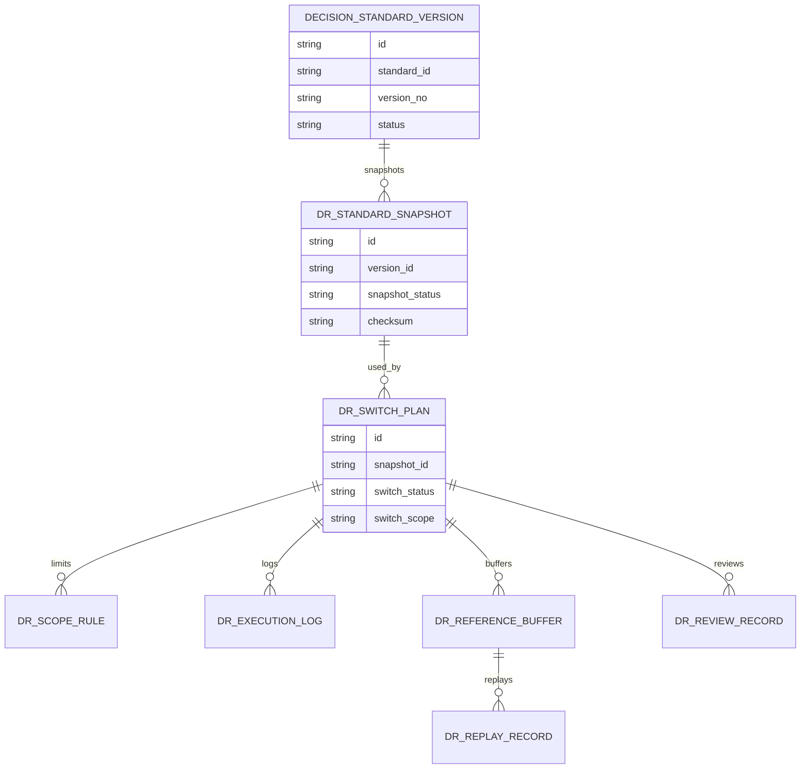
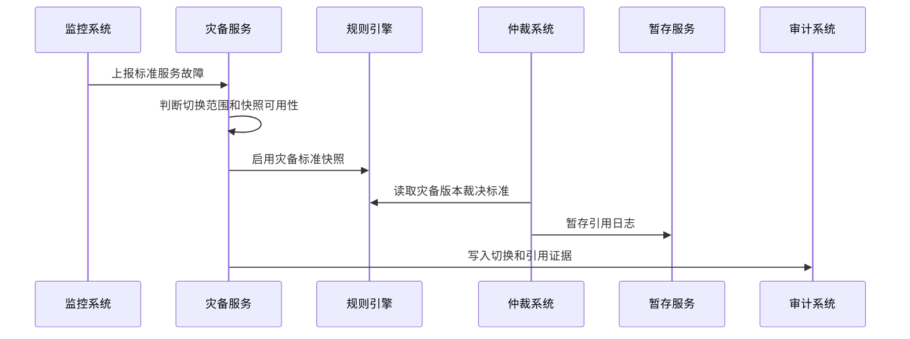
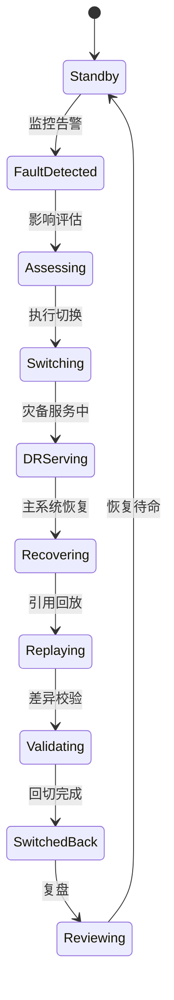
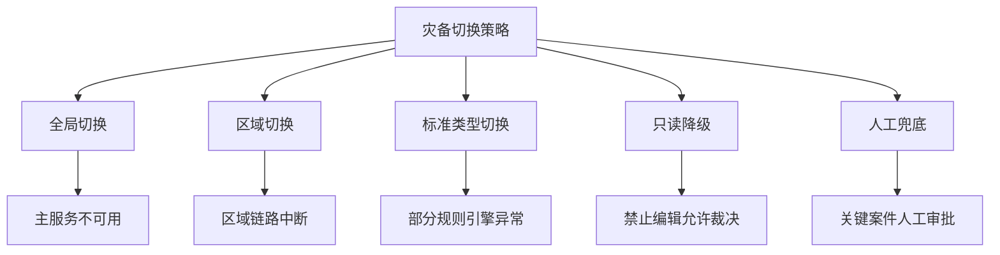
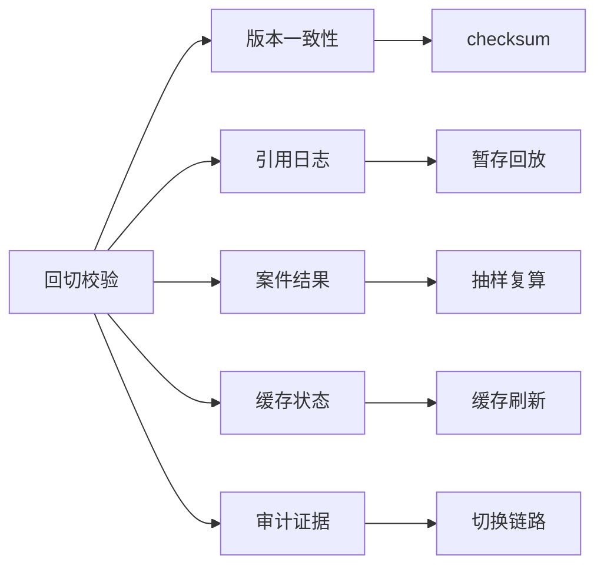

# 渠道策略标准灾备切换项目案例

## 适合谁看

- 想理解渠道裁决标准服务异常时如何切换灾备版本和备用规则的前端开发者。
- 正在做渠道仲裁、标准库、规则引擎、灾备、风控、合规审计或高可用后台的团队。
- 希望避免“标准服务不可用后，渠道案件无法裁决或错误使用过期标准”的项目负责人。

## 业务目标

渠道策略标准版本回滚和回滚演练解决标准错误发布的问题，但还需要处理系统不可用、区域链路中断、规则引擎异常、缓存损坏和主库故障等灾备场景。灾备切换要保证关键渠道争议在标准服务异常时仍能读取可信版本、明确降级范围、保留审计证据，并在主系统恢复后完成回切和差异校验。

灾备切换要解决：

- 标准服务哪些能力必须有灾备。
- 灾备版本、只读缓存和备用规则如何保持可信。
- 发生故障时如何判断切换范围和切换策略。
- 灾备期间新增案件和引用记录如何回补。
- 主系统恢复后如何回切、校验差异和复盘故障。

## 灾备切换链路

灾备切换不是简单切到另一台机器，而是要保证标准版本、裁决引用和审计链路都可控。

## 核心概念

| 概念 | 说明 |
| --- | --- |
| 灾备版本 | 在灾备环境中可用的可信标准版本快照。 |
| 切换策略 | 按区域、渠道、标准类型或全局范围启用灾备。 |
| 只读裁决 | 灾备期间只允许读取标准和引用，禁止修改标准。 |
| 引用暂存 | 灾备期间产生的案件引用日志先写入暂存区，恢复后回补。 |
| 回切校验 | 主系统恢复后对标准版本、引用日志和案件结果做一致性检查。 |
| 灾备复盘 | 故障原因、切换耗时、影响案件和改进任务的总结。 |

## 数据模型

灾备标准快照要有校验值，避免灾备环境拿到不完整或被污染的版本。

## 推荐表结构

| 表 | 作用 | 关键字段 |
| --- | --- | --- |
| `dr_standard_snapshot` | 保存灾备快照 | `version_id`、`snapshot_status`、`checksum`、`created_at` |
| `dr_switch_plan` | 保存切换计划 | `snapshot_id`、`switch_scope`、`switch_status`、`owner_id` |
| `dr_scope_rule` | 保存切换范围 | `plan_id`、`scope_type`、`scope_value`、`exclude_flag` |
| `dr_execution_log` | 保存切换日志 | `plan_id`、`step_code`、`result`、`error_message` |
| `dr_reference_buffer` | 保存引用暂存 | `plan_id`、`case_id`、`version_id`、`buffer_status` |
| `dr_replay_record` | 保存回放记录 | `buffer_id`、`replay_result`、`replayed_at`、`diff_summary` |
| `dr_review_record` | 保存灾备复盘 | `plan_id`、`fault_type`、`impact_summary`、`improvement_action` |

## 切换执行流程

灾备期间的写操作要严格受控，优先保证裁决可读和引用可追溯。

## 灾备状态设计

回切前必须完成引用回放和差异校验，不能只看主服务恢复。

## 切换策略拆解

不同故障要匹配不同切换策略，避免小范围故障扩大成全局降级。

## 回切校验矩阵

回切校验要有可视化结果，不能只在日志里判断。

## 前端页面拆分

| 页面 | 核心内容 | 设计重点 |
| --- | --- | --- |
| 灾备总览 | 快照状态、待命状态、最近切换、风险告警 | 让运维和业务知道是否可切。 |
| 切换计划 | 故障范围、切换策略、灾备快照、审批记录 | 支持紧急切换。 |
| 灾备服务详情 | 当前版本、命中案件、引用暂存、只读状态 | 展示灾备期间运行情况。 |
| 回切校验 | 引用回放、差异检查、缓存刷新、抽样复算 | 决定是否可以回主。 |
| 灾备复盘 | 故障原因、影响案件、切换耗时、改进任务 | 形成灾备能力改进。 |

## 接口拆分建议

| 接口 | 作用 |
| --- | --- |
| `GET /api/channel-standard-dr/snapshots` | 查询灾备标准快照。 |
| `POST /api/channel-standard-dr/switch-plans` | 创建灾备切换计划。 |
| `GET /api/channel-standard-dr/switch-plans/:id` | 查询切换详情。 |
| `POST /api/channel-standard-dr/switch-plans/:id/switch` | 执行切换。 |
| `POST /api/channel-standard-dr/switch-plans/:id/replay` | 回放引用暂存。 |
| `POST /api/channel-standard-dr/switch-plans/:id/validate` | 执行回切校验。 |
| `POST /api/channel-standard-dr/switch-plans/:id/switch-back` | 回切主系统。 |
| `POST /api/channel-standard-dr/switch-plans/:id/review` | 提交灾备复盘。 |

## 实际项目常见问题

### 1. 灾备版本不是最新可信版本

切换后使用了过期标准。解决方式是灾备快照定期生成并校验 checksum。

### 2. 灾备期间引用日志丢失

后续无法审计案件用了哪个版本。解决方式是引用暂存和回放作为核心链路。

### 3. 全局切换过度

单区域故障导致全量降级。解决方式是支持区域、标准类型和渠道范围切换。

### 4. 回切没有差异校验

主系统恢复后直接回切，遗漏灾备期间案件。解决方式是必须完成暂存回放和抽样复算。

### 5. 业务不知道处于灾备

裁决人员无法解释系统限制。解决方式是在裁决页面展示灾备状态和标准版本说明。

## 权限与审计

| 权限 | 说明 |
| --- | --- |
| 查看灾备状态 | 可以查看快照和切换状态。 |
| 发起切换 | 可以创建灾备切换计划。 |
| 执行切换 | 可以启用灾备版本。 |
| 执行回切 | 可以回放日志并切回主系统。 |
| 提交复盘 | 可以维护故障原因和改进动作。 |

快照生成、切换审批、切换执行、引用暂存、回放校验、回切和复盘都要写审计。

## 验收清单

- 能生成和校验灾备标准快照。
- 能配置切换范围和切换策略。
- 能在故障时启用灾备标准版本。
- 能以只读方式支撑关键裁决。
- 能暂存并回放灾备期间引用日志。
- 能完成回切校验和抽样复算。
- 能沉淀灾备复盘和改进任务。

## 下一步学习

- [渠道策略标准回滚演练项目案例](/projects/channel-strategy-standard-rollback-drill-case)
- [渠道策略标准版本回滚项目案例](/projects/channel-strategy-standard-version-rollback-case)
- [跨区域灾备项目案例](/projects/disaster-recovery-case)
