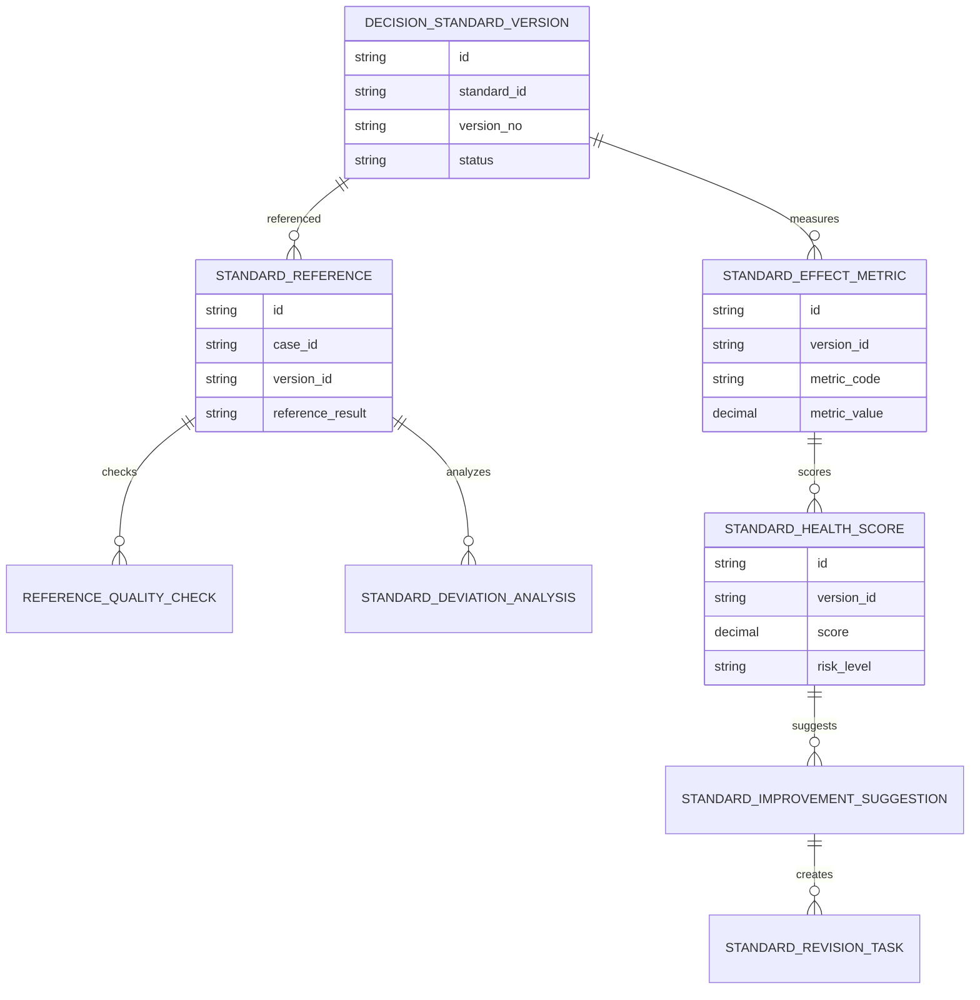
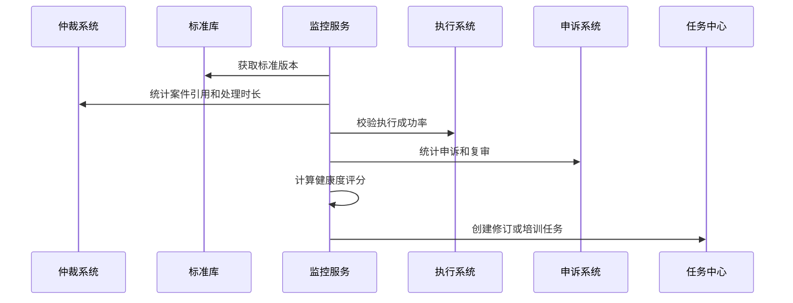
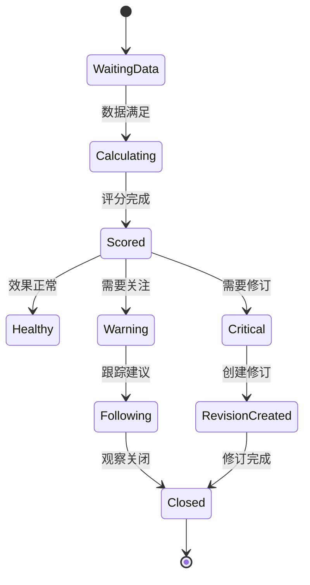
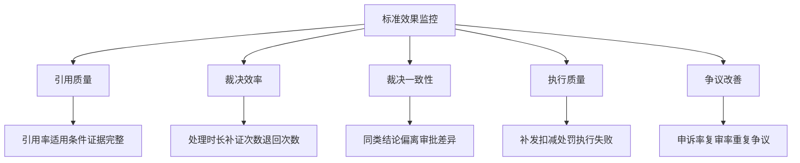

# 渠道策略标准效果监控项目案例

## 适合谁看

- 想理解裁决标准发布后如何监控引用效果、偏离情况和争议改善的前端开发者。
- 正在做渠道仲裁、策略治理、合规审计、规则引擎、经营分析或风控看板的团队。
- 希望避免“标准库建好了，但没人知道它有没有减少争议、有没有被正确使用”的项目负责人。

## 业务目标

渠道策略裁决标准库解决了裁决依据沉淀问题，但标准发布后还要持续观察效果。如果标准引用率低、偏离率高、申诉率不降或执行失败率上升，说明标准可能不清晰、不适用或需要修订。

标准效果监控要解决：

- 标准被哪些案件引用，引用是否正确。
- 同类案件是否因为标准发布而处理更快、更一致。
- 偏离标准的原因是标准缺陷还是特殊案件。
- 标准是否减少渠道申诉、重复争议和执行失败。
- 哪些标准需要修订、废弃或补充培训。

## 效果监控链路

标准效果监控不是简单统计引用次数，而是判断标准是否真正提升裁决一致性和执行质量。

## 核心概念

| 概念 | 说明 |
| --- | --- |
| 引用率 | 同类案件中引用该标准的比例。 |
| 正确引用 | 案件满足标准适用条件，并完整检查证据门槛后引用标准。 |
| 偏离率 | 案件引用标准后没有按标准结论执行，或需要特殊审批的比例。 |
| 处理效率 | 标准发布前后案件处理时长、补证次数和退回次数的变化。 |
| 争议改善 | 渠道申诉率、重复争议率、执行失败率和复审率的变化。 |
| 标准健康度 | 综合引用、偏离、效率、争议和执行效果形成的评分。 |

## 数据模型

效果指标要绑定标准版本。不同版本的效果不能混在一起，否则无法判断哪次修订带来了改善。

## 推荐表结构

| 表 | 作用 | 关键字段 |
| --- | --- | --- |
| `standard_reference` | 保存标准引用记录 | `case_id`、`version_id`、`reference_result`、`deviation_flag` |
| `reference_quality_check` | 保存引用质量检查 | `reference_id`、`check_type`、`result`、`reason` |
| `standard_deviation_analysis` | 保存偏离分析 | `reference_id`、`deviation_type`、`approved`、`summary` |
| `standard_effect_metric` | 保存效果指标 | `version_id`、`metric_code`、`period`、`metric_value` |
| `standard_health_score` | 保存健康度评分 | `version_id`、`score`、`risk_level`、`score_reason` |
| `standard_improvement_suggestion` | 保存优化建议 | `score_id`、`suggestion_type`、`priority`、`owner_id` |
| `standard_revision_task` | 保存修订任务 | `suggestion_id`、`task_status`、`due_at`、`result` |

## 效果计算流程

标准效果需要跨系统采集：仲裁引用、财务执行、渠道申诉和标准修订都要进入同一张分析视图。

## 监控状态设计

样本量不足时不要急着评分，否则标准刚发布就可能被误判为无效。

## 效果指标拆解

前端看板要让用户能从标准健康度下钻到具体案件，而不是只看一个分数。

## 前端页面拆分

| 页面 | 核心内容 | 设计重点 |
| --- | --- | --- |
| 标准效果看板 | 健康度、引用率、偏离率、申诉率、执行失败率 | 优先显示低健康度标准。 |
| 标准版本详情 | 发布前后对比、样本量、指标趋势、风险原因 | 评估单个版本是否有效。 |
| 引用质量 | 案件适用条件、证据完整度、引用结果 | 发现标准是否被误用。 |
| 偏离分析 | 偏离案件、偏离原因、审批人、特殊场景 | 区分标准缺陷和合理例外。 |
| 改进任务 | 标准修订、裁决培训、证据模板调整 | 把监控结果转成行动。 |

## 接口拆分建议

| 接口 | 作用 |
| --- | --- |
| `GET /api/channel-standard-effect-dashboard` | 查询标准效果看板。 |
| `GET /api/channel-decision-standard-versions/:id/effect` | 查询标准版本效果。 |
| `GET /api/channel-decision-standard-versions/:id/reference-quality` | 查询引用质量。 |
| `GET /api/channel-decision-standard-versions/:id/deviations` | 查询偏离分析。 |
| `POST /api/channel-decision-standard-versions/:id/calculate-effect` | 计算效果指标。 |
| `POST /api/channel-standard-improvement-suggestions/:id/tasks` | 创建改进任务。 |
| `POST /api/channel-standard-health-scores/:id/close` | 关闭效果观察。 |

## 实际项目常见问题

### 1. 只看引用次数

引用次数高不代表标准有效，可能是标准被滥用。解决方式是同时检查适用条件和证据完整度。

### 2. 偏离率高但没人分析

裁决人经常偏离标准，可能说明标准不适用。解决方式是偏离必须分类并进入修订建议。

### 3. 标准发布后没有前后对比

无法证明争议是否减少。解决方式是保存发布前后的处理时长、申诉率和执行失败率。

### 4. 样本量太少就评分

刚发布的标准被错误判定为无效。解决方式是配置最小样本量和观察周期。

### 5. 改进建议没有落地

看板发现风险，但没有任务。解决方式是低健康度标准自动生成修订或培训任务。

## 权限与审计

| 权限 | 说明 |
| --- | --- |
| 查看效果 | 可以查看标准健康度和指标趋势。 |
| 查看案件明细 | 可以下钻引用案件和偏离原因。 |
| 计算效果 | 可以触发标准效果计算。 |
| 创建改进任务 | 可以发起标准修订、培训或证据模板优化。 |
| 关闭观察 | 可以确认风险已处理并关闭监控。 |

效果计算口径、健康度评分、偏离分析和改进任务都要保留审计记录。

## 验收清单

- 能按标准版本统计引用率、偏离率和申诉率。
- 能检查案件是否正确引用标准。
- 能比较标准发布前后的处理效率和争议改善。
- 能计算标准健康度并解释分数来源。
- 能从异常指标下钻到具体案件。
- 能对低健康度标准生成修订或培训任务。
- 能保留效果计算和改进处理审计。

## 下一步学习

- [渠道策略裁决标准库项目案例](/projects/channel-strategy-decision-standard-library-case)
- [渠道策略仲裁复盘项目案例](/projects/channel-strategy-arbitration-review-case)
- [智能报表与 BI 分析项目案例](/projects/smart-bi-dashboard-case)
