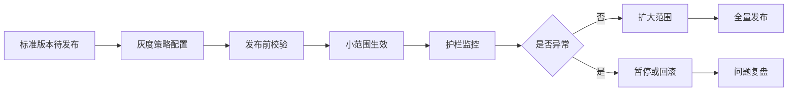
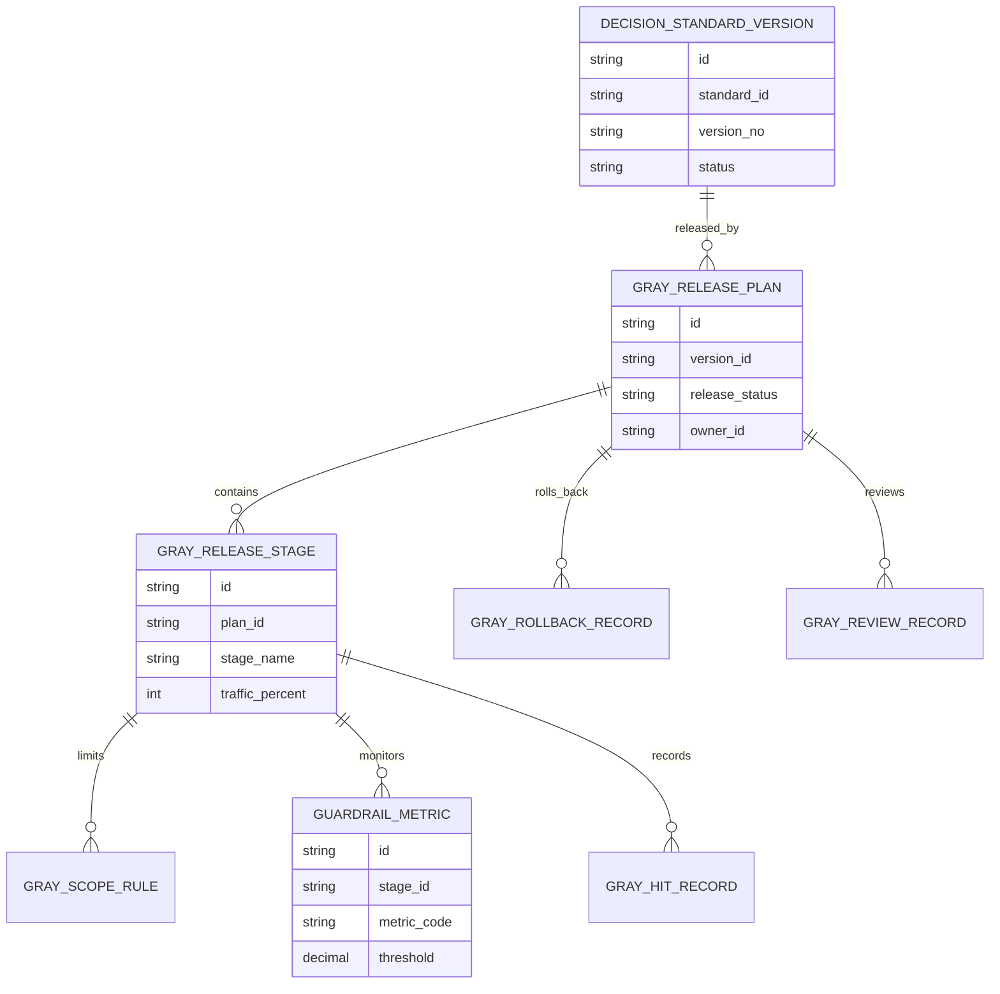
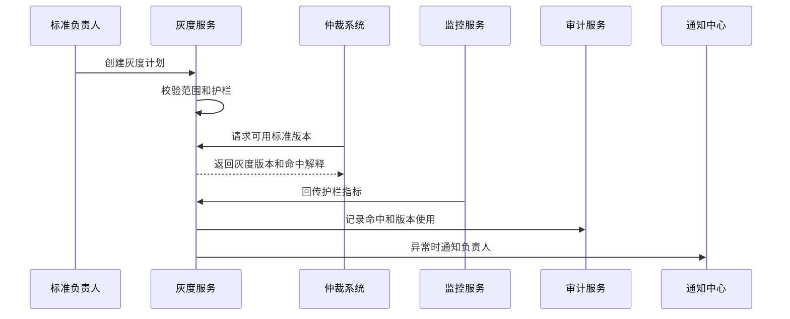
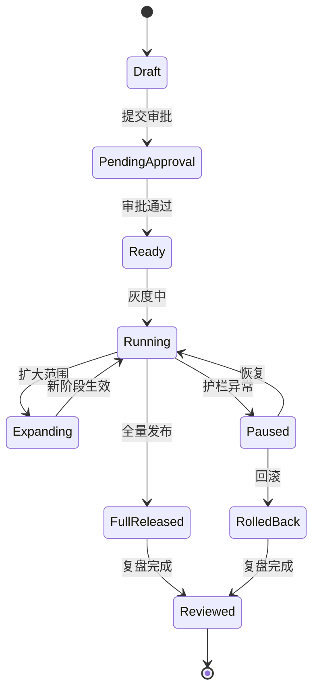
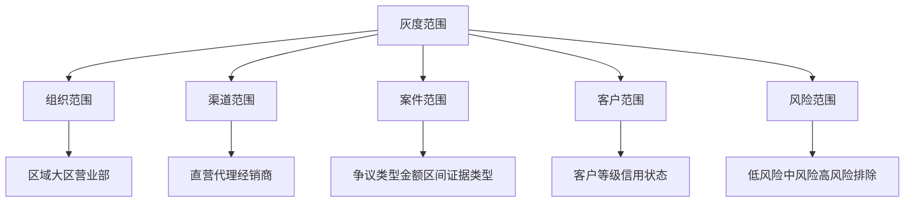
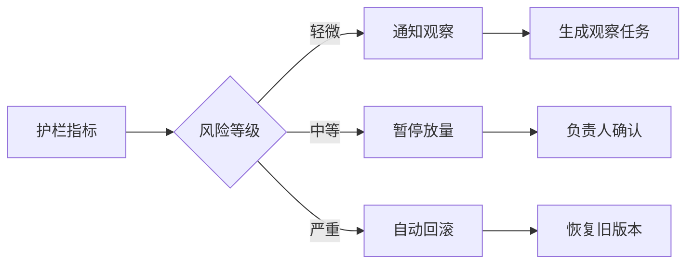

# 渠道策略标准灰度发布项目案例

## 适合谁看

- 想理解渠道裁决标准如何从小范围试运行再逐步放量的前端开发者。
- 正在做渠道仲裁、规则引擎、灰度发布、策略治理、申诉处理或合规审计系统的团队。
- 希望避免“标准一发布就全量生效，出现误伤后只能人工补救”的项目负责人。

## 业务目标

渠道策略裁决标准库把复杂争议沉淀成可复用标准，但标准发布并不代表可以立刻全量生效。新标准可能存在适用条件不清、证据门槛过高、区域差异、渠道执行能力不足或系统集成问题。灰度发布的目标是在可控范围内验证标准效果，及时发现偏差，并在护栏指标异常时回滚。

标准灰度发布要解决：

- 哪些标准适合灰度，哪些必须先审批或试运行。
- 灰度范围如何按区域、渠道、争议类型、客户等级和案件风险圈定。
- 灰度期间如何监控引用率、偏离率、申诉率和执行失败率。
- 护栏指标异常时如何暂停、缩小范围或回滚到旧版本。
- 灰度结束后如何判断是否扩大范围、继续观察或废弃版本。

## 灰度发布链路

灰度发布的关键是“范围、护栏、回滚”三件事同时存在。只有范围没有护栏，会变成慢速全量；只有护栏没有回滚，会变成告警展示。

## 核心概念

| 概念 | 说明 |
| --- | --- |
| 灰度范围 | 标准版本临时生效的对象集合，例如区域、渠道、业务线、案件类型或风险等级。 |
| 放量阶段 | 从 5%、20%、50% 到全量的阶段配置。 |
| 护栏指标 | 用于判断灰度是否安全的指标，例如申诉率、执行失败率、偏离率和处理时长。 |
| 命中解释 | 案件为什么命中灰度版本，方便裁决人员和审计人员理解。 |
| 回滚策略 | 灰度异常时恢复旧版本、暂停引用或缩小范围的处理方式。 |
| 灰度复盘 | 灰度结束后总结效果、问题和后续处理。 |

## 数据模型

灰度计划、阶段和范围规则要分开。一个标准版本可能先在华东小渠道灰度，再扩大到全国低风险争议。

## 推荐表结构

| 表 | 作用 | 关键字段 |
| --- | --- | --- |
| `gray_release_plan` | 保存灰度计划 | `version_id`、`release_status`、`owner_id`、`rollback_version_id` |
| `gray_release_stage` | 保存放量阶段 | `plan_id`、`stage_name`、`traffic_percent`、`start_at`、`end_at` |
| `gray_scope_rule` | 保存范围规则 | `stage_id`、`scope_type`、`scope_value`、`exclude_flag` |
| `guardrail_metric` | 保存护栏配置 | `stage_id`、`metric_code`、`operator`、`threshold`、`action` |
| `gray_hit_record` | 保存命中记录 | `stage_id`、`case_id`、`hit_reason`、`standard_result` |
| `gray_monitor_snapshot` | 保存监控快照 | `stage_id`、`metric_code`、`metric_value`、`risk_level` |
| `gray_rollback_record` | 保存回滚记录 | `plan_id`、`rollback_reason`、`operator_id`、`created_at` |
| `gray_review_record` | 保存复盘记录 | `plan_id`、`review_result`、`summary`、`next_action` |

## 灰度执行流程

仲裁系统每次获取标准版本时都要能拿到命中解释，否则业务人员很难判断为什么同类案件使用了不同版本。

## 灰度状态设计

暂停和回滚不要混在一起。暂停适合短时观察，回滚适合确认版本本身有问题。

## 灰度范围拆解

范围配置要支持“包含”和“排除”。例如华东区域灰度，但排除高价值客户和历史申诉率高的渠道。

## 护栏动作矩阵

护栏动作必须提前配置，不能等异常发生后临时讨论。

## 前端页面拆分

| 页面 | 核心内容 | 设计重点 |
| --- | --- | --- |
| 灰度计划列表 | 标准版本、当前阶段、范围、状态、风险等级 | 优先显示护栏异常和待审批计划。 |
| 灰度配置 | 放量阶段、范围规则、护栏指标、回滚版本 | 配置时要能预览影响范围。 |
| 灰度监控 | 命中量、引用率、偏离率、申诉率、执行失败率 | 支持按阶段和范围下钻。 |
| 命中明细 | 案件、命中原因、标准结果、裁决结果 | 用于解释同类案件差异。 |
| 灰度复盘 | 效果总结、异常原因、下一步动作 | 决定扩大、回滚、继续观察或废弃。 |

## 接口拆分建议

| 接口 | 作用 |
| --- | --- |
| `GET /api/channel-standard-gray-release-plans` | 查询灰度计划。 |
| `POST /api/channel-standard-gray-release-plans` | 创建灰度计划。 |
| `GET /api/channel-standard-gray-release-plans/:id` | 查询灰度详情。 |
| `POST /api/channel-standard-gray-release-plans/:id/submit` | 提交灰度审批。 |
| `POST /api/channel-standard-gray-release-plans/:id/start` | 启动灰度。 |
| `POST /api/channel-standard-gray-release-plans/:id/expand` | 扩大灰度范围。 |
| `POST /api/channel-standard-gray-release-plans/:id/pause` | 暂停灰度。 |
| `POST /api/channel-standard-gray-release-plans/:id/rollback` | 回滚标准版本。 |
| `GET /api/channel-standard-gray-release-plans/:id/hit-records` | 查询灰度命中明细。 |

## 实际项目常见问题

### 1. 灰度范围配置过粗

只按区域灰度，结果高风险客户也被新标准影响。解决方式是范围规则要同时支持区域、渠道、案件、客户和风险过滤。

### 2. 灰度没有回滚版本

异常后无法快速恢复。解决方式是创建灰度计划时必须指定回滚版本和回滚动作。

### 3. 护栏指标只展示不处理

看板红了，但标准仍继续放量。解决方式是护栏指标要绑定通知、暂停、回滚或审批动作。

### 4. 裁决人员不知道自己命中了灰度

同类案件结果不同，业务误以为系统不一致。解决方式是裁决详情里展示标准版本和命中解释。

### 5. 灰度结束没有复盘

标准全量后问题继续扩大。解决方式是全量发布前必须完成灰度效果复盘和负责人确认。

## 权限与审计

| 权限 | 说明 |
| --- | --- |
| 创建灰度计划 | 可以为标准版本配置灰度范围和护栏。 |
| 审批灰度 | 可以批准标准进入灰度。 |
| 启动和扩大灰度 | 可以让阶段生效或扩大范围。 |
| 暂停和回滚 | 可以在异常时停止灰度或恢复旧版本。 |
| 查看命中明细 | 可以查看案件命中灰度的原因。 |

灰度范围、护栏阈值、审批记录、命中结果、暂停回滚和复盘结论都要保留审计。

## 验收清单

- 能为标准版本创建灰度计划。
- 能配置阶段、范围、护栏和回滚版本。
- 能在仲裁系统中按范围返回灰度标准。
- 能记录案件命中原因和标准版本。
- 能监控引用率、偏离率、申诉率和执行失败率。
- 能在护栏异常时暂停或回滚。
- 能完成灰度复盘并决定全量、继续观察或废弃。

## 下一步学习

- [渠道策略标准效果监控项目案例](/projects/channel-strategy-standard-effect-monitoring-case)
- [渠道策略裁决标准库项目案例](/projects/channel-strategy-decision-standard-library-case)
- [灰度发布后台项目案例](/projects/gray-release-admin-case)
