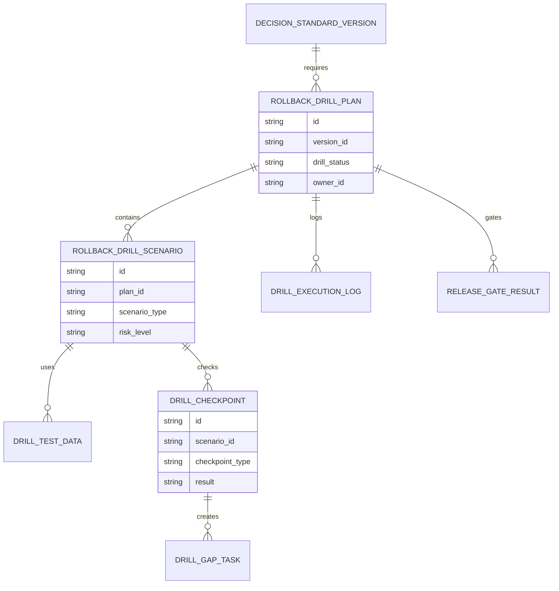
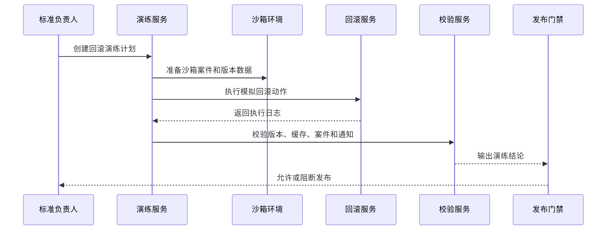
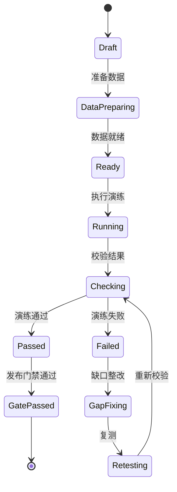
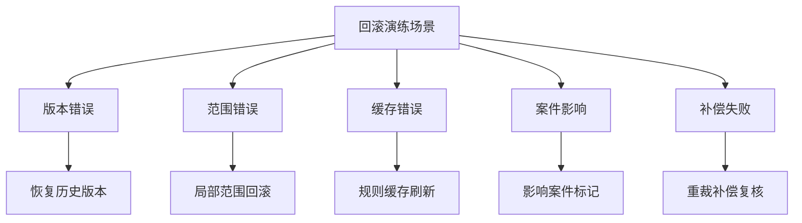
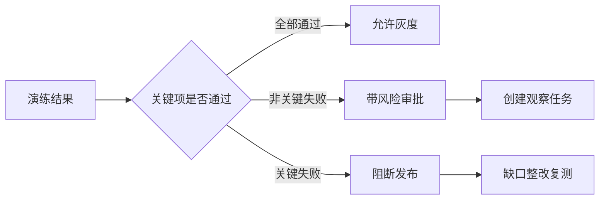

# 渠道策略标准回滚演练项目案例

## 适合谁看

- 想理解渠道裁决标准回滚能力如何提前演练和验证的前端开发者。
- 正在做渠道仲裁、标准库、灰度发布、版本回滚、风控演练或合规审计系统的团队。
- 希望避免“回滚方案写在文档里，但真正出事故时没人知道能不能恢复”的项目负责人。

## 业务目标

渠道策略标准版本回滚解决的是异常发生后的恢复问题，但高风险标准上线前还需要演练。回滚演练要模拟标准误发布、范围扩大、缓存未刷新、案件误判和执行补偿等场景，验证回滚流程、权限、数据、通知和补偿动作是否真的可用。

回滚演练要解决：

- 哪些标准版本上线前必须演练。
- 演练场景如何覆盖版本切换、影响评估、缓存刷新和案件补偿。
- 演练是否会影响真实案件和真实结算。
- 演练结果如何形成门禁，阻断未通过版本发布。
- 演练缺口如何转成整改任务和复测计划。

## 回滚演练链路

演练的核心不是“跑一遍流程”，而是证明关键故障场景下系统能恢复、能解释、能留痕。

## 核心概念

| 概念 | 说明 |
| --- | --- |
| 演练计划 | 针对某个标准版本或业务场景设计的回滚验证计划。 |
| 演练场景 | 模拟的异常类型，例如错误适用范围、错误证据门槛、缓存未刷新和补偿失败。 |
| 沙箱数据 | 不影响生产案件和真实结算的演练数据。 |
| 验证点 | 判断演练是否通过的检查项，例如版本恢复、案件标记、通知和审计。 |
| 演练缺口 | 演练失败或不达标的能力缺失。 |
| 发布门禁 | 演练不通过时限制标准进入灰度或全量发布。 |

## 数据模型

演练计划要和标准版本绑定，演练结论才能成为发布门禁的一部分。

## 推荐表结构

| 表 | 作用 | 关键字段 |
| --- | --- | --- |
| `rollback_drill_plan` | 保存演练计划 | `version_id`、`drill_status`、`owner_id`、`planned_at` |
| `rollback_drill_scenario` | 保存演练场景 | `plan_id`、`scenario_type`、`risk_level`、`expected_result` |
| `drill_test_data` | 保存沙箱数据 | `scenario_id`、`case_id`、`data_type`、`is_mock` |
| `drill_checkpoint` | 保存验证点 | `scenario_id`、`checkpoint_type`、`result`、`evidence` |
| `drill_execution_log` | 保存执行日志 | `plan_id`、`step_code`、`result`、`error_message` |
| `drill_gap_task` | 保存缺口整改 | `checkpoint_id`、`owner_id`、`due_at`、`task_status` |
| `release_gate_result` | 保存发布门禁 | `plan_id`、`gate_result`、`block_reason`、`approved_by` |

## 演练执行流程

演练必须和生产环境隔离，但校验逻辑要尽量复用真实回滚服务。

## 演练状态设计

演练失败不是结束，而是进入缺口整改和复测。

## 演练场景拆解

至少要覆盖一个技术故障、一个业务影响和一个补偿失败场景。

## 发布门禁矩阵

门禁要区分关键失败和非关键失败，避免所有问题都阻断，也避免关键风险被放过。

## 前端页面拆分

| 页面 | 核心内容 | 设计重点 |
| --- | --- | --- |
| 演练计划列表 | 标准版本、风险等级、演练状态、门禁结论 | 优先显示待发布但未演练版本。 |
| 演练配置 | 场景、沙箱数据、验证点、预期结果 | 配置时要能看到覆盖度。 |
| 演练执行详情 | 步骤日志、回滚动作、校验结果、失败原因 | 支持复测前快速定位缺口。 |
| 缺口整改 | 失败验证点、负责人、整改计划、复测记录 | 让演练失败形成闭环。 |
| 发布门禁 | 演练结论、风险审批、阻断原因、发布建议 | 直接服务标准发布流程。 |

## 接口拆分建议

| 接口 | 作用 |
| --- | --- |
| `GET /api/channel-standard-rollback-drills` | 查询回滚演练计划。 |
| `POST /api/channel-standard-rollback-drills` | 创建演练计划。 |
| `GET /api/channel-standard-rollback-drills/:id` | 查询演练详情。 |
| `POST /api/channel-standard-rollback-drills/:id/prepare-data` | 准备演练数据。 |
| `POST /api/channel-standard-rollback-drills/:id/run` | 执行演练。 |
| `POST /api/channel-standard-rollback-drills/:id/check` | 执行验证点检查。 |
| `POST /api/channel-standard-rollback-drills/:id/gap-tasks` | 创建缺口整改任务。 |
| `POST /api/channel-standard-rollback-drills/:id/retest` | 发起复测。 |

## 实际项目常见问题

### 1. 演练影响真实案件

演练数据和生产数据没有隔离。解决方式是使用沙箱数据，并在服务层强制标记演练上下文。

### 2. 只演练版本切换

没有验证缓存、案件和通知。解决方式是演练场景必须包含完整验证点。

### 3. 演练失败没有门禁

失败后仍然发布。解决方式是演练结论接入标准发布流程。

### 4. 演练过于理想化

只覆盖成功路径。解决方式是必须模拟补偿失败、缓存异常和范围错误。

### 5. 复测没有记录

缺口修了但没有证明。解决方式是复测结果和证据必须绑定原失败验证点。

## 权限与审计

| 权限 | 说明 |
| --- | --- |
| 创建演练计划 | 可以为标准版本配置演练。 |
| 执行演练 | 可以触发沙箱回滚流程。 |
| 查看演练数据 | 可以查看沙箱案件和校验结果。 |
| 处理缺口 | 可以创建和关闭整改任务。 |
| 放行门禁 | 可以基于演练结论批准发布。 |

演练计划、沙箱数据、执行日志、验证结果、缺口整改、复测和门禁结论都要留痕。

## 验收清单

- 能为标准版本创建回滚演练计划。
- 能配置演练场景和验证点。
- 能准备隔离的沙箱数据。
- 能执行模拟回滚并记录日志。
- 能校验版本、缓存、案件和通知结果。
- 能把失败验证点转成整改任务。
- 能将演练结论接入发布门禁。

## 下一步学习

- [渠道策略标准版本回滚项目案例](/projects/channel-strategy-standard-version-rollback-case)
- [渠道策略标准灰度发布项目案例](/projects/channel-strategy-standard-gray-release-case)
- [渠道策略回滚治理项目案例](/projects/channel-strategy-rollback-governance-case)
