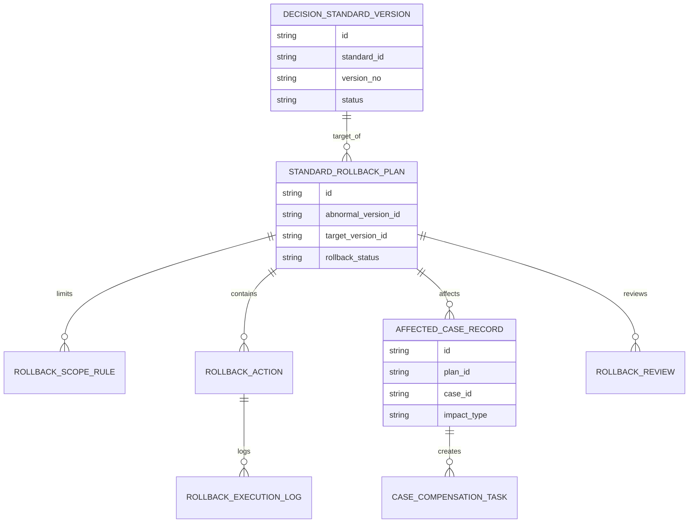
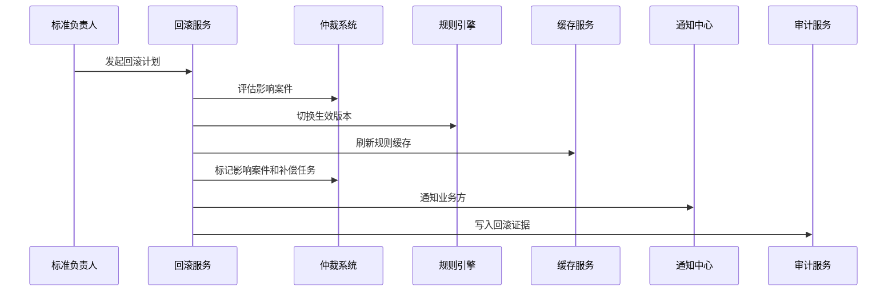
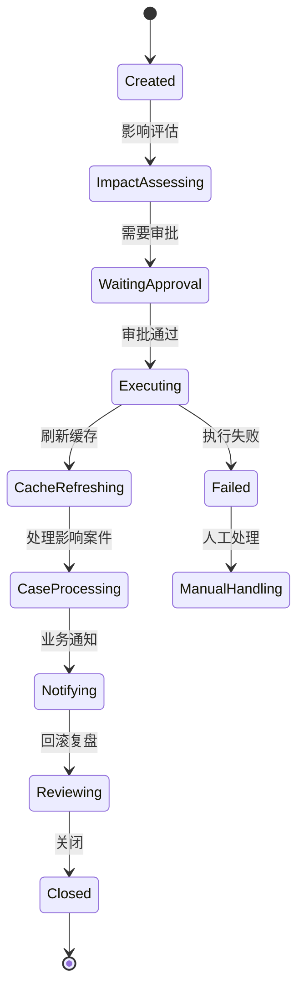
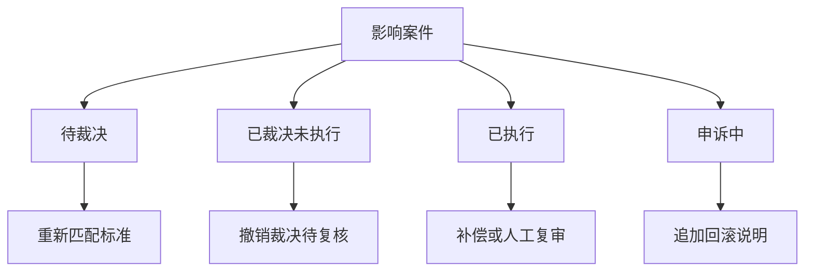
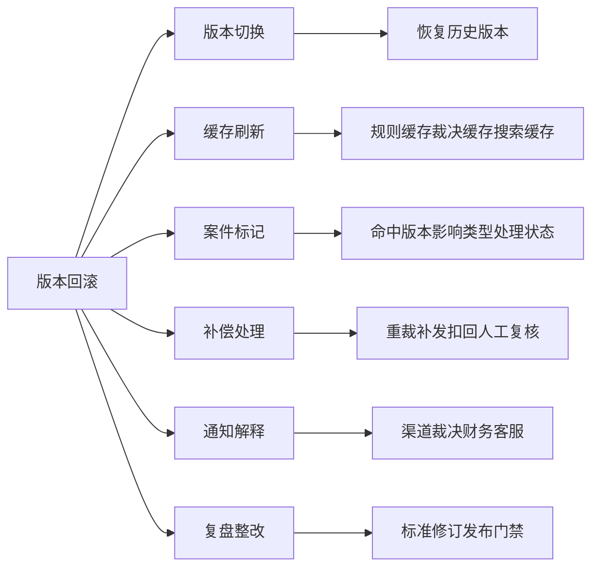

# 渠道策略标准版本回滚项目案例

## 适合谁看

- 想理解渠道裁决标准发布异常后如何快速恢复旧版本的前端开发者。
- 正在做渠道仲裁、标准库、策略发布、灰度发布、审计或规则引擎系统的团队。
- 希望避免“新标准出问题后只能人工改规则、补案件、发通知，恢复过程不可控”的项目负责人。

## 业务目标

渠道策略标准灰度发布可以降低新标准风险，但仍然会出现证据门槛配置错误、适用范围过宽、裁决结论误伤、执行系统不兼容等问题。版本回滚的目标是在确认标准版本异常后，把案件引用、规则缓存、执行结果、通知和审计证据恢复到可控状态。

版本回滚要解决：

- 哪些异常允许回滚，哪些需要先暂停观察。
- 回滚到哪个版本，回滚范围是全量还是局部。
- 已经引用新版本的案件如何处理和标记。
- 规则缓存、裁决结果、执行系统和通知如何同步恢复。
- 回滚后如何复盘标准缺陷并避免再次发布。

## 版本回滚链路

回滚不是简单把版本号改回去。真正复杂的是已经命中新版本的案件、执行结果和业务解释。

## 核心概念

| 概念 | 说明 |
| --- | --- |
| 回滚版本 | 被恢复为当前生效状态的历史标准版本。 |
| 回滚范围 | 按区域、渠道、争议类型、案件风险或时间窗口限制回滚影响。 |
| 影响案件 | 已经引用异常版本的案件，包括待裁决、已裁决、已执行和申诉中案件。 |
| 回滚动作 | 版本切换、缓存刷新、案件标记、执行补偿、通知和复盘任务。 |
| 补偿处理 | 对已经错误执行的案件进行重裁、补发、扣回或人工复核。 |
| 回滚证据 | 回滚原因、审批记录、影响范围、执行日志和复盘结论。 |

## 数据模型

回滚计划必须同时记录异常版本和目标版本，否则后续无法证明从哪里回到哪里。

## 推荐表结构

| 表 | 作用 | 关键字段 |
| --- | --- | --- |
| `standard_rollback_plan` | 保存回滚计划 | `abnormal_version_id`、`target_version_id`、`rollback_status`、`owner_id` |
| `rollback_scope_rule` | 保存回滚范围 | `plan_id`、`scope_type`、`scope_value`、`exclude_flag` |
| `rollback_action` | 保存回滚动作 | `plan_id`、`action_type`、`order_no`、`action_config` |
| `rollback_execution_log` | 保存执行日志 | `action_id`、`result`、`start_at`、`end_at`、`error_message` |
| `affected_case_record` | 保存影响案件 | `plan_id`、`case_id`、`impact_type`、`process_status` |
| `case_compensation_task` | 保存补偿任务 | `affected_case_id`、`task_type`、`owner_id`、`task_status` |
| `rollback_review` | 保存回滚复盘 | `plan_id`、`root_cause`、`prevention_action`、`closed_at` |

## 回滚执行流程

执行顺序很重要。先切版本和刷新缓存，再处理案件补偿，避免新案件继续命中异常版本。

## 回滚状态设计

回滚失败时不能静默结束。必须进入人工处理，并冻结异常版本继续发布。

## 影响案件分类

不同状态的案件处理方式不同。已经执行的案件通常不能自动撤销，需要补偿任务和人工确认。

## 回滚动作拆解

前端详情页要按动作链展示执行状态，不能只显示“回滚成功”。

## 前端页面拆分

| 页面 | 核心内容 | 设计重点 |
| --- | --- | --- |
| 回滚计划列表 | 异常版本、目标版本、影响案件数、状态、负责人 | 优先展示执行失败和高影响回滚。 |
| 回滚影响评估 | 范围、案件状态分布、执行影响、风险等级 | 发起回滚前让审批人看清影响。 |
| 回滚执行详情 | 动作链、执行日志、缓存刷新、案件处理 | 展示每一步是否真正完成。 |
| 影响案件处理 | 案件、命中版本、处理建议、补偿任务 | 支持批量生成复核任务。 |
| 回滚复盘 | 根因、预防动作、发布门禁、责任人 | 避免同类问题再次发布。 |

## 接口拆分建议

| 接口 | 作用 |
| --- | --- |
| `GET /api/channel-standard-rollback-plans` | 查询回滚计划列表。 |
| `POST /api/channel-standard-rollback-plans` | 创建回滚计划。 |
| `GET /api/channel-standard-rollback-plans/:id` | 查询回滚详情。 |
| `POST /api/channel-standard-rollback-plans/:id/assess-impact` | 评估影响案件。 |
| `POST /api/channel-standard-rollback-plans/:id/approve` | 审批回滚。 |
| `POST /api/channel-standard-rollback-plans/:id/execute` | 执行版本回滚。 |
| `POST /api/channel-standard-rollback-plans/:id/process-cases` | 处理影响案件。 |
| `POST /api/channel-standard-rollback-plans/:id/review` | 提交回滚复盘。 |

## 实际项目常见问题

### 1. 只切版本不处理案件

新案件恢复正常，但已命中异常版本的案件无人处理。解决方式是回滚计划必须生成影响案件清单。

### 2. 回滚范围过大

局部区域的问题被全量回滚，影响正常渠道。解决方式是支持区域、渠道、争议类型和时间窗口范围。

### 3. 缓存没有刷新

数据库版本改了，规则引擎仍使用旧缓存。解决方式是缓存刷新作为独立回滚动作并验证结果。

### 4. 回滚没有业务解释

渠道和客服不知道为什么案件结论变化。解决方式是生成通知说明和案件级回滚原因。

### 5. 回滚后不改发布门禁

同类配置错误再次上线。解决方式是复盘结论要进入发布校验和审批清单。

## 权限与审计

| 权限 | 说明 |
| --- | --- |
| 创建回滚计划 | 可以为异常标准版本发起回滚。 |
| 查看影响案件 | 可以查看命中异常版本的案件明细。 |
| 审批回滚 | 可以批准版本切换和补偿处理。 |
| 执行回滚 | 可以触发版本切换和缓存刷新。 |
| 处理补偿 | 可以创建重裁、补发或扣回任务。 |

回滚原因、影响评估、审批记录、执行日志、案件处理和复盘整改必须保留审计。

## 验收清单

- 能从异常标准版本创建回滚计划。
- 能评估回滚范围和影响案件。
- 能指定目标版本和回滚动作链。
- 能执行版本切换和缓存刷新。
- 能标记影响案件并生成补偿任务。
- 能通知相关业务角色。
- 能完成回滚复盘并更新发布门禁。

## 下一步学习

- [渠道策略标准灰度发布项目案例](/projects/channel-strategy-standard-gray-release-case)
- [渠道策略标准效果监控项目案例](/projects/channel-strategy-standard-effect-monitoring-case)
- [渠道策略回滚治理项目案例](/projects/channel-strategy-rollback-governance-case)
