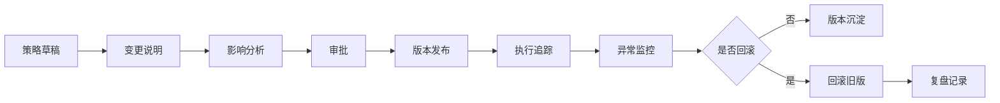
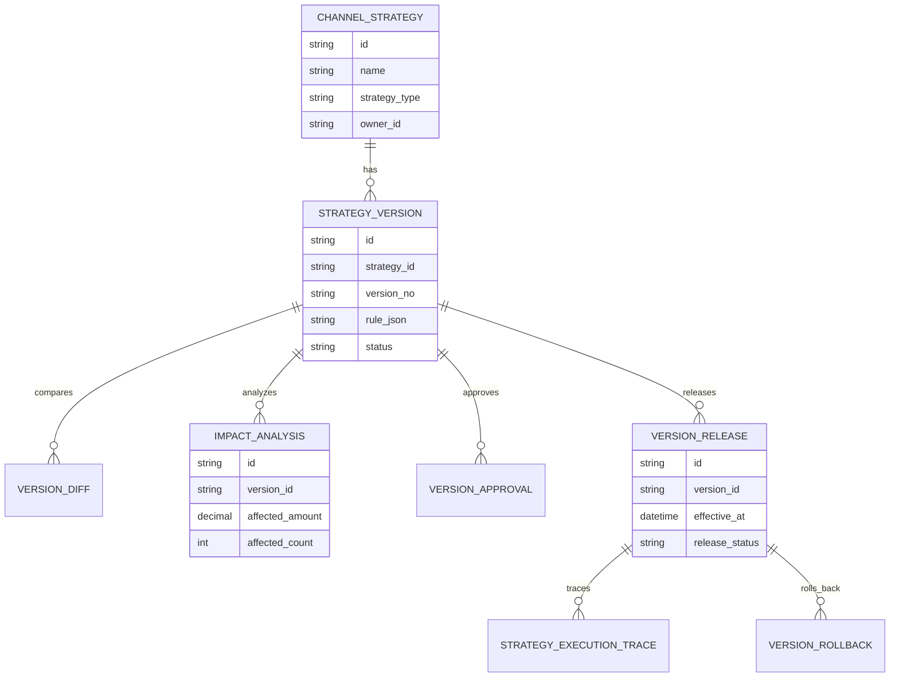
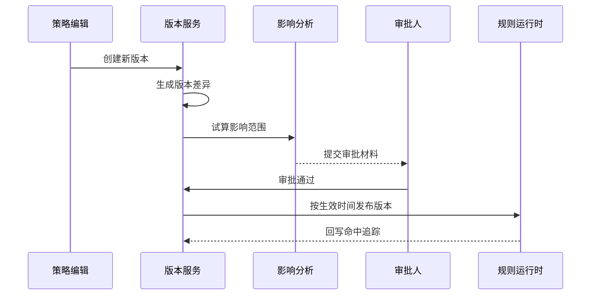
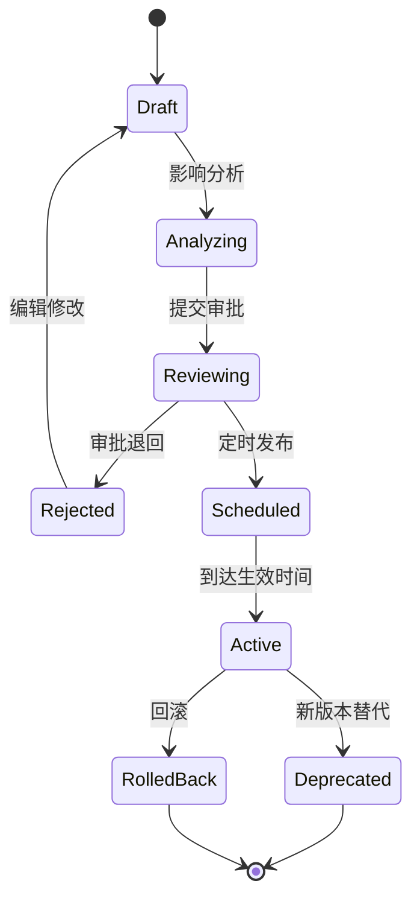
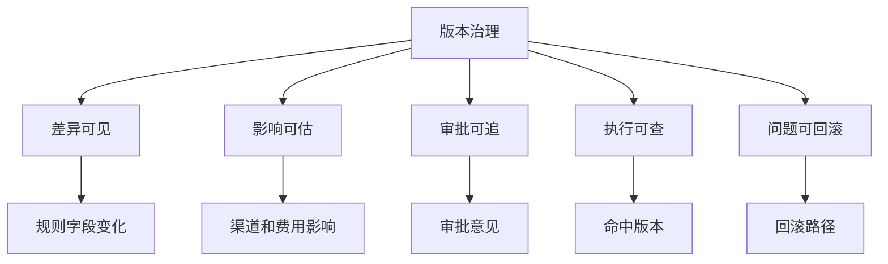

# 渠道策略版本治理项目案例

## 适合谁看

- 想理解渠道政策、费用规则、返利策略为什么需要版本治理的前端开发者。
- 正在做渠道运营、规则引擎、灰度发布、费用结算或策略配置系统的团队。
- 希望避免“策略改了但不知道谁改的、什么时候生效、影响哪些单据”的项目负责人。

## 业务目标

渠道策略版本治理的目标，是让每一次策略变更都有版本、原因、影响范围、审批记录、生效时间、回滚路径和执行追溯。

它解决的典型问题包括：

- 费用规则被覆盖，历史结算无法解释。
- 多人同时改策略，线上版本混乱。
- 新策略影响范围过大，无法快速回滚。
- 渠道投诉时，查不到当时适用哪版政策。
- 策略复盘时，不知道期间发生过哪些变更。

## 版本治理链路

可以把它理解成“业务规则的 Git”。每次改动都要知道差异、作者、原因、发布时间和影响。

## 核心概念

| 概念 | 说明 | 举例 |
| --- | --- | --- |
| 策略主档 | 策略的长期身份 | 华东渠道季度返利政策 |
| 策略版本 | 某次具体规则配置 | V1.3、V1.4 |
| 变更差异 | 新旧版本的差异 | 阶梯比例从 3% 调到 4% |
| 生效窗口 | 版本适用的时间范围 | 2026-07-01 到 2026-09-30 |
| 影响分析 | 上线前估算影响对象和金额 | 影响 120 家渠道、预计费用 +30 万 |
| 回滚版本 | 出问题时恢复的版本 | 从 V1.4 回滚到 V1.3 |

## 数据模型

## 推荐表结构

| 表 | 关键字段 | 作用 |
| --- | --- | --- |
| `channel_strategy` | `name`、`strategy_type`、`owner_id`、`status` | 策略主档 |
| `strategy_version` | `strategy_id`、`version_no`、`rule_json`、`change_reason`、`status` | 策略版本 |
| `version_diff` | `version_id`、`base_version_id`、`diff_json` | 新旧差异 |
| `impact_analysis` | `version_id`、`affected_count`、`affected_amount`、`risk_summary` | 影响分析 |
| `version_approval` | `version_id`、`approver_id`、`decision`、`comment` | 审批记录 |
| `version_release` | `version_id`、`effective_at`、`release_status`、`rollback_version_id` | 发布记录 |
| `strategy_execution_trace` | `release_id`、`business_id`、`hit_detail_json` | 执行追踪 |

## 版本发布流程

## 版本状态设计

## 治理维度拆解

版本治理的关键不是多做一张版本表，而是保证每一笔业务计算都能回答：当时命中了哪个策略版本，为什么。

## 前端页面拆分

| 页面 | 主要内容 | 设计重点 |
| --- | --- | --- |
| 策略版本列表 | 当前版本、草稿版本、历史版本、生效时间 | 明确哪个版本正在生效 |
| 版本编辑 | 规则配置、适用范围、变更原因 | 保存时自动生成差异 |
| 版本差异 | 新旧字段、规则变化、金额影响 | 让审批人看懂改了什么 |
| 影响分析 | 受影响渠道、单据、预计费用、风险提示 | 支持下钻到样本 |
| 执行追踪 | 业务单据、命中版本、计算结果 | 处理投诉和对账 |

## 接口拆分建议

| 接口 | 方法 | 说明 |
| --- | --- | --- |
| `/api/channel-strategies/:id/versions` | GET | 查询版本列表 |
| `/api/channel-strategies/:id/versions` | POST | 创建策略版本 |
| `/api/strategy-versions/:id/diff` | GET | 查询版本差异 |
| `/api/strategy-versions/:id/impact` | POST | 执行影响分析 |
| `/api/strategy-versions/:id/submit` | POST | 提交审批 |
| `/api/strategy-versions/:id/release` | POST | 发布版本 |
| `/api/strategy-versions/:id/rollback` | POST | 回滚版本 |

## 实际项目常见问题

### 1. 历史单据被新规则重新解释

业务单据必须保存命中的 `strategy_version_id` 和关键计算快照。不能在详情页实时用当前规则重新算历史金额。

否则渠道投诉时，系统展示的金额可能和当时结算不一致。

### 2. 版本号只是手填文本

版本号应由系统生成，至少保证同一策略下递增且唯一。人工可以填写变更摘要，但不应手工控制版本顺序。

### 3. 审批人看不懂规则 JSON

审批页要把差异翻译成业务语言，例如“一级渠道返利比例从 3% 调整为 4%”。

JSON 可以作为技术详情，但不能作为审批主界面。

### 4. 回滚影响不清楚

回滚前也要做影响分析：哪些未结算单据会恢复旧版，哪些已结算单据不会重算。

默认建议只影响未确认或新产生的单据。

### 5. 策略并发生效冲突

多个版本、多个策略可能覆盖同一渠道。需要定义优先级，例如指定渠道优先、灰度版本优先、生效时间最新优先。

冲突结果要在影响分析阶段提示。

## 权限与审计

| 动作 | 权限建议 | 审计内容 |
| --- | --- | --- |
| 创建版本 | 策略管理员 | 变更原因和规则内容 |
| 执行影响分析 | 策略管理员或分析师 | 样本范围和结果 |
| 审批版本 | 渠道主管、财务 | 审批意见 |
| 发布版本 | 授权发布人 | 生效时间和范围 |
| 回滚版本 | 应急角色 | 回滚原因和影响 |

## 验收清单

- 策略有主档和多个版本。
- 新版本能展示新旧差异。
- 发布前能做影响分析。
- 审批记录可追溯。
- 每笔业务计算能追踪命中版本。
- 版本支持定时发布和回滚。

## 下一步学习

完成这个案例后，可以继续学习：

- [渠道费用策略灰度项目案例](/projects/channel-expense-strategy-gray-release-case)
- [渠道策略对照实验项目案例](/projects/channel-strategy-ab-experiment-case)
- [规则引擎项目案例](/projects/rule-engine-case)

