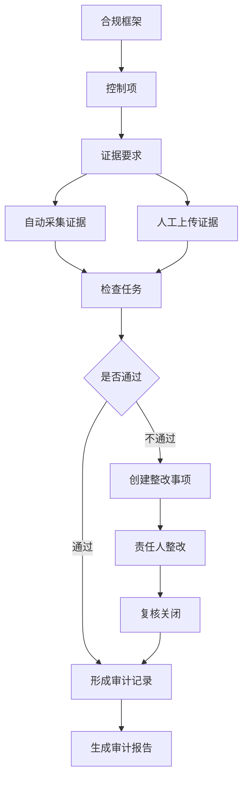
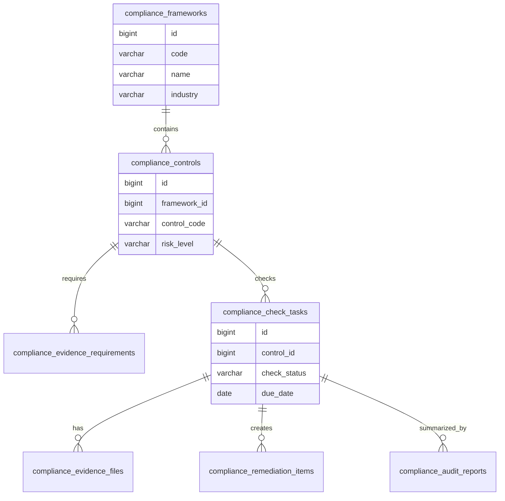
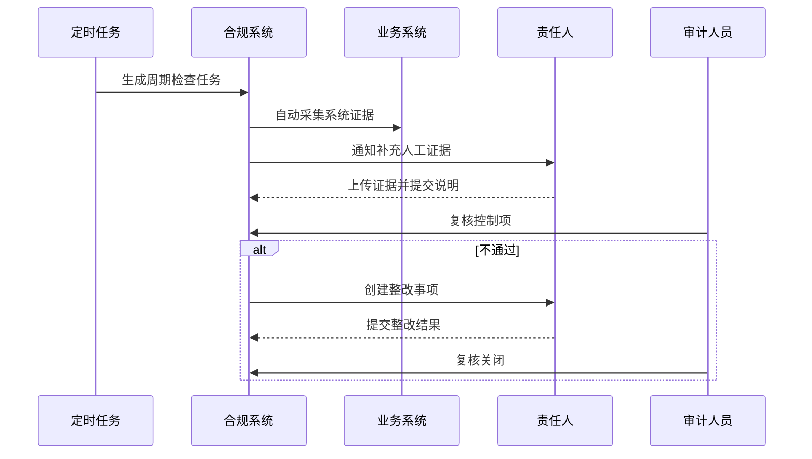

# 行业合规审计项目案例

## 适合谁看

适合需要做金融、医疗、教育、政企、跨境业务里的合规控制项、证据采集、整改跟踪、审计报告、权限审查和数据安全检查的开发者。

合规审计不是“导出一份操作日志”。真实项目里，合规要求会拆成控制项，每个控制项要对应系统证据、负责人、检查周期、风险等级和整改闭环。系统要证明自己满足要求，而不是在审计来临时临时翻日志。

## 业务目标

第一版合规审计支持：

- 维护合规框架和控制项。
- 绑定系统、数据、权限和流程证据。
- 定期生成检查任务。
- 记录检查结果。
- 创建整改事项。
- 跟踪整改闭环。
- 生成审计报告。
- 支持审计导出和留痕。

## 合规链路图

合规系统最重要的是证据链。每个控制项都要能回答：要求是什么、证据在哪里、谁负责、什么时候检查、问题是否关闭。

## 数据模型

## 推荐表结构

| 表 | 作用 | 关键字段 |
| --- | --- | --- |
| `compliance_frameworks` | 合规框架 | `code`、`name`、`industry`、`version` |
| `compliance_controls` | 合规控制项 | `framework_id`、`control_code`、`risk_level`、`owner_id` |
| `compliance_evidence_requirements` | 证据要求 | `control_id`、`evidence_type`、`collect_method` |
| `compliance_check_tasks` | 检查任务 | `control_id`、`period`、`check_status`、`due_date` |
| `compliance_evidence_files` | 证据文件 | `task_id`、`file_id`、`source_type`、`uploaded_by` |
| `compliance_remediation_items` | 整改事项 | `task_id`、`owner_id`、`severity`、`status` |
| `compliance_audit_reports` | 审计报告 | `framework_id`、`report_period`、`file_id`、`status` |
| `compliance_audit_logs` | 审计留痕 | `target_type`、`target_id`、`action`、`operator_id` |

证据文件建议只保存文件 ID、来源、采集时间和校验结果。实际文件由文件中心统一管理。

## 合规检查流程

自动采集和人工上传要分开记录。审计人员需要知道证据是系统自动生成的，还是责任人手动补充的。

## 常见控制项

| 控制项 | 检查内容 | 证据示例 |
| --- | --- | --- |
| 权限最小化 | 高权限账号是否过多 | 角色成员清单、审批记录 |
| 离职回收 | 离职人员权限是否及时关闭 | 员工状态、账号禁用记录 |
| 数据脱敏 | 敏感字段是否脱敏展示 | 字段分级、脱敏规则截图 |
| 操作审计 | 关键操作是否留痕 | 审计日志导出 |
| 备份恢复 | 是否定期备份并演练恢复 | 备份记录、演练报告 |
| 变更审批 | 生产变更是否经过审批 | 发布单、审批记录 |

控制项应该尽量绑定系统数据。只靠人工截图，很难长期维护。

## 前端页面拆分

| 页面 | 作用 | 注意点 |
| --- | --- | --- |
| 合规框架 | 维护法规、标准和版本 | 框架版本变更要保留历史 |
| 控制项库 | 管理检查要求 | 展示风险等级和负责人 |
| 检查任务 | 跟踪周期检查 | 支持逾期、通过、不通过状态 |
| 证据中心 | 查看自动和人工证据 | 标记来源和采集时间 |
| 整改闭环 | 处理不通过项 | 需要责任人、期限和复核 |
| 审计报告 | 生成报告和导出 | 报告生成后不可篡改 |
| 权限审查 | 定期复核高权限账号 | 支持批量确认和撤销 |

## 实际项目常见问题

### 问题 1：审计前临时补材料

说明平时没有周期检查任务。要把控制项拆成月度、季度或年度任务，并持续收集证据。

### 问题 2：整改事项关闭了，但问题没有真正解决

缺少复核环节。整改人提交后，应由审计人员或控制项负责人复核关闭。

### 问题 3：导出的审计报告和系统数据对不上

报告生成时要保存报告快照。后续数据变化不应该影响已经归档的报告。

## 验收清单

- 合规框架和控制项可配置。
- 控制项有风险等级、负责人和检查周期。
- 证据要求清楚。
- 支持自动采集和人工上传证据。
- 检查任务有状态、截止时间和逾期提醒。
- 不通过项能进入整改闭环。
- 整改完成后需要复核。
- 审计报告能生成、归档和导出。
- 报告归档后不可篡改。
- 合规关键操作有审计留痕。

## 下一步学习

继续学习 [审计中心项目案例](/projects/audit-center-case)、[数据治理平台项目案例](/projects/data-governance-case) 和 [跨区域灾备管理项目案例](/projects/disaster-recovery-case)。
