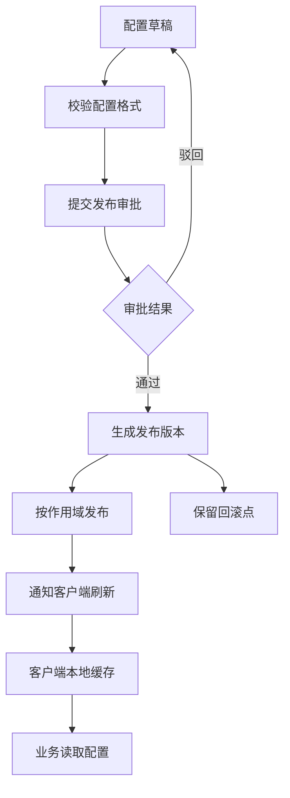
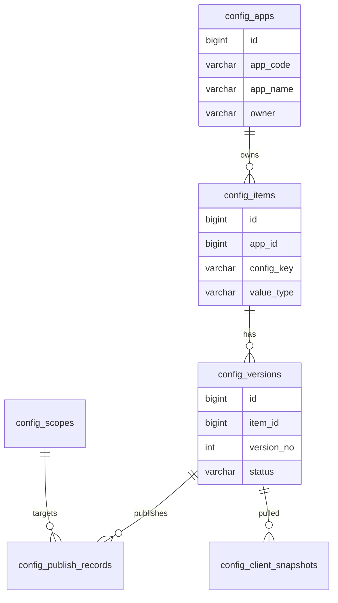
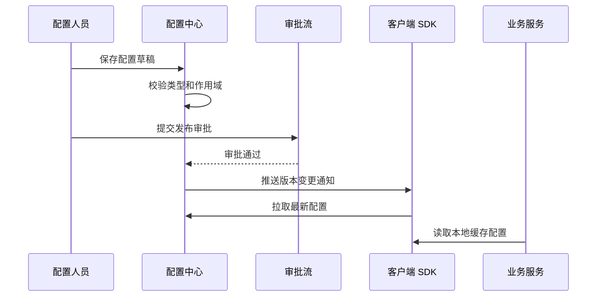

# 统一配置中心项目案例

## 适合谁看

适合需要做系统参数、业务开关、租户配置、灰度配置、动态刷新、配置审计和回滚能力的开发者。

统一配置中心不是“把配置放到数据库”。真实项目里，配置会影响多个应用、多个环境、多个租户和多个版本。配置一旦错发，可能导致功能不可用、价格错误、权限异常或服务雪崩。配置中心必须关注作用域、发布流程、缓存刷新、回滚和审计。

## 业务目标

第一版统一配置中心支持：

- 管理应用配置。
- 区分环境、应用和租户。
- 支持配置版本。
- 支持发布审批。
- 支持灰度发布。
- 支持客户端拉取和缓存。
- 支持配置回滚。
- 支持变更审计。

## 配置链路图

配置中心的重点是“可控发布”。如果配置保存后立刻生效，就很难做审批、灰度和回滚。

## 数据模型

## 推荐表结构

| 表 | 作用 | 关键字段 |
| --- | --- | --- |
| `config_apps` | 接入应用 | `app_code`、`app_name`、`owner_id`、`status` |
| `config_items` | 配置项 | `app_id`、`config_key`、`value_type`、`description` |
| `config_versions` | 配置版本 | `item_id`、`version_no`、`config_value`、`status` |
| `config_scopes` | 配置作用域 | `scope_type`、`scope_key`、`environment` |
| `config_publish_records` | 发布记录 | `version_id`、`scope_id`、`publish_status`、`published_at` |
| `config_client_snapshots` | 客户端快照 | `app_code`、`scope_key`、`version_hash`、`pulled_at` |
| `config_audit_logs` | 配置审计 | `config_key`、`before_value`、`after_value`、`operator_id` |

配置值可以是字符串、数字、布尔、JSON 或枚举，但每个配置项必须声明类型和校验规则。

## 发布流程

客户端不要每次业务请求都访问配置中心。常见做法是启动加载、本地缓存、定时刷新和变更通知结合。

## 配置作用域

| 作用域 | 示例 | 注意点 |
| --- | --- | --- |
| 全局 | 所有环境通用配置 | 适合低风险配置 |
| 环境 | dev、test、prod | 生产配置需要审批 |
| 应用 | order-service | 避免跨应用误用 |
| 租户 | tenant-a | 多租户系统常见 |
| 用户分组 | beta-users | 常用于灰度发布 |
| 地域 | cn、sg、us | 注意默认值 |

作用域要有优先级。例如用户级配置优先于租户级配置，租户级配置优先于全局配置。优先级必须写进文档和代码。

## 前端页面拆分

| 页面 | 作用 | 注意点 |
| --- | --- | --- |
| 应用接入 | 管理应用和负责人 | 负责人用于审批和告警 |
| 配置列表 | 查看配置项 | 展示类型、默认值和最近发布 |
| 配置编辑 | 编辑草稿值 | 根据类型展示不同输入控件 |
| 版本记录 | 查看历史版本 | 支持差异对比 |
| 发布审批 | 管理发布申请 | 高风险配置必须审批 |
| 灰度发布 | 配置生效范围 | 支持按租户、分组、比例 |
| 客户端状态 | 查看拉取版本 | 发现客户端未刷新 |

## 实际项目常见问题

### 问题 1：配置改完后部分服务没生效

可能是客户端缓存没有刷新，或者服务没有接入变更通知。要在客户端状态页展示每个应用当前拉取的版本。

### 问题 2：生产配置被误改

说明缺少审批、权限和发布确认。生产环境高风险配置必须走审批，并展示变更差异。

### 问题 3：不同租户看到的配置不一致但无法解释

通常是作用域优先级不透明。配置详情页要展示最终生效值来自哪个作用域和哪个版本。

## 验收清单

- 配置项有类型、默认值和说明。
- 配置区分应用、环境和租户。
- 配置保存和发布分离。
- 生产发布有审批。
- 支持灰度发布和回滚。
- 客户端读取配置有本地缓存。
- 客户端能感知配置版本变化。
- 配置详情能解释最终生效值。
- 配置变更有审计日志。
- 高风险配置有权限控制。

## 下一步学习

继续学习 [灰度发布后台项目案例](/projects/gray-release-admin-case)、[规则引擎项目案例](/projects/rule-engine-case) 和 [部署策略](/devops/deployment-strategy)。
