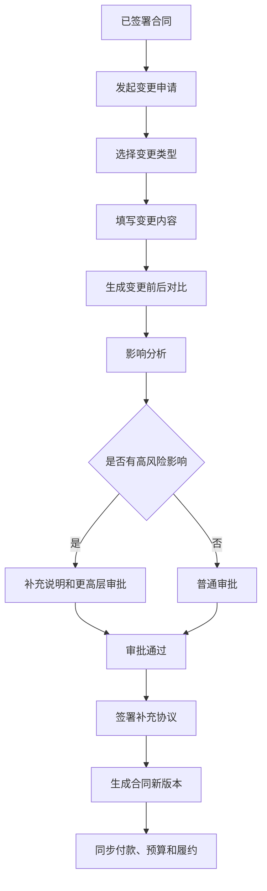
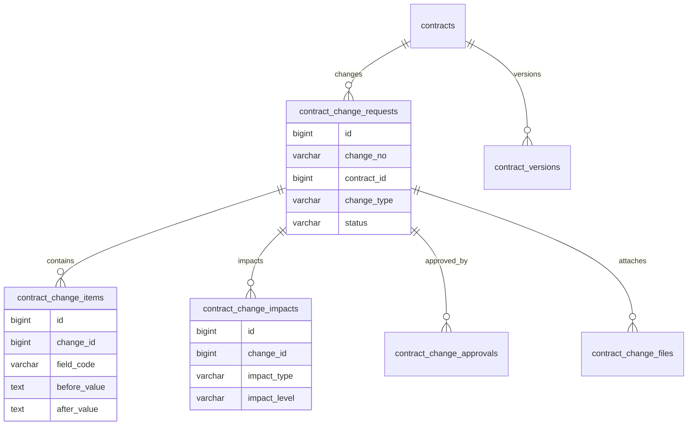
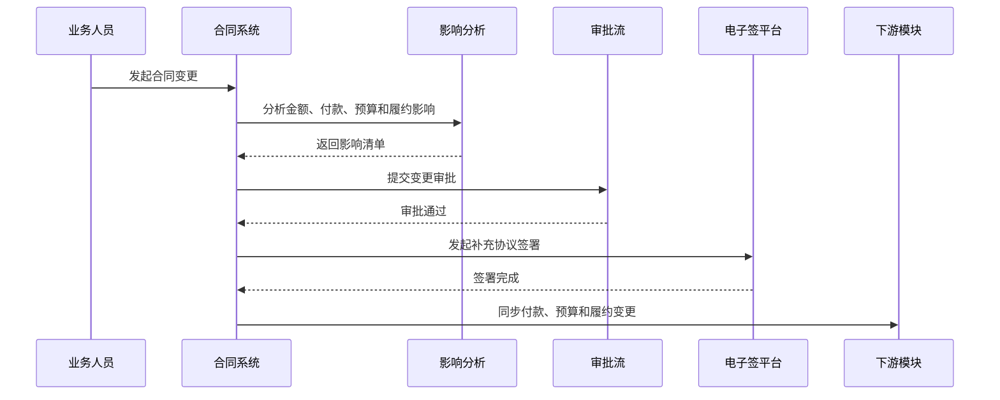

# 合同变更项目案例

## 适合谁看

适合需要做合同补充协议、金额变更、期限变更、付款条款调整、履约范围变更、审批、版本归档和变更影响分析的开发者。

合同变更不是“改一下合同字段”。真实项目里，合同一旦签署，金额、期限、付款节点、交付范围、甲乙方信息和附件都可能已经影响审批、付款、验收、发票、预算和资金计划。合同变更要解决的是：改了什么、为什么改、谁批准、影响哪些业务单据、旧版本如何追溯。

## 业务目标

第一版合同变更支持：

- 基于已签署或履约中的合同发起变更。
- 支持金额、期限、付款条款、履约节点和附件变更。
- 自动生成变更前后对比。
- 支持变更审批和电子签补充协议。
- 评估对付款、发票、预算、验收和资金计划的影响。
- 生成合同新版本和变更记录。
- 支持变更撤回、驳回、作废和生效。
- 保留完整审计和版本快照。

## 合同变更链路

合同变更的关键是“变更影响”。如果只保存一份新合同，不告诉业务哪些付款节点、验收节点和预算被影响，后续系统会出现大量状态不一致。

## 核心概念

| 概念 | 说明 | 示例 |
| --- | --- | --- |
| 变更申请 | 对已生效合同提出修改 | 调整合同金额 |
| 变更类型 | 变更的业务分类 | 金额、期限、付款、范围 |
| 变更对比 | 修改前后字段差异 | 金额 100 万变 120 万 |
| 影响分析 | 变更影响哪些下游单据 | 付款计划、预算占用 |
| 补充协议 | 双方确认变更的法律文件 | 合同补充协议 |
| 生效版本 | 当前正式执行的合同版本 | V3 生效 |
| 历史版本 | 曾经生效或审批过的快照 | V1、V2 |

合同变更要把“草稿变更”和“生效合同”分开。审批中的变更不能直接污染当前合同。

## 数据模型

## 推荐表结构

| 表 | 作用 | 关键字段 |
| --- | --- | --- |
| `contract_change_requests` | 合同变更申请 | `change_no`、`contract_id`、`change_type`、`status`、`reason` |
| `contract_change_items` | 变更字段明细 | `change_id`、`field_code`、`before_value`、`after_value` |
| `contract_change_impacts` | 变更影响分析 | `change_id`、`impact_type`、`impact_object_id`、`impact_level` |
| `contract_change_approvals` | 变更审批记录 | `change_id`、`node_name`、`action`、`operator_id` |
| `contract_change_files` | 变更附件 | `change_id`、`file_id`、`file_type`、`version_no` |
| `contract_versions` | 合同版本 | `contract_id`、`version_no`、`source_change_id`、`snapshot_json` |
| `contract_change_sync_logs` | 下游同步日志 | `change_id`、`target_module`、`status`、`error_message` |

变更字段建议结构化保存，同时保存完整快照。结构化字段便于查询影响，快照便于审计和还原。

## 变更审批流程

变更审批通过不等于合同已经生效。若需要双方签署补充协议，应在签署完成后再生成生效版本。

## 变更类型设计

| 变更类型 | 可能影响 | 注意点 |
| --- | --- | --- |
| 金额变更 | 预算、付款、发票、资金计划 | 已付款不能被简单回滚 |
| 期限变更 | 到期提醒、履约节点、SLA | 历史提醒要保留 |
| 付款条款变更 | 可付款金额、付款排期、质保金 | 审批中付款要重新校验 |
| 履约范围变更 | 验收、交付物、项目计划 | 需要变更说明 |
| 合同主体变更 | 客户、供应商、开票信息 | 风险高，需要强审批 |
| 附件变更 | 法务文件、签署文件 | 版本和签章状态要清晰 |

金额、主体和付款条款属于高风险变更。第一版就应该比普通字段变更有更严格的审批和审计。

## 前端页面拆分

| 页面或组件 | 作用 | 注意点 |
| --- | --- | --- |
| 合同变更列表 | 查看变更状态和类型 | 支持合同、类型、风险筛选 |
| 变更申请 | 填写变更原因和内容 | 自动读取当前合同版本 |
| 变更对比 | 展示字段差异 | 高风险字段突出显示 |
| 影响分析 | 展示付款、预算、履约影响 | 允许业务补充说明 |
| 变更审批 | 审批变更申请 | 展示原合同和变更对比 |
| 补充协议签署 | 跟踪签署状态 | 支持失败重试和补偿查询 |
| 合同版本 | 查看所有历史版本 | 标记当前生效版本 |
| 同步日志 | 查看下游模块同步结果 | 支持失败重试 |

变更申请页要避免让用户直接编辑完整合同。更稳妥的方式是选择变更类型，再只填写相关字段。

## 接口拆分建议

| 接口 | 作用 | 注意点 |
| --- | --- | --- |
| `POST /contracts/{id}/changes` | 创建变更申请 | 当前存在审批中变更时要限制 |
| `POST /contract-changes/{id}/impact` | 影响分析 | 返回付款、预算、履约影响 |
| `POST /contract-changes/{id}/submit` | 提交审批 | 提交后冻结变更内容 |
| `POST /contract-changes/{id}/approve` | 审批变更 | 保存审批意见 |
| `POST /contract-changes/{id}/sign` | 发起补充协议签署 | 使用签署流水防重 |
| `POST /contract-changes/{id}/effective` | 变更生效 | 生成新合同版本 |
| `POST /contract-changes/{id}/cancel` | 撤回或作废 | 限制状态 |
| `GET /contracts/{id}/versions` | 查询合同版本 | 支持版本对比 |

## 实际项目常见问题

### 问题 1：合同金额改了，但付款计划没变

金额变更必须触发付款节点重新计算。已付款、审批中付款、待付款和质保金要分别处理，不能只改合同总金额。

### 问题 2：审批中的变更影响了线上合同

变更申请要保存在独立表里，审批通过并签署完成前不能覆盖合同主表。合同详情页应显示当前生效版本和待生效变更。

### 问题 3：补充协议签署失败后状态卡住

电子签平台需要回调加补偿查询。签署中状态要有超时提醒、重试和人工处理入口。

### 问题 4：业务无法解释为什么变更

变更原因、附件、审批意见和影响分析都要必填或可追踪。高风险变更没有说明不应提交审批。

## 权限与审计

合同变更权限至少要区分：

- 发起合同变更。
- 查看变更对比。
- 查看影响分析。
- 审批合同变更。
- 发起补充协议签署。
- 使变更生效。
- 作废变更。
- 查看历史版本。

金额、主体、付款条款、补充协议和生效操作都要审计。合同变更会影响法律文件和资金流，不能只保留最终字段。

## 验收清单

- 合同变更申请和生效合同分离。
- 支持金额、期限、付款、履约和附件变更。
- 变更前后对比清晰。
- 高风险变更有影响分析。
- 变更审批后内容冻结。
- 需要签署的变更在签署后生效。
- 生效后生成合同新版本。
- 付款、预算、履约等下游模块能同步或提示处理。
- 历史版本可追溯。
- 关键操作有审计记录。

## 下一步学习

继续学习 [合同管理项目案例](/projects/contract-management-case)、[合同履约项目案例](/projects/contract-fulfillment-case)、[合同付款项目案例](/projects/contract-payment-case) 和 [行业合规审计项目案例](/projects/compliance-audit-case)。
