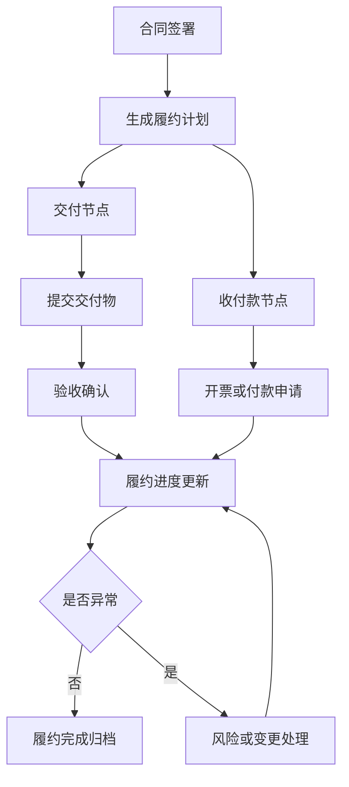
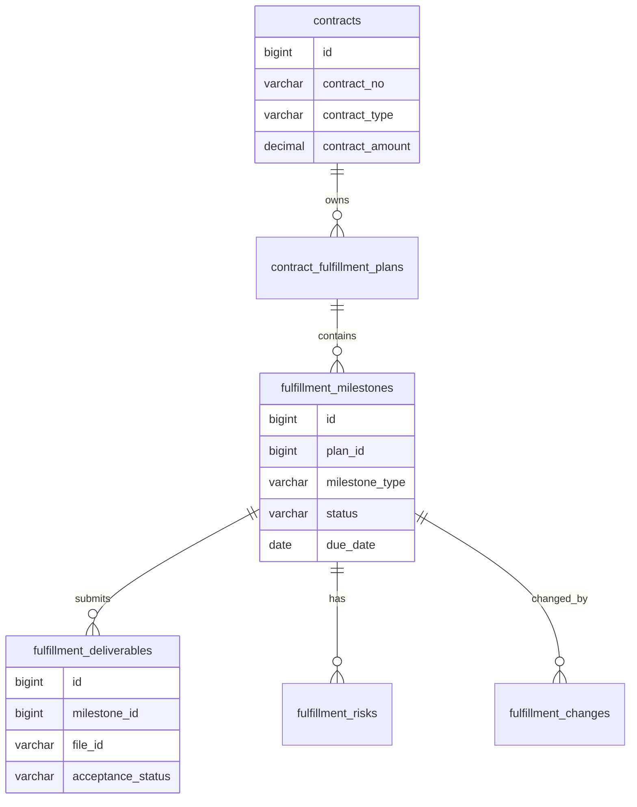
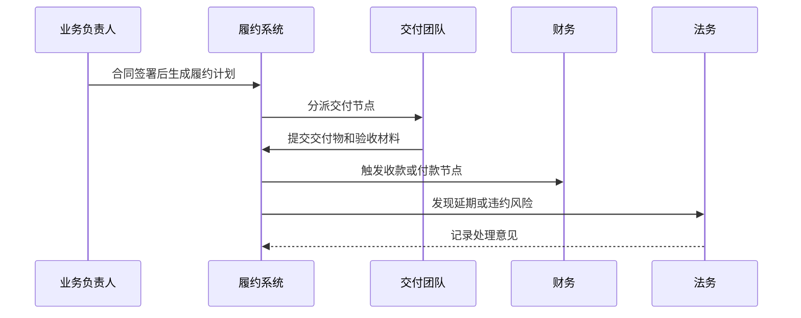

# 合同履约项目案例

## 适合谁看

适合需要做合同签署后履约计划、交付节点、收付款节点、履约风险、变更、验收、违约和归档管理的开发者。

合同履约不是“合同审批通过后归档”。真实项目里，合同签完只是开始。后续还要跟踪交付物、付款条件、发票、验收、延期、变更、违约和续签。如果只管理合同文件，不管理履约过程，业务最终会说不清“合同做到哪一步、钱该不该付、风险在哪里”。

## 业务目标

第一版合同履约支持：

- 合同签署后生成履约计划。
- 支持交付节点、验收节点、收款节点和付款节点。
- 支持节点负责人、截止时间和提醒。
- 支持履约变更、延期和风险记录。
- 支持履约进度看板。
- 支持验收、开票、付款和归档关联。
- 支持违约和争议处理。

## 合同履约链路

核心原则：合同履约要围绕节点管理，而不是围绕合同文件管理。文件说明“约定了什么”，节点说明“执行到哪里”。

## 数据模型

## 推荐表结构

| 表 | 作用 | 关键字段 |
| --- | --- | --- |
| `contracts` | 合同主表 | `contract_no`、`contract_type`、`amount`、`status` |
| `contract_fulfillment_plans` | 履约计划 | `contract_id`、`plan_no`、`owner_id`、`status` |
| `fulfillment_milestones` | 履约节点 | `plan_id`、`milestone_type`、`due_date`、`status` |
| `fulfillment_deliverables` | 交付物 | `milestone_id`、`file_id`、`submitted_by`、`acceptance_status` |
| `fulfillment_payments` | 收付款节点 | `milestone_id`、`amount`、`invoice_status`、`payment_status` |
| `fulfillment_changes` | 履约变更 | `milestone_id`、`change_type`、`reason`、`status` |
| `fulfillment_risks` | 履约风险 | `milestone_id`、`risk_level`、`risk_reason`、`owner_id` |
| `fulfillment_acceptance_records` | 验收记录 | `deliverable_id`、`result`、`comment`、`operator_id` |

履约计划要能从合同条款生成，但不能只依赖合同正文解析。关键节点要结构化保存，方便提醒、审批和报表统计。

## 履约节点类型

| 节点类型 | 示例 | 常见风险 |
| --- | --- | --- |
| 交付节点 | 交付系统、报告、设备 | 交付物不明确 |
| 验收节点 | 客户验收、内部验收 | 验收标准缺失 |
| 收款节点 | 首款、尾款、里程碑款 | 条件未满足就收款 |
| 付款节点 | 供应商付款 | 未验收先付款 |
| 续签节点 | 到期续约 | 忘记提前沟通 |
| 违约节点 | 延期赔付 | 证据不足 |

不同合同类型的节点模板不同。软件项目合同、采购合同、服务合同不应该共用同一套履约节点。

## 履约推进流程

履约节点变更要有原因和审批。直接改截止时间会让延期风险失真。

## 前端页面拆分

| 页面或组件 | 作用 | 注意点 |
| --- | --- | --- |
| 履约工作台 | 查看待处理节点和风险 | 优先展示逾期和高金额合同 |
| 合同履约详情 | 查看节点、交付物、收付款 | 时间线比纯表格更直观 |
| 节点任务页 | 处理交付、验收和付款 | 明确前置条件 |
| 履约变更 | 申请延期、金额或节点调整 | 变更前后要对比 |
| 风险列表 | 跟踪延期、违约和争议 | 有负责人和处理结论 |
| 履约看板 | 查看履约率、逾期率、金额风险 | 指标口径要固定 |
| 归档页 | 汇总合同、交付物、验收和付款 | 归档后限制修改 |

合同履约详情页要把合同条款、节点计划、交付物、验收和收付款放在同一条时间线上，减少跨页面查找。

## 常见问题

### 问题 1：合同已签，但没人知道下一步谁负责

签署后应自动生成履约计划和节点负责人。没有负责人和截止时间的节点不应该进入执行状态。

### 问题 2：付款节点到了，但交付还没验收

付款节点要配置前置条件，例如交付物已提交、验收通过、发票已登记。不能只按日期触发。

### 问题 3：延期被直接改日期，报表看不出风险

延期要走履约变更，保存原日期、新日期、原因、审批人和影响范围。

### 问题 4：合同归档后又出现争议

归档前要检查交付物、验收、收付款和风险是否关闭。归档后争议应创建补充事件，而不是直接修改历史记录。

## 验收清单

- 合同签署后能生成履约计划。
- 履约节点有负责人、截止时间和状态。
- 交付、验收、收付款节点边界清晰。
- 付款节点支持前置条件。
- 履约变更保留前后差异和审批记录。
- 风险和争议有负责人、级别和处理结论。
- 履约详情能展示完整时间线。
- 归档前检查节点、付款和风险状态。
- 高金额和逾期合同能进入预警。
- 履约看板能统计履约率、逾期率和金额风险。

## 下一步学习

继续学习 [合同管理项目案例](/projects/contract-management-case)、[预算管理项目案例](/projects/budget-management-case)、[审批流项目案例](/projects/approval-workflow-case) 和 [复杂财务对账项目案例](/projects/finance-reconciliation-case)。
