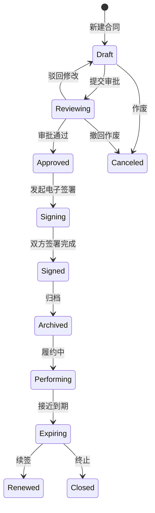
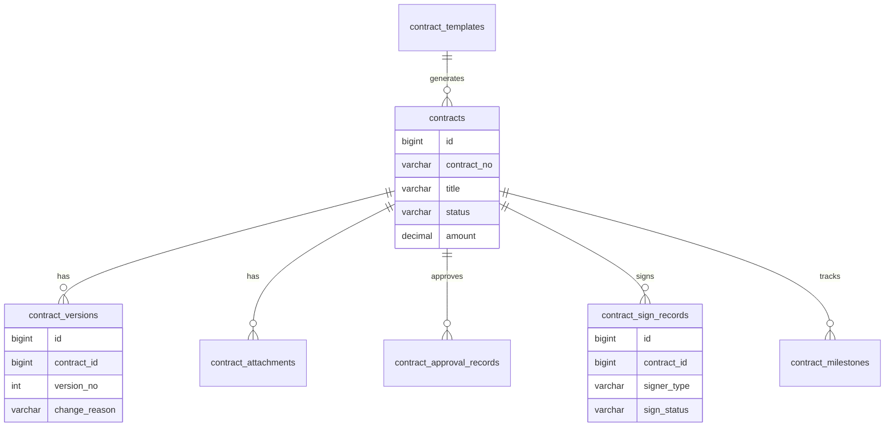
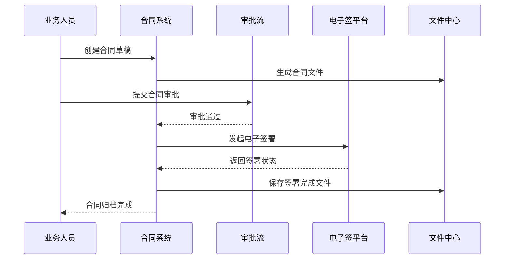

# 合同管理项目案例

## 适合谁看

适合需要做合同台账、合同模板、审批签署、电子签章、归档、履约跟踪、到期提醒和合同风险提示的开发者。

合同管理不是“上传一个 PDF”。真实项目里，合同会经历起草、审批、签署、归档、履约、变更、续签和终止。每一步都可能涉及权限、附件、版本、审批、外部电子签平台、财务付款和审计留痕。

## 业务目标

第一版合同管理支持：

- 维护合同台账。
- 使用合同模板生成合同草稿。
- 发起合同审批。
- 对接电子签署。
- 管理合同附件和归档文件。
- 跟踪合同金额、履约节点和付款节点。
- 支持到期提醒。
- 支持合同变更和作废。

## 合同生命周期

合同状态要严格控制。不要只用一个“已完成”状态，否则审批完成、签署完成、归档完成和履约完成会混在一起。

## 数据模型

## 推荐表结构

| 表 | 作用 | 关键字段 |
| --- | --- | --- |
| `contract_templates` | 合同模板 | `template_code`、`name`、`content_schema`、`status` |
| `contracts` | 合同主表 | `contract_no`、`title`、`counterparty`、`amount`、`status` |
| `contract_versions` | 合同版本 | `contract_id`、`version_no`、`file_id`、`change_reason` |
| `contract_attachments` | 合同附件 | `contract_id`、`file_id`、`attachment_type` |
| `contract_approval_records` | 审批记录 | `contract_id`、`node_name`、`action`、`operator_id` |
| `contract_sign_records` | 签署记录 | `contract_id`、`signer_name`、`sign_status`、`signed_at` |
| `contract_milestones` | 履约节点 | `contract_id`、`milestone_name`、`due_date`、`status` |
| `contract_reminders` | 提醒记录 | `contract_id`、`remind_type`、`remind_at`、`sent_status` |

合同文件建议进入文件中心统一管理。合同表只保存文件 ID 和业务元数据，不要把大文件直接塞进业务表。

## 审批签署流程

电子签署要考虑回调幂等。第三方平台可能重复推送签署结果，合同系统不能重复推进状态。

## 合同状态设计

| 状态 | 说明 | 谁可以操作 |
| --- | --- | --- |
| 草稿 | 业务人员正在填写合同 | 创建人、合同管理员 |
| 审批中 | 已提交审批，合同内容冻结 | 审批人、管理员 |
| 已审批 | 审批完成，等待签署 | 创建人、签署管理员 |
| 签署中 | 已发送签署任务 | 签署方、系统回调 |
| 已签署 | 双方完成签署 | 合同管理员 |
| 已归档 | 合同文件归档完成 | 合同管理员 |
| 履约中 | 合同进入执行阶段 | 业务负责人 |
| 已终止 | 合同提前终止或到期关闭 | 管理员 |

审批中和签署中的合同内容必须冻结。需要修改时，应撤回或创建新版本。

## 前端页面拆分

| 页面 | 作用 | 注意点 |
| --- | --- | --- |
| 合同台账 | 查询合同列表 | 支持状态、类型、金额、到期时间筛选 |
| 合同详情 | 查看基本信息、附件、审批和签署记录 | 信息按生命周期分区 |
| 合同新建 | 使用模板创建草稿 | 字段校验要清楚 |
| 模板管理 | 维护合同模板和变量 | 模板发布后保留版本 |
| 审批记录 | 查看节点和意见 | 和审批流系统状态一致 |
| 电子签署 | 展示签署方和签署状态 | 支持重试和异常提示 |
| 履约节点 | 跟踪交付、付款和续签 | 到期前提醒 |

## 实际项目常见问题

### 问题 1：合同审批通过后还能被编辑

这是状态边界不清。审批中、已审批、签署中和已签署状态都不能直接修改正文，必须通过撤回、变更或新版本处理。

### 问题 2：电子签署完成了，但系统还是签署中

通常是回调失败或签署状态轮询缺失。要同时支持平台回调和定时补偿查询，并记录每次回调原文。

### 问题 3：合同快到期但没人知道

合同到期不是合同详情页的问题，而是任务提醒问题。要为到期、付款、续签和履约节点建立提醒任务。

## 验收清单

- 合同编号唯一且可追踪。
- 合同状态机清晰。
- 审批中和签署中的合同内容不可直接修改。
- 合同模板有版本。
- 电子签署回调具备幂等处理。
- 签署完成文件能归档。
- 合同附件权限受控。
- 到期和履约节点有提醒。
- 合同变更保留原因和版本。
- 关键操作有审计记录。

## 下一步学习

继续学习 [工作流配置器项目案例](/projects/workflow-builder-case)、[文件中心项目案例](/projects/file-center-case) 和 [复杂财务对账项目案例](/projects/finance-reconciliation-case)。
