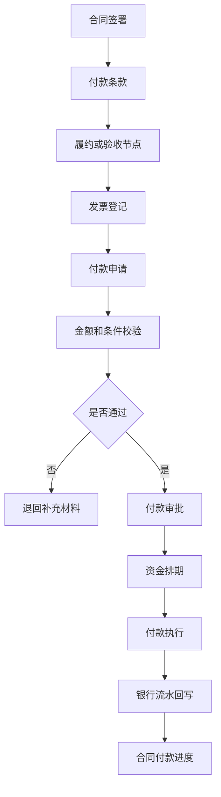
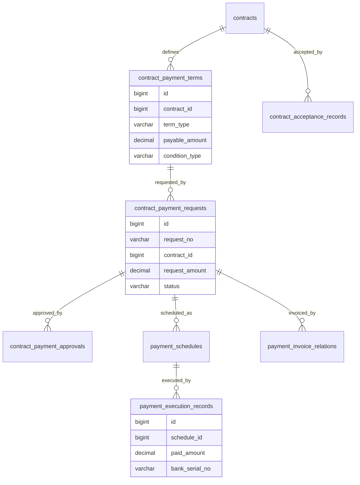
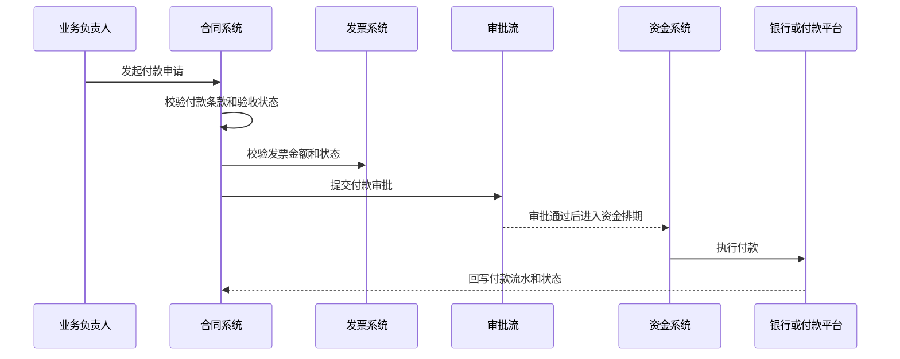

# 合同付款项目案例

## 适合谁看

适合需要做合同付款节点、付款申请、付款审批、发票校验、验收关联、付款排期、付款执行和合同付款进度跟踪的开发者。

合同付款不是“合同里填一个付款金额”。真实项目里，付款通常要同时满足合同条款、履约节点、验收结果、发票、预算、资金计划和审批要求。系统要能回答：这笔钱为什么能付、付到哪一步、是否超过合同金额、是否已经收到发票、是否存在重复付款风险。

如果你已经看过 [合同管理项目案例](/projects/contract-management-case) 和 [资金计划项目案例](/projects/cash-flow-planning-case)，这个案例可以理解为合同、采购、财务和资金之间的付款闭环。

## 业务目标

第一版合同付款支持：

- 维护合同付款条款和付款节点。
- 关联合同履约、验收和发票。
- 创建付款申请。
- 校验可付款金额、已付金额和剩余金额。
- 支持付款审批和付款排期。
- 支持付款执行和银行流水回写。
- 支持预付款、阶段款、尾款和质保金。
- 支持付款异常、退款和冲销。
- 支持合同付款进度和风险看板。

## 合同付款链路

付款链路的核心是“付款条件”。不是合同签了就能付款，也不是发票到了就一定能付款。系统要把合同条款、验收和发票放到同一个校验上下文中。

## 核心概念

| 概念 | 说明 | 示例 |
| --- | --- | --- |
| 付款条款 | 合同约定的付款规则 | 预付 30%、验收后付 60%、质保金 10% |
| 付款节点 | 具体可付款阶段 | 签署后、到货后、验收后 |
| 可付款金额 | 当前节点允许申请的金额 | 验收后最多可付 60 万 |
| 已付金额 | 已经执行付款的金额 | 已付 30 万预付款 |
| 付款申请 | 业务发起的付款请求 | 申请支付阶段款 |
| 付款排期 | 财务安排实际付款日期 | 下周三付款 |
| 质保金 | 合同预留的风险保证金 | 验收 1 年后支付 |

付款节点建议独立建模。不要只在合同正文里写付款说明，否则系统无法自动校验金额和状态。

## 数据模型

## 推荐表结构

| 表 | 作用 | 关键字段 |
| --- | --- | --- |
| `contract_payment_terms` | 合同付款条款 | `contract_id`、`term_type`、`payable_ratio`、`payable_amount`、`condition_type` |
| `contract_acceptance_records` | 合同验收记录 | `contract_id`、`milestone_id`、`acceptance_status`、`accepted_at` |
| `contract_payment_requests` | 付款申请 | `request_no`、`contract_id`、`term_id`、`request_amount`、`status` |
| `payment_invoice_relations` | 发票关联 | `payment_request_id`、`invoice_id`、`invoice_amount` |
| `contract_payment_approvals` | 付款审批记录 | `payment_request_id`、`node_name`、`action`、`operator_id` |
| `payment_schedules` | 付款排期 | `payment_request_id`、`scheduled_date`、`pay_account_id`、`status` |
| `payment_execution_records` | 付款执行记录 | `schedule_id`、`paid_amount`、`paid_at`、`bank_serial_no` |
| `payment_adjustment_records` | 付款调整 | `payment_request_id`、`adjust_type`、`adjust_amount`、`reason` |
| `contract_payment_risks` | 付款风险 | `contract_id`、`risk_type`、`risk_level`、`status` |

付款执行记录要和银行流水或付款平台流水关联。只把付款申请改成“已付款”，后续财务对账会缺少依据。

## 付款申请流程

付款申请和付款执行要分开。审批通过只是允许付款，不代表款项已经实际支付。

## 付款类型设计

| 类型 | 条件 | 注意点 |
| --- | --- | --- |
| 预付款 | 合同签署或审批通过 | 通常不依赖验收，但需要控制比例 |
| 阶段款 | 阶段交付或里程碑达成 | 关联履约节点和验收记录 |
| 到货款 | 采购或设备到货 | 关联到货验收和入库 |
| 验收款 | 验收通过 | 验收不通过不能付款 |
| 尾款 | 合同主体履约完成 | 要扣除质保金和已付款 |
| 质保金 | 质保期结束后 | 需要到期提醒和风险检查 |

付款类型会影响校验规则。不要把所有付款都走同一个“提交审批”逻辑，否则业务阻塞原因会不清楚。

## 前端页面拆分

| 页面或组件 | 作用 | 注意点 |
| --- | --- | --- |
| 合同付款计划 | 查看付款节点和条件 | 展示应付、已付、可付和剩余 |
| 付款申请 | 发起付款 | 自动带出合同、节点、发票和验收 |
| 付款校验面板 | 展示阻塞原因 | 例如未验收、发票不足、超额 |
| 付款审批 | 审批付款申请 | 展示合同条款和资金影响 |
| 付款排期 | 财务安排付款日期 | 关联资金计划和账户 |
| 付款执行 | 查看实际支付结果 | 展示银行流水和失败原因 |
| 合同付款详情 | 合同维度完整付款进度 | 支持按节点追踪 |
| 付款风险看板 | 查重复付款、超额付款和逾期付款 | 支持分派处理 |

付款申请页要让业务知道“为什么现在最多只能申请这个金额”。可付款金额的计算过程必须可见。

## 接口拆分建议

| 接口 | 作用 | 注意点 |
| --- | --- | --- |
| `GET /contracts/{id}/payment-terms` | 查询付款条款 | 返回应付、已付、可付和条件状态 |
| `POST /contract-payments/check` | 付款校验 | 返回阻塞原因和可申请金额 |
| `POST /contract-payments/requests` | 创建付款申请 | 按合同、节点和发票做幂等 |
| `POST /contract-payments/{id}/submit` | 提交审批 | 审批中冻结金额 |
| `POST /contract-payments/{id}/schedule` | 安排付款 | 校验资金计划和账户 |
| `POST /contract-payments/{id}/execute` | 执行付款 | 使用付款流水号防重 |
| `POST /contract-payments/{id}/adjust` | 付款调整 | 必须记录原因和审批 |
| `GET /contract-payments/risks` | 查询付款风险 | 支持超额、重复、逾期筛选 |

## 实际项目常见问题

### 问题 1：合同金额 100 万，系统累计付了 110 万

通常是付款申请只校验单笔金额，没有校验合同累计已付、审批中金额和执行中金额。解决方案是在创建申请、提交审批和执行付款三个节点都校验累计额度。

### 问题 2：验收没通过也能付款

付款节点必须绑定条件。验收款需要验收记录通过后才可申请；如果允许例外付款，必须走单独审批并记录例外原因。

### 问题 3：付款审批通过后重复付款

付款执行要使用付款计划或付款流水做幂等。银行超时后不能直接重新付款，应先查询原流水状态。

### 问题 4：财务不知道哪些付款会影响现金流

付款申请审批通过后要进入资金排期，资金计划要能看到付款金额、优先级、预计日期和是否可延期。

## 权限与审计

合同付款权限至少要区分：

- 查看合同付款计划。
- 创建付款申请。
- 提交付款审批。
- 审批付款。
- 安排付款排期。
- 执行付款。
- 调整付款金额。
- 查看付款风险。
- 导出付款报表。

付款金额调整、例外付款、重复付款处理和付款执行必须审计。这些操作直接影响企业资金安全。

## 验收清单

- 合同付款条款结构化。
- 支持预付款、阶段款、验收款、尾款和质保金。
- 付款申请能校验合同金额、已付金额和审批中金额。
- 付款条件能关联验收、发票和履约节点。
- 审批通过和实际付款状态分离。
- 付款排期能进入资金计划。
- 付款执行有银行或平台流水。
- 重复付款和超额付款有防护。
- 付款异常、退款和调整有记录。
- 合同付款进度可按节点追踪。

## 下一步学习

继续学习 [合同管理项目案例](/projects/contract-management-case)、[合同履约项目案例](/projects/contract-fulfillment-case)、[资金计划项目案例](/projects/cash-flow-planning-case) 和 [复杂财务对账项目案例](/projects/finance-reconciliation-case)。
