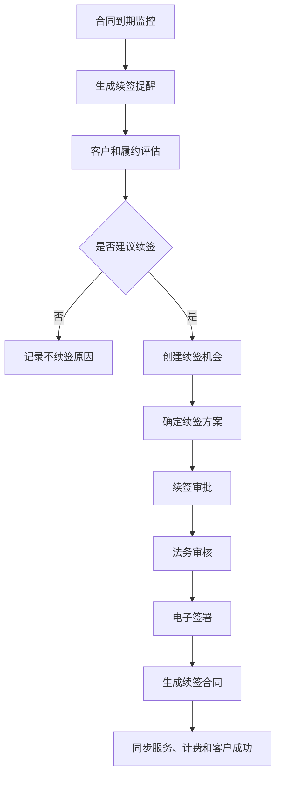
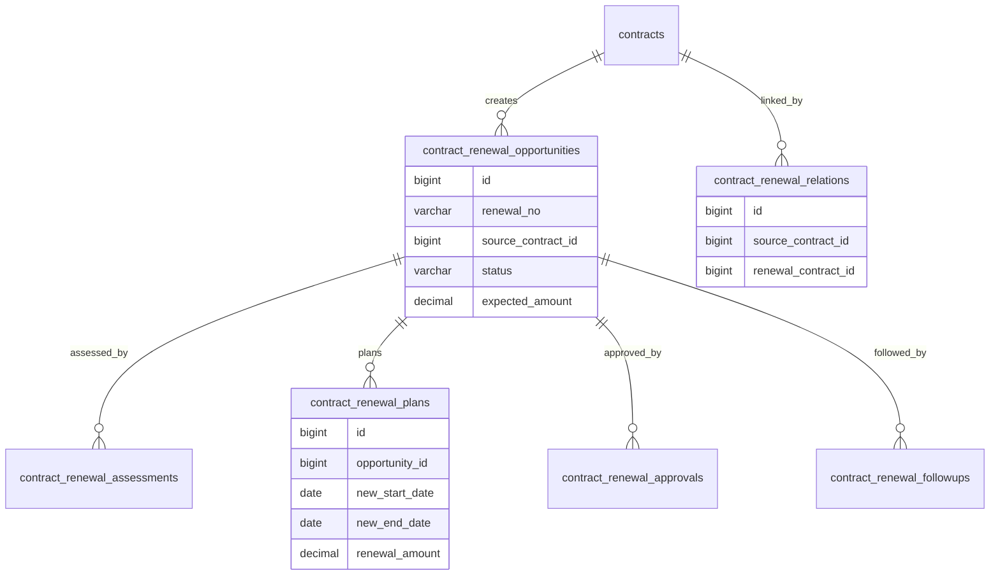
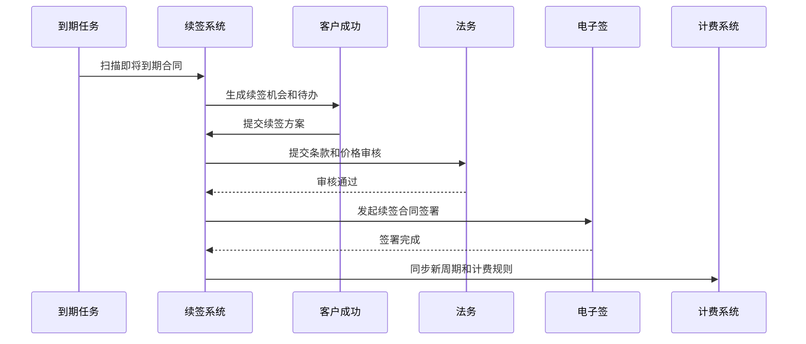

# 合同续签项目案例

## 适合谁看

适合需要做合同到期提醒、续签机会、续签审批、价格调整、条款复用、补充协议、重新签署和续签归档的开发者。

合同续签不是“复制一份旧合同”。真实项目里，续签会影响客户成功、销售机会、价格策略、授信额度、合同模板、历史履约、付款条款和后续服务。系统要能回答：哪些合同快到期、是否值得续签、续签金额和周期是什么、条款是否变化、续签是否已经生效。

## 业务目标

第一版合同续签支持：

- 自动识别即将到期合同。
- 生成续签提醒和续签机会。
- 展示原合同履约、付款、开票和服务情况。
- 支持续签价格、周期、范围和付款条款调整。
- 支持续签审批、法务审核和电子签署。
- 支持续签合同与原合同关联。
- 支持续签失败原因、客户流失原因和跟进记录。
- 支持续签率、续签金额和到期风险看板。

## 合同续签链路

合同续签的关键是“续签前评估”。如果只在到期前提醒销售，业务无法判断客户是否欠款、是否服务质量差、是否需要调整价格。

## 核心概念

| 概念 | 说明 | 示例 |
| --- | --- | --- |
| 到期提醒 | 合同到期前的系统提醒 | 提前 90 天提醒 |
| 续签机会 | 围绕合同产生的销售机会 | 年费续签机会 |
| 续签方案 | 续签周期、价格、条款和范围 | 续签一年涨价 10% |
| 续签评估 | 判断是否适合续签 | 付款及时、服务满意 |
| 原合同 | 被续签的历史合同 | 2025 年服务合同 |
| 续签合同 | 新签署并关联原合同的合同 | 2026 年服务合同 |
| 不续签原因 | 客户流失或停止合作原因 | 预算取消、竞品替换 |

续签合同应是新的合同对象，而不是直接延长旧合同。旧合同需要保留原始周期、金额、审批和签署证据。

## 数据模型

## 推荐表结构

| 表 | 作用 | 关键字段 |
| --- | --- | --- |
| `contract_renewal_opportunities` | 续签机会 | `renewal_no`、`source_contract_id`、`customer_id`、`expected_amount`、`status` |
| `contract_renewal_assessments` | 续签评估 | `opportunity_id`、`payment_score`、`service_score`、`risk_level`、`suggestion` |
| `contract_renewal_plans` | 续签方案 | `opportunity_id`、`new_start_date`、`new_end_date`、`renewal_amount`、`price_policy` |
| `contract_renewal_approvals` | 续签审批 | `opportunity_id`、`node_name`、`action`、`operator_id` |
| `contract_renewal_followups` | 跟进记录 | `opportunity_id`、`followup_type`、`content`、`next_followup_at` |
| `contract_renewal_relations` | 新旧合同关系 | `source_contract_id`、`renewal_contract_id`、`relation_type` |
| `contract_renewal_loss_reasons` | 不续签原因 | `opportunity_id`、`reason_code`、`description` |
| `contract_renewal_metrics` | 续签指标快照 | `period`、`due_count`、`renewed_count`、`renewal_amount` |

续签机会不要只依赖合同到期日期。客户健康度、欠款、服务投诉和使用量也应该进入续签评估。

## 续签审批流程

续签签署完成后，系统要同步服务有效期、计费周期、客户权益和客户成功任务，否则客户可能已续签但服务被停用。

## 续签状态设计

| 状态 | 含义 | 注意点 |
| --- | --- | --- |
| 待跟进 | 系统生成提醒 | 分配负责人 |
| 评估中 | 正在分析客户和合同 | 展示风险项 |
| 方案中 | 正在制定续签方案 | 可调整金额和周期 |
| 审批中 | 续签方案已提交 | 核心字段冻结 |
| 待签署 | 审批通过等待客户签署 | 跟踪签署进度 |
| 已续签 | 新合同已生效 | 同步下游系统 |
| 不续签 | 客户确认不续 | 必填原因 |
| 已过期 | 到期仍未完成续签 | 触发升级提醒 |

“已过期”不一定代表“不续签”。有些续签还在审批或签署中，系统要区分延期风险和确定流失。

## 前端页面拆分

| 页面或组件 | 作用 | 注意点 |
| --- | --- | --- |
| 续签工作台 | 查看到期合同、续签机会和风险 | 按剩余天数排序 |
| 续签机会详情 | 展示原合同、客户、履约、付款和服务情况 | 帮助判断是否续签 |
| 续签评估 | 汇总客户健康度、欠款、投诉和使用量 | 风险项可解释 |
| 续签方案 | 编辑续签周期、金额、条款和附件 | 从原合同复制但可对比 |
| 续签审批 | 审批价格和条款变化 | 展示原合同与新方案差异 |
| 签署跟踪 | 查看电子签状态 | 支持超时提醒 |
| 不续签登记 | 记录流失原因和竞争信息 | 便于复盘 |
| 续签看板 | 查看续签率、续签金额、风险合同 | 支持按销售、客户、行业分析 |

续签方案页要突出“和原合同相比变了什么”。续签不是纯新增合同，用户最关心差异。

## 接口拆分建议

| 接口 | 作用 | 注意点 |
| --- | --- | --- |
| `POST /contract-renewals/scan` | 扫描到期合同 | 支持任务幂等 |
| `POST /contract-renewals` | 创建续签机会 | 限制重复创建 |
| `GET /contract-renewals/{id}/assessment` | 获取续签评估 | 聚合付款、服务和客户数据 |
| `POST /contract-renewals/{id}/plans` | 保存续签方案 | 保存原合同差异 |
| `POST /contract-renewals/{id}/submit` | 提交续签审批 | 冻结方案内容 |
| `POST /contract-renewals/{id}/sign` | 发起续签签署 | 关联合同模板 |
| `POST /contract-renewals/{id}/effective` | 续签生效 | 创建新合同并关联原合同 |
| `POST /contract-renewals/{id}/loss` | 登记不续签 | 记录原因和复盘信息 |

## 实际项目常见问题

### 问题 1：合同到期提醒太晚

不同合同类型需要不同提醒周期。年度服务合同可能提前 90 天，短期项目合同可能提前 30 天。

### 问题 2：续签后服务仍然到期停用

续签生效后要同步客户权益、服务有效期、计费周期和消息通知。不能只生成一份新合同。

### 问题 3：续签金额和原合同差异无法解释

续签方案要保存价格政策、折扣理由和审批意见。价格变化没有证据会导致财务和销售复盘困难。

### 问题 4：同一个合同被多个销售重复跟进

续签机会要有唯一负责人和锁定机制。合同维度应限制同一周期内重复创建续签机会。

## 权限与审计

合同续签权限至少要区分：

- 查看到期合同。
- 创建续签机会。
- 编辑续签方案。
- 查看客户健康度和欠款。
- 审批续签方案。
- 发起续签签署。
- 续签生效。
- 登记不续签原因。
- 查看续签看板。

续签金额、折扣、周期、条款变化、不续签原因和生效操作都要审计。续签影响收入预测和客户服务，不能只依赖销售口头记录。

## 验收清单

- 可自动识别即将到期合同。
- 续签机会和原合同关联清晰。
- 展示客户、付款、服务和履约评估。
- 支持续签周期、金额、范围和条款调整。
- 续签方案和原合同差异可见。
- 续签审批后内容冻结。
- 签署完成后生成新合同。
- 新旧合同关系可追溯。
- 不续签原因可统计。
- 续签率和风险合同可看板分析。

## 下一步学习

继续学习 [合同管理项目案例](/projects/contract-management-case)、[合同变更项目案例](/projects/contract-change-case)、[客户成功平台项目案例](/projects/customer-success-case) 和 [计费中台项目案例](/projects/billing-platform-case)。
