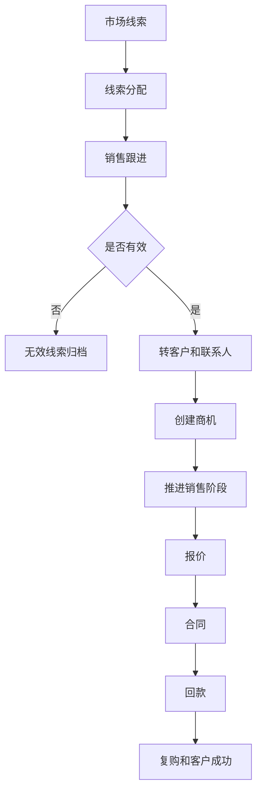
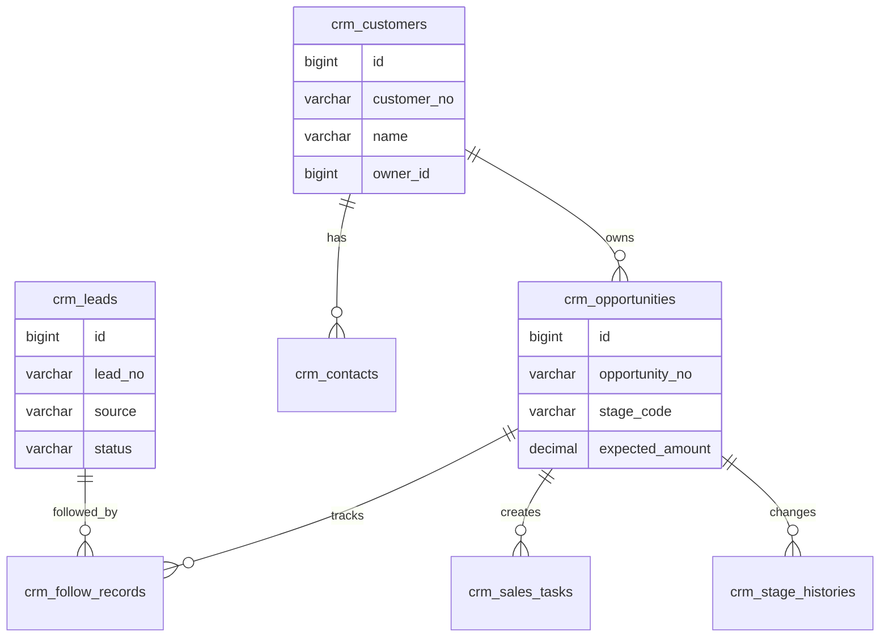
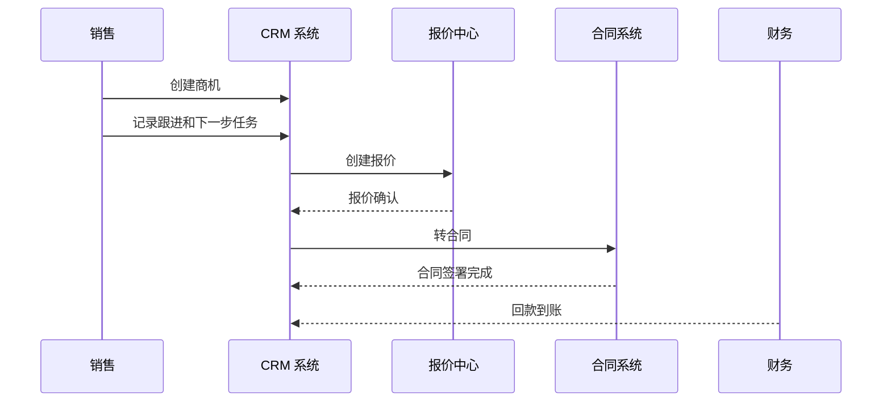

# CRM 销售管理项目案例

## 适合谁看

适合需要做线索、客户、商机、销售跟进、销售阶段、报价、合同、回款预测和销售漏斗的开发者。

CRM 销售管理不是“客户表加跟进记录”。真实项目里，销售过程会经历线索获取、客户建档、商机推进、报价、合同、回款和复购。系统要帮助销售团队知道“客户是谁、现在推进到哪一步、下一步谁负责、预计什么时候成交”。

## 业务目标

第一版 CRM 销售管理支持：

- 管理线索和客户。
- 建立联系人和跟进记录。
- 管理销售商机。
- 配置销售阶段。
- 支持销售任务提醒。
- 支持报价和合同关联。
- 支持回款预测。
- 支持销售漏斗看板。

## 销售链路图

CRM 的核心是过程管理。不要只记录成交客户，否则团队看不到漏斗前面的线索质量和商机风险。

## 数据模型

## 推荐表结构

| 表 | 作用 | 关键字段 |
| --- | --- | --- |
| `crm_leads` | 销售线索 | `lead_no`、`source`、`owner_id`、`status` |
| `crm_customers` | 客户档案 | `customer_no`、`name`、`industry`、`owner_id` |
| `crm_contacts` | 联系人 | `customer_id`、`name`、`role`、`phone`、`email` |
| `crm_opportunities` | 销售商机 | `customer_id`、`stage_code`、`expected_amount`、`win_rate` |
| `crm_stage_histories` | 阶段变更 | `opportunity_id`、`from_stage`、`to_stage`、`changed_by` |
| `crm_follow_records` | 跟进记录 | `target_type`、`target_id`、`content`、`next_follow_at` |
| `crm_sales_tasks` | 销售任务 | `opportunity_id`、`task_type`、`due_at`、`status` |
| `crm_revenue_forecasts` | 回款预测 | `opportunity_id`、`forecast_amount`、`forecast_date`、`confidence` |

商机阶段要有历史记录。只保存当前阶段，后续无法分析商机推进慢在哪个环节。

## 商机推进流程

CRM 不一定自己实现报价、合同和财务，但要和这些系统关联，形成销售闭环。

## 销售阶段设计

| 阶段 | 含义 | 推进条件 |
| --- | --- | --- |
| 初步接触 | 刚确认客户需求 | 有联系人和需求摘要 |
| 需求确认 | 明确预算、时间和决策人 | 填写需求和预算 |
| 方案报价 | 已提交方案或报价 | 关联报价单 |
| 商务谈判 | 讨论合同和价格 | 有跟进记录 |
| 赢单 | 客户确认购买 | 关联合同或订单 |
| 输单 | 客户放弃或选择竞品 | 必填输单原因 |

阶段推进要有最小校验。否则销售为了报表好看，可能把商机随意推进到高阶段。

## 前端页面拆分

| 页面 | 作用 | 注意点 |
| --- | --- | --- |
| 线索池 | 分配和跟进线索 | 防止线索长期无人处理 |
| 客户列表 | 管理客户和负责人 | 支持行业、等级、来源筛选 |
| 客户详情 | 汇总联系人、跟进、商机、合同 | 信息按业务对象分区 |
| 商机看板 | 拖动销售阶段 | 后端校验阶段推进条件 |
| 跟进任务 | 查看待跟进事项 | 逾期提醒 |
| 销售漏斗 | 统计阶段金额和转化率 | 口径要固定 |
| 回款预测 | 预测销售收入 | 区分预测和实际回款 |

## 实际项目常见问题

### 问题 1：销售离职后客户没人跟

客户和商机必须有负责人，离职时需要交接。交接记录要保留新旧负责人和交接原因。

### 问题 2：销售漏斗金额虚高

商机金额要结合阶段、赢率和预计签约时间。不能把所有商机金额直接相加当收入预测。

### 问题 3：跟进记录很多但没有下一步

每次关键跟进后应记录下一步动作和时间。否则 CRM 只是日志系统，不是销售推进工具。

## 验收清单

- 线索、客户、联系人和商机边界清晰。
- 商机有阶段、金额、赢率和预计时间。
- 阶段变更有历史。
- 跟进记录可以关联客户、线索或商机。
- 下一步跟进任务可提醒。
- 输单必须填写原因。
- 客户和商机负责人可交接。
- 报价、合同和回款能关联 CRM。
- 销售漏斗口径清晰。
- 高价值客户数据有权限控制。

## 下一步学习

继续学习 [报价中心项目案例](/projects/quotation-center-case)、[合同管理项目案例](/projects/contract-management-case) 和 [客户成功平台项目案例](/projects/customer-success-case)。
