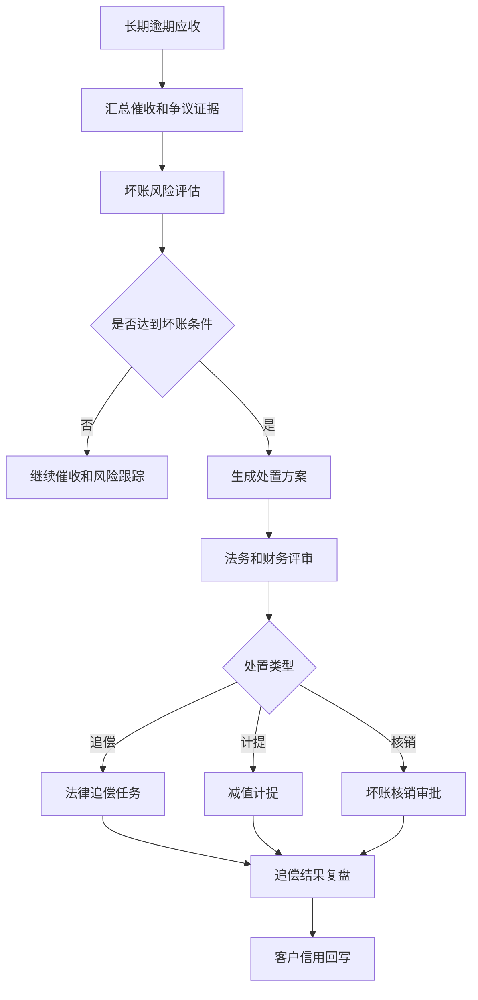
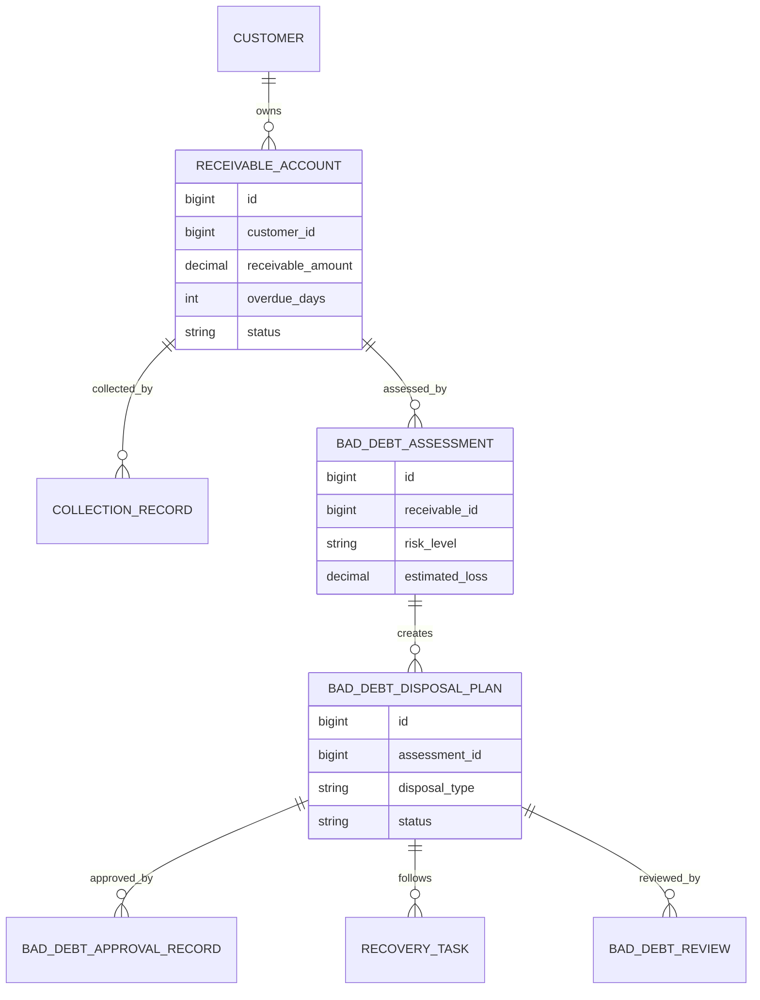
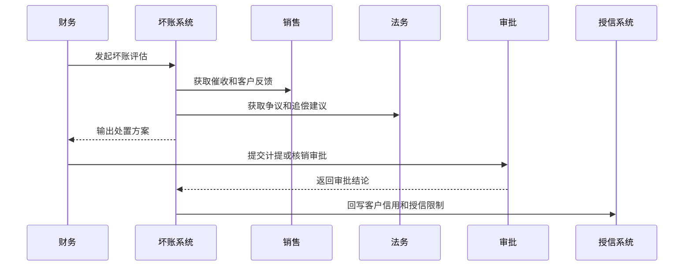
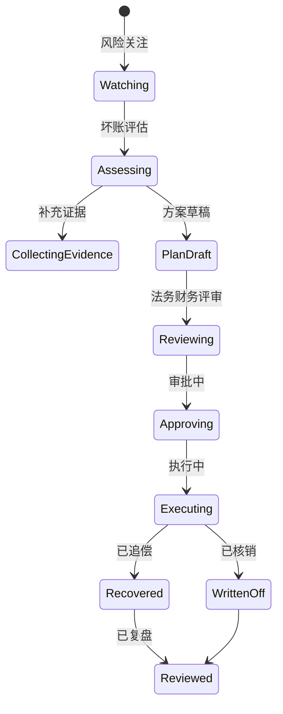
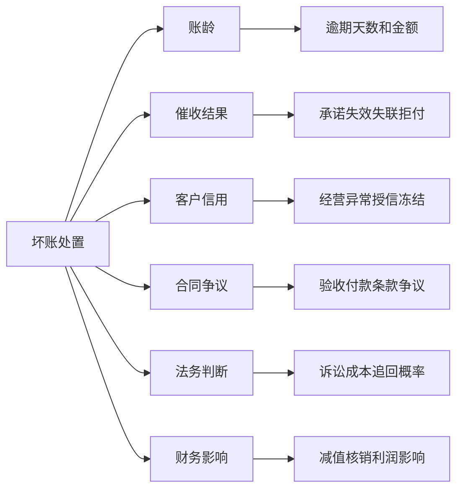

# 客户坏账处置策略项目案例

## 适合谁看

如果你做过客户账期、客户授信风控、客户回款风险预测、销售回款计划或财务对账，但还不清楚逾期账款最终怎么进入坏账评估、核销、追偿和复盘，可以学习这个案例。

客户坏账处置策略关注的是客户长期逾期、失联、争议、经营异常或法律风险后的处理链路。它不是简单把账款标记为坏账，而是要经过风险分级、催收记录、法律评估、减值计提、核销审批、追偿跟踪和客户信用回写。

## 业务目标

客户坏账处置策略要回答 6 个问题：

- 哪些应收账款已经进入坏账风险区间。
- 坏账判断需要哪些证据：账龄、催收、争议、诉讼、客户经营状态。
- 不同风险等级应该继续催收、暂停服务、法律追偿、计提减值还是申请核销。
- 坏账核销如何审批，如何避免随意核销。
- 核销后是否还要追偿，追偿回款如何入账。
- 坏账结果如何反哺客户授信、账期和销售策略。

真实项目里，坏账处置容易变成财务部门的事。但坏账往往源于销售授信、合同条款、交付争议和催收过程，系统要让多部门围绕同一条证据链协作。

## 客户坏账处置链路

这条链路说明，坏账不是一个结果字段，而是一套财务、法务、销售和客户管理共同参与的风险处置流程。

## 核心概念

| 概念 | 说明 | 新手理解 |
| --- | --- | --- |
| 坏账风险 | 应收账款可能无法收回 | 钱可能收不回来 |
| 账龄 | 应收账款逾期时长 | 逾期越久风险越高 |
| 催收证据 | 催收动作和客户反馈 | 证明已经努力追款 |
| 减值计提 | 财务上提前确认损失风险 | 先把风险反映到账上 |
| 坏账核销 | 按流程把账款作为损失处理 | 不等于放弃追偿 |
| 追偿 | 核销或计提前继续追回款项 | 法务、催收、协商 |
| 信用回写 | 把坏账结果影响客户信用 | 下次不再轻易授信 |

坏账处置最重要的是“证据完整”。没有催收记录、合同争议和法务意见，就很难说明为什么可以核销。

## 数据模型

评估、处置方案、审批和追偿要分开建模。坏账不是一次性动作，后面还可能继续追偿和回款。

## 推荐表结构

| 表 | 用途 | 关键字段 |
| --- | --- | --- |
| `receivable_account` | 应收账款 | customer_id、contract_id、amount、due_date、overdue_days、status |
| `collection_record` | 催收记录 | receivable_id、method、contact_person、result、promise_date |
| `bad_debt_assessment` | 坏账评估 | receivable_id、risk_level、estimated_loss、assessment_reason |
| `bad_debt_disposal_plan` | 处置方案 | assessment_id、disposal_type、disposal_amount、status |
| `bad_debt_approval_record` | 审批记录 | plan_id、approver_id、result、comment |
| `recovery_task` | 追偿任务 | plan_id、owner_id、action_type、due_date、status |
| `bad_debt_review` | 坏账复盘 | plan_id、actual_loss、recovered_amount、root_cause |

坏账核销前必须能看到完整催收证据、风险评估和审批意见。

## 坏账处置流程

系统要把销售、财务和法务意见放到同一个处置单里，不要分散在聊天记录和邮件里。

## 处置状态设计

补证状态很重要。证据不足时不能直接驳回，也不能跳过评审。

## 处置因素拆解

坏账处置不是财务独立判断，必须把业务原因、法律可追偿性和财务影响一起看。

## 前端页面拆分

| 页面 | 核心内容 | 设计建议 |
| --- | --- | --- |
| 坏账风险工作台 | 高风险应收、账龄、金额、客户 | 高金额长账龄置顶 |
| 评估详情页 | 风险原因、催收证据、争议情况 | 证据按时间线展示 |
| 处置方案页 | 继续催收、计提、核销、追偿 | 支持多方案对比 |
| 审批页 | 处置金额、原因、影响、意见 | 审批人看摘要和证据 |
| 追偿任务页 | 法务动作、负责人、进展、结果 | 核销后也可继续追踪 |
| 信用回写页 | 授信额度、账期、冻结策略 | 影响后续交易 |
| 坏账复盘页 | 损失金额、追回金额、根因 | 反哺风控规则 |

页面设计重点是证据链。用户需要快速看清楚“为什么这笔钱收不回来”。

## 接口拆分建议

| 接口 | 方法 | 说明 |
| --- | --- | --- |
| `/api/bad-debts/assessments` | GET/POST | 查询和创建坏账评估 |
| `/api/bad-debts/assessments/:id/evidence` | GET/POST | 查询和补充证据 |
| `/api/bad-debts/plans` | GET/POST | 查询和创建处置方案 |
| `/api/bad-debts/plans/:id/submit-approval` | POST | 提交处置审批 |
| `/api/bad-debts/recovery-tasks` | GET/POST | 查询和创建追偿任务 |
| `/api/bad-debts/plans/:id/credit-writeback` | POST | 回写客户信用 |
| `/api/bad-debts/reviews` | GET/POST | 查询和提交坏账复盘 |

处置接口要返回证据完整度。证据不完整时，前端应该提示缺少哪些材料。

## 实际项目常见问题

### 1. 坏账核销缺少证据

只有财务说明，没有催收和法务证据。

解决方式：

- 核销前校验证据清单。
- 催收记录、客户反馈、法务意见结构化保存。
- 缺证据进入补证状态。
- 审批页展示证据完整度。

### 2. 核销后停止追偿

财务核销只是账务处理，不代表不再追款。

解决方式：

- 核销后仍保留追偿任务。
- 追回金额关联原核销记录。
- 追偿结果进入复盘。
- 客户信用不因核销自动恢复。

### 3. 坏账原因无法复盘

只知道损失金额，不知道是授信过高、合同漏洞还是交付争议。

解决方式：

- 复盘时必须选择根因。
- 根因关联销售、交付、法务或财务环节。
- 高频根因进入制度优化。
- 复盘结论回写风控规则。

### 4. 客户信用没有同步更新

坏账客户后续仍然获得账期和额度。

解决方式：

- 坏账处置完成后自动回写授信系统。
- 高风险客户冻结账期或发货。
- 临时恢复需要审批。
- 信用变更保留审计记录。

### 5. 法务成本高于追回金额

小额坏账走复杂诉讼不划算。

解决方式：

- 处置方案评估追回概率和成本。
- 小额低概率转协商或核销。
- 大额高概率进入法律追偿。
- 法务建议作为审批依据。

## 权限与审计

| 权限点 | 控制原因 |
| --- | --- |
| 查看坏账风险 | 涉及客户财务和信用信息 |
| 创建处置方案 | 会影响财务损失确认 |
| 提交核销审批 | 高风险财务动作 |
| 修改追偿结果 | 影响追回金额和复盘 |
| 回写客户信用 | 影响后续交易 |
| 导出坏账清单 | 需要审计导出范围 |

坏账核销、追偿结果和信用回写都必须审计。

## 验收清单

- 能从长期逾期应收生成坏账评估。
- 能记录催收、争议、法务和财务证据。
- 能生成计提、核销、追偿等处置方案。
- 核销审批前能校验证据完整度。
- 核销后仍能跟踪追偿。
- 处置结果能回写客户信用。
- 坏账复盘能沉淀根因和规则优化建议。

## 下一步学习

学完这个案例后，可以继续看：

- [客户回款风险预测项目案例](/projects/customer-payment-risk-prediction-case)
- [客户账期项目案例](/projects/customer-credit-term-case)
- [客户授信风控项目案例](/projects/customer-credit-risk-control-case)
- [销售回款计划项目案例](/projects/sales-collection-plan-case)

