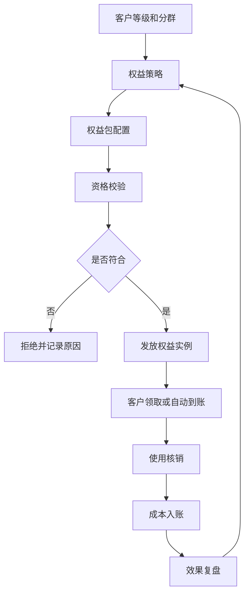
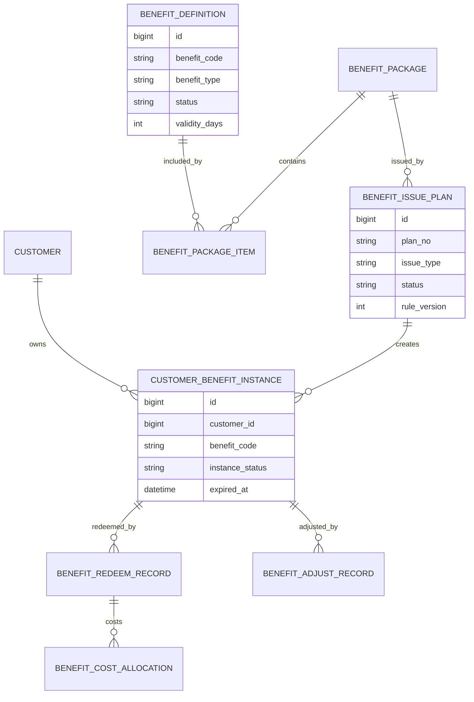
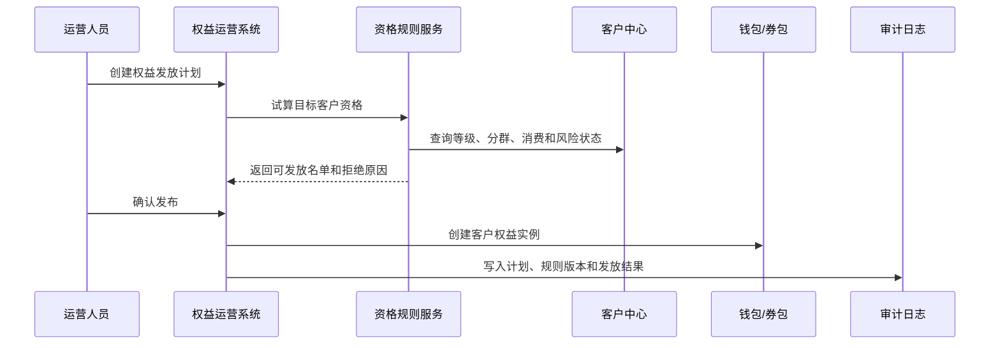
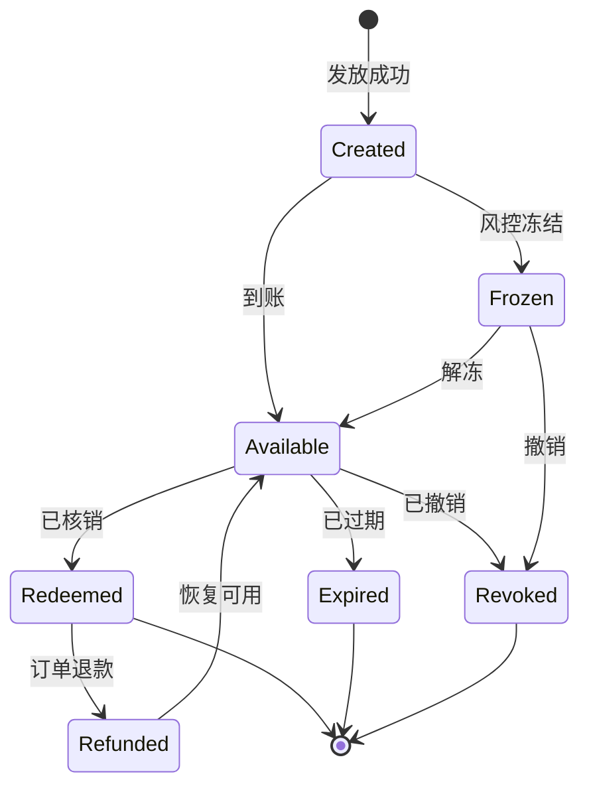
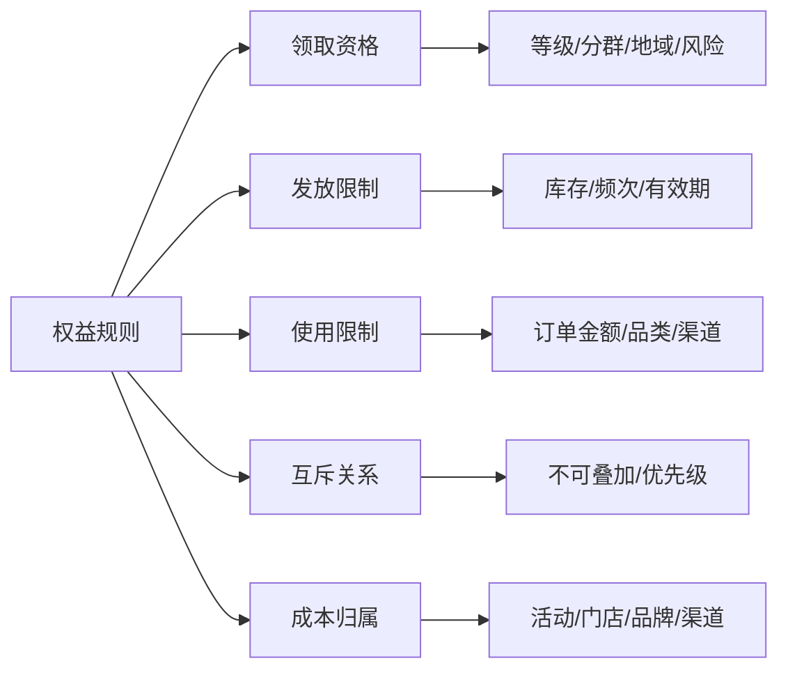

# 客户权益运营项目案例

## 适合谁看

如果你做过会员营销、客户成功、客户分群运营或客户触达自动化，但还不清楚“权益”在系统里应该怎么建模、发放、核销和复盘，可以学习这个案例。

客户权益运营不是简单发优惠券。它要把客户等级、权益包、领取资格、发放记录、使用限制、核销流水、成本分摊和效果复盘串起来，避免出现权益乱发、重复发、无法核销、成本不可控和效果无法证明的问题。

## 业务目标

客户权益运营要回答 6 个问题：

- 哪些客户可以获得哪些权益。
- 权益是按等级自动给，还是按活动、任务、人工补偿发放。
- 权益有没有库存、有效期、使用门槛和互斥限制。
- 客户领取、使用、过期、退款、撤销时如何记录。
- 权益成本由哪个业务、活动、渠道或门店承担。
- 权益是否提升了复购、续费、留存、满意度或客单价。

在真实项目中，权益系统最容易失败的点是“运营能发，财务算不清，客服查不到，技术追不回”。所以这个模块必须把规则、流水和审计放在第一层设计。

## 客户权益运营链路

这条链路说明，权益不是发出去就结束。真正重要的是发放前的资格、发放后的核销、核销后的成本和效果。

## 核心概念

| 概念 | 说明 | 新手理解 |
| --- | --- | --- |
| 权益定义 | 一种可发放的利益 | 例如折扣券、免运费、专属服务、延保 |
| 权益包 | 多个权益组合 | 例如黄金会员月度权益包 |
| 资格规则 | 判断客户能否领取 | 例如等级、消费额、地域、渠道 |
| 权益实例 | 发给某个客户的具体权益 | 每张券、每次服务资格都是实例 |
| 核销流水 | 权益被使用的记录 | 谁在什么时候用了什么权益 |
| 成本分摊 | 权益消耗后成本归属 | 活动成本、门店成本、品牌成本 |
| 效果复盘 | 判断权益是否有价值 | 复购率、留存率、毛利提升 |

权益系统必须区分“权益定义”和“权益实例”。定义是模板，实例是客户手里的可使用对象。

## 数据模型

这里最关键的是 `CUSTOMER_BENEFIT_INSTANCE`。没有实例表，就无法追踪每个客户到底拿到了什么、什么时候过期、是否已经使用。

## 推荐表结构

| 表 | 用途 | 关键字段 |
| --- | --- | --- |
| `benefit_definition` | 权益定义 | benefit_code、benefit_type、use_limit、validity_days、status |
| `benefit_package` | 权益包 | package_code、package_name、scope_type、status、version |
| `benefit_package_item` | 权益包明细 | package_id、benefit_code、quantity、priority |
| `benefit_qualification_rule` | 资格规则 | rule_code、condition_json、version、owner_id |
| `benefit_issue_plan` | 发放计划 | plan_no、issue_type、target_segment_id、rule_version、status |
| `customer_benefit_instance` | 客户权益实例 | customer_id、benefit_code、source_plan_id、expired_at、instance_status |
| `benefit_redeem_record` | 核销记录 | instance_id、order_id、redeem_amount、redeemed_at |
| `benefit_adjust_record` | 调整记录 | instance_id、adjust_type、reason、operator_id |
| `benefit_cost_allocation` | 成本分摊 | redeem_id、cost_center、cost_amount、allocation_status |

所有涉及规则的表都建议有版本。权益发放后，后续规则变更不应该影响历史实例的解释。

## 权益发放流程

发放计划必须先试算。试算阶段能发现目标人数异常、规则写错、库存不足、客户风险状态不符合等问题。

## 权益实例状态设计

真实项目要特别处理退款。订单退款后，权益是否恢复、是否重新计算有效期、是否冲回成本，都要提前设计。

## 权益规则拆解

不要把所有规则都写进一个大字段。可以用规则引擎保存条件，但业务页面要把规则拆成用户能理解的配置项。

## 前端页面拆分

| 页面 | 核心内容 | 设计建议 |
| --- | --- | --- |
| 权益总览 | 发放量、核销量、过期量、成本、转化 | 先看业务结果，再看配置 |
| 权益定义 | 权益类型、使用限制、有效期、状态 | 定义停用后不能影响历史实例 |
| 权益包配置 | 权益组合、数量、适用等级 | 支持版本和复制 |
| 发放计划 | 目标人群、资格规则、试算结果 | 发布前必须展示预计人数 |
| 客户权益详情 | 客户已有权益、来源、状态、有效期 | 客服必须能按客户快速查询 |
| 核销流水 | 订单、权益、金额、时间、渠道 | 支持退款追踪 |
| 成本复盘 | 活动成本、核销成本、ROI | 财务和运营都能看懂 |

权益运营页面不要只服务运营。客服、财务、风控也会查看同一批权益数据。

## 接口拆分建议

| 接口 | 方法 | 说明 |
| --- | --- | --- |
| `/api/benefits/definitions` | GET/POST | 查询和维护权益定义 |
| `/api/benefits/packages` | GET/POST | 查询和维护权益包 |
| `/api/benefits/issue-plans` | GET/POST | 创建权益发放计划 |
| `/api/benefits/issue-plans/:id/preview` | POST | 试算目标客户和库存 |
| `/api/benefits/issue-plans/:id/publish` | POST | 发布发放计划 |
| `/api/customers/:id/benefits` | GET | 查询客户权益 |
| `/api/benefits/instances/:id/redeem` | POST | 核销权益 |
| `/api/benefits/effects` | GET | 查询权益效果和成本 |

核销接口必须幂等。支付、下单、退款链路经常重试，如果没有幂等，会造成权益重复扣减。

## 实际项目常见问题

### 1. 客户说权益没到账，但系统显示已发放

常见原因是发放计划成功了，但钱包到账异步失败，或者客户账号合并导致查错账号。

解决方式：

- 发放计划和权益实例分开记录。
- 实例创建、钱包到账、通知发送分别保存状态。
- 客户详情页展示权益来源、计划号和发放时间。
- 账号合并时迁移权益实例，并保留合并审计。

### 2. 运营重复给同一客户发权益

没有发放频控，或者不同活动之间没有互斥规则。

解决方式：

- 发放前按客户、权益、活动类型做去重。
- 配置同类权益频控，例如 30 天最多 1 次。
- 重要权益设置审批和预算占用。
- 页面展示目标人群和历史发放重叠率。

### 3. 权益过期后客户投诉

有效期提示不明显，或者权益到账后没有通知。

解决方式：

- 权益实例保存明确过期时间。
- 到期前发送提醒。
- 客服可以查看权益过期原因。
- 是否补偿重新发放要走审批和审计。

### 4. 财务无法计算权益成本

只记录了核销金额，没有记录成本中心和活动来源。

解决方式：

- 发放计划绑定活动、预算或成本中心。
- 核销时生成成本分摊记录。
- 退款时冲回成本。
- 成本报表按活动、门店、渠道、权益类型汇总。

### 5. 权益效果看起来很好，但毛利下降

只看转化率，没有看折扣成本和利润。

解决方式：

- 复盘同时看收入、毛利、成本和留存。
- 对重点权益设置对照组。
- 区分新客、老客、沉默客户的效果。
- 低毛利权益进入策略复审。

## 权限与审计

| 权限点 | 控制原因 |
| --- | --- |
| 维护权益定义 | 会影响所有后续发放 |
| 创建发放计划 | 会消耗预算并影响客户体验 |
| 发布发放计划 | 高风险动作，需要审批 |
| 查看客户权益 | 可能涉及客户隐私和补偿记录 |
| 手工调整权益 | 容易被滥用，需要强审计 |
| 导出权益明细 | 涉及客户资产和营销策略 |

审计日志至少记录：权益定义变更、权益包版本变更、发放计划发布、手工补发、撤销、核销、退款恢复和成本调整。

## 验收清单

- 能维护权益定义、权益包和资格规则。
- 发放计划支持试算、发布、异步发放和失败重试。
- 客户权益实例能记录来源、状态、有效期和核销流水。
- 核销和退款链路幂等。
- 权益成本能按活动、门店、渠道或成本中心归集。
- 客服能按客户查到权益明细和变更原因。
- 运营能复盘权益带来的转化、留存、收入和毛利。

## 下一步学习

建议继续阅读：

- [客户分群运营项目案例](/projects/customer-segmentation-operation-case)
- [客户触达自动化项目案例](/projects/customer-touch-automation-case)
- [运营活动项目案例](/projects/marketing-campaign-case)
- [支付订单项目案例](/projects/payment-order-case)
